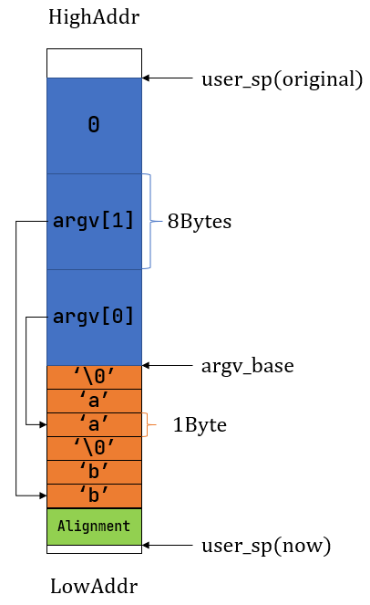

## 内核支持命令行参数

> raw_point: As string slices are a slice of bytes, the raw pointer points to a u8. This pointer will be pointing to the first byte of the string slice.

user shell 处理命令行参数
1. user shell 将传入的命令按照空格分割成 `Vec<String>`
2. 为 `Vec<String>` 中所有的 `String` 增加 `\0` 作为结尾
3. 遍历 `Vec<String>` 中所有 `String`，获取其 raw_point (as_ptr)，存储到 `Vec<*const u8>` 中，并在末尾处插入一个 `null` 值
4. 获取 `Vec<*const u8>` 的 raw_point，作为参数传入到 `exec` 系统调用中
5. os trap处理中，以 `null` 结尾标识通过 `Vec<*const u8>` raw_point 获取所有的 `String` raw_point，得到内核中传入参数的 `Vec<String>` 以便进行下一步操作

内核 `exec` 系统调用处理命令行参数

用户应用还原命令行参数

## 将命令行参数压入用户栈



## 标准输入输出重定向

dup系统调用

```rust
/// 功能：将进程中一个已经打开的文件复制一份并分配到一个新的文件描述符中。
/// 参数：fd 表示进程中一个已经打开的文件的文件描述符。
/// 返回值：如果出现了错误则返回 -1，否则能够访问已打开文件的新文件描述符。
/// 可能的错误原因是：传入的 fd 并不对应一个合法的已打开文件。
/// syscall ID：24
pub fn sys_dup(fd: usize) -> isize;
```

重定向实现思路，通过 close 系统调用关闭标准输入/输出文件，然后立刻通过 sys_dup 系统调用，在进程中复制相同文件的描述符，而考虑文件描述符是栈式申请/回收的，所以通过复制能够实现对于标准输入/输出的替换，最后在将此文件描述符关闭，完成整个复制过程

## user shell 改进

```rust
#![no_std]
#![no_main]
#![allow(clippy::println_empty_string)]

extern crate alloc;

#[macro_use]
extern crate user_lib;

const LF: u8 = 0x0au8;
const CR: u8 = 0x0du8;
const DL: u8 = 0x7fu8;
const BS: u8 = 0x08u8;
const LINE_START: &str = ">> ";

use alloc::string::String;
use alloc::vec::Vec;
use user_lib::console::getchar;
use user_lib::{close, dup, exec, fork, open, pipe, waitpid, OpenFlags};

#[derive(Debug)]
struct ProcessArguments {
    input: String,
    output: String,
    args_copy: Vec<String>,
    args_addr: Vec<*const u8>,
}

impl ProcessArguments {
    // 对 user shell 的标准输入的参数进行解析
    // 得到要执行的程序的参数，重定向情况，以及参数在堆上的地址
    pub fn new(command: &str) -> Self {
        // 按空格分割一条命令, 并为每个参数增加 `\0` 结尾
        let args: Vec<_> = command.split(' ').collect();
        let mut args_copy: Vec<String> = args
            .iter()
            .filter(|&arg| !arg.is_empty())
            .map(|&arg| {
                let mut string = String::new();
                string.push_str(arg);
                string.push('\0');
                string
            })
            .collect();

        // 判断是否进行输入重定向
        let mut input = String::new();
        if let Some((idx, _)) = args_copy
            .iter()
            .enumerate()
            .find(|(_, arg)| arg.as_str() == "<\0")
        {
            input = args_copy[idx + 1].clone();
            // 对于要执行的进程而言， `<` 及之后的参数都是多余的
            args_copy.drain(idx..=idx + 1);
        }

        // 判断是否进行输出重定向
        let mut output = String::new();
        if let Some((idx, _)) = args_copy
            .iter()
            .enumerate()
            .find(|(_, arg)| arg.as_str() == ">\0")
        {
            output = args_copy[idx + 1].clone();
            // 对于要执行的进程而言， `>` 及之后的参数都是多余的
            args_copy.drain(idx..=idx + 1);
        }

        let mut args_addr: Vec<*const u8> = args_copy.iter().map(|arg| arg.as_ptr()).collect();
        args_addr.push(core::ptr::null::<u8>());

        Self {
            input,
            output,
            args_copy,
            args_addr,
        }
    }
}

#[no_mangle]
pub fn main() -> i32 {
    println!("Rust user Shell");
    let mut line: String = String::new();
    print!("{}", LINE_START);
    loop {
        let c = getchar();
        match c {
            // 回车或换行，即将要执行应用
            LF | CR => {
                println!("");
                if !line.is_empty() {
                    // 分离管道，并解析各自的参数
                    let splited: Vec<_> = line.as_str().split('|').collect();
                    let pargs_list: Vec<_> = splited
                        .iter()
                        .map(|&cmd| ProcessArguments::new(cmd))
                        .collect();
                    // 参数合法性判断
                    // 如果使用管道，必须保证管道最左端的output为空，最右端的input为空，中间部分input/output都为空
                    let mut valid = true;
                    for (i, pargs) in pargs_list.iter().enumerate() {
                        if i == 0 {
                            if !pargs.output.is_empty() {
                                valid = false;
                            }
                        } else if i == pargs_list.len() - 1 {
                            if !pargs.input.is_empty() {
                                valid = false;
                            }
                        } else if !pargs.output.is_empty() || !pargs.input.is_empty() {
                            valid = false;
                        }
                    }
                    if pargs_list.len() == 1 {
                        valid = true;
                    }

                    if !valid {
                        println!("Invalid command: Inputs/Outputs cannot be correctly binded!");
                    } else {
                        // 创建管道
                        let mut pipes_fd: Vec<[usize; 2]> = Vec::new();
                        if !pargs_list.is_empty() {
                            for _ in 0..pargs_list.len() - 1 {
                                let mut pipe_fd = [0usize; 2];
                                pipe(&mut pipe_fd);
                                pipes_fd.push(pipe_fd);
                            }
                        }

                        let mut children: Vec<_> = Vec::new();
                        for (i, pargs) in pargs_list.iter().enumerate() {
                            let pid = fork();
                            if pid == 0 {
                                let input = &pargs.input;
                                let output = &pargs.output;
                                let args_copy = &pargs.args_copy;
                                let args_addr = &pargs.args_addr;

                                // 输入重定向
                                if !input.is_empty() {
                                    let input_fd = open(input.as_str(), OpenFlags::RDONLY);
                                    if input_fd == -1 {
                                        println!("Error when opening file {}", input);
                                        return -4;
                                    }
                                    let input_fd = input_fd as usize;
                                    close(0);
                                    assert_eq!(dup(input_fd), 0);
                                    close(input_fd);
                                }

                                // 输出重定向
                                if !output.is_empty() {
                                    let output_fd = open(
                                        output.as_str(),
                                        OpenFlags::CREATE | OpenFlags::WRONLY,
                                    );
                                    if output_fd == -1 {
                                        println!("Error when opening file {}", input);
                                        return -4;
                                    }
                                    let output_fd = output_fd as usize;
                                    close(1);
                                    assert_eq!(dup(output_fd), 1);
                                    close(output_fd);
                                }

                                // 获得连接前一个进程与当前进程的管道的读端，设置为当前进程的标准输入
                                if i > 0 {
                                    close(0);
                                    let read_end = pipes_fd.get(i - 1).unwrap()[0];
                                    assert_eq!(dup(read_end), 0);
                                }

                                // 将连接当前一个进程与下一个进程的管道的写端，设置为当前进程的标准输出
                                if i < pargs_list.len() - 1 {
                                    close(1);
                                    let write_end = pipes_fd.get(i).unwrap()[1];
                                    assert_eq!(dup(write_end), 1);
                                }

                                // 使用 dup 复制完毕后，关闭为pipe创建的文件描述符
                                for pipe_fd in pipes_fd.iter() {
                                    close(pipe_fd[0]);
                                    close(pipe_fd[1]);
                                }

                                // 执行 args_copy 中的命令
                                if exec(args_copy[0].as_str(), args_addr.as_slice()) == -1 {
                                    println!("Error when executing!");
                                    return -4;
                                }
                                unreachable!()
                            } else {
                                children.push(pid);
                            }
                        }

                        // 关闭 shell 中打开的pipe
                        for pipe_fd in pipes_fd.iter() {
                            close(pipe_fd[0]);
                            close(pipe_fd[1]);
                        }

                        // 等待子进程退出
                        let mut exit_code: i32 = 0;
                        for pid in children.into_iter() {
                            let exit_pid = waitpid(pid as usize, &mut exit_code);
                            assert_eq!(pid, exit_pid);
                        }
                    }

                    line.clear();
                }
                print!("{}", LINE_START);
            }
            // 退格或删除，即删除当前命令行的一个字符
            BS | DL => {
                if !line.is_empty() {
                    // 删除最后一个字符
                    print!("{}", BS as char);
                    // 填充一个空格
                    print!(" ");
                    // 删除填充的空格
                    print!("{}", BS as char);
                    line.pop();
                }
            }
            // 其余情况则是向当前命令行增加一个字符
            _ => {
                print!("{}", c as char);
                line.push(c as char);
            }
        }
    }
}

```


