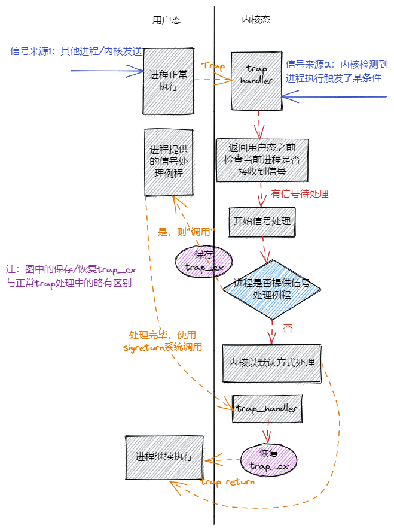

## 信号机制

如果将信号与硬件中断进行比较，我们可以把信号描述为软件中断。当硬件发出中断后，中断响应的对象是操作系统，并由操作系统预设的中断处理例程来具体地进行中断的响应和处理；对于信号来说，当某进程或操作系统发出信号时，会指定信号响应的对象，即某个进程的 pid ，并由该进程预设的信号处理例程来进行具体的信号响应

信号的接收方是一个进程，接收到信号有多种处理方式，最常见的三种如下：
- 忽略：就像信号没有发生过一样
- 捕获：进程会调用相应的处理函数进行处理
- 终止：终止进程

## 信号处理流程



信号有两种来源
- 最开始的时候进程在正常执行，此时可能内核或者其他进程给它发送了一个信号，这些就属于异步信号，是信号的第一种来源
- 信号的第二种来源则是由进程自身的执行触发，在处理 Trap 的时候内核会将相应的信号直接附加到进程控制块中，这种属于同步信号

内核会在 Trap 处理完成即将返回用户态之前检查要返回到的进程是否还有信号待处理。如果需要处理的话，取决于进程是否提供该种信号的处理函数，有两种处理方法
- 如果进程通过下面介绍的 sigaction 系统调用提供了相应信号的处理函数，那么内核会将该进程 Trap 进来时留下的 Trap 上下文保存在另一个地方，并回到用户态执行进程提供的处理函数。内核要求处理函数的编写者在函数的末尾手动进行另一个 sigreturn 系统调用，表明处理结束并请求恢复进程原来的执行。内核将处理该系统调用并恢复之前保存的 Trap 上下文，等到再次回到用户态的时候，便会继续进程在处理信号之前的执行
- 反之，如果进程未提供处理函数，这是一种比较简单的情况。此时，内核会直接默认的方式处理信号。之后便会回到用户态继续进程原先的执行

## 信号机制系统调用

### 发送信号

```rust
/// 功能：当前进程向另一个进程（可以是自身）发送一个信号。
/// 参数：pid 表示接受信号的进程的进程 ID, signum 表示要发送的信号的编号。
/// 返回值：如果传入参数不正确（比如指定进程或信号类型不存在）则返回 -1 ,否则返回 0 。
/// syscall ID: 129
pub fn kill(pid: usize, signum: i32) -> isize;
```

### 处理信号

与信号处理相关的系统调用则有三个：
- sys_sigaction :设置信号处理例程
- sys_procmask :设置进程的信号屏蔽掩码
- sys_sigreturn :清除栈帧，从信号处理例程返回

```rust
/// 功能：为当前进程设置某种信号的处理函数，同时保存设置之前的处理函数。
/// 参数：signum 表示信号的编号，action 表示要设置成的处理函数的指针
/// old_action 表示用于保存设置之前的处理函数的指针（SignalAction 结构稍后介绍）。
/// 返回值：如果传入参数错误（比如传入的 action 或 old_action 为空指针或者）
/// 信号类型不存在返回 -1 ，否则返回 0 。
/// syscall ID: 134
pub fn sys_sigaction(
    signum: i32,
    action: *const SignalAction,
    old_action: *mut SignalAction,
) -> isize;
```

## 用户程序

```rust
fn func() {
    println!("user_sig_test passed");
    sigreturn();
}

#[no_mangle]
pub fn main() -> i32 {
    // 定义信号处理例程
    let mut new = SignalAction::default();
    let mut old = SignalAction::default();
    new.handler = func as usize;

    println!("signal_simple: sigaction");
    if sigaction(SIGUSR1, Some(&new), Some(&mut old)) < 0 {
        panic!("Sigaction failed!");
    }
    println!("signal_simple: kill");
    if kill(getpid() as usize, SIGUSR1) < 0 {
        println!("Kill failed!");
        exit(1);
    }
    println!("signal_simple: Done");
    0
}
```

## 设计与实现信号机制

- 为进程维护一个 sigactions 列表，同时设置 sigmask 以控制用户程序要响应的signal

### 信号的产生

信号的产生有以下几种方式：
- 进程通过 kill 系统调用给自己或者其他进程发送信号
- 内核检测到某些事件给某个进程发送信号，但这个事件与接收信号的进程的执行无关
  - 典型的例子如： SIGCHLD 当子进程的状态改变后由内核发送给父进程。可以看出这可以用来实现更加灵活的进程管理，但我们的内核为了简单目前并没有实现 SIGCHLD 这类信号
- 前两种属于异步信号，最后一种则属于同步信号：即进程执行的时候触发了某些条件，于是在 Trap 到内核处理的时候，内核给该进程发送相应的信号。比较常见的例子是进程执行的时候出错，比如段错误 SIGSEGV 和非法指令异常 SIGILL

通过 kill 系统调用为目标进程设置待处理的信号，保存在TCB的signals中，同一时间相同的信号只允许设置一次

在进程执行出错的情况（比如访存错误或非法指令异常），这会 Trap 到内核并在 trap_handler 中由内核将对应信号发送到当前进程

### 信号处理

在 trap_handler 完成 Trap 处理并返回用户态之前，会调用 handle_signals 函数处理当前进程此前接收到的信号

SIGSTOP/SIGCONT信号
- 当进程收到 SIGSTOP 信号之后，它的执行将被暂停，等到该进程收到 SIGCONT 信号之后再继续执行
- 在进程控制块中新增 frozen 字段表示进程目前是否已收到 SIGSTOP 信号被暂停，而 killed 字段表示进程是否已被杀死


[continue](http://rcore-os.cn/rCore-Tutorial-Book-v3/chapter7/4signal.html)
