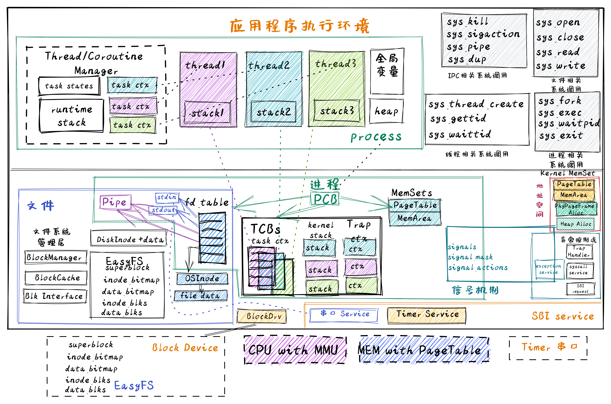
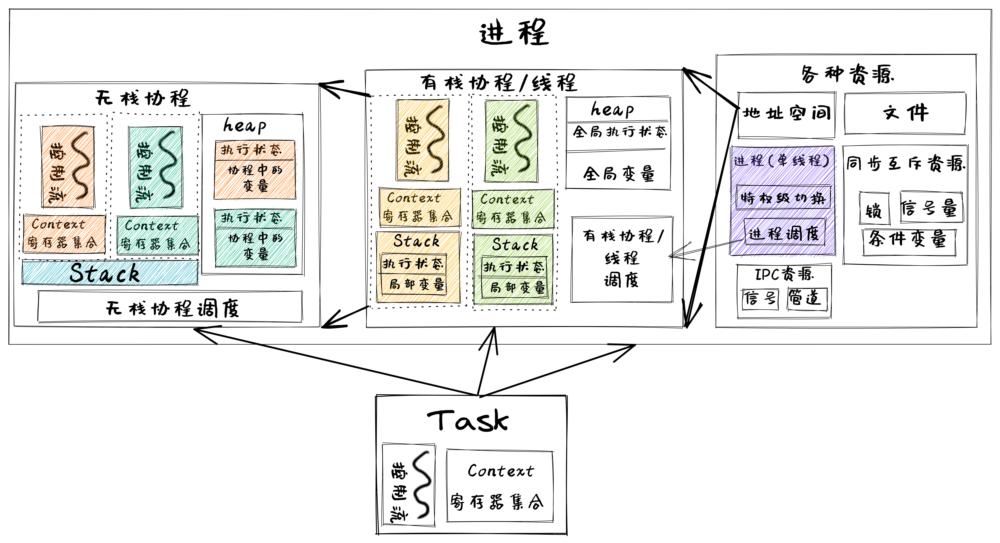
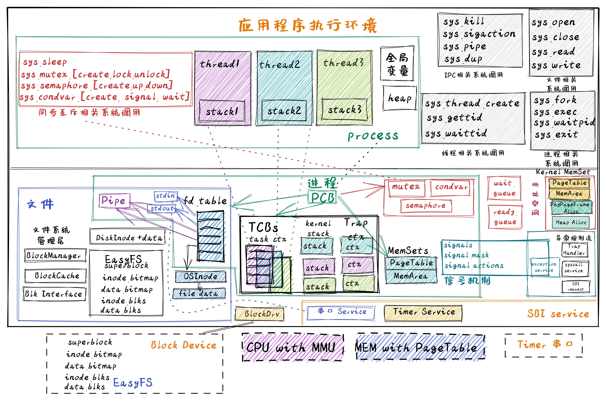

## 同步互斥

线程的数据一致性 的定义
- 在单处理器（即只有一个核的CPU）下，如果某线程更新了一个可被其他线程读到的共享数据，那么后续其他线程都能读到这个最新被更新的共享数据

两个或多个线程在竞争访问同一资源时，执行结果取决于它们的不可预知的执行顺序的情况称为 **线程的竞态条件（race condition）**

系统架构

进程、线程、协程

进程包含线程（即有栈协程），线程包含无栈协程，形成一个层次包含关系。而与它们执行相关的重点是切换控制流，即任务切换，关键就是保存于恢复任务上下文，任务上下文的核心部分就是每个任务所分时共享的硬件寄存器内容。对于无栈协程，切换这些寄存器就够了；对于拥有独立栈的线程而言，还需进一步切换线程栈；如果是拥有独立地址空间的进程而言，那还需进一步切换地址空间（即切换页表）

[continue](http://rcore-os.cn/rCore-Tutorial-Book-v3/chapter8/0intro.html)