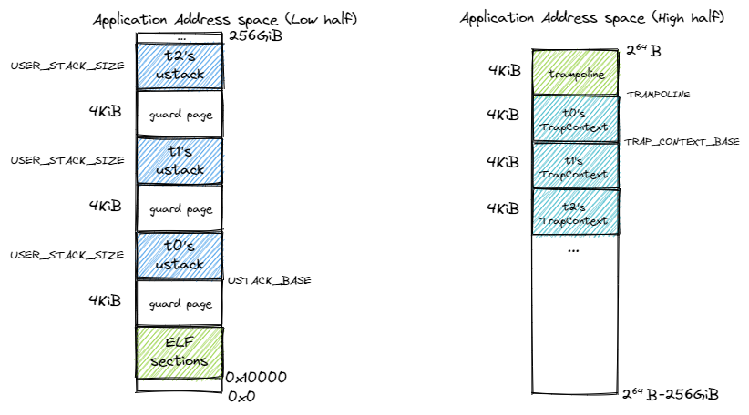

## 线程模型与重要系统调用

简单线程模型:
- 线程有三种状态：就绪态、运行态和阻塞态
- 同进程下的所有线程共享所属进程的地址空间和其他共享资源
- 线程可被操作系统调度来分时占用 CPU 执行
- 线程可以动态创建和退出
- 同进程下的多个线程不像进程一样存在父子关系，但有一个特殊的主线程在它所属进程被创建的时候产生，应用程序的 main 函数就运行在这个主线程上。当主线程退出后，整个进程立即退出，也就意味着不论进程下的其他线程处于何种状态也随之立即退出
- 程可通过系统调用获得操作系统的服务
  - 注意线程和进程两个系列的系统调用不能混用

线程模型建立在进程的地址空间抽象之上：同进程下的所有线程共享该进程的地址空间，包括代码段和数据段。从逻辑上来说某些段是由所有线程共享的（比如包含代码中的全局变量的全局数据段），而某些段是由某个线程独占的（比如操作系统为每个线程分配的栈），通常情况下程序员会遵循这种约定。然而，线程之间并不能严格做到隔离。举例来说，一个线程访问另一个线程的栈这种行为并不会被操作系统和硬件禁止。这也体现了线程和进程的不同：线程的诞生是为了方便共享，而进程更强调隔离

### 线程创建

```rust
/// 功能：当前进程创建一个新的线程
/// 参数：entry 表示线程的入口函数地址，arg 表示传给线程入口函数参数
/// 返回值：创建的线程的 TID
/// syscall ID: 1000
pub fn sys_thread_create(entry: usize, arg: usize) -> isize;
```

相比于创建进程的 fork 系统调用，创建线程无需建立新的地址空间，这是二者之间最大的不同。另外属于同一进程中的线程之间没有父子关系，这一点也与进程不一样

### 线程退出及资源回收

```rust
/// 功能：等待当前进程内的一个指定线程退出
/// 参数：tid 表示指定线程的 TID
/// 返回值：如果线程不存在，返回-1；如果线程还没退出，返回-2；其他情况下，返回结束线程的退出码
/// syscall ID: 1002
pub fn sys_waittid(tid: usize) -> i32;
```

- 一般情况下进程/主线程要负责通过 waittid 来等待它创建出来的线程（不是主线程）结束并回收它们在内核中的资源（如线程的内核栈、线程控制块等
- 如果进程/主线程先调用了 exit 系统调用来退出，那么整个进程（包括所属的所有线程）都会退出，而对应父进程会通过 waitpid 回收子进程剩余还没被回收的资源

### 进程相关的系统调用

为了实现更加简单，我们要求每个应用对于 线程和进程两个系列的系统调用只能使用其中之一 

### 通用资源分配器及线程相关的软硬件资源

RecycleAllocator
- 进程描述符 PidHandle
- 线程独占的线程资源组 TaskUserRes ，其中包括线程描述符
- 线程独占的内核栈 KernelStack 

进程用户空间内存布局



在低地址空间中，在放置完应用 ELF 的所有段之后，会预留 4KiB 的空间作为保护页，得到地址 ustack_base ，这部分实现可以参考创建应用地址空间的 MemorySet::from_elf ， ustack_base 即为其第二个返回值

接下来从 ustack_base 开始按照 TID 从小到大的顺序向高地址放置线程的用户栈，两两之间预留一个保护页放置栈溢出。在高地址空间中，最高的虚拟页仍然作为跳板页，跳板页中放置的是只读的代码，因此线程之间可以共享

然而，每个线程需要有自己的 Trap 上下文，于是我们在跳板页的下面向低地址按照 TID 从小到大的顺序放置线程的 Trap 上下文

TaskUserRes并非任何时候都需要分配(映射地址空间), 例如，在 fork 子进程并创建子进程的主线程的时候，就不必再分配一次用户栈和 Trap 上下文，因为子进程拷贝了父进程的地址空间，这些内容已经被映射过了。因此这个时候 alloc_user_res 为假。其他情况下则需要进行映射

### 进程和线程控制块

### 任务管理器与处理器管理结构

## 线程管理机制的设计与实现

- 线程生命周期管理
- 线程执行中的调度和特权级切换

### 线程生命周期管理

**线程创建**

线程创建有两种方式

#### (1) 默认创建

第一种是在创建进程的时候默认为这个进程创建一个主线程（创建进程又分为若干种方式）

**new**

- 创建进程PCB与主线程的TCB
- 获取所需要的信息并填充主线程的Trap上下文
- 将主线程插入到进程的线程列表中
- 维护 PID-进程控制块的映射
- 将主线程加入到任务管理器从而使能调度

**fork**

- 创建子进程的PCB, 并将其加入到当前进程的子进程列表中
- 创建子进程的主线程控制块，继承父进程的 ustack, 同时不必重新分配用户栈和Trap上下文
- 子进程主线程基本与父进程主线程相同，但内核栈地址不同
- 将子进程插入到PID-进程控制块映射，并将子进程的主线程加入到任务管理器中

#### (2) 系统调用

第二种是通过 thread_create 系统调用在当前进程内创建一个新的线程

线程正确运行所需的重要的执行环境要素
- 线程的用户态栈：确保在用户态的线程能正常执行函数调用；
- 线程的内核态栈：确保线程陷入内核后能正常执行函数调用；
- 线程共享的跳板页和线程独占的 Trap 上下文：确保线程能正确的进行用户态与内核态间的切换；
- 线程的任务上下文：线程在内核态的寄存器信息，用于线程切换

**线程创建**

- 找到当前正在执行的线程 task 和此线程所属的进程 process
- 调用 TaskControlBlock::new 方法，创建一个新的线程 new_task ，在创建过程中，建立与进程 process 的所属关系，分配了线程资源组 TaskUserRes 和其他资源
- 把线程挂到调度队列中
- 把线程接入到所属进程的线程列表 tasks 中
- 初始化位于该线程在用户态地址空间中的 Trap 上下文：设置线程的函数入口点和用户栈，使得第一次进入用户态时能从指定位置开始正确执行；设置好内核栈和陷入函数指针 trap_handler ，保证在 Trap 的时候用户态的线程能正确进入内核态

**线程退出**

1. 将当前线程从处理器管理结构 PROCESSOR 中移除，随后在线程控制块中记录退出码并回收当前线程的线程资源组 TaskUserRes
2. 针对当前线程是所属进程主线程的情况退出整个进程和其他的所有线程（此时主线程已经在上一步中被移除）。其判断条件为当前线程 TID 是否为 0 ，这是主线程的特征
3. 更新 PID-进程控制块映射，将进程标记为僵尸进程然后记录进程退出码， 进程退出码即为其主线程退出码
4. 将子进程挂到初始进程 INITPROC 下面
5. 回收所有线程的 TaskUserRes ，为了保证进程控制块的独占访问，我们需要先将所有的线程的 TaskUserRes 收集到向量 recycle_res 中。通过清空 recycle_res 自动回收所有的 TaskUserRes
6. 依次清空子进程列表、回收进程地址空间中用于存放数据的物理页帧、清空文件描述符表并最终移除所有线程。注意我们在回收物理页帧之前必须将 TaskUserRes 清空，不然相关物理页帧会被回收两次


主线程退出的时候可能有一些线程处于就绪状态等在任务管理器 TASK_MANAGER 的队列中，我们需要及时调用 remove_inactive_task 函数将它们从队列中移除，不然将导致它们的引用计数不能成功归零并回收资源，最终导致内存溢出

**等待线程结束**

如果调用 sys_exit 退出的不是进程的主线程，那么 sys_exit 之后该线程的资源并没有被完全回收，这一点和进程比较像。还需要另一个线程调用 waittid 系统调用才能收集该线程的退出码并彻底回收该线程的资源


注意
- 此时线程为调度的主要单位，因此进程创建时，只需要分配好进程的资源，不必再进行 trap/ustack 的映射
- 同时，一个进程中可以同时存在多个线程的 trap ctx，因此 trap_return 应当基于当前线程的 trap ctx, 而不是固定的 trap ctx

[continue](http://rcore-os.cn/rCore-Tutorial-Book-v3/chapter8/0intro.html)