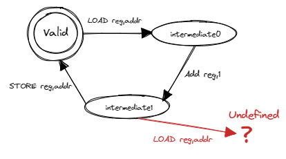

# 互斥锁

## 多线程计数器

可将多线程计数器中的全局变量 A 视为一种资源，连带有对于 A 的三个阶段操作，可使用 有限状态机模型 来进行描述



在多线程情况下，对于 A 的操作存在未定义行为，即存在不合法状态时的操作，这是导致 A 结果不正确的原因

多线程对共享资源的访问天然需求某种互斥性：当一个线程在对共享资源进行操作的时候，共享资源处在不合法的中间状态，如果此时其他线程开始操作会产生未定义行为。只有当操作完成，共享资源重新回到合法状态之后，之前操作的线程或者其他线程才能开始下一次操作。只有满足这种互斥性，才能保证多线程对共享资源的访问符合我们的预期

**共享资源 (Shared Resources)** 是指多个线程均能够访问的资源。线程对于共享资源进行操作的那部分代码被称为 **临界区 (Critical Section)**。在多线程并发访问某种共享资源的时候，为了正确性，必须要满足 **互斥 (Mutual Exclusion) 访问** 要求，即同一时间最多只能有一个线程在这种共享资源的临界区之内。这样才能保证当一个线程开始操作时，共享资源总是处于合法状态，这保证了操作是有意义的

对于一些原生类型，现代指令集架构额外提供一组 **原子指令 (Atomic Instruction)** ，在某些架构上只需一条原子指令就能完成包括访存、算术运算在内的一系列功能

原子指令虽然强大，其应用范围却比较有限，通常它只能用来保护 单内存位置 上的简单操作

## 锁

引入锁机制后的线程访问共享资源的流程
1. 第一步上锁：线程进入临界区之前检查共享资源是否已经上锁。如果已经上锁的话，则需要 **等待** 持有钥匙的线程归还钥匙并解锁。接下来，线程尝试“抢”到钥匙，如果成功的话，线程将资源上锁，此时我们说该线程 **获取到了锁** （或者说 **持有锁或拿到了锁** ）。最后线程拿走钥匙并进入临界区。此时资源进入上锁状态，其他线程不能进入临界区
2. 第二步在临界区内访问共享资源。只有持有共享资源锁的线程能够进入临界区，这就能够保证临界区的互斥性
3. 第三步解锁：线程离开临界区之后将资源解锁并归还钥匙，我们说线程 **释放了锁** 。此时资源回到空闲状态

### 锁实现的指标

常用以下的指标来从多个维度评估这种实现是否能够正确、高效地达成锁这种互斥原语应有的功能
- 忙则等待：意思是当一个线程持有了共享资源的锁，此时资源处于繁忙状态，这个时候其他线程必须等待拿着锁的线程将锁释放后才有进入临界区的机会。这其实就是互斥访问的另一种说法。这种互斥性是锁实现中最重要的也是必须做到的目标，不然共享资源访问的正确性会受到影响
- 空闲则入 (在《操作系统概念》一书中也被称为 前进 Progress)：若资源处于空闲状态且有若干线程尝试进入临界区，那么一定能够在有限时间内从这些线程中选出一个进入临界区。如果不满足空闲则入的话，可能导致即使资源空闲也没有线程能够进入临界区，对于锁来说是不可接受的
- 有界等待 (Bounded Waiting)：当线程获取锁失败的时候首先需要等待锁被释放，但这并不意味着此后它能够立即抢到被释放的锁，因此此时可能还有其他的线程也处于等待状态。于是它可能需要等待一轮、二轮、多轮才能拿到锁，甚至在极端情况下永远拿不到锁。 有界等待 要求每个线程在等待有限长时间后最终总能够拿到锁。相对的，线程可能永远无法拿到锁的情况被称之为 饥饿 (Starvation) 。这体现了锁实现分配共享资源给线程的 公平性 (Fairness)
- 让权等待（可选）：线程如何进行等待实际上也大有学问。这里所说的让权等待是指需要等待的线程暂时主动或被动交出 CPU 使用权来让 CPU 做一些有意义的事情，这通常需要操作系统的支持。这样可以提升系统的总体效率

总的来说，忙则等待、空闲则入和有界等待是一个合格的锁实现必须满足的要求，而让权等待则关系到锁机制的效率，是可选的

## 锁的用户态实现

[Peterson 算法](https://en.wikipedia.org/wiki/Peterson%27s_algorithm)
双线程 [Dekkers 算法](https://en.wikipedia.org/wiki/Dekker%27s_algorithm)
多线程 [Eisenberg & McGuire 算法 ](https://en.wikipedia.org/wiki/Eisenberg_%26_McGuire_algorithm)

## 基于硬件机制及特殊指令的锁实现

两种实现锁机制相关硬件支持：即关闭中断和原子指令

### 关闭中断

存在的问题
- 首先，这种做法给了用户态程序使能/屏蔽中断这种特权，相当于相信应用并放权给它。这会面临和我们引入抢占式调度之前一样的问题：线程可以选择恶意永久关闭中断而独占所有 CPU 资源，这将会影响到整个系统的正常运行
  - 因此，事实上至少在 RISC-V 这样含多个特权级的架构中，这甚至是完全做不到的。回顾第三章，可以看到中断使能和屏蔽的相关标志位分布在 S 特权级的 CSR sstatus 和 sie ，甚至更高的 M 特权级的 CSR 中。用户态试图修改它们将会触发非法指令异常，操作系统会直接杀死该线程
- 其次，即使我们能够做到，它对于多处理器架构也是无效的，假设同一进程的多个线程运行在不同的 CPU 上，它们都尝试访问同种共享资源。一般来说，每个 CPU 都有自己的独立的中断相关的寄存器，它只能对自己的中断处理进行设置。对于一个线程来说，它可以关闭它所在 CPU 的中断，但是这无法影响到其他线程所在的 CPU ，其他线程仍然可以在此时进入临界区，便不能满足互斥访问的要求了

采用控制中断的方式仅对一些非常简单，且信任应用的单处理器场景有效，而对于更广泛的其他场景是不够的

### 原子指令    

#### 常用的 CAS 和  TAS 指令

硬件提供的原子指令一般是对于一个内存位置进行一系列操作，并保证整个过程的原子性

**基于 CAS 指令的 锁**

比较并交换 （Compare-And-Swap, CAS）指令
- 在 x86 平台上有 CMPXCHG 指令，在 SPARC-V9 平台上则有 CASA/SWAP 等指令

```rust
/// CAS 指令含义的 rust 语言表达
fn compare_and_swap(ptr: *mut i32, expected: i32, new: i32) -> i32 {
    let original = unsafe { *ptr };
    if original == expected {
        unsafe { *ptr = new; }
    }
    original
}
```

```rust
/// compare_exchange 如果原子变量当前的值与 current 相同，则将原子变量的值修改为 new ，否则不进行修改。无论是否进行修改，都会返回原子变量在操作之前的值。可以看到返回值是一个 Result ，如果修改成功的话这个值会用 Ok 包裹，否则则会用 Err 包裹
pub fn compare_exchange(
    &self,
    current: bool,
    new: bool,
    success: Ordering,
    failure: Ordering,
) -> Result<bool, bool>;

static OCCUPIED: AtomicBool = AtomicBool::new(false);

fn lock() {
    while OCCUPIED
    .compare_exchange(false, true, Ordering::Relaxed, Ordering::Relaxed)
    .is_err()
    {
        // OCCUPIED 当前是 true ，表明已经有线程在临界区之内了，那么 compare_exchange 修改失败并返回 Err ，循环还需要继续下去
        yield_();
    }
    // 如果 OCCUPIED 当前是 false ，表明目前没有线程在临界区内，那么就将 OCCUPIED 改成 true ，返回 Ok 退出 while 循环，随后线程进入临界区
}

fn unlock() {
    OCCUPIED.store(false, Ordering::Relaxed);
}
```

**测试并设置 (Test-And-Set, TAS) 指令**

相比 CAS ， TAS 没有比较的步骤，它直接将 new 写入到内存并返回内存位置原先的值

```rust
/// TAS 指令含义的 rust 语言表达
fn test_and_set(ptr: *mut i32, new: i32) -> i32 {
    let orignal = unsafe {*ptr};
    unsafe {*ptr = new};
    orginal 
}
```

```rust
static mut OCCUPIED: i32 = 0;

unsafe fn lock() {
    /// 假设有多个线程同时想要进入临界区，由于硬件保证 TAS 指令的原子性不受中断或多核同时访问的影响，只有 TAS 指令被最早执行的线程能够看到 TAS 的返回值为 0 ，意味着此时还没有线程在临界区中，那么这个线程可以结束忙等进入临界区
    while (test_and_set(&mut OCCUPIED, 1) == 1) {}
}

unsafe fn unlock() {
    OCCUPIED = 0;
}
```

#### RISC-V 架构上的原子指令

RISC-V 控制状态寄存器（CSR）的特殊指令，比如 csrr ， csrw ，特别是 csrrw 等

除此之外， RISC-V 架构的原子拓展（Atomic，简称 A 拓展）提供了一些对于一个内存位置上的值进行原子操作的原子指令，分为两大类

其中第一类被称为原子内存操作（Atomic Memory Operation, AMO)
- 这类原子指令首先根据寄存器 rs1 保存的内存地址将值从内存载入到寄存器 rd 中，然后将这个载入的值与寄存器 rs2 中保存的值进行某种运算，并将结果写回到 rs1 中的地址对应的内存区域中
- 整个过程可以被概括为一种 read-modify-write 的三阶段操作，硬件能够保证其原子性
- AMO 支持多种不同的运算，包括交换、整数加法、按位与、按位或、按位异或以及有/无符号整数最大或最小值

另一类原子指令被称为加载保留/条件存储（Load Reserved / Store Conditional，简称LR/SC），它们通常被配对使用
- 首先， LR 指令可以读取内存中的一个值（其地址保存在寄存器 rs1 中）到目标寄存器 rd 
- 然后，可以使用 SC 指令，它的功能是将内存中的这个值（其地址保存在寄存器 rs1 中且与 LR 指令中的相同）改成寄存器 rs2 保存的值
- 这样操作的前提是：执行 LR 和 SC 这两条指令之间的这段时间内，内存中的这个值并未被修改。如果这个前提条件不满足，那么 SC 指令不会进行修改
- SC 指令的目标寄存器 rd 指出 SC 指令是否进行了修改：如果进行了修改， rd 为 0；否则， rd 可能为一个非零的任意值

SC指令判断内存中的值是否修改的方式
- 在 RISC-V 架构下，存在一个 保留集 (Reservation Set) 的概念，这也是“加载保留”这种叫法的来源
- 保留集用来实现 LR/SC 的检查机制：
  - 当 CPU 执行 LR 指令的时候，硬件会记录下此时内存中的值是多少，此外还可能有一些附加信息，这些被记录下来的信息就被称为保留集
  - 之后，当其他 CPU 或者外设对内存这个值进行修改的时候，硬件可以将这个值对应的保留集标记为非法或者删除
  - 等到之前执行 LR 指令的 CPU 执行 SC 指令的时候，CPU 就可以检查保留集是否存在/合法或者保留集记录的值是否与内存中现在的值一致，以这种方式来决定是否进行写入以及目标寄存器 rd 的值

RISC-V 并不原生支持 CAS/TAS 原子指令，但我们可以通过 LR/SC 指令对来实现它。比如下面是通过 LR/SC 指令对来模拟 CAS 指令

```s
# 参数 a0 存放内存中的值的所在地址
# 参数 a1 存放 expected
# 参数 a2 存放 new
# 返回值 a0 略有不同：这里若比较结果相同则返回 0 ，否则返回 1
# 而不是返回 CAS 之前内存中的值
cas:
    lr.w t0, (a0) # LR 将值加载到 t0
    bne t0, a1, fail # 如果值和 a1 中的 expected 不同，跳转到 fail
    sc.w t0, a2, (a0) # SC 尝试将值修改为 a2 中的 new
    bnez t0, cas # 如果 SC 的目标寄存器 t0 不为 0 ，说明 LR/SC 中间值被修改，重试
    li a0, 0 # 成功，返回值为 0
    ret # 返回
fail:
    li a0, 1 # 失败，返回值为 1
    ret # 返回
```

#### 原子指令小结

为了提供软件所需的包含互斥锁在内的各种同步机制，硬件对于内存中的一个字、双字、四字（位宽分别为16、32、64位，且通常要求是对齐的）这类通用的存储单位提供了一系列原子指令，这些原子指令能够对内存中的值进行加载、运算、修改等多种操作，且能够保证整个过程是原子的。也就是说，在硬件层面上，其原子性有着更高的优先级而不会被中断、多个 CPU 同时访问内存中同个位置或者指令执行中的更多情况破坏

作为例子我们介绍了经典的 CAS/TAS 指令以及 RISC-V 上提供的 LR/SC 指令对，基于它们我们能够简单且高效的实现锁机制。重新回顾一下这些指令，可以发现它们从结果上都存在成功/失败之分。如果多个 CPU 同时用这些指令访问内存中同一个值，显然只有一个 CPU 能够成功。事实上，当多个 CPU 同时执行这些原子指令的时候，它们会将相关请求发送到 CPU 与 RAM 间总线上，总线会将这些请求进行排序。这就好像一群纷乱的游客在通过一个狭窄的隘口的时候必须单列排队通过，无论如何总会产生一种顺序。于是我们会看到，请求排在最前面的 CPU 能够成功，随后它便相当于独占了这一块被访问的内存区域。接下来，排在后面的 CPU 的请求都会失败了，这种状况会持续到之前独占的 CPU 将对应内存区域重置（相当于 unlock ）。正因如此，我们才说：“ 原子指令是整个计算机系统中最根本的原子性和互斥性的来源 。”这种最根本的互斥性来源于总线的仲裁，表现为原子指令，作用范围为基础存储单位。在原子指令的基础上，我们可以灵活地编写软件来延伸互斥性或其他同步需求的作用范围，使得对于各种丰富多彩的资源（如复杂数据结构和多种外设）我们都能将其管理得有条不紊。

虽然原子指令已经能够简单高效的解决问题了，但是在很多情况下，我们可以在此基础上再引入软件对资源进行灵活的调度管理，从而避免资源浪费并得到更高的性能

## 在操作系统支持下实现让权等待

**忙等**

在忙等的时候被等待的条件有可能从不满足变为满足，此时忙等有意义
在忙等有意义的前提下，忙等的优势是在条件成立的第一时间就能够进行响应，对于事件的响应延迟更低，实时性更好，而且不涉及开销很大的上下文切换。它的缺点则是不可避免的会浪费一部分 CPU 资源在忙等上。因此，如果我们能够预测到条件将很快得到满足，在这种情况下使用忙等是一个好主意。如果条件成立的时间无法预测或者所需时间比较长，那还是及时交出 CPU 资源更好

**让权**

使用 yield 实现通常情况下不会出错。但是它的实际表现却很大程度上受到操作系统调度器的影响
如果在条件满足之前就多次调度到等待的线程，虽然看起来线程很快就会再次通过 yield 主动让权从而没什么开销，但是实际上却增加了上下文切换的次数。上下文切换的开销是很大的，除了要保存和恢复寄存器之外，更重要的一点是会破坏程序的时间和空间局部性使得我们无法高效利用 CPU 上的各类缓存
- 比如说，我们的实现中在 Trap 的时候需要切换地址空间，有可能需要清空 TLB ；由于用户态和内核态使用不同的栈，在应用 Trap 到内核态的时候，缓存中原本保存着用户栈的内容，在执行内核态代码的时候可能由于缓存容量不足而需要逐步替换成内核栈的内容，而在返回用户态之后又需要逐步替换回来。整个过程中的缓存命中率将会很低。所以说，即使线程只是短暂停留也有可能对整体性能产生影响
相反，如果在条件满足很久之后才调度到等待的线程，这则会造成事件的响应延迟不可接受。使用 yield 就有可能出现这些极端情况，而且我们完全无法控制或预测其效果究竟如何

**阻塞**

当线程需要等待事件到来的时候，操作系统可以将该线程标记为阻塞状态 (Blocked) 并将其从调度器的就绪队列中移除。由于操作系统每次只会从就绪队列中选择一个线程分配 CPU 资源，被阻塞的线程就不再会获得 CPU 使用权，也就避免了上下文切换。相对的，在线程要等待的事件到来之后，我们需要解除线程的阻塞状态，将线程状态改成就绪状态，并将线程重新加入到就绪队列，使其有资格得到 CPU 资源。这就是与阻塞机制配套的唤醒机制。在线程被唤醒之后，由于它所等待的事件已经出现，在操作系统调度到它之后它就可以继续向下运行了

阻塞与唤醒机制相配合就可以实现精确且高效的等待。阻塞机制保证在线程等待的事件到来之前，线程不会参与调度，因此不会浪费任何时间片或产生上下文切换。唤醒机制则在事件到来之后允许线程正常继续执行。注意到，操作系统能够感知到事件以及等待该事件的线程，因此根据事件的实时性要求以及线程上任务的重要程度，操作系统可以在对于调度策略进行调整。比如，当事件为键盘或鼠标输入时，操作系统可以在唤醒之后将对应线程的优先级调高，让其能够被尽量早的调度到，这样就能够降低响应延迟并提升用户体验。也就是说，相比 yield ，这种做法的可控性更好

阻塞机制的缺点在于会不可避免的产生 **两次上下文切换**。站在等待的线程的视角，它会被切换出去再切换回来然后再继续执行。在事件产生频率较低、事件到来速度比较慢的情况下这不是问题，但当事件产生频率很高的时候直接忙等也许是更好的选择。此外，阻塞机制相对比较复杂，需要操作系统的支持。

下面介绍我们的操作系统如何实现阻塞机制以及阻塞机制的若干应用

### 实现阻塞与唤醒机制

#### 基于阻塞机制实现 sleep 系统调用

线程调用 `sys_sleep` 之后将在陷入内核态后被阻塞并从就绪队列中删除，标记状态为 blocked，线程所等待的事件是时钟计数器的值超过当前时间加上线程睡眠时长的综合，相关的数据保存在 TimerConvar中
随后每次时钟中断产生时，获取当前最早到期的睡眠线程，如果符合条件，则直接将其重新加入到就绪队列中，其状态在被调度时从 blocked 变为 running(?)

#### 基于阻塞机制实现锁机制

为了在操作系统的支持下实现锁机制，可以将锁看成进程内的一种资源（类似文件描述符表和地址空间），一个进程可以有多把锁，这些锁可以用它们的 ID 来区分，每把锁可以用来保护不同的共享资源。进程内的所有线程均可以访问锁，但是只能通过系统调用这种间接的方式进行访问

```rust
/// 功能：为当前进程新增一把互斥锁。
/// 参数： blocking 为 true 表示互斥锁基于阻塞机制实现，
/// 否则表示互斥锁基于类似 yield 的方法实现。
/// 返回值：假设该操作必定成功，返回创建的锁的 ID 。
/// syscall ID: 1010
pub fn sys_mutex_create(blocking: bool) -> isize;

/// 功能：当前线程尝试获取所属进程的一把互斥锁。
/// 参数： mutex_id 表示要获取的锁的 ID 。
/// 返回值： 0
/// syscall ID: 1011
pub fn sys_mutex_lock(mutex_id: usize) -> isize;

/// 功能：当前线程释放所属进程的一把互斥锁。
/// 参数： mutex_id 表示要释放的锁的 ID 。
/// 返回值： 0
/// syscall ID: 1012
pub fn sys_mutex_unlock(mutex_id: usize) -> isize;
```

锁的实现中仅用到单标记 locked ，为什么无需使用原子指令来保证对于 locked 本身访问的互斥性呢？这其实是因为，RISC-V 架构规定从用户态陷入内核态之后所有（内核态）中断默认被自动屏蔽，也就是说与应用的执行不同， 目前系统调用的执行是不会被中断打断的 。同时，目前我们是在单核上，也 不会有多个 CPU 同时执行系统调用的情况 。在这种情况下，内核态的共享数据访问就仍在 UPSafeCell 的框架之内，只要使用它就能保证互斥访问

互斥访问的需求因为不同线程（或其他执行流，比如说系统调用执行）在执行期间出现了 时间与空间的交集 

? 忙等让权锁 比 阻塞锁效率更高
- 假设有 n 个线程, 对于自旋锁，第一个获得锁的线程执行时，其他线程都在自旋，即获得CPU使用权限后立刻将CPU交还给获得锁的线程
- 而对于阻塞锁，第一个获得锁的线程执行时，其他线程需要将自己加入到 blocked 队列中

## 信号量

信号量的实现与阻塞锁类似，需要为进程增加爱 semaphore 资源，而相比于 mutex 内部的 bool, 信号量支持一个数值，可增可减

```rust
pub fn up(&self) {
    let mut inner = self.inner.exclusive_access();
    inner.count += 1;
    // 意味着先前 count < 0, 即存在阻塞的线程需要唤醒
    if inner.count <= 0 {
        if let Some(task) = inner.wait_queue.pop_front() {
            add_task(task);
        }
    }
}

pub fn down(&self) {
    let mut inner = self.inner.exclusive_access();
    inner.count -= 1;
    // 意味着之前 count <= 0, 即没有资源了，需要阻塞当前线程
    if inner.count < 0 {
        inner.wait_queue.push_back(current_task().unwrap());
        drop(inner);
        block_current_and_run_next();
    }
}
```

## 条件变量

操作系统提供的互斥锁和信号量两种同步原语。它们可以用来实现各种同步互斥需求，但是它们比较复杂（特别是信号量），对于程序员的要求较高。如果使用不当，就有可能导致效率低下或者产生竞态条件、死锁或一些不可预测的情况

### 管程

Brinch Hansen（1973）和Hoare（1974）结合操作系统和Concurrent Pascal编程语言，提出了一种高级同步原语，称为管程（monitor）。一个管程是一个由过程（procedures，Pascal语言的术语，即函数）、共享变量及数据结构等组成的一个集合。线程可以调用管程中的过程，但线程不能在管程之外声明的过程中直接访问管程内的数据结构

```
monitor m1
    integer i;   //共享变量
    condition c; //条件变量

    procedure f1();
      ...       //对共享变量的访问，以及通过条件变量进行线程间的通知
    end;

    procedure f2();
      ...       //对共享变量的访问，以及通过条件变量进行线程间的通知
    end;
end monitor
```

**互斥机制**

管程有一个很重要的特性，即任一时刻只能有一个活跃线程调用管程中过程，这一特性使线程在调用执行管程中过程时能保证互斥，这样线程就可以放心地访问共享变量

管程是编程语言的组成部分，编译器知道其特殊性，因此可以采用与其他过程调用不同的方法来处理对管程的调用，比如编译器可以在管程中的每个过程的入口/出口处加上互斥锁的加锁/释放锁的操作。因为是由编译器而非程序员来生成互斥锁相关的代码，所以出错的可能性要小

**线程间沟通机制**

首先是等待机制：由于线程在调用管程中某个过程时，发现某个条件不满足，那就在无法继续运行而被阻塞。这里需要注意的是：在阻塞之前，操作系统需要把进入管程的过程入口处的互斥锁给释放掉，这样才能让其他线程有机会调用管程的过程

其次是唤醒机制：另外一个线程可以在调用管程的过程中，把某个条件设置为真，并且还需要有一种机制及时唤醒等待条件为真的阻塞线程，唤醒线程（本身执行位置在管程的过程中）如果把阻塞线程(其执行位置还在管程的过程中)唤醒了，那么需要避免两个活跃的线程都在管程中导致互斥被破坏的情况

为了避免管程中同时有两个活跃线程，我们需要一定的规则来约定线程发出唤醒操作的行为。目前有三种典型的规则方案
- Hoare语义：线程发出唤醒操作后，马上阻塞自己，让新被唤醒的线程运行。注：此时唤醒线程的执行位置还在管程中
- Hansen语义：是执行唤醒操作的线程必须立即退出管程，即唤醒操作只可能作为一个管程过程的最后一条语句。注：此时唤醒线程的执行位置离开了管程
- Mesa语义：唤醒线程在发出行唤醒操作后继续运行，并且只有它退出管程之后，才允许等待的线程开始运行。注：此时唤醒线程的执行位置还在管程中


管程中锁用来控制任一时刻只能有一个活跃线程调用管程中过程
条件变量用以判断当前执行管程中某一过程的线程是否有继续执行下去的条件
- 条件变量wait操作中传入锁，以使得当前活跃的线程能够放弃管程的执行权限

```rust
static mut A: usize = 0;
unsafe fn first() -> ! {
    mutex.lock();
    A=1;
    condvar.wakeup();
    mutex.unlock();
    ...
}

unsafe fn second() -> ! {
    mutex.lock();
    while A==0 {
       condvar.wait(mutex); //在睡眠等待之前，需要释放mutex
    };
    mutex.unlock();
    //继续执行相关事务
}

/// 条件变量的wait操作包含三步，1. 释放锁；2. 把自己挂起；3. 被唤醒后，再获锁
/// 条件变量的signal操作只包含一步：找到挂在条件变量上睡眠的线程，把它唤醒。

fn wait(mutex) {
    mutex.unlock();
    <block and enqueue the thread>;
    mutex.lock();
}

fn signal() {
   <unblock a thread>;
}
```

### 实现条件变量

```rust
/// 从等待队列中唤醒一个线程
pub fn signal(&self) {
    let mut inner = self.inner.exclusive_access();
    if let Some(task) = inner.wait_queue.pop_front() {
        add_task(task);
    }
}

/// 阻塞当前线程并加入等待队列
/// 需要释放锁以便其他线程得以进入
pub fn wait(&self, mutex: Arc<dyn Mutex>) {
    mutex.unlock();
    let mut inner = self.inner.exclusive_access();
    inner.wait_queue.push_back(current_task().unwrap());
    drop(inner);
    block_current_and_run_next();
    // 当前线程在此处暂停，等待条件满足后，获得锁并继续执行
    mutex.lock();
}
```

[continue](http://rcore-os.cn/rCore-Tutorial-Book-v3/chapter8/3semaphore.html)