# I/O 设备管理

> DOS操作系统的全称是“Disk Operating System”
> MMIO: I/O 设备连接CPU数据/地址总线，CPU向保留MMIO内存地址发出写/读指令时，读写的并非是物理内存，而是I/O设备对应的寄存器


从上图的右上角可以看到为应用程序增加了GUI相关的新系统调用。应用程序可以通过 sys_framebuffer 和 sys_framebuffer_flush 来显示图形界面，通过 sys_event_get 和 sys_key_pressed 来接收来自串口/键盘/鼠标的输入事件

在上图的最下面展示的硬件组成中，可以看到由Qemu模拟器仿真的 Virt Machine ，它包含了我们要管理的各种硬件组件，包括在前面章节中重点涉及的 CPU 和 Main Memory ，还包括新引入的外设， ns16500 UART串口外设、 virtio-gpu 图形显示外设、 virtio-input 键盘鼠标外设、 vritio-blk 硬盘存储设备。为了与这些硬件交互，系统软件还需了解有关这些外设的硬件参数模型，如各个外设的控制寄存器的内存起始地址和范围等，这就是Qemu模拟器中的 Virt Machine 硬件参数模型

硬件参数的具体内容可以在Qemu源码 qemu/include/hw/riscv/virt.h 和 qemu/hw/riscv/virt.c 中找到

```c
// qemu/hw/riscv/virt.c
static const MemMapEntry virt_memmap[] = {
   [VIRT_PLIC] =        {  0xc000000, VIRT_PLIC_SIZE(VIRT_CPUS_MAX * 2) },
   [VIRT_UART0] =       { 0x10000000,         0x100 },
   [VIRT_VIRTIO] =      { 0x10001000,        0x1000 },
   [VIRT_DRAM] =        { 0x80000000,           0x0 },
   ...
};
// qemu/include/hw/riscv/virt.h
enum {
   UART0_IRQ = 10,
   VIRTIO_IRQ = 1, /* 1 to 8 */
   ...
};
```

在上面的代码片段中，可以看到 UART 串口外设的控制寄存器的MMIO内存起始地址和空间大小为： { 0x10000000,         0x100 } ，而其它 virtio 外设的控制寄存器的MMIO内存起始地址和空间大小为 { 0x10001000,        0x1000 },当操作系统知道这些外设的控制寄存器的MMIO内存地址后，就可以通过读写这些寄存器来访问和管理这些外设了

同时，我们也看到了各种外设的中断号，如串口中断号 UART0_IRQ 为10， 而``virtio`` 外设的中断号有8个，编号为 1~8。而对各种外设的中断的管理、检测发送给CPU等事务都在一个特殊的设备中完成，即 PLIC 平台级中断控制器（Platform Level InterruptController），它的控制寄存器内存起始地址和空间大小为 { 0xc000000, VIRT_PLIC_SIZE(VIRT_CPUS_MAX * 2) } ，它的空间大小与CPU个数相关

设计设备驱动程序前，需要了解应用程序或操作系统中的其他子系统需要设备驱动程序完成哪些功能，再根据所需提供的功能完成如下基本操作：

- 设备扫描/发现
- 设备初始化
- 准备发给设备的命令
- 通知设备
- 接收设备通知

6.（可选）卸载设备驱动时回收设备驱动资源


## I/O设备

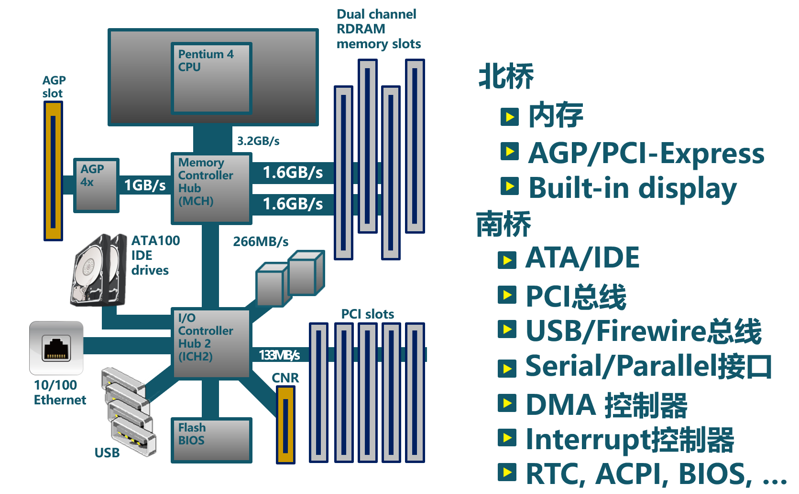

## I/O传输方式

CPU主要有三种方式可以与外设进行数据传输
- Programmed I/O (简称PIO)
- Interrupt
- Direct Memory Access (简称DMA)

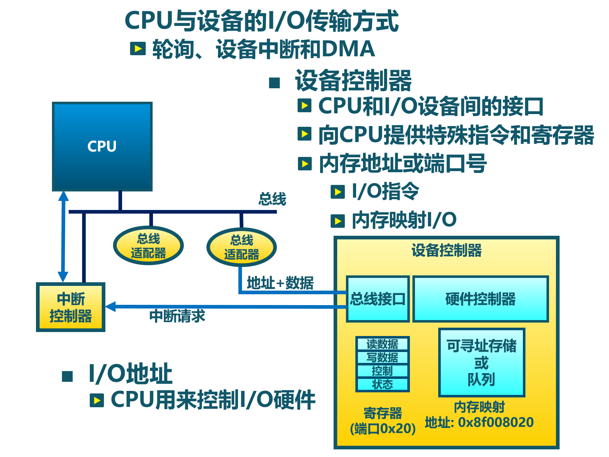


### Programmed I/O

PIO指CPU通过发出I/O指令的方式来进行数据传输。PIO方式可以进一步细分为基于Memory-mapped的PIO（简称MMIO）和Port-mapped的PIO（简称PMIO），MMIO是将I/O设备物理地址映射到内存地址空间，这样CPU就可以通过普通访存指令将数据送到I/O设备在主存上的位置，从而完成数据传输。

对于采用PMIO方式的I/O设备，它们具有自己独立的地址空间，与内存地址空间分离。CPU若要访问I/O设备，则需要使用特殊的I/O指令，如x86处理器中的 IN 、OUT 指令，这样CPU直接使用I/O指令，就可以通过PMIO方式访问设备

### Interrupt based I/O

如果采用PIO方式让CPU来获取外设的执行结果，那么这样的I/O软件中有一个CPU读外设相关寄存器的循环，直到CPU收到可继续执行I/O操作的外设信息后，CPU才能进一步做其它事情。当外设(如串口)的处理速度远低于CPU的时候，将使CPU处于忙等的低效状态中

中断机制的出现，极大地缓解了CPU的负担。CPU可通过PIO方式来通知外设，只要I/O设备有了CPU需要的数据，便会发出中断请求信号。CPU发完通知后，就可以继续执行与I/O设备无关的其它事情。中断控制器会检查I/O设备是否准备好进行传输数据，并发出中断请求信号给CPU。当CPU检测到中断信号，CPU会打断当前执行，并处理I/O传输

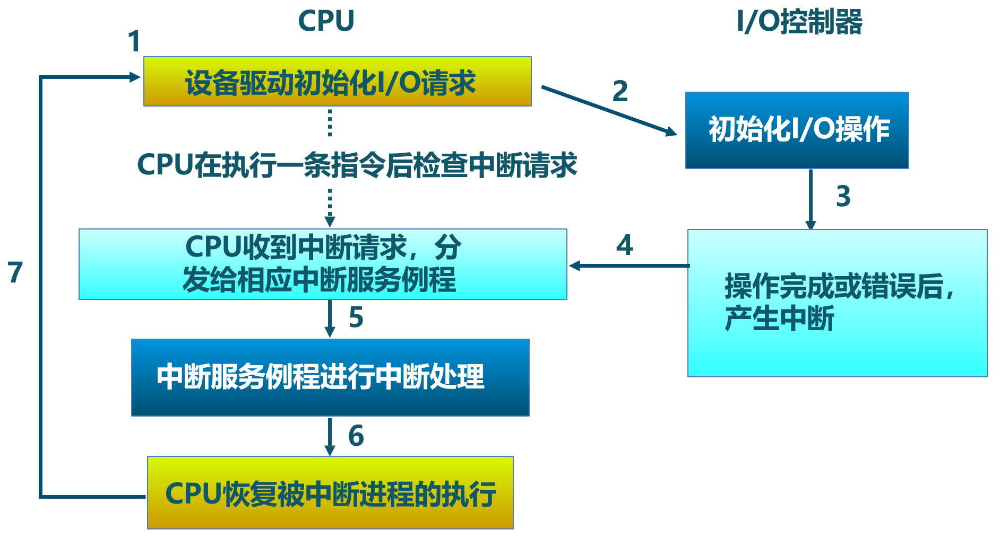

### Direct Memory Access

如果外设每传一个字节都要产生一次中断，那系统执行效率还是很低。DMA（Direct Memory Access）是一种用于在计算机系统中进行快速数据传输的技术。它允许设备直接将数据传输到内存中，而不必通过CPU来直接处理。这样使得CPU从I/O任务中解脱出来，从而提高了系统的整体性能。DMA操作通常由DMA控制器来完成。当CPU需要从内存中读取或写入设备数据时，它会提前向DMA控制器发出准备请求，然后DMA控制器会在后续阶段直接将数据传输到目标位置

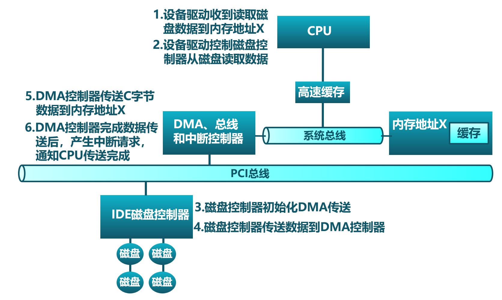

DMA技术工作流程

当CPU想与外设交换一块数据时，它会向DMA控制器发出一条命令。命令的基本内容包括：读或写I/O设备的操作标记，I/O设备的地址，DMA内存的起始地址和传输长度。然后CPU继续其它工作。DMA控制器收到命令后，会直接从内存中或向内存传送整块数据，这个传输过程不再需要通过CPU进行操作。传送结束后，DMA控制器会通过I/O控制器给CPU发送一个表示DMA操作结束的中断。CPU在收到中断后，知道这次I/O操作完成，可进行后续相关事务的处理

## I/O设备抽象

### I/O接口交互协议

对于一个外设而言，它包含了两部分重要组成部分
- 第一部分是对外向系统其他部分展现的设备I/O接口（hardware I/O interface），这样操作系统才能通过接口来管理控制外设。所有设备都有自己的特定接口以及典型交互的协议
- 第二部分是对内的内部结构，包含了设备相关物理实现。由于外在接口的多样性，使得操作系统难以统一管理外设

如果我们不考虑具体的设备，而是站在一个高度抽象的角度来让软件管理设备，那么我们就不用太关注设备的内部结构，而重点考虑设备的接口如何进行简化。其实一个简化的抽象设备接口需要包括三部分：状态、命令、数据。软件可以读取并查看设备的当前状态，从而根据设备当前状态决定下一步的I/O访问请求；而软件是通过一系列的命令来要求设备完成某个具体的I/O访问请求；在完成一个I/O访问请求中，会涉及到将数据传给设备或从设备接收数据。CPU与设备间的I/O接口的交互协议如下所示

```
while STATUS == BUSY {};   // 等待设备执行完毕
DATA =  data;              // 把数据传给设备
COMMAND = command;         // 发命令给设备
while STATUS == BUSY {};   // 等待设备执行完毕
```

引入中断机制后，这个简化的抽象设备接口需要包括四部分：状态、命令、数据、中断。CPU与设备间的I/O接口的交互协议如下所示

```
DATA =  data;          // 把数据传给设备
COMMAND = command;     // 发命令给设备
do_otherwork();        // 做其它事情
...                    // I/O设备完成I/O操作，并产生中断
...                    // CPU执行被打断以响应中断
trap_handler();        // 执行中断处理例程中的相关I/O中断处理
restore_do_otherwork();// 恢复CPU之前被打断的执行
...                    // 可继续进行I/O操作
```

中断机制允许CPU的高速计算与外设的慢速I/O操作可以重叠（overlap），CPU不用花费时间等待外设执行的完成，这样就形成CPU与外设的并行执行，这是提高CPU利用率和系统效率的关键。

站在软件的角度来看，为提高一大块数据传输效率引入的DMA机制并没有改变抽象设备接口的四个部分。仅仅是上面协议伪码中的 data 变成了 data block 。这样传输单个数据产生的中断频度会大大降低，从而进一步提高CPU利用率和系统效率

### 基于文件的I/O设备抽象

设备按照文件的访问接口（即 open/close/read/write ）来进行处理。但由于各种设备的功能繁多，仅仅靠 read/write 这样的方式很难有效地与设备交互

### 基于流的I/O设备抽象

流是用户进程和设备或伪设备之间的全双工连接。它由几个线性连接的处理模块（module）组成，类似于一个shell程序中的管道（pipe），用于数据双向流动。流中的模块通过向邻居模块传递消息来进行通信。除了一些用于流量控制的常规变量，模块不需要访问其邻居模块的其他数据。此外，一个模块只为每个邻居提供一个入口点，即一个接受消息的例程

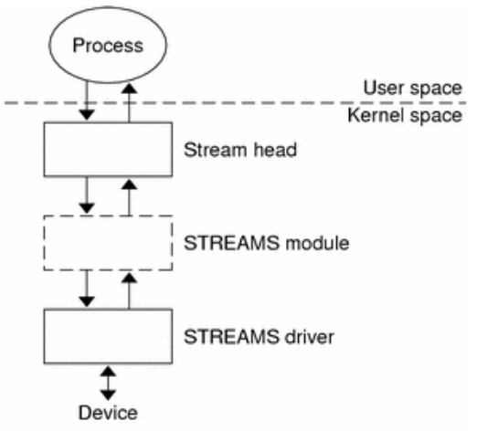

### 基于virtio的I/O设备抽象

虚拟机（VMM或Hypervisor）提供virtio设备的实现，virtio设备有着统一的virtio接口，guest操作系统只要能够实现这些通用的接口，就可以管理和控制各种virtio设备

而虚拟机与guest操作系统的virtio设备驱动程序间的通道是基于共享内存的异步访问方式来实现的，效率很高。虚拟机会进一步把相关的virtio设备的I/O操作转换成物理机上的物理外设的I/O操作。这就完成了整个I/O处理过程

由于virtio设备的设计，使得虚拟机不用模拟真实的外设，从而可以设计一种统一和高效的I/O操作规范来让guest操作系统处理各种I/O操作。这种I/O操作规范其实就形成了基于virtio的I/O设备抽象，并逐渐形成了事实上的虚拟I/O设备的标准

外部设备为CPU提供存储、网络等多种服务，是计算机系统中除运算功能之外最为重要的功能载体。CPU与外设之间通过某种协议传递命令和执行结果；virtio协议最初是为虚拟机外设而设计的IO协议，但是随着应用范围逐步扩展到物理机外设，virtio协议正朝着更适合物理机使用的方向而演进

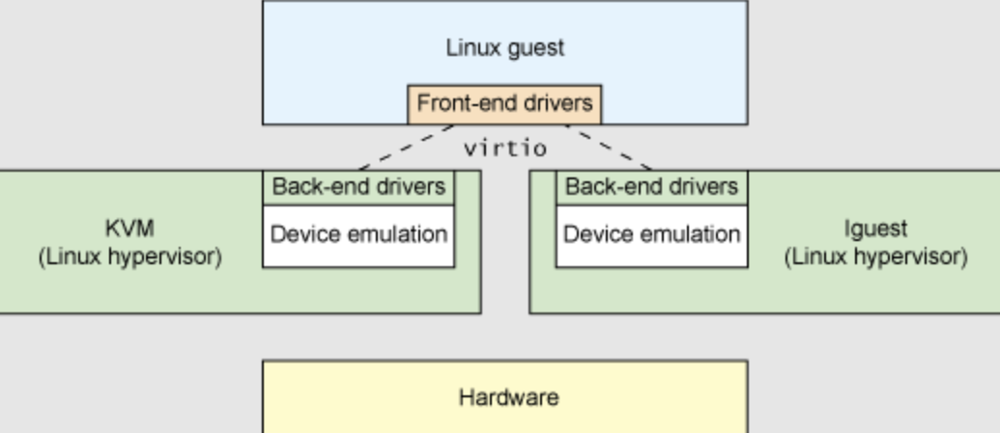

## I/O执行模型

从用户进程的角度看，用户进程是通过I/O相关的系统调用（简称I/O系统调用）来进行I/O操作的。在UNIX环境中，I/O系统调用有多种不同类型的执行模型。根据Richard Stevens的经典书籍“UNIX Network Programming Volume 1: The Sockets Networking ”的6.2节“I/O Models ”的介绍，大致可以分为五种I/O执行模型(I/O Execution Model，简称IO Model, IO模型)：
- blocking IO
- nonblocking IO
- IO multiplexing
- signal driven IO
- asynchronous IO

当一个用户进程发出一个 read I/O系统调用时，主要经历两个阶段:
1. 等待数据准备好 (Waiting for the data to be ready)
2. 把数据从内核拷贝到用户进程中(Copying the data from the kernel to the process)


上述五种IO模型在这两个阶段有不同的处理方式。需要注意，阻塞与非阻塞关注的是进程的执行状态：
- 阻塞：进程执行系统调用后会被阻塞
- 非阻塞：进程执行系统调用后不会被阻塞

同步和异步关注的是消息通信机制：
- 同步：用户进程与操作系统（设备驱动）之间的操作是经过双方协调的，步调一致的
- 异步：用户进程与操作系统（设备驱动）之间并不需要协调，都可以随意进行各自的操作

### 阻塞I/O

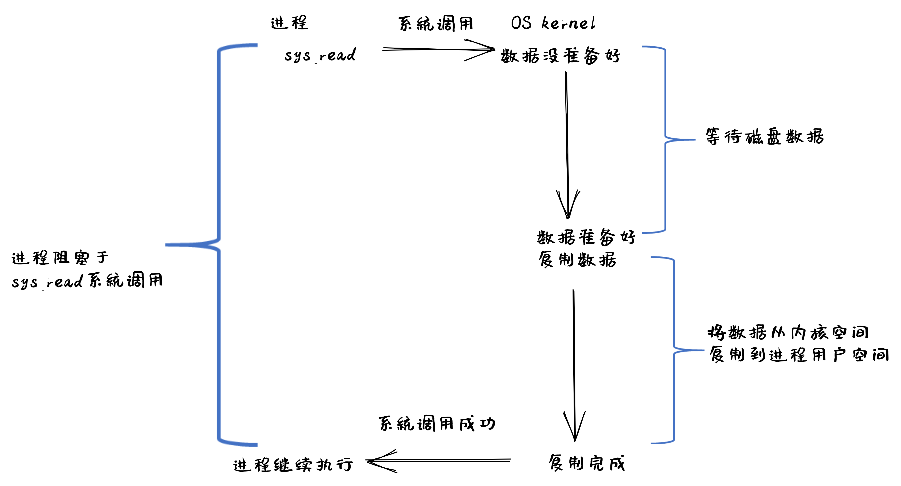

1. 用户进程发出 read 系统调用
2. 内核发现所需数据没在I/O缓冲区中，需要向磁盘驱动程序发出I/O操作，并让用户进程处于阻塞状态
3. 磁盘驱动程序把数据从磁盘传到I/O缓冲区后，通知内核（一般通过中断机制），内核会把数据从I/O缓冲区拷贝到用户进程的buffer中，并唤醒用户进程（即用户进程处于就绪态）
4. 内核从内核态返回到用户态的进程，此时 read 系统调用完成

所以阻塞IO（blocking IO）的特点就是用户进程在I/O执行的两个阶段（等待数据和拷贝数据两个阶段）都是阻塞的。

当然，如果正好用户进程所需数据位于内存中，那么内核会把数据从I/O缓冲区拷贝到用户进程的buffer中，并从内核态返回到用户态的进程， read 系统调用完成。这个由于I/O缓冲带了的优化结果不会让用户进程处于阻塞状态

### 非阻塞I/O

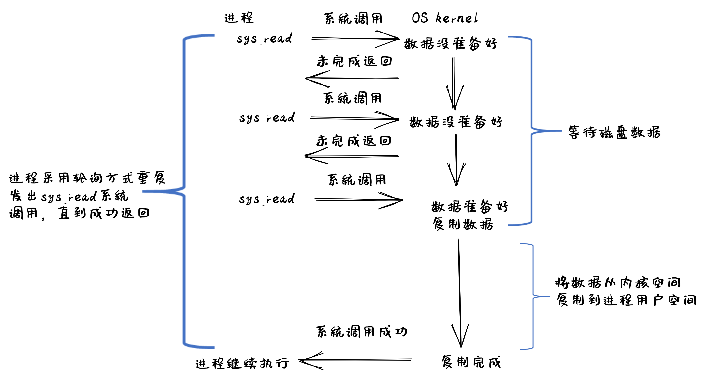

1. 用户进程发出 read 系统调用
2. 内核发现所需数据没在I/O缓冲区中，需要向磁盘驱动程序发出I/O操作，并不会让用户进程处于阻塞状态，而是立刻返回一个error
3. 用户进程判断结果是一个error时，它就知道数据还没有准备好，于是它可以再次发送read操作（这一步操作可以重复多次
4. 磁盘驱动程序把数据从磁盘传到I/O缓冲区后，通知内核（一般通过中断机制），内核在收到通知且再次收到了用户进程的system call后，会马上把数据从I/O缓冲区拷贝到用户进程的buffer中
5. 内核从内核态返回到用户态的进程，此时 read 系统调用完成

所以，在非阻塞式IO的特点是用户进程不会被内核阻塞，而是需要用户进程不断的主动询问内核所需数据准备好了没有。非阻塞系统调用相比于阻塞系统调用的的差异在于在被调用之后会立即返回。

使用系统调用 fcntl( fd, F_SETFL, O_NONBLOCK ) 可以将对某文件句柄 fd 进行的读写访问设为非阻塞IO模型的读写访问

### 多路复用I/O

IO multiplexing对应的I/O系统调用是 select 和 epoll 等，也称这种IO方式为事件驱动IO(event driven IO)

select 和 epoll 的优势在于，采用单进程方式就可以同时处理多个文件或网络连接的I/O操作。其基本工作机制就是通过 select 或 epoll 系统调用来不断的轮询用户进程关注的所有文件句柄或socket，当某个文件句柄或socket有数据到达了，select 或 epoll 系统调用就会返回到用户进程，用户进程再调用 read 系统调用，让内核将数据从内核的I/O缓冲区拷贝到用户进程的buffer中

在多路复用IO模型中，对于用户进程关注的每一个文件句柄或socket，一般都设置成为non-blocking，只是用户进程是被 select 或 epoll 系统调用阻塞住了。select/epoll 的优势并不会导致单个文件或socket的I/O访问性能更好，而是在有很多个文件或socket的I/O访问情况下，其总体效率会高

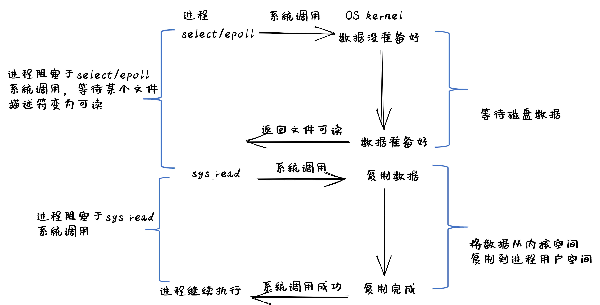

### 信号驱动I/O

当进程发出一个 read 系统调用时，会向内核注册一个信号处理函数，然后系统调用返回。进程不会被阻塞，而是继续执行。当内核中的IO数据就绪时，会发送一个信号给进程，进程便在信号处理函数中调用IO读取数据。此模型的特点是，采用了回调机制，这样开发和调试应用的难度加大

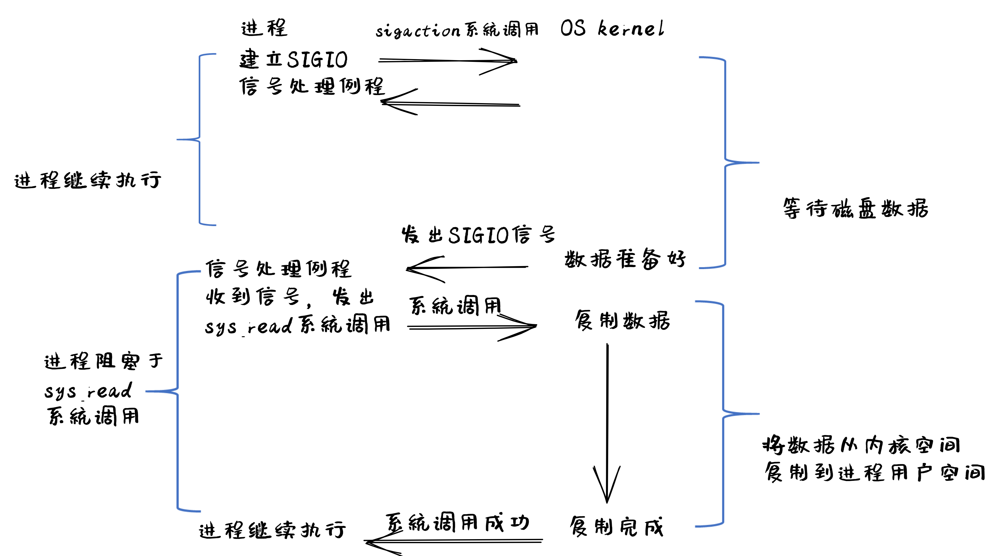

### 异步I/O

用户进程发起 async_read 异步系统调用之后，立刻就可以开始去做其它的事。而另一方面，从内核的角度看，当它收到一个 async_read 异步系统调用之后，首先它会立刻返回，所以不会对用户进程产生任何阻塞情况。然后，kernel会等待数据准备完成，然后将数据拷贝到用户内存，当这一切都完成之后，kernel会通知用户进程，告诉它read操作完成了

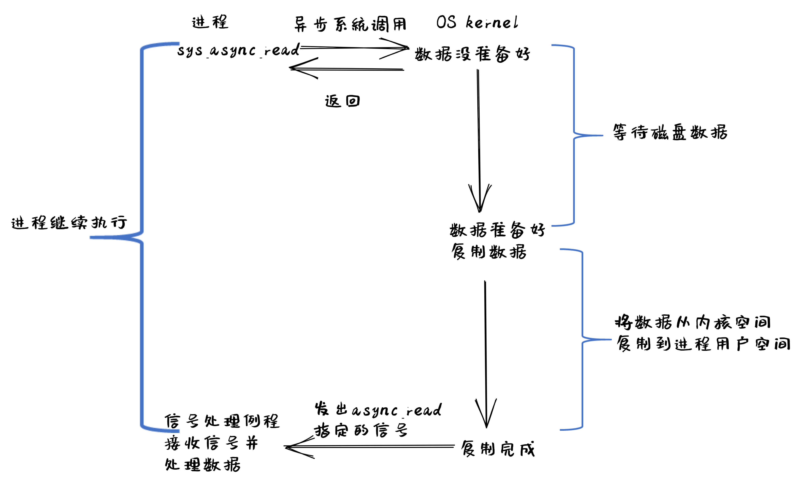

### 五种I/O执行模型对比

- 阻塞IO：在用户进程发出IO系统调用后，进程会等待该IO操作完成，而使得进程的其他操作无法执行
- 非阻塞IO：在用户进程发出IO系统调用后，如果数据没准备好，该IO操作会立即返回，之后进程可以进行其他操作；如果数据准备好了，用户进程会通过系统调用完成数据拷贝并接着进行数据处理
- 同步IO：导致请求进程阻塞/等待，直到I/O操作完成
- 异步IO：不会导致请求进程阻塞

[continue](http://rcore-os.cn/rCore-Tutorial-Book-v3/chapter9/0intro.html)

## 允许S模式下中断的数据结构

RefCell是一个智能指针，通过 `borrow_mut` 获得 `RefMut`，通过 `borrow` 获得 `Ref`, 对应与对于变量的 `&mut` 获取可变引用, 与 `&` 获取不可变引用，但需要注意的是，后者的借用检查发生在编译时，前者的借用检查发生在运行时，而对 `RefMut`/`Ref` 的`deref`能够得到可变变量与不可变变量

将`RefCell<T>`包裹在`UPSafeCell<T>`中，并为`UPSafeCell<T>`实现Sync特征，被包裹的变量T就能够在线程之间安全访问，`exclusive_access`方法中包裹`borrow_mut()`调用，使得根据借用规则，变量只能被独占访问，否则会panic

先前只有U模式允许中断，因而在S模式中的`UPSafeCell<T>`能够保证单核下线程间变量的独占使用，而在允许S模式中断后，S模式中执行代码会被中断打断，这导致`UPSafeCell<T>`无法实现可靠的独占访问(代码在逻辑上是独占访问，但考虑到中断的发生，会倒是逻辑上的独占访问被打破)

通过`UPIntrFreeCell`对可写数据进行独占访问时，会先屏蔽中断，而对可写数据独占访问结束后，再使能中断。从而确保线程对可写数据的独占访问时，不会被中断打断或引入可能的线程切换，而避免了竞态条件的产生