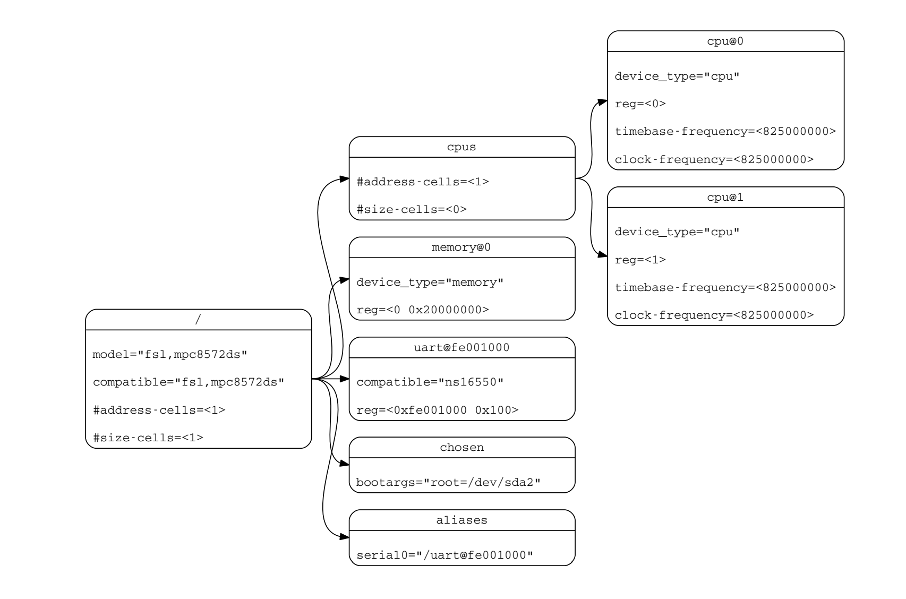

# 外设平台

驱动程序要完成的主要功能，包括初始化设备，接收用户进程的I/O请求并给设备发出I /O命令，响应设备发出的通知，完成用户进程的I/O请求

## 驱动程序概述

本而言，驱动程序是一种软件组件，是操作系统与机外设之间的接口，可让操作系统和设备彼此通信。从操作系统架构上看，驱动程序与I/O设备靠的更近，离应用程序更远，这使得驱动程序需要站在协助所有进程的全局角度来处理各种I/O操作。这也就意味着在驱动程序的设计实现中，尽量不要与单个进程建立直接的联系，而是在全局角度对I/O设备进行统一处理

一般需包括如下一些操作:
- 定义设备相关的数据结构，包括设备信息、设备状态、设备操作标识等
- 设备初始化，即完成对设备的初始配置，分配I/O操作所需的内存，设置好中断处理例程
- 如果设备会产生中断，需要有处理这个设备中断的中断处理例程（Interrupt Handler）
- 根据操作系统上层模块（如文件系统）的要求（如读磁盘数据），给I/O设备发出命令，检测和处理设备出现的错误
- 与操作系统上层模块或应用进行交互，完成上层模块或应用的要求（如上传读出的磁盘数据）

从驱动程序I/O操作的执行模式上看，主要有两种模式的I/O操作：异步和同步。同步模式下的处理逻辑类似函数调用，从应用程序发出I/O请求，通过同步的系统调用传递到操作系统内核中，操作系统内核的各个层级进行相应处理，并最终把相关的I/O操作命令转给了驱动程序。一般情况下，驱动程序完成相应的I/O操作会比较慢（相对于CPU而言），所以操作系统会让代表应用程序的进程进入等待状态，进行进程切换。但相应的I/O操作执行完毕后（操作系统通过轮询或中断方式感知），操作系统会在合适的时机唤醒等待的进程，从而进程能够继续执行

异步I/O操作是一个效率更高的执行模式，即应用程序发出I/O请求后，并不会等待此I/O操作完成，而是继续处理应用程序的其它任务（这个任务切换会通过运行时库或操作系统来完成）。调用异步I/O操作的应用程序需要通过某种方式（比如某种异步通知机制）来确定I/O操作何时完成(协程)

编写驱动程序需要注意:
1. 了解硬件规范：从而能够正确地与硬件交互，并能处理访问硬件出错的情况
2. 了解操作系统，由于驱动程序与它所管理的设备会同时执行，也可能与操作系统其他模块并行/并发访问相关共享资源，所以需要考虑同步互斥的问题（后续会深入讲解操作系统同步互斥机制），并考虑到申请资源失败后的处理
3. 理解驱动程序执行中所在的可能的上下文环境：如果是在进行中断处理（如在执行 trap_handler 函数），那是在中断上下文中执行；如果是在代表进程的内核线程中执行后续的I/O操作（如收发TCP包），那是在内核线程上下文执行。这样才能写出正确的驱动程序

## 硬件系统架构

### 设备树

获取设备树信息

```shell
qemu-system-riscv64 -machine virt -machine dumpdtb=riscv64-virt.dtb -bios default

dtc -I dtb -O dts -o riscv64-virt.dts riscv64-virt.dtb

less riscv64-virt.dts
```

#### 设备树与设备节点属性

设备树（Device Tree）是一种数据结构，用于表示硬件系统的结构和功能。 它是一个文本文件，描述了硬件系统的结构和功能，并将这些信息提供给操作系统。设备树包含了关于硬件系统的信息，如：
- 处理器的类型和数量
- 板载设备（如存储器、网卡、显卡等）的类型和数量
- 硬件接口（如 I2C、SPI、UART 等）的类型和地址信息

设备树中的节点是用来描述硬件设备的信息的。一个设备树节点包含了一个或多个属性，每个属性都是一个键-值对，用来描述设备的某一特定信息。而操作系统就是通过这些节点上的信息来实现对设备的识别和初始化。具体而言，一个设备节点上会有一些常见的属性：
- compatible：表示设备的类型，可以是设备的厂商名、产品名等，如 “virtio,mmio” 指的是这个设备通过 virtio 协议、MMIO（内存映射 I/O）方式来驱动
- reg：表示设备在系统中的地址空间位置
- interrupts：表示设备支持的中断信号

设备树在很多嵌入式系统中都得到了广泛应用，它是一种常用的方法，用于将硬件（特别是外设）信息传递给操作系统。在桌面和服务器系统中，PCI总线可以起到设备树的作用，通过访问PCI总线上特定地址空间，也可以遍历出具有挂在PCI总线上的各种PCI设备



#### 传递设备树信息

操作系统启动后需要了解计算机系统中的所有接入设备，这要求有一个读取全部已接入设备的能力，而在RISC-V中，获取接入设备的信息并存放到某处这一任务通常由 bootloader, 即 OpenSBI 或 RustSBI 固件完成
- 它完成对于包括物理内存在内的各种外设的探测，将探测结果以 **设备树二进制对象（DTB，Device Tree Blob）** 的格式保存在物理内存中的某个地方
- 然后 bootloader 会"调用"操作系统启动，即把存放 DTB 的物理地址存放在 a1 寄存器中，将 HART ID (Hardware Thread, 硬件线程，可理解为执行的 CPU 核)放在 a0 寄存器上，然后跳转到操作系统的入口地址处继续执行

#### 解析设备树信息

通过 bootloader 获得 DTB 之后，将其转化为 Fdt 类型，再依次遍历找到所有的 `virtio, mmio` 设备，通过 `virtio_probe` 显示设备信息并初始化这些设备
1. 分析 reg 信息
2. 判断 virtio 类型
3. 调用 `virtio_device` 函数进一步初始化不同的 virtio 设备
4. 读写特定内存来控制 mmio 设备

## 平台级中断控制器

>中断控制器（Interrupt Controller）
>计算机中的中断控制器是一种硬件，可帮助处理器处理来自多个不同I/O设备的中断请求（Interrupt Request，简称IRQ）。这些中断请求可能同时发生，并首先经过中断控制器的处理，即中断控制器根据 IRQ 的优先级对同时发生的中断进行排序，然后把优先级最高的IRQ传给处理器，让操作系统执行相应的中断处理例程 （Interrupt Service Routine，简称ISR）

如果让操作系统处理外设中断，就需要对中断控制器进行初始化设置。RISC-V中与外设连接的I/O控制器的一个重要组成是平台级中断控制器(Platform-Level Interrupt Controller，PLIC), 它的一端汇聚来各种外设的中断信号，另一端连接到CPU的外部中断引脚上。当一个外部设备发出中断请求时，PLIC 会将其转发给 RISC-V CPU, CPU会执行对应的中断处理程序来响应中断，[PLIC](https://github.com/riscv/riscv-plic-spec/blob/master/riscv-plic.adoc)

通过RISC-V中 M Mode 的中断委托机制，也可以在RISC-V的 S Mode下，通过 `sie` 寄存器中的 `seie` 位，对中断信号是否接收进行控制

### PLIC MMIO

> riscv 特权级中并没有 U-mode 中断

hart_id
- 1-core without SMT，there is only 1 hart (0)
- 1-core with 2-way SMT, there are 2 harts (0,1)

hart_context
- Interrupt targets are usually hart contexts, where a hart context is a given privilege mode on a given hart
- hart运行在不同特权模式中，每个特权模式对应与hart的一个context，而中断的目标通常都是hart context
- 如存在S、M pv 时，每个hart就至少有2个hart context
- hart context 可以类比 thread context

每个处理器核心定义一种策略，来说明但存在多个hart context时，同时活跃的中断的处理方式。对于单个hart context stack（每个支持的特权模式一个）的简单情况，较高特权上下文的中断可以抢先执行较低特权上下文的处理程序。多线程处理器内核可以同时在不同的hart上下文上运行多个独立的中断处理程序。处理器内核还可以提供仅用于中断处理的hart上下文，以减少中断服务延迟，这些上下文可能会抢占同一内核上其他hart的中断处理程序

CPU可以通过MMIO的方式来对PLIC进行管理，与PLIC相关的寄存器如下:

| 寄存器    | 起始地址    | 功能描述                               |
| :-------- | :---------- | :------------------------------------- |
| Priority  | 0x0c00_0000 | 每个中断源的中断优先级                 |
| Pending   | 0x0c00_1000 | 每个中断源的挂起状态                   |
| Enable    | 0x0c00_2000 | 每个hart context的中断源启动状态       |
| Threshold | 0x0c20_0000 | 每个hart context的中断优先级阈值       |
| Claim     | 0x0c20_0004 | 每个hart context触发中断的中断号       |
| Complete  | 0x0c20_0004 | 向相关中断网关发送中断完成消息的寄存器 | # |

**MemoryMap**

The base address of PLIC Memory Map is platform implementation-specific. The memory-mapped registers specified in this chapter have a width of 32-bits. The bits are accessed atomically with LW and SW instructions.

PLIC Memory Map
```
base + 0x000000: Reserved (interrupt source 0 does not exist)
base + 0x000004: Interrupt source 1 priority
base + 0x000008: Interrupt source 2 priority
...
base + 0x000FFC: Interrupt source 1023 priority
base + 0x001000: Interrupt Pending bit 0-31
base + 0x00107C: Interrupt Pending bit 992-1023
...
152
base + 0x002080: Enable bits for sources 0-31 on context 1
base + 0x002084: Enable bits for sources 32-63 on context 1
...
base + 0x0020FC: Enable bits for sources 992-1023 on context 1
base + 0x002100: Enable bits for sources 0-31 on context 2
base + 0x002104: Enable bits for sources 32-63 on context 2
...
base + 0x00217C: Enable bits for sources 992-1023 on context 2
...
base + 0x1F1F80: Enable bits for sources 0-31 on context 15871
base + 0x1F1F84: Enable bits for sources 32-63 on context 15871
base + 0x1F1FFC: Enable bits for sources 992-1023 on context 15871
...
base + 0x1FFFFC: Reserved
base + 0x200000: Priority threshold for context 0
base + 0x200004: Claim/complete for context 0
base + 0x200008: Reserved
...
base + 0x200FFC: Reserved
base + 0x201000: Priority threshold for context 1
base + 0x201004: Claim/complete for context 1
...
base + 0x3FFF000: Priority threshold for context 15871
base + 0x3FFF004: Claim/complete for context 15871
base + 0x3FFF008: Reserved
...
base + 0x3FFFFFC: Reserved
```

### 中断优先级(Interrupt Priorities)

PLIC中的优先级是一些带有平台定义最高中断等级的unsigned interges。priority为0表示 "never interrupt", 中断优先级随 priority 数值的增加而提高。每个全局中断源都有一个保存在内存映射的寄存器中的相关中断优先级

尽量不要为不同的中断源设置相同的优先级，当存在这种情况是，中断ID最小的拥有最高的优先级


通过DTC可获得设备的中断信息，以及基于MMIO的外设寄存器信息，这在后续驱动程序中需要用到

操作系统如果要响应外设的中断，需要进行两方面的初始化工作。
- 首先需要吧 `sie` 寄存器中的 `seie` 位设置为1, 让CPU能够接收通过PLIC传过来的外部设备中断信号
- 然后还需要通过MMIO方式对PLIC的寄存器进行初始化设置，才能让外设产生的中断传到CPU处, 其主要操作包括
  - 设置外设中断优先级
  - 设置外设中断的阈值，屏蔽小于等于阈值的中断
  - 激活外设中断，即把 `Enable` 寄存器的外设中断编号为目标索引的位设置为1

外设产生中断后，CPU并不知道具体是哪个设备传过来的中断，而这可以通过读取PLIC的 `claim` 来了解。`Claim` 寄存器会返回PLIC接收到的优先级最高的中断; 如果没有外设中断产生，读 `Claim` 寄存器会返回0

操作系统在受到中断并完成中断处理后，还需通知PLIC中断处理完毕。CPU需要在PLIC的 `Complete` 寄存器中写入对应中断号为索引的位，来通知PLIC中断处理已经完毕

