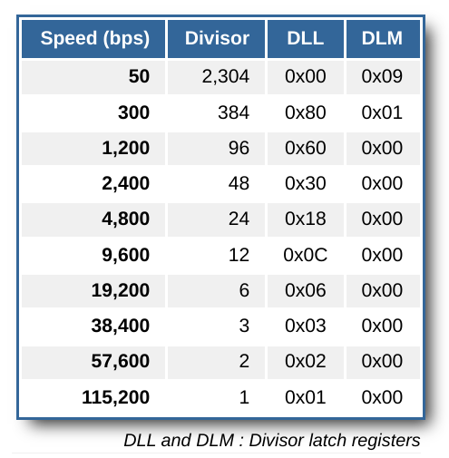

# 串口驱动程序

串口（Universal Asynchronous Receiver-Transmitter，简称UART）是一种在嵌入式系统中常用的用于传输、接收系列数据的外部设备。串行数据传输是逐位（bit）顺序发送数据的过程

[NS16550A硬件规范](https://www.lammertbies.nl/comm/info/serial-uart)

每个UART使用8个I/O字节来访问其寄存器(每个寄存器8bit)，每个寄存器的访问规则如下
- DLAB是寄存器LSR的第7位，依据此位的不同，读取 I/O port 所对应的寄存器也不同

| I/O port |        Read (DLAB=0)         |     Write (DLAB=0)      |        Read (DLAB=1)         |    Write (DLAB=1)     |
| :------: | :--------------------------: | :---------------------: | :--------------------------: | :-------------------: |
|   base   |     RBR receiver buffer      | THR transmitter holding |    DLL divisor latch LSB     | DLL divisor latch LSB |
|  base+1  |     IER interrupt enable     |  IER interrupt enable   |    DLM divisor latch MSB     | DLM divisor latch MSB |
|  base+2  | IIR interrupt identification |    FCR FIFO control     | IIR interrupt identification |   FCR FIFO control    |
|  base+3  |       LCR line control       |    LCR line control     |       LCR line control       |   LCR line control    |
|  base+4  |      MCR modem control       |    MCR modem control    |      MCR modem control       |   MCR modem control   |
|  base+5  |       LSR line status        |      factory test       |       LSR line status        |     factory test      |
|  base+6  |       MSR modem status       |        not used         |       MSR modem status       |       not used        |
|  base+7  |         SCR scratch          |       SCR scratch       |         SCR scratch          |      SCR scratch      |

RBR: Receiver buffer register(RO)
保存接受到的数据。FIFO未设置时，保存接收的一个Byte，FIFO设置时，则保存最久的1个Byte。FIFO设置时，每次读的行为都将返回下一个Byte，直到没有新的数据为止。LSR中第0位(右1)用来检查是否所有的Byte都被读取完毕

THR: Transmitter holding register(WO)
保存发送的数据。FIFO未设置时，仅保存1Byte，设置时，最大字符数量与UART设备的类型相关。LSR bit 5可用来检查是否有新的数据需要写向FIFO，为0时表明寄存器是空的，当FIFO设置时，可以将多于1的字符写入FIFO，但是并没有任何标志来记录当前transmitter中保存的数据

transmitter保存数据的寄存器不用于直接传输数据。这些Byte首先被传送到移位寄存器，在移位寄存器中，信息被分成单个位，这些位被逐个发送

IER: Interrupt enable register(R/W)
进行串口通信最聪明的方式是使用中断驱动的例程，而无需周期性地轮询寄存器来感知状态的变化。UART将通过产生处理器中断来通知每个变化。必须有一个软件例程来处理中断，并检查导致中断的状态变化。UART并非一定使用中断，而需要通过设置IER来完成，通过使能IER寄存器的位，来决定当那些事件发生时，会产生中断

|  Bit  |             Description              |
| :---: | :----------------------------------: |
|   0   |       Received data available        |
|   1   |  Transmitter holding register empty  |
|   2   | Receiver line status register change |
|   3   |     Modem status register change     |
|   4   |       Sleep mode (16750 only)        |
|   5   |     Low power mode (16750 only)      |
|   6   |               reserved               |
|   7   |               reserved               |

IIR: Interrupt identification register(RO)
中断发生时，处理器还需要额外的信息来知道导致中断的原因，IIR便用来显示当前UART的状态，以及那种状态变化导致中断产生


FCR: FIFO control register(WO)
控制UART中FIFO的行为

LCR: Line control register(R/W)
LCR线路控制寄存器在初始化时用于设置通信参数。寄存器还控制DLL和DLM寄存器的可访问性。这些寄存器映射到与RBR、THR和IER寄存器相同的I/O端口。因为只有在初始化时，当没有通信发生时才能访问它们，所以寄存器交换对性能没有影响

MCR: Modem control register (R/W)
控制与所连接设备的握手

LSR: Line status register (RO)
LSR线路状态寄存器显示通信的当前状态。错误反映在此寄存器中。接收和发送缓冲器的状态也是可用的

bit 5和6都显示了发送周期的状态。不同之处在于，只要transmitter保持寄存器为空，位5就变高，而位6表示输出线路上的位的移位寄存器也是空的
|  Bit  |          Description           |
| :---: | :----------------------------: |
|   0   |         Data available         |
|   1   |         Overrun error          |
|   2   |          Parity error          |
|   3   |         Framing error          |
|   4   |     Break signal received      |
|   5   |          THR is empty          |
|   6   | THR is empty, and line is idle |
|   7   |     Errornous data in FIFO     |


MSR: Modem status register (RO)
包含有关设备上四条输入调制解调器控制线的信息

SCR: Scratch register (R/W)
唯一实际用途是检查UART是8250/8250B还是8250A/16450系列

DLL and DLM: Divisor latch registers (R/W)
为了产生其定时信息，每个UART使用一个振荡器产生约1.8432 MHz的频率。该频率除以16以产生通信的时基



## 设备树信息

dts中的信息显示
- uart设备的MMIO起始地址为`0x10000000`, 范围在`0x00 - 0x100` 之间
- 中断号为 `0x0a`， `interrupt-parent` 属性值包含一个引用了中断控制器节点的 phandle 实例，它指定了哪个节点是该设备的中断控制器，phandle是设备树的另一个重要概念，用于表示设备节点之间的父子关系，即将子设备与父设备相关联。可以将phandle理解为设备节点的唯一标识符。
- `clock-frequency` 表示时钟频率，其值为0x38400，即3.6864 MHz
- `compatible = "ns16550a" `表示串口的硬件规范兼容NS16550A

```
# soc
uart@10000000 {
        interrupts = <0x0a>;
        interrupt-parent = <0x03>;
        clock-frequency = "\08@";
        reg = <0x00 0x10000000 0x00 0x100>;
        compatible = "ns16550a";
};
```

在如下情况下，串口会产生中断：
- 有新的输入数据进入串口的接收缓存
- 串口完成了缓存中数据的发送
- 串口发送出现错误

### 串口设备初始化

通过MMIO正确设置UART设备各个寄存器的值，并使能数据接收中断

### 串口设备输入输出

线程想要从串口读取数据，但此时并没有数据传入时，进程将被暂时block, 同时，由于设置了串口数据接收中断，而在对应的中断处理函数中，会不断读取串口传入的数据，并唤醒block的线程

### 内核中断上下文