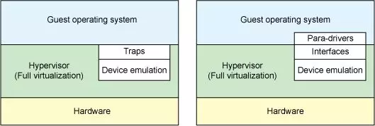
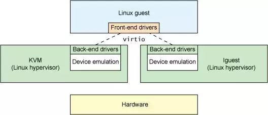
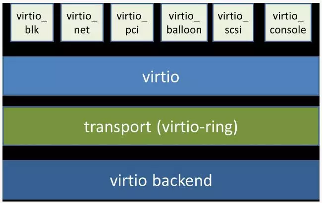
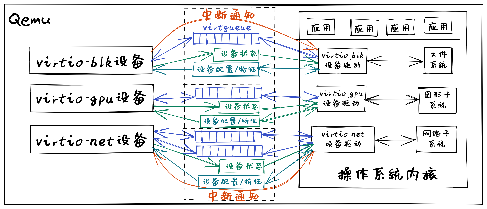
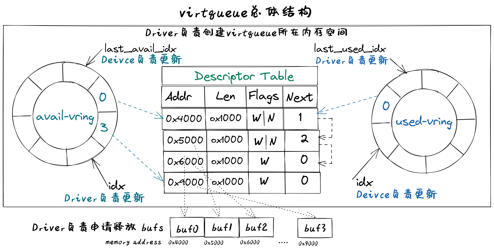

# virtio设备驱动程序

virtio 协议是对hypervisor 中的一组通用模拟设备的抽象，即virtio协议定义了虚拟设备的输入/输出接口。而基于virtio协议的I/O设备称为virtio设备

虚拟机模拟外设的传统方案中，如果guest VM 要使用底层 host主机的资源，需要 Hypervisor 截获所有的I/O请求指令，然后模拟出这些I/O指令的行为，这会带来较大的性能开销

virtio方案中，模拟的外设实现了功能最小化，即虚拟外设的数据面接口主要是与guest VM 共享的内存、控制面接口主要基于内存映射的寄存器和中断机制。这样guest VM 通过访问虚拟外设来使用底层 host主机的资源时，Hypervisor只需对少数寄存器访问和中断机制进行处理，实现了高效的I/O虚拟化过程

数据面（Data Plane）
- 设备与处理器之间的I/O数据传输相关的数据设定（地址、布局等）与传输方式（基于内存或寄存器等）

控制平面（Control Plane）
- 处理器发现设备、配置设备、管理设备等相关的操作，以及处理器和设备之间的相互通知机制

另外，各种类型的virtio设备，如块设备（virtio-blk）、网络设备（virtio-net）、键盘鼠标类设备（virtio-input）、显示设备（virtio-gpu）具有共性特征和独有特征。对于共性特征，virtio设计了各种类型设备的统一抽象接口，而对于独有特征，virtio尽量最小化各种类型设备的独有抽象接口。这样，virtio就形成了一套通用框架和标准接口（协议）来屏蔽各种hypervisor的差异性，实现了guest VM和不同hypervisor之间的交互过程

从本质上讲，virtio是一个接口，允许运行在虚拟机上的操作系统和应用软件通过访问 virtio 设备使用其主机的设备。这些 virtio 设备具备功能最小化的特征，Guest VM中的设备驱动程序(Front-end drivers)只需实现基本的发送和接收I/O数据即可，而位于Hypervisor中的Back-end drivers和设备模拟部分让主机处理其实际物理硬件设备上的大部分设置、维护和处理。这种设计方案极大减轻了virtio驱动程序的复杂性

## virtio架构

总体上看，virtio 架构可以分为上中下三层

上层包括运行在QEMU模拟器上的前端操作系统中各种驱动程序（Front-end drivers）

中间层是传输（transport）层，就是驱动程序与虚拟设备之间的交互接口，包含两部分：
  - 上半部是virtio接口定义，即I/O数据传输机制的定义：virtio 虚拟队列（virtqueue）
  - 下半部是virtio接口实现，即I/O数据传输机制的具体实现：virtio-ring，主要由环形缓冲区和相关操作组成，用于保存驱动程序和虚拟设备之间进行命令和数据交互的信息

下层是在QEMU中模拟的各种虚拟设备 Device

操作系统中virtio 驱动程序的主要功能包括：
1. 接受来自用户进程或操作系统其它组件发出的 I/O 请求
2. 将这些 I/O 请求通过virqueue发送到相应的 virtio 设备
3. 通过中断或轮询等方式查找并处理相应设备完成的I/O请求

Qemu或Hypervisor中virtio设备的主要功能包括：
1. 通过virqueue接受来自相应virtio驱动程序的 I/O 请求
2. 通过设备仿真模拟或将I/O操作卸载到主机的物理硬件来处理I/O请求，使处理后的I/O数据可供virtio驱动程序使用
3. 通过寄存器、内存映射或中断等方式通知virtio驱动程序处理已完成的I/O请求

## I/O设备基本组成结构

virtio设备代表了一类I/O通用设备，为了让设备驱动能够管理和使用设备。在程序员的眼里，I/O设备基本组成结构包括如下：
- 呈现模式：设备一般通过寄存器、内存或特定I/O指令等方式让设备驱动能看到和访问到设备
- 特征描述：让设备驱动能够了解设备的静态特性（可通过软件修改），从而决定是否或如何使用该设备
- 状态表示：让设备驱动能够了解设备的当前动态状态，从而确定如何进行设备管理或I/O数据传输
- 交互机制：交互包括事件通知和数据传输
  - 对于事件通知，让设备驱动及时获知设备的状态变化的机制（可基于中断等机制），以及让设备及时获得设备驱动发出的I/O请求（可基于寄存器读写等机制）
  - 对于数据传输，让设备驱动能处理设备给出的数据，以及让设备能处理设备驱动给出的数据，如（可基于DMA或virtqueue等机制）

## virtio设备基本组成要素

virtio设备的基本组成要素如下：
- 设备配置空间（Device Configuration space）
- 特征位（Feature bits）
- 设备状态域（Device status field）
- 通知（Notifications）
- 一个或多个虚拟队列（virtqueue）

其中的设备特征位和设备配置空间属于virtio设备的特征描述

设备状态域属于virtio设备初始化时的状态表示

通知和虚拟队列属于virtio设备的交互机制，也包含virtio设备运行时的状态表示

## virtio设备呈现模式

virtio设备支持三种设备呈现模式：
- Virtio Over MMIO，虚拟设备直接挂载到系统总线上
- Virtio Over PCI BUS，遵循PCI规范，挂在到PCI总线上，作为virtio-pci设备呈现，在QEMU虚拟的x86计算机上采用的是这种模式
- Virtio Over Channel I/O：主要用在虚拟IBM s390计算机上，virtio-ccw使用这种基于channel I/O的机制。

在Qemu模拟的RISC-V计算机 – virt 上，采用的是Virtio Over MMIO的呈现模式。这样在实现设备驱动时，只需要找到相应virtio设备的I/O寄存器等以内存形式呈现的地址空间，就可以对I/O设备进行初始化和管理了

## virtio设备特征描述

virtio设备特征描述包括设备特征位和设备配置空间

### 特征位

特征位用于表示VirtIO设备具有的各种特性和功能
- bit00 – 23是特定设备可以使用的feature bits
- bit24 – 37预给队列和feature协商机制
- bit38以上保留给未来其他用途
  
驱动程序与设备对设备特性进行协商，形成一致的共识，这样才能正确的管理设备

### 设备配置空间

设备配置空间通常用于配置不常变动的设备参数（属性），或者初始化阶段需要设置的设备参数。设备的特征位中包含表示配置空间是否存在的bit位，并可通过在特征位的末尾添加新的bit位来扩展配置空间。

设备驱动程序在初始化virtio设备时，需要根据virtio设备的特征位和配置空间来了解设备的特征，并对设备进行初始化

## virtio设备状态表示

virtio设备状态表示包括在设备初始化过程中用到的设备状态域，以及在设备进行I/O传输过程中用到的I/O数据访问状态信息和I/O完成情况等

### 设备状态域

设备状态域包含对设备初始化过程中virtio设备的6种状态：
- ACKNOWLEDGE（1）：驱动程序发现了这个设备，并且认为这是一个有效的virtio设备
- DRIVER (2) : 驱动程序知道该如何驱动这个设备
- FAILED (128) : 由于某种错误原因，驱动程序无法正常驱动这个设备
- FEATURES_OK (8) : 驱动程序认识设备的特征，并且与设备就设备特征协商达成一致
- DRIVER_OK (4) : 驱动程序加载完成，设备可以正常工作了
- DEVICE_NEEDS_RESET (64) ：设备触发了错误，需要重置才能继续工作

在设备驱动程序对virtio设备初始化的过程中，需要经历一系列的初始化阶段，这些阶段对应着设备状态域的不同状态

### I/O传输状态

设备驱动程序控制virtio设备进行I/O传输过程中，会经历一系列过程和执行状态，包括 *I/O请求*状态、 *I/O处理*状态、 *I/O完成*状态、 *I/O错误*状态、 *I/O后续处理* 状态等。设备驱动程序在执行过程中，需要对上述状态进行不同的处理

virtio设备进行I/O传输过程中，设备驱动会指出 I/O请求 队列的当前位置状态信息，这样设备能查到I/O请求的信息，并根据 I/O请求 进行I/O传输；而设备会指出 I/O完成 队列的当前位置状态信息，这样设备驱动通过读取 I/O完成 数据结构中的状态信息，就知道设备是否完成I/O请求的相应操作，并进行后续事务处理

1. virtio_blk设备驱动发出一个读设备块的I/O请求，并在某确定位置给出这个I/O请求的地址，然后给设备发出'kick'通知(读或写相关I/O寄存器映射的内存地址)，此时处于 `I/O请求` 状态
2. 设备在得到通知后，此时处于 `I/O处理` 状态，它解析I/O请求，完成I/O请求的处理，即把磁盘块内容读入到内存中，并给出读出的块数据的内存地址，再通过中断通知设备驱动，此时处于 `I/O完成` 状态；如果磁盘块读取发生错误，此时处于 `I/O错误` 状态
3. 设备驱动通过中断处理例程(此时处于 `I/O后续处理` 状态)知道设备已经完成读磁盘块操作，会根据磁盘块数据所在内存地址，把数据传递给文件系统进行进一步处理；如果设备驱动发现磁盘块读错误，则会进行错误恢复相关的后续处理

## virtio设备交互机制

virtio设备交互机制包括基于Notifications的事件通知和基于virtqueue虚拟队列的数据传输
- 事件通知是指设备和驱动程序必须通知对方，它们有数据需要对方处理
- 数据传输是指设备和驱动程序之间进行进行I/O数据（如磁盘块数据、网络包）传输

### Notification通知

驱动程序和设备在交互过程中需要相互通知对方：
- 驱动程序组织好相关 命令/信息 要通知设备去处理I/O事务
- 设备处理完I/O事务后，要通知驱动程序进行后续事务，如回收内存，向用户进程反馈I/O事务的处理结果等

驱动程序通知设备可用 `门铃 doorbell` 机制，即采用PIO或MMIO方式访问设备特定寄存器，QEMU进行拦截再通知其模拟的设备

设备通知驱动程序一般用中断机制，即在QEMU中进行中断注入，让CPU响应并执行中断处理例程，来完成对I/O执行结果的处理

### virtqueue虚拟队列

在virtio设备上进行批量数据传输的机制被称为虚拟队列（virtqueue），virtio设备的虚拟队列（virtqueue）可以由各种数据结构（如数组、环形队列等）来具体实现

每个virtio设备可以拥有零个或多个virtqueue，每个virtqueue占用多个物理页，可用于设备驱动程序给设备发I/O请求命令和相关数据（如磁盘块读写请求和读写缓冲区），也可用于设备给设备驱动程序发I/O数据（如接收的网络包）

## virtqueue虚拟队列

virtio协议中一个关键部分是virtqueue，在virtio规范中，virtqueue是virtio设备上进行批量数据传输的机制和抽象表示。在设备驱动实现和Qemu中virtio设备的模拟实现中，virtqueue是一种数据结构，用于设备和驱动程序中执行各种数据传输操作

操作系统在Qemu上运行时，virtqueue是 virtio 驱动程序和 virtio 设备访问的同一块内存区域

当涉及到 virtqueue 的描述时，有很多不一致的地方。有将其与vring（virtio-rings或VRings）等同表示，也有将二者分别单独描述为不同的对象。我们将在这里单独描述它们，因为vring是virtqueues的主要组成部分，是达成virtio设备和驱动程序之间数据传输的数据结构， vring本质是virtio设备和驱动程序之间的共享内存，但 virtqueue 不仅仅只有vring

virtqueue由三部分组成
- 描述符表 Descriptor Table：描述符表是描述符为组成元素的数组，每个描述符描述了一个内存buffer 的address/length。而内存buffer中包含I/O请求的命令/数据（由virtio设备驱动填写），也可包含I/O完成的返回结果（由virtio设备填写）等
- 可用环 Available Ring：一种vring，记录了virtio设备驱动程序发出的I/O请求索引，即被virtio设备驱动程序更新的描述符索引的集合，需要virtio设备进行读取并完成相关I/O操作
- 已用环 Used Ring：另一种vring，记录了virtio设备发出的I/O完成索引，即被virtio设备更新的描述符索引d 集合，需要vrtio设备驱动程序进行读取并对I/O操作结果进行进一步处理

### 描述符表 Descriptor Table

描述符表用来指向virtio设备I/O传输请求的缓冲区（buffer）信息，由 Queue Size 个Descriptor（描述符）组成。描述符中包括buffer的物理地址(addr字段)，buffer的长度(len字段)，可以链接到 next Descriptor 的next指针（用于把多个描述符链接成描述符链

buffer所在物理地址空间需要设备驱动程序在初始化时分配好，并在后续由设备驱动程序在其中填写IO传输相关的命令/数据，或者是设备返回I/O操作的结果。多个描述符（I/O操作命令，I/O操作数据块，I/O操作的返回结果）形成的描述符链可以表示一个完整的I/O操作请求

### 可用环 Available Ring

可用环在结构上是一个环形队列，其中的条目（item）仅由**驱动程序**写入，并由设备读出

可用环中的条目包含了一个描述符链的头部描述符的索引值。可用环用头指针（idx）和尾指针（last_avail_idx）表示其可用条目范围。virtio设备通过读取可用环中的条目可获取驱动程序发出的I/O操作请求对应的描述符链，然后virtio设备就可以进行进一步的I/O处理了。描述符指向的缓冲区具有可读写属性，可读的缓冲区用于Driver发送数据，可写的缓冲区用于接收数据。

比如，对于virtio-blk设备驱动发出的一个读I/O操作请求包含了三部分内容，由三个buffer承载，需要用到三个描述符：
1. "读磁盘块"
2. I/O操作数据块("数据缓冲区")
3. I/O操作的返回结果("结果缓冲区")
这三个描述符形成的一个完成的I/O请求链，virtio-blk设备可通过读取第一个描述符指向的缓冲区了解到是“读磁盘块”操作，这样就可把磁盘块数据通过DMA操作放到第二个描述符指向的“数据缓冲区”中，然后把“OK”写入到第三个描述符指向的“结果缓冲区”中

### 已用环 Used Ring

已用环在结构上是一个环形队列，其中的的条目仅由virtio设备写入，并由驱动程序读出。已用环中的条目也一个是描述符链的头部描述符的索引值。已用环也有头指针（idx）和尾指针（last_avail_idx）表示其已用条目的范围。

比如，对于virtio-blk设备驱动发出的一个读I/O操作请求（由三个描述符形成的请求链）后，virtio设备完成相应I/O处理，即把磁盘块数据写入第二个描述符指向的“数据缓冲区”中，可用环中对应的I/O请求条目“I/O操作的返回结果”的描述符索引值移入到已用环中，把“OK”写入到第三个描述符指向的“结果缓冲区”中，再在已用环中添加一个已用条目，即I/O操作完成信息；然后virtio设备通过中断机制来通知virtio驱动程序，并让virtio驱动程序读取已用环中的描述符，获得I/O操作完成信息，即磁盘块内容

## 基于virtqueue进行I/O操作的过程

- 初始化过程：（驱动程序执行）
  1. virtio设备驱动在对设备进行初始化时，会申请virtqueue（包括描述符表、可用环、已用环）的内存空间
  2. 把virtqueue中的描述符、可用环、已用环三部分的物理地址分别写入到virtio设备中对应的控制寄存器（即设备绑定的特定内存地址）中。至此，设备驱动和设备就共享了整个virtqueue的内存空间
- I/O请求过程：（驱动程序执行）
  1. 设备驱动在发出I/O请求时，首先把I/O请求的命令/数据等放到一个或多个buffer中
  2. 然后在描述符表中分配新的描述符（或描述符链）来指向这些buffer
  3. 再把描述符（或描述符链的首描述符）的索引值写入到可用环中，更新可用环的idx指针
  4. 