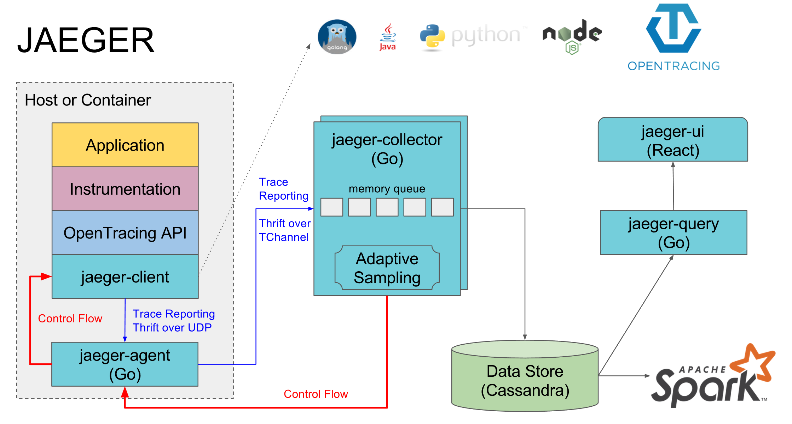

# Jaeger 架构分析

- [Jaeger 架构分析](#jaeger-架构分析)
  - [一、jaeger架构设计](#一jaeger架构设计)
    - [(1) 架构图](#1-架构图)
    - [(2) 组件概述](#2-组件概述)
    - [(3) 总结](#3-总结)
  - [二、采样](#二采样)
    - [(1) 采样策略](#1-采样策略)
    - [(2) 自适应采样](#2-自适应采样)
    - [(3) 文件采样](#3-文件采样)

- [Jaeger源码解析](https://blog.csdn.net/weixin_33961829/article/details/88954322)  

## 一、jaeger架构设计

### (1) 架构图

- 

### (2) 组件概述

**Jaeger Client**

- Jaeger 客户端是 OpenTracing API 的特定语言实现
  - 可以用来手动为app插桩或与各种现有开源框架（例如 Flask、Dropwizard、gRPC 等）一起为分布式跟踪检测应用程序，这些框架已经与 OpenTracing 集成

- 已经插桩的服务在接收新请求时，创建span并将上下文信息（trace ID、span ID 和baggage）附加到传出请求
  - 只有 ids 和 baggage 会随请求传播
  - 所有其他分析数据，如操作名称、时间、标签和日志，都不会传播
  - 反而，它在后台异步传输到 Jaeger 后端

- 插桩设计为能够始终在生产环境中运行
  - 为了最大限度地减少开销，Jaeger Client 采用了各种采样策略
  - 当一个 trace 被选中采样时，则会捕获可分析的span数据并将其传输到 Jaeger 后端
  - 当一个 trace 没有被选中采样时，则根本不会收集任何分析数据，并且对 OpenTracing API 的调用将被被"短路"以最小化的开销
  - 默认情况下，Jaeger Client对 0.1% 的trace进行采样，并且能够从 Jaeger 后端取得其他采样策略

**Jaeger Agent**

- 一个监听在 UDP 端口上接收 span 数据的网络守护进程，会将数据批量发送给 collector
  - 被设计成一个基础组件，部署到 所有 的宿主机上
  - Agent 将 client library 和 collector 解耦，为 client library 屏蔽了路由和发现 collector 的细节

**Jaeger Collector**

- Jaeger Collector接收来自 Jaeger Agent 的trace数据并运行一套数据处理流水线
  - 目前在流水线中验证trace、构建索引、执行任何转换并最终将数据存储至给定的数据库
  - Jaeger Collector 被设计成无状态的组件，能够可以同时运行任意数量

**Data Store** 
  - Jaeger 的存储是一个可插拔组件，目前支持 Cassandra、Elasticsearch 和 Kafka

**Query**
- 接收查询请求，然后从后端存储系统中检索 trace 并通过 UI 进行展示
  - Query 是无状态的，您可以启动多个实例，把它们部署在 nginx 这样的负载均衡器后面

**UI**

- 提供给用户的展示界面

**Ingester**

- Ingester 是一项从 Kafka topic 读取数据并写入另一个存储后端（Cassandra、Elasticsearch）的服务

### (3) 总结

从数据流动来看，程序通过Client提供的SDK，能够将追踪信息发送给本机上的Agent，Agent则批量地将数据发送给Collector，Collector将接收到的数据写入Data Store进行存储，而前端则通过Query进行追踪数据的查询

## 二、采样

- Jaeger 库实现一致的前期（或基于头部）采样
- 假设我们有一个简单的调用图，其中服务 A 调用服务 B，而 B 调用服务 C：A -> B -> C
  1. 当服务 A 收到不包含trace信息的请求时，Jaeger tracer将启动一个新的trace，为其分配一个随机跟踪 ID，并根据当前使用的采样策略做出采样决策
  2. 采样决策将随着请求传播到B与C，因此后续的服务都不必再进行采用决策，而是遵循顶级服务 A 做出的决策
- 这种方法保证如果对trace进行采样，则它的所有span都将在后端记录。如果每个服务都做出自己的采样决定，则很少会在后端获得完整的trace

### (1) 采样策略

- 实例化tracer时，可以通过 sampler.type 和 sampler.param 属性选择采样类型
- Jaeger 库支持以下采样器

|采样策略|配置|描述|举例|
|:-:|:-:|-|-|
|Constant|sampler.type=const|采样器总是对所有trace做出相同的决策|要么对所有轨迹进行采样（sampler.param=1），要么不采样（sampler.param=0）|
|Probabilistic|sampler.type=probabilistic|sampler 做出随机采样决策，采样概率等于 sampler.param 属性的值|当 sampler.param=0.1 时，大约 10 条迹线中就有 1 条将被采样|
|Rate Limiting|sampler.type=ratelimiting|采样器使用漏桶速率限制器来确保以某个恒定速率对轨迹进行采样|当 sampler.param=2.0 时，它将以每秒 2 次跟踪的速率对请求进行采样|
|Remote(default)|sampler.type=remote|采样器咨询 Jaeger 代理以获取在当前服务中使用的适当采样策略|允许从 Jaeger 后端的中央配置控制服务中的采样策略，甚至动态控制|

### (2) 自适应采样

- 自适应采样在 Jaeger Collector中工作
  - Collector观察从Service中收到的span并重新计算每个Service/Endpoint组合的采样概率，以确保收集的trace数量匹配 --sampling.target-samples-per-second 
  - 当检测到新的服务或端点时，最初会使用 --sampling.initial-sampling-probability 对其进行采样, 直到收集到足够的数据来计算适合通过端点的流量的速率
- 自适应采样需要一个存储后端来存储观察到的流量数据和计算的概率
  - 目前支持内存（用于一体式部署）和 cassandra 作为采样存储后端

### (3) 文件采样