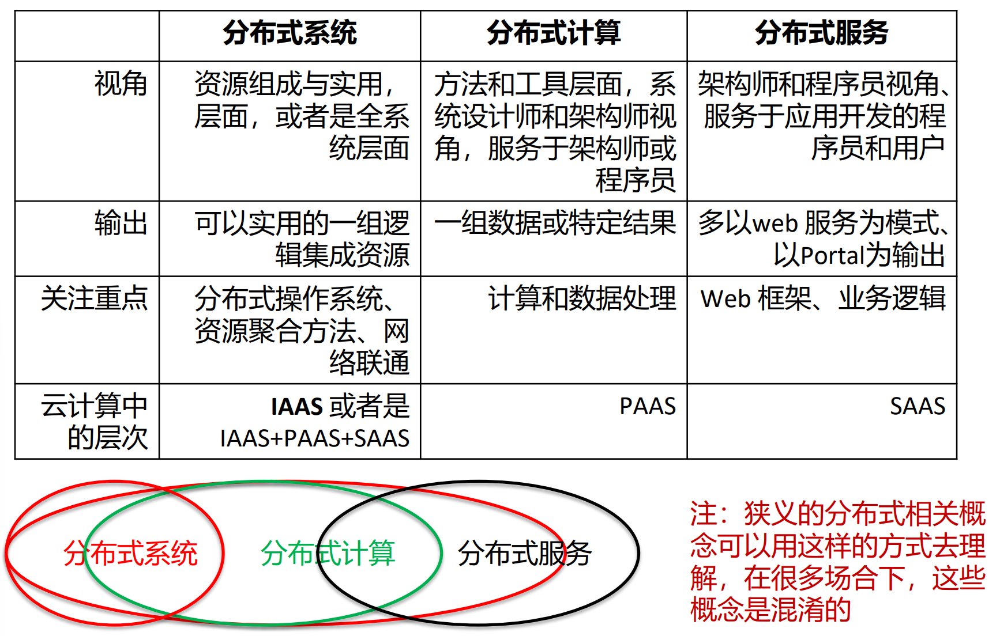
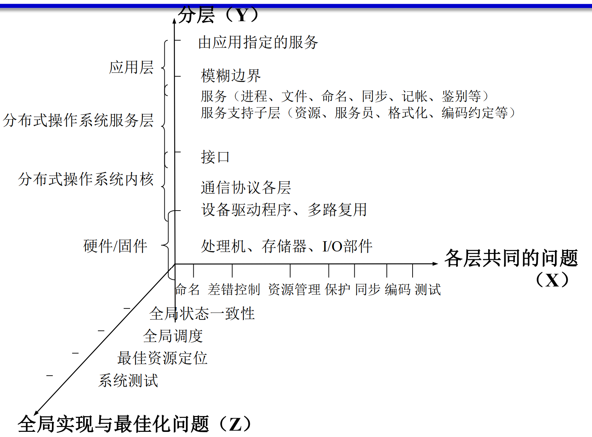
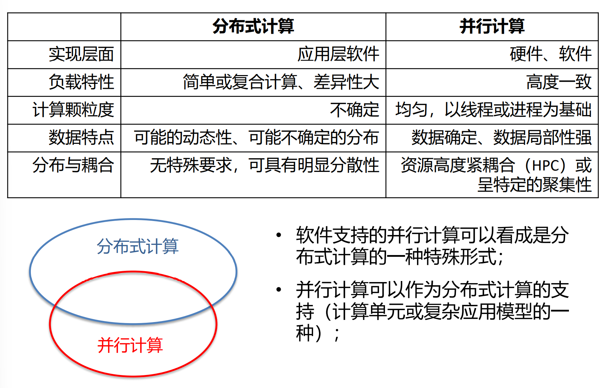

## 分布式系统、分布式计算和分布式服务

- [分布式系统、分布式计算和分布式服务](#分布式系统分布式计算和分布式服务)
- [分布式系统](#分布式系统)
  - [分布式带来的挑战](#分布式带来的挑战)
  - [分布计算系统体系结构模型](#分布计算系统体系结构模型)
- [分布式计算](#分布式计算)
- [分布式服务](#分布式服务)
- [并行计算与分布式计算](#并行计算与分布式计算)

## 分布式系统

- 一个其 硬件  或 软件组件 分布在联网的计算机上，组件之间通过传递消息进行 通信 和 动作协调 的系统
- 重要特征
  - 组件的并发性
  - 缺乏全局时钟
  - 组件故障的独立性

### 分布式带来的挑战

- 异构性
- 开放性
- 安全性
- 可伸缩性
  - 容错实现的途径: 恢复、冗余
- 故障处理
- 并发性
- 透明性
- 服务质量

### 分布计算系统体系结构模型

## 分布式计算

- 基本思想
  - 分而治之、并行计算
  - 移动计算而非移动数据

## 分布式服务

- 概念
  - 面向大规模服务需求，采用尽可能的拆分、以达到更好的独立扩展与伸缩、更灵活的部署、更好的隔离和容错的应用系统
- 核心支撑
  - 分布式服务框架，提供分布式服务的开发和运行环境
- 优势
  - 降低模块之间的耦合度，提升组件的内聚性，规范对外的接口，实现分布式的、又具有整体性的系统架构，把一个大型软件系统通过服务化的方式规划治理起来

- RPC
  - 进程间通信的方式，允许像调用本地服务一样调用远程服务

- SOA
  - 是一种粗粒度、松耦合的以服务为中心的架构，接口之间通过定义明确的协议和接口进行通信

- 微服务架构（MSA）
  - 是一种服务化架构，通过将功能分散到各个离散的服务中以实现对解决方案的解耦

## 并行计算与分布式计算

- 并行计算突出的是时间上的同步性，同时进行计算
- 分布式计算突出的是空间上的分布性，计算在不同的位置进行
  - 分布式计算在很多情况下也是并行计算，在网络的不同位置同时进行

- 并行计算主要目的是为了能更快的完成任务
- 分布式计算的应用不一样，所追求的目标也不同

