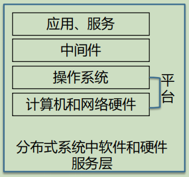

# 分布式系统模型

- [分布式系统模型](#分布式系统模型)
  - [一、基本概念](#一基本概念)
    - [1. 模型](#1-模型)
    - [2. 分布式系统的困难和威胁](#2-分布式系统的困难和威胁)
    - [3. 分布式系统的模型](#3-分布式系统的模型)
  - [二、物理模型](#二物理模型)
    - [1. 从物理模型看分布式系统的代际对比](#1-从物理模型看分布式系统的代际对比)
    - [2. 系统的分布式系统](#2-系统的分布式系统)
  - [三、体系结构模型](#三体系结构模型)
    - [1. 体系结构元素](#1-体系结构元素)
      - [(1) 通信实体](#1-通信实体)
        - [面向系统的实体](#面向系统的实体)
        - [面向问题的实体](#面向问题的实体)
      - [(2) 通信范式](#2-通信范式)
        - [进程间通信](#进程间通信)
        - [远程调用](#远程调用)
        - [间接通信](#间接通信)
      - [(3) 角色与责任](#3-角色与责任)
      - [(4) 放置](#4-放置)
      - [(5) 小结](#5-小结)
    - [2. 体系结构模式](#2-体系结构模式)
  - [四、基础模型](#四基础模型)
    - [1. 交互模型](#1-交互模型)
    - [2. 故障模型](#2-故障模型)
    - [3. 安全模型](#3-安全模型)

## 一、基本概念

### 1. 模型

- 完备性表征
  - 一个系统需要在满足基础运行环境下，面对各类困难和出现的不确定因素（威胁等）能正常的工作
- 共性抽象和设计复用
  - 一种系统有不同的具体设计和实现，但需要满足一致的基本特征

- 模型是解决公共设计问题的一种好的手段
  - 模型的公共性
    - 满足模型的具体设计和实现，即是能保证达成公共基础特征
  - 模型的多样性和复合型
    - 面向一个领域或特定体系的模型通常由一组模型组成，每类模型对一个方面给出抽象的、简化的、但是一致的描述

### 2. 分布式系统的困难和威胁

- 实用模式的多样性
- 系统环境的多样性
  - 容纳异构硬件、操作系统和网络
- 内部问题
  - 非同步时钟、冲突的数据更新、多种涉及系统单个组件的软硬件故障模式
- 外部问题和威胁
  - 对数据完整性、保密性的攻击以及服务拒绝攻击等

### 3. 分布式系统的模型

- 分布式系统的模型
  - 物理模型
    - 从系统组成的角度描述计算机和设备的类型以及它们的互联
  - 体系结构模型
    - 从系统的计算元素构成和功能、通信任务方面来描述系统
  - 基础模型
    - 是对（各类）分布式系统共性问题的描述，通常由多个方面的模型构成
- 三个层次的模型相互协同

## 二、物理模型
  
- 分布式系统的 基线物理模型/最小物理模型
  - 定义
    - 一个其硬件或软件组件分布在联网的计算机上，组件之间通过传递消息进行通信和动作协调的系统
  - 最小物理模型
    - 一组可扩展的计算机节点，这些节点通过计算机网络相互连接进行所需的消息传递

### 1. 从物理模型看分布式系统的代际对比
- 业内正在开展下一代分布式系统的研究

|              | 早期分布式系统                                   | 互联网下的分布式系统                                   | 当代分布式系统                                                         |
| ------------ | ------------------------------------------------ | ------------------------------------------------------ | ---------------------------------------------------------------------- |
| 时间         | 197x-199x                                        | 1990-201x                                              | 201x-                                                                  |
| 规模和异构性 | 小、相对同构的配置                               | 大、互联网为核心网络，从平台、语言和中间件方面都比较大 | 超大、引入移动互联网和设备，异构维度增加，包括体系结构中完全不同的风格 |
| 开放性       | 不够重视，多局限于局部网络，不属于优先考虑的内容 | 重要，有一系列的标准                                   | 已经成为重要的挑战，标准往往不能覆盖复杂的系统                         |
| 服务质量     | 有基本的质量考虑                                 | 重要，针对质量引入服务                                 | 已经成为重要的挑战，已有的服务不能支撑复杂的的系统                     |

### 2. 系统的分布式系统

- 系统的系统概念
  - 一个复杂的系统，它由一系列子系统组成，这些子系统本身也是系统，它们一起完成一个或多个特定的任务
  - 类比，互联网是网络的网络
- 系统的分布式系统
  - 一个复杂的，由分布式系统作为子系统构成的超大规模系统
  - 可以看成是物理模型中基线模型的延申、嵌套、堆叠
  - 是一个复杂巨系统

## 三、体系结构模型

- 体系结构的构成
  - 用值得的 2~N 多个独立组件、以及这些组件之间的关系来表示的结构
- 体系结构的整体目标是确保结构能满足现在和将来可能的需求
  - 除功能外，还需要关心系统的可靠性、可管理性、适应性、及性价比

- 体系结构模型
  - 计算元素
    - 单个计算机或者通过网络互联的计算机集合
  - 从系统的计算元素构成和(角色)功能、通信任务等方面来描述系统
  - 客户-服务器模型 和 对等模型 是分布式系统中的两种最常使用的体系结构模型  

### 1. 体系结构元素

- 从四个关键问题入手理清一个分布式系统的基础和构建模块的方法
  1. 分布式系统中进行**通信**的**实体**是什么
  2. 实体之间如何通信，使用何种**通信范式**
  3. 实体在整个体系结构中扮演什么**角色**(功能), 承担什么**责任**
  4. 实体如何被映射到分布式系统的物理基础设施上(放置)

<table>
<tbody>
<tr>
<th>通信实体</th>
<th>通信范式</th>
<th>角色责任</th>
<th>放置</th>
</tr>
<tr>
<td colspan=4 align=center>分布式系统体系结构模型</td>
</tr>
</tbody>
</table>

#### (1) 通信实体

- 分布式系统中的"部件/实例"，具有通信能力，能够实现相互通信

<table>
<tbody>
<tr>
<th colspan=2>通信实体</th>
</tr>
<tr>
<th>面向系统的实体</th>
<th>面向问题的实体</th>
</tr>
<tr>
<td align=center>
结点(TCP/IP) 
进程 
</td>
<td align=center>
对象 
组件 
Web服务 
</td>
</tr>
</tbody>
</table>

##### 面向系统的实体

**进程**

- 传统分布式系统的通信实体通常是进程
  - 一个最传统的分布式系统可以看成是带有恰当的进程间通信范型的多个进程
- 通信实体也不完全是进程
  - 如运行不支持进程抽象的操作系统的设备，通信实体就是其本身
  - 大多数分布式系统中都使用线程来进行补充，通信的末端是线程

- 看待通信实体的两个角度
  - 在**面向系统**层面，进程作为通信实体，描述"链接关系"是清晰的，但在**面向问题**层面(目的)是不够清晰的
  - **面向问题**的抽象而设计的通信实体更具有分布式计算的特征

##### 面向问题的实体

**对象**

- 面向对象的方法主要包括面向对象的设计和面向对象的编程语言
- 在分布式面向对象的方法中，一个计算由若干交互的对象组成，这些对象代表给定问题领域分解的自然单元
- 对象通过接口被访问，用一个相关的接口定义语言(IDL)定义一个对象上的方法规约

**组件**

- 类似于对象，为构造分布式系统提供面向问题的抽象，也是通过接口被访问
- 对象与组件的差异
  - 组件不仅指定其提供的接口，还同时给出关于其它组件或接口的假设/设定
    - 对象只考虑面向的问题，而不考虑其他对象，交由开发者在使用时设计，而组件则显示地声明依赖
  - 组件让所有的依赖显式化，为系统的构造提供一个更为完整的合约
- 组件的好处
  - 合约化的方法能极大的鼓励第三方开发组件
  - 组件可以通过去除隐含的依赖，提升一个更存粹的组合化的方法来构建分布式系统
  - 基于组件的中间件通常对关键领域，如部署、服务器编程等提供额外的支持

**web服务**
>W3c 对web服务的定义：一个软件应用，通过URL被辨识，他的接口
>和绑定可以通过XML定义、描述和发现。一个web服务通过在基于互
>联网上的协议，利用基于XML的消息交换支持于其它软件代理的直接
>交互

- web服务代表开发分布式系统的第三种重要的范型
  - web服务和对象、组件紧密相关，也是采用基于行为封装和通过接口访问的方法
- web服务的好处
  - web服务通过利用web标准标识和发现服务，web服务本质上是面向万维网的
  - 相对于对象和组件经常在一个组织内部使用，用于开发紧耦合的应用，web服务可以松耦合地组织起来可以跨越组织边界，实现业务到业务的集成

#### (2) 通信范式

- 分布式系统体系结构中的通信范式定义了通信实体的通信方式
- 通信范式种类: 进程间通信、远程调用、间接通信

<table>
<tbody>
<tr>
<th colspan=3>通信范式(如何通信)</th>
</tr>
<tr>
<th>进程间通信</th>
<th>远程调用</th>
<th>间接通信</th>
</tr>
<tr>
<td align=center> 
消息传递 
套接字 
多播 
</td>
<td align=center> 
请求—应答 
RPC 
RMI 
</td>
</td>
<td align=center> 
组通信 
发布—订阅系统 
消息队列 
元组空间 
分布式共享内存 
</td>
</tr>
</tbody>
</table>

##### 进程间通信

- 用于分布式系统进程之间通信的、相对底层的支持
  - 包括消息传递原语、直接由互联网协议(UDP/TCP)提供的API(socket套接字编程)和对多播通信的支持

##### 远程调用

- 最常见的分布式系统通信范式，覆盖通信实体之间的双向交换技术，包括远程操作、过程和方法
- 典型的远程调用: 请求-应答协议、远程过程调用、远程方法调用

**请求-应答协议**

- 基于一个底层消息传递服务，用于支持 客户-服务器计算的通信协议
- 通常涉及一对消息的交换
  - 第一消息包含在服务端指向的操作的编码
  - 第二个消息包含操作的结果
  
**远程过程调用**

- 在RPC下，计算机上，进程中的过程能够被远程调用，如同在本地地址空间中的过程一样
- 底层RPC系统隐藏了通信的重要特性，包括参数、结果的编解码，消息的传递和保持过程调用所要求的语义
- RPC直接支持了 客户端-服务器 计算模式的发展，提供了访问和位置的透明性

**远程方法调用**

- 类似于RPC的机制，应用于分布式对象环境
- RMI实现一个发起调用对象，能调用一个远程对象中的方法，RMI支持对象标识和在远程调用中传递对象标识符作为参数
  - 通过 发起调用对象 来调用 远程对象
  - RMI的底层细节同样对用户透明

- 远程调用的共性
  - 通信表达的是发送者和接收者之间的双向关系
    - 发送者显式地将消息或调用送往相关的接收者
    - 接收者通常了解发送者的标识
  - 一般而言，需要双方同时在线或存在，即双方是深度耦合的

##### 间接通信

- 实现多方关系的，发送者和接收者深度解耦的通信范式
  - 空间解耦
    - 发送者不需要知道正在发送的接收者
  - 时间解耦
    - 发送者和接收者不需要同时存在
- 间接通信的关键技术: 组通信、发布-订阅系统、消息队列、元组空间、分布式共享内存

**组通信**

- 把消息传递给若干接收者，是支持一对多通信的多方通信范型
- 依赖组抽象，一个组在系统中用一个组标识符表示
- 接收者通过加入组，就能选择性地接收 发送到组的消息
  - 发送者通过 组标识符 发送消息给组
- 需要维护组成员、处理故障等机制

**发布订阅系统**

- 发布--订阅系统是一个中间服务系统
  - 通过路由的方式，高效地支持 **大量消息生产者(或发布者)** 为 **大量消费者(或订阅者)** 发布他们感兴趣的 **信息项(事件)**

**消息队列**

- 以队列作为生产者和消费者的中介
  - 生产者发布消息到指定的队列
  - 消费者从队列接收消息，或者被通知消息到达

**元组空间**

- 进程将任意结构的 **结构化数据项(称为元组)** 放到一个持久元组空间，其他进程可以指定感兴趣的模式，在元组空间中读或者删除数据
- 元组空间是持久化的，因此读操作者与写操作者不需要同时存在
- 这种风格的编程，也称为生成通信，可以采用客户端-服务器、以及对等方法等风格

**分布式共享内存**

- DSM提供一种抽象，用于支持在不共享物理内存的进程之间共享数据
- DSM提供给程序员的是一套熟悉的读或写共享数据结构的抽象，如同这些数据在本地的地址空间一样，实现了数据的分布透明
- DSM系统底层的支持需要确保实时提供副本，同时需要处理于数据同步和一致性相关的问题

#### (3) 角色与责任

- 分布式系统中，通信实体相互交互完成一个有用的活动
  - 通信实体扮演指定的角色，在建立具体的体系结构时，这些角色时基本的构成元素
- 在早期的、由单进程角色构建的分布式体系结构中
  - 主要有两种：客户---服务器模式、对等模式

**客户---服务器模式**

- 进程扮演服务器与客户端角色
  - 服务器也可以是其他服务器的客户端
- 缺陷
  - 伸缩性差，其能力不会超过提供服务的计算机的能力以及所处网络的带宽

**对等体系结构**

- 一项任务或活动的所有经常扮演相同的角色
- 所有参与进程运行相同的程序，并且相互之间提供相同的接口集合
- 目的
  - 让共享资源形成更广泛的分布，使得计算和通信负载能分散开来，最大的利用参与的计算机来完成特定的任务

#### (4) 放置

- 放置是指诸如**对象或服务等通信实体**映射到**底层的物理分布式基础设施**上的方式
  - 物理分布式的基础设施由大量的机器组成(异构的机器、网络和位置等)，这些机器通过一个任意复杂网络互联
  - 放置与体系结构的模式是密切相关的
- 放置策略是一种方法，在特定的应用知识的指导下，面向特定性能等指标给出一个优化的解决方案
  - 将服务映射到多个服务器、缓存、移动代码、移动代理

**将服务映射到多个服务器**

- 服务可实现成一个单独主机上的几个服务器进程
  - 将服务所基于的对象集进行分区，将这些分区分布到各个服务器上
  - 服务器可以在几个主机上维护复制的对象集

**缓存**

- 缓存用于存储最近使用的数据对象
  - 这些被存储的数据对象比对象本身更靠近一个客户或特定的一组客户
  - 客户进程需要访问一个对象时，会首先访问缓存
  - 缓存失效时，去取一个最新的副本
- 每个客户都可以配置缓存或者将缓存放置在由集合客户共享的代理服务器上

**移动代码**

- 移动代码 是从一台计算机发送到另一台计算机，并在目的计算机上运行的代码
  - 如Applet，浏览器从服务器端下载代码，并在浏览器中运行
- 本地运行的好处在于良好的交互响应，减少了网络延迟和带宽的影响

**移动代理**

- 移动代理是一个运行的程序(包括代码和数据)，从一台计算机移动到网络上另一台计算机，代替用户完成诸如消息收集等任务，并返回结果
  - 一个移动代理可多次调所访问地点的本地资源

#### (5) 小结

<table>
<tbody>
<tr>
<th colspan=2>通信实体</th>
<th colspan=3>通信范式(如何通信)</th>
</tr>

<tr>
<th>面向系统的实体</th>
<th>面向问题的实体</th>
<th>进程间通信</th>
<th>远程调用</th>
<th>间接通信</th>
</tr>

<tr>
<td  align=center>
结点(TCP/IP) 
进程 
</td>
<td  align=center>
对象 
组件 
Web服务 
</td>
<td  align=center> 
消息传递 
套接字 
多播 
</td>
<td align=center> 
请求—应答 
RPC 
RMI 
</td>
<td  align=center> 
组通信 
发布—订阅系统 
消息队列 
元组空间 
分布式共享内存 
</td>
</tr>

<tr>
<td colspan=2 align=center>客户端—服务器结构</td>
<td colspan=3 align=center>对等体系结构</td>
</tr>

<tr>
<td colspan=5 align=center>
物理设施上的放置 
1：1、 1：N、缓存、移动代码、移动代理……….. 
</td>
</tr>

</tbody>
</table>

### 2. 体系结构模式

- 体系结构模式是体系结构模型的组织结构，是在体系结构元素之上，通过提供组合的、复制/重复的结构，能在给定环境下良好运行的、可满足**一定问题域的(功能和性能)** 解决方案
  - 体系结构模式给出的方案不一定是完整的解决方案
- 关键的分布式体系结构模式
  - 分层体系结构(layering architecture)
  - 层次化体系结构(tiered architecture)
  - 瘦客户(包括虚拟网络计算的特定机制)

**分层体系结构**

- 平台
  - 一个服务于分布式系统和应用的平台由最底层的**硬件**和**软件**层组成
  - 底层为上层提供接口与服务
  - 平台的概念在发展过程中有泛化
- 中间件
  - 中间件是一个软件层，最初引入的目的是屏蔽异构性，给程序员提供方便的编程模型
  - 中间件表示成一组计算机上的进程或对象，这些进程或对象相互交互，实现分布式应用通信和资源共享支持
  - 中间件提供对应用编程有用的模块，这些模块参与构造在分布式系统中工作的软件组件
  - 最大的作用：
    - 中间件通过对抽象的支持，如远程方法调用、进程组之间的通信、事件的通知、共享数据对象在多个协作的计算机上的分布、放置和检索、共享数据对象的复制以及多媒体数据的实时传送，提升应用程序通信活动的层次
- 中间件分类
  - 分布式对象、分布式组件、发布-订阅系统、消息队列、web服务、对等支持

**层次化体系结构**

- 与分层体系结构互补
  - 分层将服务垂直组织陈更抽象层
  - 层次化是组织给定层功能的技术(落实实现层面的技术)
  - 层次化把给定功能放在合适的服务器或物理节点上

**瘦客户**

- 瘦客户机/ 网络计算机NC
  - 一种简单的、廉价的、完全依赖网络化服务的硬件设备
- 虚拟网络计算（Virtual Network Computing, VNC）
  - 是软件或基于硬件实现的软的“瘦客户机”。例如：RealVNC、KVM-over-IP等
- 云终端是目前云计算环境下的一种瘦客户解决方案

## 四、基础模型

- 基础模型是对分布式系统的共同、基本的特征进行描述，包括交互、故障和安全风险
- 基础模型分类: 交互模型、故障模型、安全模型

### 1. 交互模型

- 问题
  - 进程之间通过消息传递进行交互的方式
  - 反映延迟的问题
- 目标
  - 描述进程之间通过消息传递进行交互，实现系统的通信和协作功能
  - 解决分布式系统中难有相同的时间的问题

**两大因素**

- 通信性能
  - 延迟、带宽、抖动
- 计算机时钟和时序事件
  - 时钟漂移率
    - 局部时钟和一个精确的参考时钟的差值
  - 事件排序
    - 又称Lamport时钟，为运行于不同计算机上的进程的事件提供顺序，不需要求助于时钟就可以推断出消息的顺序

**两类交互模型**

<table>
<tbody>

<tr>
<th></th>
<th>同步分布式系统</th>
<th>异步分布式系统</th>
</tr>

<tr>
<td rowspan=2 align=center> 
特点
</td>
<td align=center>
有时间约束
</td>
<td align=center> 
无时间约束
</td>
</tr>

<tr>
<td align=left> 
1.进程执行每一步的时间在已知时间范围内 
2.每个在网络上传输消息可在已知时间范围内接收到 
3.每个进程的时间漂移率在已知时间范围内 
</td>
<td align=left> 
1.进程执行每一步都可能需要任意长的时间 
2.收到一个消息的等待时间可能任意长统 
3.每个进程的时钟漂移率可能是任意长 
</td>
</tr>

<tr>
<td align=center> 
举例
</td>
<td align=center>
视频点播系统 
语音会议系统 
</td>
<td align=center> 
Email 
FTP 
</td>
</tr>

</tbody>
</table>

### 2. 故障模型

- 问题
  - 反映计算机或者通信信道发生的故障
- 目标
  - 定义可能出现的故障的形式，为分析故障带来的影响提供依据
  - 设计分布式系统时，帮助考虑系统容错
  
**故障分类**

- 遗漏故障
  - 进程或通信通道不能完成它应该做的动作
- 时序故障
  - 在指定的时间间隔内对进程没有响应
- 随机故障
  - 用于描述可能出现的最坏的故障，可能发生任何类型的错误，包括遗漏故障和 时序故障，比其他分类的故障要严重

**故障屏蔽方式**

- 隐藏
  - 例如备份服务器
- 转换
  - 例如利用校验和来屏蔽损坏消息，从而将随机故障转良性遗漏故障

**通信故障屏蔽**
- 通信的可靠性
  - 有效性(Validity)：在发送端缓冲区的消息最终能够到达接收端的缓冲区
  - 完整性(Integrity)：接收到的消息和发送的消息完全一样，没有被重发篡改
- 故障屏蔽方式
  - 消息重发(隐藏)、事务(转换)

### 3. 安全模型

- 问题
  - 反映分布式系统的模块特性以及开放性，以及它们可能受到的内部和外部 的安全攻击
- 目标
  - 为各类安全威胁提供处理的依据，以此分析系统可能受到的威胁，并在设计系统时考虑这些安全威胁

**三类安全性**

- 进程的安全性
  - 服务器：防止伪造实体的调用请求服务器
    - 如欺骗邮件服务器发邮件
  - 客户端：防止伪造的结果返回到客户端
    - 如钓鱼网站窃取密码
- 通信信道的安全性
  - 防止消息的拷贝、篡改或者填充
    - 如网络抓包截获消息
  - 防止消息的重发
    - 如转账时重发转账请求，将产生错误结果
- 对象的安全性
  - 限制对象的被访问
  - 控制访问者的权能

**安全通道**

- 用来解除安全威胁
- 特性
  - 防止伪造请求
    - 每个进程知道正在执行的进程所代表的委托方的身份
  - 防止消息篡改
    - 确保在其上传输的数据的私密性和完整性
  - 防止消息被重发或排序
    - 每个消息包含物理的和逻辑的时间戳
- 技术
  - 加密技术和共享密钥
  - 认证技术

