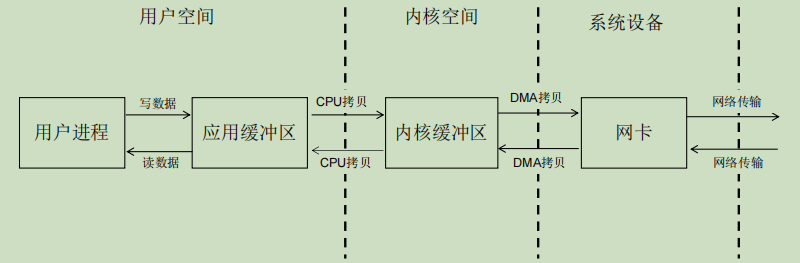
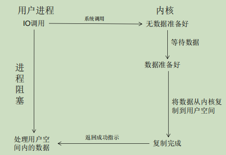
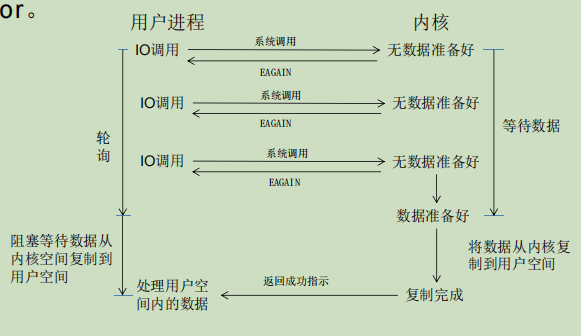
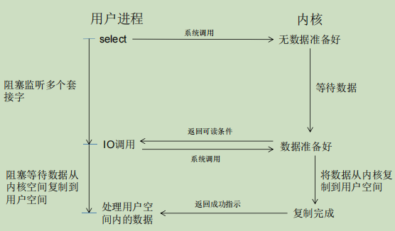
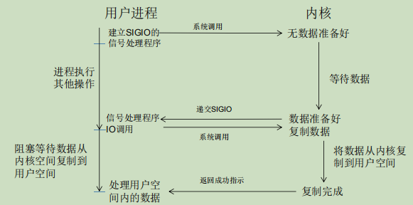
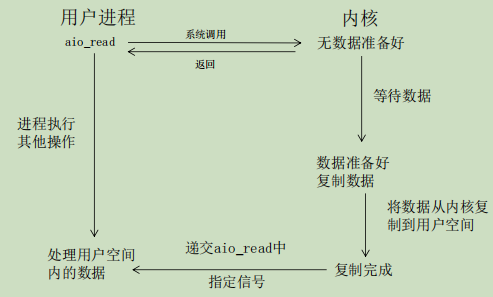

# 分布式通信方法

- [分布式通信方法](#分布式通信方法)
  - [一、RPC](#一rpc)
    - [(1) RPC协议](#1-rpc协议)
      - [RPC错误处理](#rpc错误处理)
    - [(2) 序列化与反序列化](#2-序列化与反序列化)
    - [(3) 网络IO模型](#3-网络io模型)
      - [Linux的IO模型](#linux的io模型)
      - [常用IO模型](#常用io模型)
    - [(4) 开源RPC框架](#4-开源rpc框架)
      - [gRPC](#grpc)
  - [二、间接通信](#二间接通信)

## 一、RPC

- RPC框架功能
  - 序列化与反序列化
  - RPC协议编解码
  - 网络IO功能封装

### (1) RPC协议

- 对于应用之间通信所需的 数据类型、数据长度、数据压缩方式等通用性问题的定义，需要在TCP/UDP的基础上设计新的协议
- RPC协议是RPC框架依赖的应用层协议，多数为TCP协议，也可以基于HTTP协议进行构建

<table>
<tbody>

<tr>
<th></th>
<th>基于HTTP协议</th>
<th>基于TCP协议</th>
</tr>

<tr>
<td>优点</td>
<td align=center>
容易实现 
通用性强 
</td>
<td align=center>
定制协议减少网络开销，提升性能 
</td>
</tr> 

<tr>
<td>缺点</td>
<td align=center>
包含较多无用字段，传输字节多，效率差 
</td>
<td align=center>
关注底层细节，实现代价高 
通用性低，需要适配不同的语言和平台 
</td>
</tr>

</tbody>
</table>

#### RPC错误处理

- At-Least-Once:至少一次语义(重发请求) 
- At-Most-Once：至多一次语义（过滤重复请求） 
- Exactly-Once：精确的一次（结合至少一次与至多一次）

**At-Least-Once**

- 最简单的处理失败的模式
  1. 调用方发送请求后等待响应
  2. 如果响应没有到达，则在超时后再次发送请求
  3. 在一段时间内重复尝试
  4. 如果仍无响应，则向应用报告错误
- 错误处理有效的前提
  - 所有操作都是无副作用的只读操作，调用的函数是幂等函数
  - 当应用本身具有处理重复请求和提交的功能

**At-Most-Once**

- RPC服务端发现重复请求，应该返回上次的响应而不是再次执行过程
- 重复请求判断
  - 客户端对每个RPC请求都添加一个不重复的事务ID或消息ID(xid),当客户端重发请求时使用相同的xid

**Exactly-Once**

- Exactly-Once = At-Least-Once + At-Most-Once
  - 支持请求重发
  - 过滤重复请求
- Exactly-Once尽最大能力保证请求到达，并且在服务方只执行1次

### (2) 序列化与反序列化

- 对复杂对象进行编解码
  - 序列化：将对象的状态信息转换为可以存储或传输的形式的过程
  - 反序列化：根据字节流中保存的对象状态及描述信息，通过反序列化重建对象

- 序列化框架
  - JDK原生序列化、XML序列化、JSON序列化、Protobuf
- 序列化框架选择优先级
  - 安全性、通用性、兼容性、性能、空间开销

**JDK原生序列化**

- 可序列化对象的类需要实现Serializable接口
- 序列化通过objectOutputStream完成
- 反序列化通过 objectInputStream完成

**XML序列化**

- XML指可扩展标记语言，被设计用来传输和存储数据

**JSON序列化**

- JSON(JavaScript Object Notation, JS对象简谱) 是一种轻量级的数据交换格式
  - 采用完全独立于编程语言的文本格式来存储和表示数据
  - 相较于XML更加简洁

**ProtoBuf序列化**

- ProtoBuf是google于2010年发布的一种语言无关、平台无关、可扩展 的序列化结构数据的方法，可用于（数据）通信协议、数据存储等
  - 序列化后体积相比JSON小很多
  - 序列化与反序列化不需要借助反射等语言机制获取类型

### (3) 网络IO模型

- 网络IO读写流程

- POSIX中的IO分类
  - 同步IO
    - 内核空间与用户空间的数据拷贝需要发起IO请求的进程参与
  - 异步IO
    - 内核空间与用户空间的数据拷贝不需要发起IO请求的进程参与

>POSIX标准定义了操作系统应该为应用程序提供的接口标准，目前实现其标准的有UNIX,Linux,>Windows系统

#### Linux的IO模型

- 同步IO模型
  - 阻塞IO(blocking IO)
  - 非阻塞IO(non-blocking IO)
  - 多路复用IO(multiplexing IO)
  - 信号驱动IO
- 异步IO模型
  - 异步非阻塞IO(asynchronous IO)

**阻塞IO**

- 用户进程调用读数据后进入阻塞状态，等待内核空间准备好数据并复制到用户空间

**非阻塞IO**

- 采用轮询的方式

**多路复用IO**

- 多路复用IO通过select内核级别的系统调用实现等待多个socket，对多个IO端口进行监听，其中任何一个socket的数据准备好，都能返回可读

**信号驱动IO**

- 信号驱动IO允许Socket进行信号驱动IO,并安装一个信号处理函数，进 程继续运行并不阻塞
- 当数据准备好时，进程会收到一个SIGIO信号，可以 在信号处理函数中调用I/O操作函数处理数据

**异步非阻塞IO**

- 用户进程进行aio_read系统调用后，无论内核数据是否准备好，都直接返回给用户进程
- 等socket数据准备好，内核直接复制数据给进程，然后从内核向进程发送通知

#### 常用IO模型

- 同步阻塞IO与IO多路复用最为常用
  - 大多数系统内核都会支持同步阻塞IO，同步非阻塞IO，IO多路复用
  - 信号驱动IO和异步IO只有高版本的Linux内核才会支持
- IO多路复用在高性能网络编程中最常用
  - Redis,Nginx,Netty都选择IO多路复用

### (4) 开源RPC框架

- 当前稳定的开源框架

<table>
<tbody>

<tr>
<th></th>
<th>Dubbo</th>
<th>Motan</th>
<th>RPCX</th>
<th>gRPC</th>
<th>Thrift</th>
</tr>

<tr>
<td>开发语言</td>
<td align=center>Java</td>
<td align=center>Java</td>
<td align=center>go</td>
<td align=center>多语言</td>
<td align=center>多语言</td>
</tr> 

<tr>
<td>多序列化框 架支持</td>
<td align=center>支持</td>
<td align=center>支持</td>
<td align=center>支持</td>
<td align=center>只支持Protobuf</td>
<td align=center>只支持Thrift格式</td>
</tr> 

<tr>
<td>跨编程语言</td>
<td align=center>不支持</td>
<td align=center>不支持</td>
<td align=center>不支持</td>
<td align=center>支持</td>
<td align=center>支持</td>
</tr> 

<tr>
<td>通信协议</td>
<td align=center>
支持多协议 
dubbo\HTTP协议等 
</td>
<td align=center>
支持多协议 
Motan2\HTTP协议等 
</td>
<td align=center>
支持多协议 
QUIC\HTTP协议等 
</td>
<td align=center>
HTTP/2
</td>
<td align=center>Thrift私有协议</td>
</tr>

</tbody>
</table>

#### gRPC

**特点**

- 使用HTTP/2弥补了HTTP/1.1的不足
- 使用Protobuf进行数据编码，提高数据压缩率
- 在调用方和服务方使用协议约定文件，提供参数可选，为版本兼容留下缓冲空间
- 跨语言与跨平台

**HTTP/2**

>HTTP/2标准于2015年5月以RFC 7540正式发表

- HTTP/1.1的性能瓶颈
  - 队头阻塞问题(Head Of Line Blocking)
    - 每个 TCP连接同时只能处理一个请求-响应，浏览器按 FIFO 原则处理请求，如果上一个响应没返回，后续请求-响应都会受阻
  - 重复传输臃肿的首部字段，降低网络资源利用率
  - 报文字段长度不固定，增加了报文解析难度，只能串行解析
  - 只能客户端发起请求，服务器响应请求，服务器端的数据更新无法及时反 馈到客户端

- HTTP/2优势
  - 二进制分帧，报文解析更高效
  - 多路复用充分利用网络带宽，提高并发度
  - 头部压缩减少报文大小，提高传输效率
  - 服务端推送减少请求发送次数

**gRPC通信模式**

## 二、间接通信
