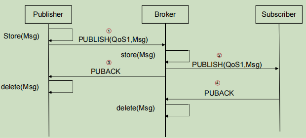

  # 分布式通信方法

- [分布式通信方法](#分布式通信方法)
  - [一、RPC](#一rpc)
    - [(1) RPC协议](#1-rpc协议)
      - [RPC错误处理](#rpc错误处理)
    - [(2) 序列化与反序列化](#2-序列化与反序列化)
    - [(3) 网络IO模型](#3-网络io模型)
      - [Linux的IO模型](#linux的io模型)
      - [常用IO模型](#常用io模型)
    - [(4) 开源RPC框架](#4-开源rpc框架)
      - [gRPC](#grpc)
  - [二、间接通信](#二间接通信)
    - [(1) 间接通信技术](#1-间接通信技术)
      - [组通信](#组通信)
      - [消息中间件](#消息中间件)
    - [(2) 消息模型分类](#2-消息模型分类)
    - [(3) 消息标准与协议](#3-消息标准与协议)
      - [JMS标准](#jms标准)
      - [AMQP协议](#amqp协议)
      - [MQTT协议](#mqtt协议)
    - [(4) 开源消息中间件](#4-开源消息中间件)
      - [Kafka](#kafka)

## 一、RPC

- RPC框架功能
  - 序列化与反序列化
  - RPC协议编解码
  - 网络IO功能封装

### (1) RPC协议

- 对于应用之间通信所需的 数据类型、数据长度、数据压缩方式等通用性问题的定义，需要在TCP/UDP的基础上设计新的协议
- RPC协议是RPC框架依赖的应用层协议，多数为TCP协议，也可以基于HTTP协议进行构建

<table>
<tbody>

<tr>
<th></th>
<th>基于HTTP协议</th>
<th>基于TCP协议</th>
</tr>

<tr>
<td>优点</td>
<td align=center>
容易实现 
通用性强 
</td>
<td align=center>
定制协议减少网络开销，提升性能 
</td>
</tr> 

<tr>
<td>缺点</td>
<td align=center>
包含较多无用字段，传输字节多，效率差 
</td>
<td align=center>
关注底层细节，实现代价高 
通用性低，需要适配不同的语言和平台 
</td>
</tr>

</tbody>
</table>

#### RPC错误处理

- At-Least-Once:至少一次语义(重发请求) 
- At-Most-Once：至多一次语义（过滤重复请求） 
- Exactly-Once：精确的一次（结合至少一次与至多一次）

**At-Least-Once**

- 最简单的处理失败的模式
  1. 调用方发送请求后等待响应
  2. 如果响应没有到达，则在超时后再次发送请求
  3. 在一段时间内重复尝试
  4. 如果仍无响应，则向应用报告错误
- 错误处理有效的前提
  - 所有操作都是无副作用的只读操作，调用的函数是幂等函数
  - 当应用本身具有处理重复请求和提交的功能

**At-Most-Once**

- RPC服务端发现重复请求，应该返回上次的响应而不是再次执行过程
- 重复请求判断
  - 客户端对每个RPC请求都添加一个不重复的事务ID或消息ID(xid),当客户端重发请求时使用相同的xid

**Exactly-Once**

- Exactly-Once = At-Least-Once + At-Most-Once
  - 支持请求重发
  - 过滤重复请求
- Exactly-Once尽最大能力保证请求到达，并且在服务方只执行1次

### (2) 序列化与反序列化

- 对复杂对象进行编解码
  - 序列化：将对象的状态信息转换为可以存储或传输的形式的过程
  - 反序列化：根据字节流中保存的对象状态及描述信息，通过反序列化重建对象

- 序列化框架
  - JDK原生序列化、XML序列化、JSON序列化、Protobuf
- 序列化框架选择优先级
  - 安全性、通用性、兼容性、性能、空间开销

**JDK原生序列化**

- 可序列化对象的类需要实现Serializable接口
- 序列化通过objectOutputStream完成
- 反序列化通过 objectInputStream完成

**XML序列化**

- XML指可扩展标记语言，被设计用来传输和存储数据

**JSON序列化**

- JSON(JavaScript Object Notation, JS对象简谱) 是一种轻量级的数据交换格式
  - 采用完全独立于编程语言的文本格式来存储和表示数据
  - 相较于XML更加简洁

**ProtoBuf序列化**

- ProtoBuf是google于2010年发布的一种语言无关、平台无关、可扩展 的序列化结构数据的方法，可用于（数据）通信协议、数据存储等
  - 序列化后体积相比JSON小很多
  - 序列化与反序列化不需要借助反射等语言机制获取类型

### (3) 网络IO模型

- 网络IO读写流程

- POSIX中的IO分类
  - 同步IO
    - 内核空间与用户空间的数据拷贝需要发起IO请求的进程参与
  - 异步IO
    - 内核空间与用户空间的数据拷贝不需要发起IO请求的进程参与

>POSIX标准定义了操作系统应该为应用程序提供的接口标准，目前实现其标准的有UNIX,Linux,>Windows系统

#### Linux的IO模型

- 同步IO模型
  - 阻塞IO(blocking IO)
  - 非阻塞IO(non-blocking IO)
  - 多路复用IO(multiplexing IO)
  - 信号驱动IO
- 异步IO模型
  - 异步非阻塞IO(asynchronous IO)

**阻塞IO**

- 用户进程调用读数据后进入阻塞状态，等待内核空间准备好数据并复制到用户空间

**非阻塞IO**

- 采用轮询的方式

**多路复用IO**

- 多路复用IO通过select内核级别的系统调用实现等待多个socket，对多个IO端口进行监听，其中任何一个socket的数据准备好，都能返回可读

**信号驱动IO**

- 信号驱动IO允许Socket进行信号驱动IO,并安装一个信号处理函数，进 程继续运行并不阻塞
- 当数据准备好时，进程会收到一个SIGIO信号，可以 在信号处理函数中调用I/O操作函数处理数据

**异步非阻塞IO**

- 用户进程进行aio_read系统调用后，无论内核数据是否准备好，都直接返回给用户进程
- 等socket数据准备好，内核直接复制数据给进程，然后从内核向进程发送通知

#### 常用IO模型

- 同步阻塞IO与IO多路复用最为常用
  - 大多数系统内核都会支持同步阻塞IO，同步非阻塞IO，IO多路复用
  - 信号驱动IO和异步IO只有高版本的Linux内核才会支持
- IO多路复用在高性能网络编程中最常用
  - Redis,Nginx,Netty都选择IO多路复用

### (4) 开源RPC框架

- 当前稳定的开源框架

<table>
<tbody>

<tr>
<th></th>
<th>Dubbo</th>
<th>Motan</th>
<th>RPCX</th>
<th>gRPC</th>
<th>Thrift</th>
</tr>

<tr>
<td>开发语言</td>
<td align=center>Java</td>
<td align=center>Java</td>
<td align=center>go</td>
<td align=center>多语言</td>
<td align=center>多语言</td>
</tr> 

<tr>
<td>多序列化框 架支持</td>
<td align=center>支持</td>
<td align=center>支持</td>
<td align=center>支持</td>
<td align=center>只支持Protobuf</td>
<td align=center>只支持Thrift格式</td>
</tr> 

<tr>
<td>跨编程语言</td>
<td align=center>不支持</td>
<td align=center>不支持</td>
<td align=center>不支持</td>
<td align=center>支持</td>
<td align=center>支持</td>
</tr> 

<tr>
<td>通信协议</td>
<td align=center>
支持多协议 
dubbo\HTTP协议等 
</td>
<td align=center>
支持多协议 
Motan2\HTTP协议等 
</td>
<td align=center>
支持多协议 
QUIC\HTTP协议等 
</td>
<td align=center>
HTTP/2
</td>
<td align=center>Thrift私有协议</td>
</tr>

</tbody>
</table>

#### gRPC

**特点**

- 使用HTTP/2弥补了HTTP/1.1的不足
- 使用Protobuf进行数据编码，提高数据压缩率
- 在调用方和服务方使用协议约定文件，提供参数可选，为版本兼容留下缓冲空间
- 跨语言与跨平台

**HTTP/2**

>HTTP/2标准于2015年5月以RFC 7540正式发表

- HTTP/1.1的性能瓶颈
  - 队头阻塞问题(Head Of Line Blocking)
    - 每个 TCP连接同时只能处理一个请求-响应，浏览器按 FIFO 原则处理请求，如果上一个响应没返回，后续请求-响应都会受阻
  - 重复传输臃肿的首部字段，降低网络资源利用率
  - 报文字段长度不固定，增加了报文解析难度，只能串行解析
  - 只能客户端发起请求，服务器响应请求，服务器端的数据更新无法及时反 馈到客户端

- HTTP/2优势
  - 二进制分帧，报文解析更高效
  - 多路复用充分利用网络带宽，提高并发度
  - 头部压缩减少报文大小，提高传输效率
  - 服务端推送减少请求发送次数

**gRPC通信模式**

- 单向RPC模式
  - 客户端发出单个请求，获得单个响应
- 服务端流式RPC模式
  - 服务端在接收到客户端的请求消息后，会发回一个响应的序列
- 客户端流式RPC模式
  - 客户端发送多个请求给服务端，服务端返回一个响应给客户端
- 双向流式RPC
  - 客户端以消息流的形式发送请求到服务器端，服务器端也以消息流的形式进行响应
  - 调用必须由客户端发起，但在此之后，通信完全基于gRPC客户端和服务器端的应用程序逻辑

**gRPC序列化与反序列化**

- ProtoBuf(Protocol Buffers)提供了一种语言无关，平台无关的结构化数据序列化方法
  - 通过IDL可以实现跨语言
  - 相较于JSON，XML，ProtoBuf编码速度快
  - ProtoBuf编码后的数据体积小
  - ProtoBuf与gRPC都是Google开源
- IDL(Interface Definition Language)
  - 通过IDL编译器能够生成
    - 编解码器: 对结构化数据类型进行序列化与反序列化
    - client-stub: 客户端RPC代理
    - server-stub: 服务端RPC代理
- 序列化流程
  - 在 .proto 文件中，使用ProtoBuf语法定义结构化数据
  - 使用ProtoBuf编译器将.proto文件编译为目标语言文件
  - 将文件放入工程中，使用对应语言的ProtoBuf API进行序列化与反序列化

**gRPC网络IO**

- Reactor模式
  - 基于事件驱动的设计模式, 利用IO多路复用监听套接字上的读写事件，再将事件分发到对应处理进程
    - select
      - 同步等待多个事件源到达
    - dispatch
      - 将事件多路分解以及分配相应的事件服务进行处理，采用分派服务集中处理
    - handler
      - 分解的事件以及对应的事件服务应用从分派服务中分离出去

## 二、间接通信

- 时空耦合与解耦

<table>
<tbody>

<tr>
<th></th>
<th>时间耦合</th>
<th>时间解耦</th>
</tr>

<tr>
<td>空间耦合</td>
<td align=center>
发送方与接收者直接通信 
双方同时在线 
如 RPC 
</td>
<td align=center>
发送方与接收者直接通信 
双方可有各自的生命周期 
如 电子邮件 
</td>
</tr>

<tr>
<td>空间解耦</td>
<td align=center>
发送方无需知道接收者的身份 
双方同时在线 
如 IP组播 
</td>
<td align=center>
发送方无需知道接收者身份 
双方可有各自的生命周期 
如 消息队列 
</td>
</tr>

</tbody>
</table>

### (1) 间接通信技术

#### 组通信

- 分布式系统中的通信既有点对点，也有一对多、多对多的通信模式
- 网络系统中，一个相互作用的进程集合称为组
- 一个发送进程在一次操作中将一个消息发送给组内其他进程的通信模式称为组通信
- 应用场景
  - 面向大量客户的可靠信息分发
  - 支持协作的应用
  - 支持一系列容错策略的应用

**基于UDP的组通信**

- IP组播建立在IP协议的上层, 允许发送方将单个IP数据包传送给组成一个组播组的计算机集合
- 使用UDP支持组播通信
  - 应用程序通过组播地址和普通的端口号发送UDP数据报完成组播
  - 存在的问题
    - 可靠性、有序性
- 可靠有序组播
  - 捎带确认法
  - 否定确认

#### 消息中间件

- 面向消息的中间件(message-oriented middleware,MOM)利用高效可靠的消息传递机 制进行平台无关的数据交流，并基于数据通信进行分布式系统集成的独立系统软件

### (2) 消息模型分类

- 点对点模型(P2P)
  - 消息生产者发送消息至先进先出队列
  - 单个消费者消费消息，完成后向队列发送通知
  - 收到消费者消费完成通知后，消息从队列中移除
- 发布-订阅模型(Pub-Sub)
  - 消息订阅者订阅主题
  - 消息发布者指定主题发布消息
  - 消息服务将主题中的消息发送给主题的订阅者
- 模型差异

<table>
<tbody>

<tr>
<th></th>
<th>点对点模型</th>
<th>发布-订阅模型</th>
</tr>

<tr>
<td>角色</td>
<td align=center>
发送消息：消息生产者 
接收消息：消息消费者 
</td>
<td align=center>
发送消息：消息发布者 
接收消息：消息订阅者 
</td>
</tr>

<tr>
<td>消息中介</td>
<td align=center>
先进先出队列 
</td>
<td align=center>
主题 
</td>
</tr>

<tr>
<td>消息消费</td>
<td align=center>
每个消息只能由一个消费者消费一次 
</td>
<td align=center>
每个消息可以有订阅相同主题的所有订阅者接收 
</td>
</tr>

</tbody>
</table>

### (3) 消息标准与协议

- 消息标准
  - 定义了消息中间件客户端与服务器之间的交互API
  - 常见标准: JMS
- 消息协议
  - 是统一消息服务的应用层标准协议，基于此协议的客户端与消息中间件可传递消息
  - 常见中间件协议P: AMQP、MQTT

#### JMS标准

>2002年Sun公司发 布的Java平台面向消息中间件的一套规范的API接口

**体系架构**

- JMS Client
  - 提供消息发送与消息接收功能
- JMS Server 
  - JMS消息中间件P: 包含点对点模型与发布-订阅模型两种抽象
  - JMS queue: queue，支持点对点模型
  - JMS Topic: 主题，支持发布-订阅模型

**JMS可靠性**

- 持久化
  - JMS服务宕机时数据不丢失，数据保存在服务器本地
- ACK确认机制
  - 支持消费者自动/手动提交ack信息
- 事务
  
#### AMQP协议

>是摩根大通于2006年 发布的一个提供统一消息服务的应用层标准高级消息队列协议

- 核心组成
  - 高级消息交换协议模型
    - 交换器
    - 消息队列
  - 数据传输机制

**交换器**

- 服务器中接收来自生产者应用程序消息的实体，并通过绑定定义的消息队列和交换机之间的关系，将这些消息路由到服务器中的消息队列
- 交换器本质上是一种路由算法，它会分析发布消息时报文中的routingKey 字段或headers，从绑定(bingding)列表中找到匹配的消息队列进行转发
- 直连交换器
  - 消息队列绑定到直连交换器时需要指定routingKey
  - 消息发布者发布消息给直连交换器时需要指定routingKey的值
  - 直连交换器接收到消息时会执行以下路由算法
    - 读取routingKey的值
    - 遍历Binding列表，找到所有routingKey匹配的消息队列
    - 转发消息给匹配的消息队列
- 扇型交换器
  - 消息队列绑定到扇型交换器不需要指定参数
  - 消息发布者发布消息给扇型交换器时也不需要指定参数
  - 遍历Binding列表，找到与之绑定的消息队列
  - 扇型交换器会无条件将消息转发给所有与他绑定的消息队列
- 主题交换器
  - 与直连交换器类似，绑定消息队列到topic时，routingkey可以使用 `#` 与 `*` 进行模糊匹配
- 头交换器
  - 消息队列绑定到头交换器时需要指定参数作为匹配条件，其值为key-value键值对
  - 发布者发布消息给Headers Exchange时需要指定headers，此时不需要添加x-match

**消息队列**

- 接收消息、保存消息、发送消息

**数据传输机制**

- AMQP通过消息传输机制，使客户端可使用AMQP模型与服务器进行通信，通常分为两层
  - 功能层：定义了一系列命令，可为应用程序做有用工作
  - 传输层：在TCP协议的基础上处理通道复用，帧同步, 内容编码,心跳检测, 以及数据表示和错误处理

**消息类型**

- AMQP传输基于二进制协议，传输的信息被组织成各种类型的帧
- 帧携带协议方法和其他相关信息，所有的帧具有相同个格式：帧头、载荷、帧尾
- 帧类型
  - 方法帧
    - 可以携带高级协议命令，一个方法帧携带一个命令
  - 内容帧
    - 封装具体业务消息
    - 内容头帧(content header frame):属性集合
    - 内容体帧(content body frame):实际数据，可被分解成多个块
  - 心跳帧
    - 用于保持和监测TCP连接

#### MQTT协议

>IBM在1999年发布
>MQTT协议广泛应用于物联网、移动互联网、智能硬件、车联网、电力能源等领域

- 是一种基于发布/订阅模式的轻量级通讯协议，构建于TCP/IP协议之上
  - 轻量级、简单、可靠传输、生态丰富

**MQTT模型**

- 客户端分为两种
  - 发布者、订阅者
- MQTT Broker
  - Broker负责接收与过滤消息，并将消息发送给对应的Client
  - 负责保存会话数据及客户端的身份验证和授权

**消息类型**

**服务质量等级**

- MQTT提供三种等级的服务质量: QoS0,1,2
- QoS 0：最多一次的传输，At most once
  - Publisher发送一个包含消息数据的PUBLISH包，然后不管结果如何，丢掉已发送的PUBLISH包，一条消息的发送完成

- QoS 1：至少一次的传输，At least once
  - 保证消息至少送达一次，使用ACK 机制
    - 如果Publisher或Broker在一段时间内没收到PUBLISH包对应的PUBACK，将重发 PUBLISH包，并将重发的包的重复标识置为1
    - QoS1不保证接收方不收到重复的包

- QoS 2：只有一次的传输，Exactly once
  - 在Publisher与Broker，Broker与Subscribe之间都进行发布接收的验证

### (4) 开源消息中间件

- 主流开源消息中间件

<table>
<tbody>

<tr>
<th></th>
<th>ActiveMQ</th>
<th>RabbitMQ</th>
<th>Kafka</th>
<th>RocketMQ</th>
</tr>

<tr>
<td>开发语言</td>
<td align=center>
Java
</td>
<td align=center>
Erlang
</td>
<td align=center>
Java与Scala
</td>
<td align=center>
Java
</td>
</tr>

<tr>
<td>开源组织</td>
<td align=center>
Apache基金会
</td>
<td align=center>
Pivotal公司
</td>
<td align=center>
LinkedIn捐献给Apache基金会
</td>
<td align=center>
阿里巴巴捐献给Apache基金会
</td>
</tr>

<tr>
<td>客户端支持语言</td>
<td align=center>
多语言
</td>
<td align=center>
多语言
</td>
<td align=center>
多语言
</td>
<td align=center>
Java
</td>
</tr>

<tr>
<td>持久化方式</td>
<td align=center>
内存，文件，数据库
</td>
<td align=center>
内存，文件
</td>
<td align=center>
磁盘文件
</td>
<td align=center>
磁盘文件
</td>
</tr>

<tr>
<td>支持协议</td>
<td align=center>
JMS,Stomp, AMQP
</td>
<td align=center>
AMQP
</td>
<td align=center>
定制协议
</td>
<td align=center>
定制协议
</td>
</tr>

<tr>
<td>模型</td>
<td align=center>
JMS消息队列模型
</td>
<td align=center>
AMQP模型
</td>
<td align=center>
发布/订阅模型
</td>
<td align=center>
发布/订阅模型
</td>
</tr>

<tr>
<td>性能</td>
<td align=center>
一般
</td>
<td align=center>
一般
</td>
<td align=center>
极高
</td>
<td align=center>
高
</td>
</tr>

<tr>
<td>性能</td>
<td align=center>
一般
</td>
<td align=center>
一般
</td>
<td align=center>
极高
</td>
<td align=center>
高
</td>
</tr>

<tr>
<td>场景</td>
<td align=center>
低并发量 
低吞吐量的场景
</td>
<td align=center>
并发要求小 
数据可靠性要求高的场景
</td>
<td align=center>
大数据流处理
</td>
<td align=center>
强实时与并发要求高的场景
</td>
</tr>

</tbody>
</table>

#### Kafka

>最初由Linkedin公司开发

- 一个支持分区的（Partition）、多副本的（replica）分布式消息系统
  - 高吞吐量、低延迟
  - 持久性、可靠性
  - 高并发
  - 容错性
  - 可扩展性
    - Kafka集群支持热扩展

**相关概念**

- 生产者(Producer)
- 消费者(Consumer)
- 主题(Topic)
  - 主题是承载消息的逻辑容器，主要用于区分业务
- 分区(Partition
  - 一个有序不变的消息序列
  - 每个主题下有多个分区
- 消息(Record)
  - Kafka处理的主要对象

**分区策略**

- 指定Partition策略
  - 构造Record时，传入参数Partition，Broker将把消息存入Topic下指定的Partition中
- 按消息键保序策略
  - 构造Record时，传入参数key，使用key的hash值对分区数量进行取余，取余的结果作为指定分区序号
- 轮询策略
  - Round-robin策略，当Record中未指定key，也未指定Partition时，采用该策略
    - 依次而寸

**消息持久化机制**

- 为防止log文件过大导致数 据定位效率降低，Kafka采用了分片和索引的机制，将每个Partition分为多个segment
- 每个segment包括两个文件
  - .index索引文件 与 .log数据文件
  - index与log文件以当前segment的第一条信息的offset命名

**消息序列化与消息集压缩**

- 消息序列化
  - Kafka内置序列化器
  - 自定义序列化器
- 消息集压缩
  - Kafka将若干条消息组成一个消息集，并以消息集为单位写入消息
  - 支持的压缩算法有gzip、Snappy、LZ4与Zstandard

**提高吞吐量的技术**

- 基于log文件实现顺序读写
  - 通过追加的方式写入数据，每一批消息都是被追加到文件的尾部，并且读取时也不支持随机访问，只能顺序读取
- 批处理
  - 写磁盘并不是每产生一条消息就写，而是等数据累积到一定大小(默认 16KB)再写磁盘
- 页缓存
- 零拷贝

**消费者组**

- 分区数大于消费者组中的消费者数，通常是一对一的关系
  - 一个Topic可被多个消费者组消费，且每个消费者组消费的数据互不干扰
    - 每个消费者组消费的都是Topic的完整数据
  - 一个分区只能被同一个消费者组内的一个消费者消费

**分区分配策略**

- Kafka的Topic中将分区自动分配给消费者组中的消费者
- Range策略(默认策略)
  - 用分区数除以消费者数来决定每个消费者消费几个Partition
- RoundRobin
  - 轮询方式将分区所有作为一个整体进行 hash 排序，消费者组内分配分区个数,最大差别不超过1

**底层通信设计**

