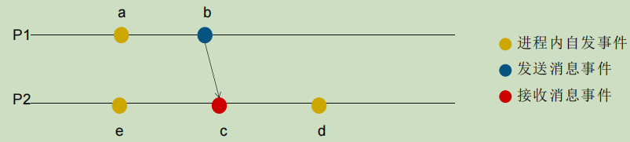
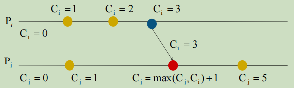

# 分布式时钟与快照算法

- [分布式时钟与快照算法](#分布式时钟与快照算法)
  - [一、物理时钟](#一物理时钟)
    - [(1) 时钟同步算法](#1-时钟同步算法)
  - [二、逻辑时钟](#二逻辑时钟)
    - [(1) Lamport逻辑时钟](#1-lamport逻辑时钟)
  - [三、向量时钟](#三向量时钟)
  - [四、快照算法](#四快照算法)
    - [Chandy-Lamport算法](#chandy-lamport算法)

## 一、物理时钟

### (1) 时钟同步算法

**Cristian时钟同步算法**

- 思想
  - 客户端向服务器进行时间同步和对齐，个客户端向服务器发出校时请求，服务器进行响应，客户端根据响应值重置时间
- 场景
  - 一个客户端向一个服务器请求正确时间
- 过程
  - 客户端发送一个请求，带有本地时钟 T1 时间戳
  - 服务端在本地时间 T2 时收到请求
  - 服务端在T3 发送一个带有本地时钟 T3 和 T2 的响应包
  - 客户端在本地T4时收到响应，并根据响应设置本地 时间
- Client在T4时刻需要调整设定的时间
  - $T_{client} = T_{3} + \delta_{resp}$
  - $\delta_{resp} = \frac{(T_{4} - T_{1}) - (T_{3} - T_{2})}{2}$
  - $T_{client} = \frac{T_{4} - T_{1} + T_{3} + T_{2}}{2}$
- $算法精度 = \delta_{resp} - min$
  - $\delta_{resp}$为往返时间，min 为Client到Server的最短时间

**Berkeley时钟同步算法**

- 思想
  - Master机器通过询问Slave机器的时间，求出平均值作为当前的标准时间，然后再通知给各个slave机器，进行全局对齐调整
- 场景
  - 多个客户端之间同步时钟
- 过程
  - Master测量与Slave的时间差值
  - Master计算时间差值的平均值
  - Master向Slave发送调整量
  - Slave进行调整，完成同步

**网络时间协议NTP**

>1985年特拉华大学的David L. Mills提出网络时间协议(Network Time Protocol NTP)，截止到2010年6月，最新的NTP版本是第4版(NTPv4)， 标准化文档为 RFC 5905

- NTP协议属于应用层协议，基于UDP，端口号123
  - 时间来源:世界协调时UTC
  - 目标：在无序的Internet环境中提供精确和健壮的时间服务，提供高精准度的时间校正（LAN上与标准间差小于1毫秒，WAN上几十毫秒）
- 场景：用于在分布式时间服务器和客户端之间同步时间
- 设计目标: 可外部同步、高可靠性、扩展性好、安全性强
- NTP协议是一种主从式架构协议，使用分层的时钟源系统，每一层称为阶层Stratum，阶层上限是15，阶层16表示未同步设备
  - Stratum0：基准时钟，主要由高精度计时设 备，没有时间漂移，如原子钟、GPS时钟、无 线电时钟
  - Stratum1：主时间服务器，与Stratum0设备同步，误差在几个微秒，如NTP服务器
  - Stratum2：与阶层Stratum1的服务器同步
  - Stratum3：与阶层Stratum2的服务器同步
- 过程
  - 客户端A发送包含NTP消息给服务器B，消息中包含发送时间戳$T_{1}$
  - 服务器B收到NTP消息后，将接收时间$T_{2}$写入消息
  - 服务器B发送该NTP消息给客户端A，发送时间$T_{3}$写入消息
  - 客户端A收到该NTP消息的时间为$T_{4}$
- 时间偏差计算
  - $\theta = T_{3} - T_{3}^{'}$
  - $T_{4} - T_{3}^{'} = \frac{(T_{4} - T_{1}) - (T_{3} - T_{2})}{2}$
  - $\theta =  \frac{T_{2} - T_{1} + T_{3} - T_{4}}{2} $

## 二、逻辑时钟

- 偏序
  - 偏序集合中的元素是部分有序
- 全序
  - 全序关系是偏序关系的一种，在偏序的基础上，增加完全性的条件
  - 全序集合中任意一对元素都是可以相互比较的，全部可排序

### (1) Lamport逻辑时钟

- 通过事件消息来产生Happened Before的偏序，依赖这个偏序确定整个系统的因果序/全序
- 逻辑时钟与物理时钟
  - Logical Clocks是通过系统事件消息的逻辑时间戳建立因果序
  - Physical Clocks是通过系统事件消息的物理时间戳建立全序

**Happened Before事件关系**

- a和b是同一个进程内的事件，a发生在b之前，则 a→b
- b和c在不同的进程中，b是发送进程内的发送事件，c是同一消息接收进程内的接收事件，则 b→c
- 如果a→b并且b→c，则a→c （消息传递性）

**Lamport时钟算法**

- 每个进程$P_{i}$内维护本地一个计数器$C_{i}$, 初始为0
- 每次执行一个事件，计数器$C_{}i$自增(假设自增量为1)
- 进程$P_{i}$发消息给进程$P_{j}$时，需要在消息上附带自身的计数器
- 当进程$P_{j}$接收到消息时，更新自身的计数器$C_{j}=max(C_{i}, C_{j}) + 1$

**Lamport时钟问题**

- Lamport的逻辑时钟算法通过构建全序时钟来描述事件顺序，但是(happened before) 是一个偏序关系
  - ab两个事件并不相关，那么这个时钟给出的大小关系则没有意义

## 三、向量时钟

>1988年由Colin Fidge和Friedemann Mattern提出， 解决Lamport逻辑时钟无法描述事件因果关系的问题：$C_{a}$ < $C_{b}$不能推导出 a→b

- 算法思想
  - 通过一组向量来描述分布式系统中所有进程上事件发生的顺序
    - 不仅同步本进程的时钟值，还同步系统中其他进程的时钟值
  - 以偏序关系刻画事件的因果顺序
- 不足
  - 与Lamport时间戳相比，向量时间戳占用的存储以及消息的有效负载与进程数N成正比
- 对每个进程$P_{i}$，定义一个向量$VC$，向量的长度是n(进程数目)
  1. 初始化各个进程$P_{i}$的向量，初始化值为0，即 $VC_{i}=[0,0,...,0]$
  2. 进程$P_{i}$每发生一个事件时，其向量的第i个元素自增 $VC_{i}[i] += 1$
  3. 当进程$P_{i}$送消息给进程$P_{j}$时,消息中包含自身的向量$VC_{i}$
  4. 进程$P_{j}$接收消息时，对齐对方的时钟，并在自身时钟上自增
     - 对[0,n)上的任意一个整数 k，执行 $VC_{j}[k] = max(VC_{j}[k],VC_{i}[k])$
     - 将$VC_{j}$中自身的时钟自增，即$VC_{j}[j]+=1$

**性质**

- 向量的各维相等，则向量相等
- 向量时钟是有序的
  - $VC_{i}$各维上的值不大于$VC_{j}$对应维上的值，则认为$VC_{i}$不大于$VC_{j}$
- 向量时钟有序性质的严格小于
  - 如果$VC_{i}$不大于$VC_{j}$， 并且至少存在一个维，在这个维上$VC_{i}$的值严格小于$VC_{j}$在这个维上的值，则认为$VC_{i}$小于$VC_{j}$
- 如果两个向量不存在大小关系，则认为两个向量平行，即 $VC_{i} || VC_{j}$

**向量时钟刻画事件顺序**

- 向量有序，则事件有序（充要）
  - $VC_{a} < VC_{a} \Leftrightarrow a \rightarrow b$
- 向量平行，则事件并发（充要）
  - $VC_{a} || VC_{a} \Leftrightarrow a || b$

## 四、快照算法

### Chandy-Lamport算法

>1985年Leslie Lamport和K. Mani Chandy提出Chandy-Lamport算法

- Chandy-Lamport算法是一种在缺乏全局时钟或全局时钟不可靠的情况下， 用来创建分布式系统全局状态一致性的快照算法
- 算法目标
  - 最终产生的快照必须保证一致性
  - 快照过程不能影响系统正常运行

**基本概念**

- 分布式系统由多个进程$P_{i}$组成
- 每个进程通过网络通道和其他进程建立双向连接，$C_{ij}$表示从$P_{i}$到$P_{j}$的连接通道，$C_{ji}$表示从$P_{j}$到$P_{i}$的连接通道
- 系统中的消息分为应用消息(application)和标记(marker)消息
  - 应用消息是业务层面的消息，用M[xy]表示从x事件发到y事件的应用消息
  - 标记消息是一种 控制消息，用来生成快照

**算法实现**

- 前提条件
  - 分布式系统中的进程不会崩溃
  - 进程之间的连接是有序的
  - 进程之间消息传递可靠
- Chandy-Lamport算法3个阶段
  - 初始化快照(Initiating a snapshot)
  - 传播快照(Propagating a snapshot)
  - 完成快照(Terminating a snapshot)

**初始化快照**

- 系统中任意一个进程$P_{i}$发起快照请求
  1. $P_{i}$记录自身的状态
  2. $P_{i}$发送一条marker消息给所有其他进程
  3. $P_{i}$记录所有其他进程发来的application消息

**传播快照**

- 对于任意一个进程$P_{j}$(包含发起快照的那个进程)，考虑所有入边链路$C_{kj}$,当在$C_{kj}$上收到了marker消息时，有两种情况
  - 如果$P_{j}$还没有记录自身的状态
    1. $P_{j}$记录自身的状态，并将$C_{kj}$标记为空
    2. $P_{j}$通过所有出边链路向其他进程发送marker消息
    3. 通过所有入边链路开始监听所有流向自身的消息
  - 如果$P_{j}$已经记录过自身的状态
    - 记下入边链路上监听到的消息，直到收到marker消息为止

**完成快照**

- 所有进程都成功地完成以下工作
  - 收到marker消息
  - 记录自身的状态
  - 记录入边链路的状态(链路上的消息)