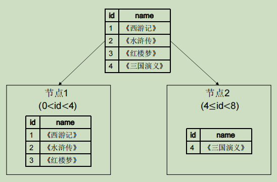
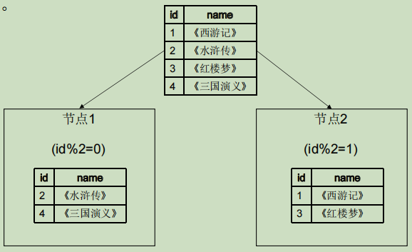
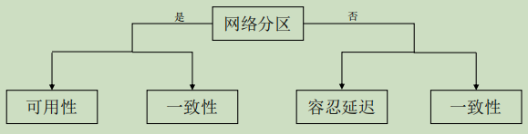

# 分布式一致性

- [分布式一致性](#分布式一致性)
  - [一、数据分区与复制](#一数据分区与复制)
    - [(1) 数据分区](#1-数据分区)
    - [(2) 数据复制](#2-数据复制)
      - [单主复制](#单主复制)
      - [多主复制](#多主复制)
      - [无主复制](#无主复制)
      - [复制技术比较](#复制技术比较)
  - [二、基础定理理论](#二基础定理理论)
    - [CAP定理](#cap定理)
    - [PACELC定理](#pacelc定理)
    - [BASE理论](#base理论)
  - [三、一致性模型](#三一致性模型)
    - [(1) 以数据为中心的一致性模型](#1-以数据为中心的一致性模型)
    - [(2) 以客户端为中心的一致性模型](#2-以客户端为中心的一致性模型)

## 一、数据分区与复制

- 分布式系统中通常使用**分区**技术提高分布式系统的可扩展性和性能，使用**复制**技术提高可用性
  - 分区
    - 将一个数据集拆分成多个小数据集
    - 将存储和处理这些小数据集的责任分配给分布式系统中的不同节点
  - 复制
    - 将同一份数据冗余存储在多个节点上
    - 节点通过网络同步数据使之 保持一致

### (1) 数据分区

- 数据分区是指分布式系统按照一定规则将数据存储到对应的节点中
  - 可以降低单个存储节点的存储和访问压力
  - 可以通过规定好的规则快速找到数据所在的节点，从而降低搜索延迟
- 常见分区方案: 范围分区、哈希分区、一致性哈希环

**范围分区**

- 按照某种规则划分数据范围，将这个范围内的数据归属到一个集合中
  - 例: 规则为id范围

**哈希分区**

- 将指定的数据经过一个哈希函数的计算，根据计算得到的值来决定该数据集的分区
- 在哈希分区设计中，添加或者删除节点，会造成大量的重新映射

**一致性哈希环**

- 一致性哈希环是一种特殊的哈希映射分区算法，用来缓解分布式系统中哈希分区增加或删除节点时引起的数据大规模移动问题
- 处理步骤
  1. 将哈希值组成一个抽象的圆环，并将节点通过机器名称或IP等因素映射到环上
  2. 将需要存储的数据的通过哈希函数计算出 哈希值，分布在哈希环上
  3. 数据存储在按顺时针方向遇到的第一个节点中

### (2) 数据复制

- 一种实现数据备份的技术，用于提高可用性
- 常见的复制方式: 单主(Single-Master)复制、多主(Muti-Master)复制、无主(Leaderless)复制

#### 单主复制

- 单主复制也叫主从复制或主从同步
  - 指定系统中的一个节点为主节点，其余节点被称为从节点
  - 客户端的写请求必须发送到主节点
  - 从节点只能处理读请求，并从主节点同步最新的数据

**同步复制**

- 主节点执行完一个写请求后，必须等待所有的从节点都执行完毕，并收到确认信息后才能回复客户端写入成功

**异步复制**

- 主节点执行完写请求后，会立即将结果返回给客户端，无须等待其他副本写入完成

**半同步复制**

- 介于同步复制和异步复制之间的一种复制机制
  - 主节点只需等待至少一个从节点同步写操作并返回完成信息即可，不需要等待所有节点都完成

#### 多主复制

- 单主复制只有一个主节点，在写性能、可扩展性方面有一定局限性
- 对于写请求负载要求严格的系统，通过增加多个主节点分担写请求的负载
- 解决数据冲突的常见方案
  - 客户端解决冲突
  - 最后写入胜利
  - 因果关系跟踪

#### 无主复制

- 无主复制技术完全没有主节点，客户端将请求发送到多个节点
- 解决数据冲突的常见方案
  - 客户端读处理
  - 节点数据修复方案
    - 读修复
    - 反熵过程
      - 创建一个用于修复数据的后台进程，该进程通过对比各节 点的数据找到错误数据，从最新数据复制到错误的节点

#### 复制技术比较

<table>
<tbody>

<tr>
<th></th>
<th>单主复制</th>
<th>多主复制</th>
<th>无主复制</th>
</tr>

<tr>
<td>优点</td>
<td align=left>
1. 简单和易于实现 
2. 仅在主节点执行并发写操作，能够保证操作顺序，避免处理各节点的数据冲突 
</td>
<td align=left>
1. 增加系统可用性，一个主节点宕机不影响系统运行 
2. 可以在多个主节点执行写请求，分担写入压力 
</td>
<td align=left>
1. 轻松容忍节点故障 
</td>
</tr>

<tr>
<td>缺点</td>
<td align=left>
1. 面对大量写操作，系统难以进行扩展 
2. 主节点宕机时，从节点提升为主节点存在停机时间 
</td>
<td align=left>
1. 复杂度高，容易产生数据冲突 
</td>
<td align=left>
1. 存在数据冲突问题 
</td>
</tr>

</tbody>
</table>

## 二、基础定理理论

### CAP定理

- 一致性(Consistency)
  - 客户端不管访问分布式系统中的哪个节点得到的都是最新的数据，否则读取失败
- 可用性(Availability)
  - 系统提供的服务必须一直处于可用状态，每次请求都能获取到正确的响应，但是不保证获取的数据为最新数据
- 分区容错性(Partition Tolerance)
  - 分布式系统在遇到网络分区故障而导致消息丢失，系统仍然运行

>网络分区：分布式系统中不同节点通过网络通信，由于某些节点间的网络 问题，从而导致整个系统的环境被切分成若干个独立区域

- CAP定理指出在一个异步网络环境中，对于一个分布式读写存储系统来说，只能满足以下三项中的两项，而不可能满足全部三项
  - 当网络分区问题出现，节点间网络不通无法同步数据
  - 此时若要保证一致性，则需要立刻停止服务
  - 如要保证可用性，则无法保证节点的一致性

**CAP中的组合**

<table>
<tbody>

<tr>
<th>组合</th>
<th>分析</th>
</tr>

<tr>
<td>CA</td>
<td align=left>
满足一致性和可用性，放弃分区容错 
对于分布式系统而言，分区容错是一个基本要求，分布式系统中的各组件必然会部署到网络中不同的节点上
</td>
</tr>

<tr>
<td>CP</td>
<td align=left>
满足一致性和分区容错性，放弃可用性 
当出现网络分区，为保证一致性，必须让服务停用
</td>
</tr>

<tr>
<td>AP</td>
<td align=left>
满足可用性和分区容错 
当出现网络分区时，系统中各节点继续对外提供服务，系统失去强一致性 
在网络恢复后，各节点可以同步数据，系统仍可确保数据的最终一致性 
</td>
</tr>

</tbody>
</table>

### PACELC定理

>耶鲁大学Daniel J. Abadi在2012提出CAP的扩展定理PACELC定理

- CAP定理提到的网络分区问题极少出现，但网络延迟问题是常见的，而CAP定理忽略网络延迟
- PACELE定理
  - 在分布式系统中存在网络分区(P)的情况下，必须在可用性(A)与一致性(C)之间做出选择
  - 否则(Else,E), 系统在没有网络分区且正常运行的情况下必须在容忍延迟(L)和一致性(C)之间做出选择

### BASE理论

>由eBay架构师Dan Pritchett于2008年在《BASE: An Acid Alternative》 这篇文章中首次提出

- 基于CAP定理演化, 通过牺牲强一致性获得可用性

**理论内容**

- 基本可用性(Basically available)
  - 允许系统中某个服务出现故障时，采用服务降级的方式保证系统整体的可用性，即允许损失部分系统功能
- 软状态(Soft state)
  - 指允许系统中的数据存在中间状态，并认为该中间状态的存在不会影响系统整体可用性
  - 允许系统在不同节点间副本同步时存在延时
- 最终一致性(Eventually consistent)
  - 系统中所有的数据副本，在经过一段时间的同步后，最终能够达到一个一致的状态

## 三、一致性模型

- 两类一致性模型
  - 以数据为中心的一致性模型
    - 通常考虑多个客户端时的系统状态
  - 以客户端为中心的一致性模型
    - 聚焦于单个客户端观察到的系统状态

### (1) 以数据为中心的一致性模型

- 为数据存储系统提供一个系统级别的全局一致性视图，要求所有节点对全部或部分操作的顺序有一致的看法，从系统的角度考虑数据副本是否一致
- 一致性从高到低
  - 线性一致性(Linearizable Consistency)
  - 顺序一致性(Sequential Consistency)
  - 因果一致性(Causal Consistency)
  - PRAM一致性(Pipelined RAM Consistency)

**线性一致性**

- 线性一致性是最强的一致性模型，也被称为严格一致性
  - 给定一个执行历史，执行历史根据并发操作可以扩展为多个顺序历史
  - 只要从中找到一个合法的顺序历史，那么该执行历史就是线性一致性的

**顺序一致性**

- 顺序一致性只要求同一个客户端的操作在排序后先后顺序不变，但不同的客户端操作的先后顺序是可以改变的

**因果一致性**

- 系统内的进程必须以相同的顺序看到因果相关的操作
  - 而没有因果关系的并发操作可以被不同进程以不同顺序观察到

**PRAM一致性**

- 又被称为FIFO一致性
- PRAM一致性要求同一个客户端的多写操作，将被所有的副本按照同样的执行顺序观察到、
  - 但不同客户端发出的写操作可以以不同的执行顺序被观察到

### (2) 以客户端为中心的一致性模型

- 基于单个客户端与系统的交互历史来定义系统应该满足的一致性要求，因此该类一致性模型也叫做会话保障
  - 读后写一致性(Write Follow Read Consistency)
    - 读后写一致性要求，同一个客户端对于数据项k，如果先读到写操作w1的结果v，那么之后写操作w2保证基于v或比v更新的值
  - 单调读一致性(Monotonic-read Consistency)
    - 单调读一致性要求，如果客户端读到关键字k的值为v，那么该客户端对于k的任何后续读必须返回v或比v更新的值，即保证客户端不会读到旧的值
  - 单调写一致性(Monotonic-writes Consistency)
    - 单调写一致性要求，同一个客户端的写操作在所有的副本上都以同样的顺序执行，即保证客户端的写操作是串行的
  - 读己之写一致性(Writes-follow-reads Consistency)
    - 读己之写一致性要求，当写操作完成后，在同一副本或其他副本上的读操作必须能读到写入的值