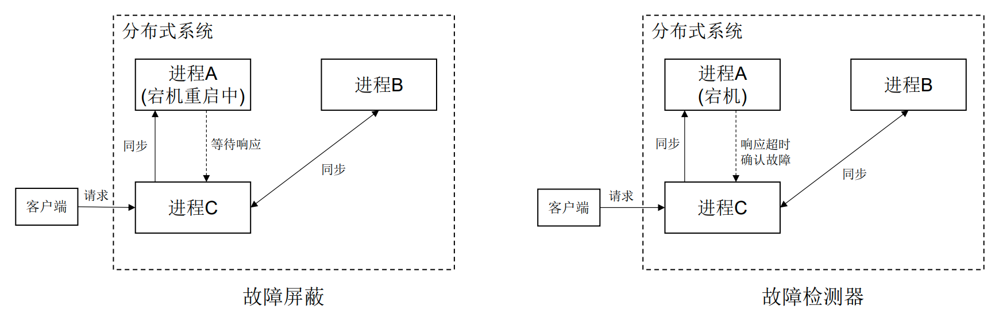
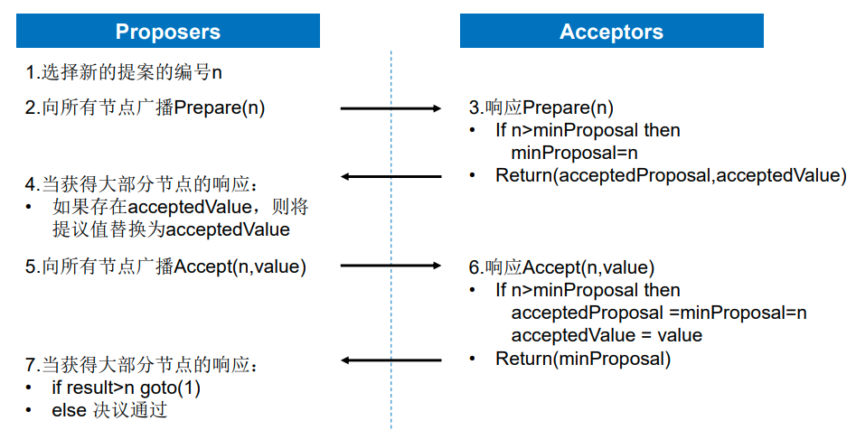
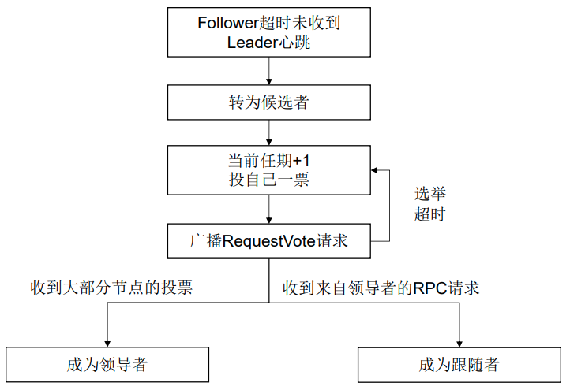
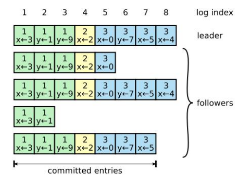
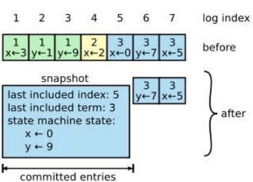
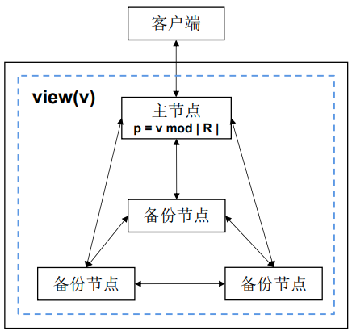
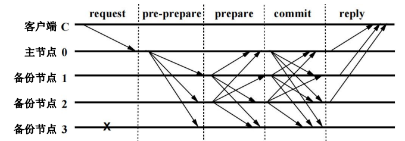

# 分布式共识

- [分布式共识](#分布式共识)
  - [一、共识概念](#一共识概念)
  - [二、拜占庭将军问题](#二拜占庭将军问题)
    - [(1) 二忠一叛问题](#1-二忠一叛问题)
    - [(2) Lamport解决拜占庭问题的方法](#2-lamport解决拜占庭问题的方法)
      - [口头协议](#口头协议)
      - [签名协议](#签名协议)
  - [三、复制状态机](#三复制状态机)
    - [复制状态机实现](#复制状态机实现)
  - [四、异步系统FLP定理](#四异步系统flp定理)
    - [(1) FLP不可能定理](#1-flp不可能定理)
    - [(2) 绕过FLP](#2-绕过flp)
  - [五、Paxos算法](#五paxos算法)
    - [Basic Paxos算法实现](#basic-paxos算法实现)
  - [六、Raft算法](#六raft算法)
    - [(1) 领导选举与日志复制](#1-领导选举与日志复制)
    - [(2) 领导者变更的安全性](#2-领导者变更的安全性)
    - [(3) 配置变更和联合共识](#3-配置变更和联合共识)
  - [七、PBFT算法](#七pbft算法)
    - [(1) 算法模型](#1-算法模型)
    - [(2) 算法组成](#2-算法组成)
    - [(3) 算法运行](#3-算法运行)
    - [(4) 垃圾回收](#4-垃圾回收)
    - [(5) 视图切换](#5-视图切换)

## 一、共识概念

- 共识
  - 在分布式系统中多个节点之间对某个事情达成一致的过程
- 描述
  - 一个分布式系统有 n 个进程 {0, 1, 2,..., n-1}，每个进程都有一个初值,进程之间互相通信，设计一种算法使得尽管出现故障，进程仍协商出某个不可撤销的最终决定值，且每次执行都满足以下三个性质
    - 终止性
      - 所有正确的进程最终都会认同某一个值
    - 协定性
      - 所有正确的进程认同的值都是同一个值
    - 完整性
      - 如果正确的进程都提议同一个值, 那么所有处于认同状态的正确进程都选择该值

## 二、拜占庭将军问题

### (1) 二忠一叛问题

- 存在情况：将军中可能存在叛徒,并试图阻止忠诚的将军达成一致
- 场景：将军按“少数服从多数的原则”进行决策
- 将军副官模型
  - 发送消息的为将军，接收消息的为副官
  - 拜占庭将军问题可以转换为一位将军发送命令给n - 1个副官
  - 满足交互一致性(interactive consistency)条件：
    - IC1.所有忠诚的副官获得相同的命令
    - IC2.如果将军是忠诚的, 那么所有忠诚的副官都会获得将军发出的原始命令

### (2) Lamport解决拜占庭问题的方法

- 解决问题，需满足
  - 一致性：所有忠诚的将军可以达成一致的作战计划
  - 正确性：少数的叛徒不会导致忠诚的将军们采用错误的计划

#### 口头协议

- 拜占庭将军问题的可解条件
  - $n ≥ 3m + 1$
  - 其中m是叛徒的数量，n是将军的总数量

- 判别函数
  - $majority(v_{1}, v_{2},...,v_{n-1}) = v$
  - $v$为$v_{1}, v_{2},...,v_{n-1}$中的众数

- 口头协议满足3个条件: 保证口头协议不被篡改，但可以进行伪造
  - A1. 每条信息都被正确的送达
  - A2. 信息的接收者知道是谁发送的信息
  - A3. 信息的缺省可以被发现

- 对于3忠一叛场景
  - 每个人都使用$majority$进行决策
  - 若副官为叛徒，则能够保证 IC1 与 IC2
  - 若将军为叛徒，则能够保证 IC1

#### 签名协议

- 算法思想
  - 口头协议中叛徒的说谎能力使解决拜占庭将军问题变得困难 ，因此通过限制叛徒的说谎能力，可以使得问题变得简单
  - 一个方法是确保将军们发送不可伪造的签名消息
- 增加2个条件
  - A4. 忠诚将军的签名无法伪造，而且对他签名消息的内容进行任何更改都会被发现
  - A5. 任何人都能验证将军签名的真伪
- choice函数
  - 当Vi中只有一个命令时就得出这个命令
  - 当Vi和Vj是相等的时候choice执行的结果是一样的
    - 相等，即其中的命令都是相同的(不考虑签名)
- 算法流程
  1. 将军将签了自己姓名的消息广播发给所有副官
     - 命令格式是 v:0
     - v是命令，0代表自己的身份
  2. 对于每个副官
     - 将收到将军的消息 v:0 中的命令V放入自己的命令集合$V_{i}$，然后将命令拷贝，加上自己的签名 ，得到消息 v:0:i，再发给其他的副官
     - 收到其他副官的消息 $v:0:j_{1}:...:j_{k}$
       - 如果此命令没有在自己的命令集合中，则加入
       - 若 k<m, 则将命令广播给不在 $j_{1}...j_{k}$中的其他副官
         - m为叛徒数量
     - 理解: 若副官收到不再集合中的命令，则就会向不是此命令来源的其他副官发送命令(第三轮消息交换的条件)
  3. 当一个副官不再收到仍和消息时就会执行choice函数
     - lamport规定是超过一定时间

## 三、复制状态机

- 分布式系统故障
  - 网络延迟问题、部分失效问题、时钟问题

>1984年Lamport提出状态机，1990年Fred Schneider发表论文详细描
>述如何使用复制状态机构建分布式系统的容错服务

- 复制状态机是解决分布式系统故障的一种常规方法
  - 状态机(state machine)
    - 由状态和状态转移函数组成
  - 复制状态机(Replicated State Machine)
    - 一组分布在多个节点上且状态一致的确定性状态机，能够在若干个节点发生故障时仍然正常工作

### 复制状态机实现

- 复制状态机通常基于多副本日志实现
  - 状态机(State Machine)
    - 记录当前节点的状态数据
  - 日志(Log)
    - 某些服务器出现故障时, 只要命令被正确复制，每个服务器的状态机将按日志顺序处理
  - 共识模块(Consensus Module)
    - 通过共识算法保证多副本日志中的值和顺序的一致性，从而使每个节点都有一致的状态和输出

## 四、异步系统FLP定理

- 分布式共识算法具备两个属性
  - 安全性(Safety)
    - 所有正确的进程都认同一个值
  - 活性(Liveness)
    - 分布式系统最终会认同某个值

### (1) FLP不可能定理

>1985年，Michael J.Fischer、Nancy Lynch和Mike Paterson(FLP)共同证明

- 在一个异步系统中，即使只有一个进程出现了故障，也没有算法能保证达
  - 在一个异步系统中，进程可以在任意时间返回响应
    - 因此无法分辨一个进程是速度很慢还是已经崩溃
  - 基于此，无法在有限时间内达成共识，不满足终止性

### (2) 绕过FLP

**故障屏蔽**

- 假设故障的进程最终一定能恢复，并找到一种重新加入分布式系统的方式
  - 如果没有收到该进程的消息就一直等待，直到收到预期的消息

- 实现方法
  - 如果一个进程崩溃，将重启该进程
  - 进程在持久化存储中保留足够多的数据，以便在崩溃和重启后能够利用这些数据继续工作

**故障检测器**

- 进程通过故障检测器来确认没有响应的进程是否已经发生故障
  - 例如超时故障检测器，即如果进程在一定时间内没有响应，那么即便该进程并没有发生故障，也将被认定为已经失效
  
- 故障检测器必须属性
  - 完全性：故障进程会被正确的进程怀疑
  - 精确性：正确进程不会被其他进程怀疑

- 故障屏蔽与故障检测器都是将异步系统转换为部分同步，即在未达成共识前让系统同步

## 五、Paxos算法

- 在同步系统中，有不超过f个进程发生故障(其他节点都是正常的)，且错误进程数量f小于进程总数N,那么，经过f+1轮消息传递后即可达成共识

- 非拜占庭错误
  - 节点发生故障造成消息丢失或重复，但不存在伪造信息的情况，也被称为故障错误(Crash Fault)
- 故障容错算法
  - Paxos算法
  - Raft算法

### Basic Paxos算法实现

- 算法过程
  1. 选择一个值(Choosing a Value)
     - 由提议者与接收者参与，通过两阶段消息传递决议出一个共识的值
  2. 学习被选中的值(Learning a Chosen Value)
     - 学习者获取被提议者与接收者决议出的共识值
- 角色责任
  - 提议者(Proposer)
    - 提出提案，让接收者接受提案
  - 接收者(Acceptor)
    - 参与决策，回应提议者的提案
  - 学习者(Learner)
    - 学习被批准的提案, 不参与决策

**选择一个值**

**学习被选中的值**

- 可选方法
  - 接收者将接受的提案都发送给学习者
    - 需要每个接收者都和学习者进行通信，通信次数等于接收者数量和学习者数量的乘积
  - 让所有接收者的接受内容发送给指定的学习者，该学习者之后会通知给其他的学习者
    - 存在单点故障问题。
  - 接收者和一组指定的学习者传递信息，再由这些学习者通知给所有的学习者
    - 通信复杂度较高

**活锁问题**

- 提议者在第一阶段发出Prepare请求后，还没来得及发送第二阶段的Accept请求，第二个提议者就发出了提案编号更大的Prepare请求，导致接收者始终停留在决定提案编号这个阶段
- 解决方法
  - 引入随机超时机制，某个提议者发现提案没有被成功接受，则等待一个随机超时时间，让出机会，减少一直抢占的可能性

**Multi-Paxos算法**

- Basic Paxos存在问题
  - 一个Paxos实例决议出一个提案值
  - 决议的形成至少需要两次网络来回，在高并发的情况下可能需要更多次的消息传递
- Multi-Paxos性能优化
  - 一个Multi-Paxos实例决议出多个提案值
  - 通过领导者选举，实现任意时刻只有一个领导者提交提案，避免提案冲突和减少第一阶段请求

## 六、Raft算法

**算法角色**

- 角色功能
  - 领导者(Leader)
    - 处理客户端请求
  - 候选者(Candidate)
    - 介于领导者与跟随者的中间状态，选举出新的领导者
  - 跟随者(Follower)
    - 被动接收RPC请求

- 在同一时刻，一个进程只能是以上角色中的一种
- 正常运行时，1个领导者与n-1个跟随者

**算法内容**

- 算法正常运行时包含领导选举与日志复制
  - 领导选举(Leader Election)
    - 通过选举机制选出新的领导者，有且仅有一个领导者节点
  - 日志复制(Log Replication)
    - 领导者生成日志条目，并将日志复制到跟随者节点，实现日志的一致性
- 领导者变更的安全性
  - 领导者更替时通过约束保障安全性。
- 配置变更和联合共识
  - 集群节点变化，需进行配置变更，引入联合共识

### (1) 领导选举与日志复制

**任期**

- 所有节点通过选举-投票机制选出领导者，每一个领导者都会对应一个任期(Term)，每个任期都是一个连续递增的编号，整个系统会将拥有最大的Term的节点作为领导者

**状态转换**

- 系统刚启动时，所有节点都是Follower
- Follower在一段时间内如果没有收到Leader的心跳信号，就会转化为Candidate，开始新一轮选举
- Leader发送心跳来维持权威

**领导选举过程**

**日志复制**

1. 客户端请求提交到Leader，Leader为请求生成日志条目Entry，并写入本地日志
2. Leader将Entry发送到其它Follower，称为复制
3. Leader等待Followers回应
4. Leader回应客户端
   - 如果收到大多数节点响应，将日志标记为提交状态，将命令应用到状态机
5. Leader通知Followers Entry已提交

**日志结构**

- 日志索引
  - 日志条目在整个日志中的序号
- 任期号
  - 日志条目首次被领导者创建时的任期
- 操作指令 
  - 领导者从客户端接收的应用于状态机的操作指令

**日志压缩-快照**

- 快照存储主要组成
  - Last included index
    - 快照块所包含的最后一个日志序号
  - Last included term
    - 快照块所包含的最后一个日志的任期
  - State
    - 状态机数据
- 快照存储方式
  - 基于内存的状态机快照
  - 基于磁盘的状态机快照

### (2) 领导者变更的安全性

- 领导者更替要满足安全性(Raft safety property)
  - 如果领导者将日志条目提交，那么该条目将存在于未来所有的领导者日志中

**选举限制**

- 目标
  - Leader必须存储所有已经提交的日志条目
  - 日志条目的传送是单向的，只能从Leader传给 Follower，并且 Leader 从不会覆盖自身本地日志中已经存在的条目
- 方法策略
  - Raft使用投票的方式，Candidate候选者需要赢得大部分选票，如果投票者的日志更新则拒绝投票
- 判断更新
  - 通过比较两份日志中最后一条提交日志条目的索引值和任期号来确定，优先级上任期号>索引值

**提交之前任期的日志条目**

- 情况一: 日志条目已复制到大多数但未提交
  - 如果一个Leader在提交日志条目之前崩溃，Raft算法不会通过计算副本数目的方式去提交一个之前任期内的日志条目
  - 只有Leader当前任期里的日志条目通过计算副本数目可以被提交
- 情况二：日志条目已提交
  - 当 Leader复制之前任期里的日志时，Raft会为所有日志保留原始的任期号，这在提交规则上产生了额外的复杂性
  - 但是，这种策略更加容易辨别出日志，即使随着时间和日志的变化，日志仍维护着同一个任期编号

### (3) 配置变更和联合共识

**配置变更**

- Raft集群在运行期间集群会发生变化(机器升级、机器宕机、副本数量变化)，共识算法
需要自动化地适应配置变化
- 直接配置变更引起矛盾的多数派问题
  - 直接从旧配置切换到新配置，可能会导致在某一个时间点，有两台服务器被选举为同一个任期的Leader，出现脑裂现象

**联合共识**

- Raft算法使用联合共识算法，通过两阶段协议完成新旧两种配置的过渡

## 七、PBFT算法

- 实用拜占庭容错(Practical Byzantine Fault Tolerance,PBFT)算法解决由于恶意攻击和软件错误会导致错误节点表现出 Byzantine行为的问题

### (1) 算法模型

- 客户端(client)
  - 向主节点发送请求
- 副本(replica)
  - 主节点(primary)
    - 接收客户端的请求，并向其余节点进行组播，校验并执行请求
  - 备份节点(backup)
    - 接收主节点组播请求，校验并执行请求
- 视图(view)
  - The replicas move through asuccession of configurations
  - 当主节点发生切换时会生成一个新的视图，称为视图切换
  - 视图是连续编号的，主节点由视图编号决定

### (2) 算法组成

- 正常运行(Normal Case Operation)
  - 包括预准备(pre-prepare)、 准备(prepare)和提交(commit)三阶段
- 垃圾回收(Garbage Collection)
  - 防止消息日志无限制增长
- 视图切换(View Changes)
  - 主节点发生故障或主节点为恶意节点时保证保证算法活性的机制

### (3) 算法运行

- request
  - 客户端发送请求到主节点
- 阶段1 pre-prepare
  - 主节点收到请求后进行广播，扩散至备份节点
- 阶段2 prepare
  - 备份节点收到后记录并再次广播
- 阶段3 commit
  - 节点在prepare阶段若收到超过一定数量的相同请求，则进入commit阶段，广播commit请求
- reply
  - 节点在commit阶段若其中有一个收到超过2f+1的相同请求，则对客户端进行反馈

**Request**

- 客户端向主节点发送请求消息(REQUEST, o, t, c)
  - REQUEST：消息所处阶段
  - o(operation)：状态机要执行的具体操作
  - t(timestamp)：客户端发起请求时的时间戳
  - c(client)：客户端唯一标识

**Pre-Prepare**

- 主节点收到C请求，将预准备消息((PRE_PREPARE, v, n ,d), m)广播到所有备份节点。
  - PRE-PREPARE：消息所处阶段
  - v：当前视图编号
  - n：主节点广播消息的唯一递增序号
  - d：为m的消息摘要
  - m：客户端消息

**Prepare**

- 如果备份节点i接受预准备消息，则向其他节点发送准备消息(PREPARE, v, n, d, i)，进入准备阶段
- 当节点收到超过 2f 个不同节点的 prepare 消息，则 prepare 阶段完成
  - PREPARE：消息所处阶段
  - v：当前视图编号
  - n：主节点广播消息的唯一递增序号
  - d：m的消息摘要
  - i: 节点编号

**Commit阶段**

- 节点i向其他节点广播commit消息(COMMIT, v, n, D(m), i)
- 当收到2f+1（包括自己）个一致的commit消息后，执行客户端消息m中包含的操作
  - COMMIT：消息所处阶段
  - v：当前视图编号
  - n：主节点广播消息的唯一递增序号
  - D(m)：m的消息摘要
  - i：节点编号

**Reply**

- 各节点向客户端发送reply消息(REPLY, v, t, c, i, r)
- 客户端等待响应，若得到f+1个不同节点且具有同样时间戳t和执行结果r，则客户端把r作为正确的执行结果
  - REQUEST：消息所处阶段
  - o(operation)：状态机要执行的具体操作
  - t(timestamp)：客户端发起请求时的时间戳
  - c(client)：客户端唯一标识

### (4) 垃圾回收

- 清理日志防止日志无限制增长，通过引入检查点机制明确日志清理时机和范围
- 检查点(checkpoint)
  - 每执行一定数量的请求后生成一次状态证明
  - 例如
    - 只要请求序号是某个值k(如100)的整数倍时，就生成一次，此时称这个状态为检查点
- 稳定检查点(stable checkpoint)
  - 当2f+1个节点完成检查点共识的最大请求编号

**垃圾回收流程**

- 副本i接收请求序号n的请求，如果n%k=0，则
  - 生成一个检查点消息，并广播给其他副本
  - 将检查点消息保存在本地日志中
  - 各副本将接收的检查点消息保存在本地日志中
- 当副本i收到2f+1个(包括自身) 不同副本发来的相同检查点消息时，该检查点变为稳定检查点
- 副本i将从本地日志中删除所有序号小于或等于n的k条请求所对应的消息
  - 同时会删除所有更早的检查点和对应的检查点消息

### (5) 视图切换

- The replicas move through a succession of configurations
  - 当主节点发生切换时会生成一个新的视图，称为视图切换
- 视图切换触发条件
  - 正常阶段定时器超时，一定时间内无法完成3阶段
  - View Changes阶段定时器超时，一定时间内无法完成正在进行的View Change
  - 定时器未超时，但有效的view-change消息数量达到f+1个，代表当前已经有f+1个非拜占庭节点发起了新的视图切换，节点为了不落后，不等待超时而进入视图切换
  - new-view消息不合法，代表当前View Changes阶段的主节点为拜占庭节点

**视图切换阶段**

- view-change
  - 触发视图切换，节点广播(VIE-CHANGE, v+1, n, C, P, i), view- change消息，通知其他节点进行视图切换
- new-view
  - 新视图的主节点(p=(v+1) mod | R |)接收到2f个来自不同其他节点的view- change后，将new-view消息(NEW_VIEW, v+1, V, 0)广播到其它从节点
  - 从节点接收到new-view消息后进行验证，验证通过则进入视图v+1

**消息结构**

- (VIE-CHANGE, v+1, n, C, P, i)
  - VIEW-CHANGE：消息所处阶段
  - v+1：新视图编号
  - n：节点i最新的稳定检查点序号
  - C：节点编号i保存的非稳定检查点
  - P：已经Prepared消息的信息集合
  - i：节点编号
- (NEW_VIEW, v+1, V, 0)
  - NEW-VIEW：消息所处阶段
  - v+1：新视图编号
  - V：一个集合，每个元素是一对(i, d)，表示i发送的view-change消息摘要是d
  - O：一个包含多个pre-prepare消息的集合