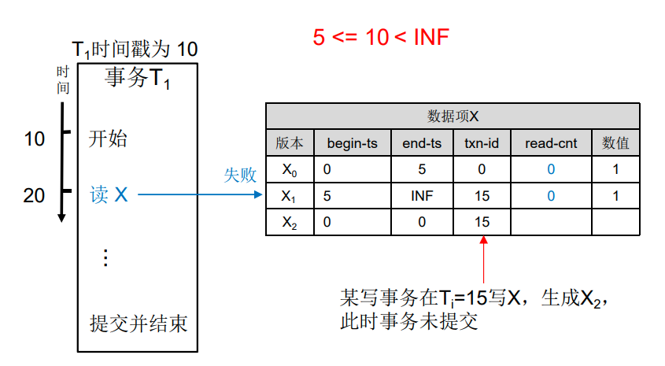

# 分布式事务

- [分布式事务](#分布式事务)
  - [一、事务特性](#一事务特性)
    - [(1) 事务](#1-事务)
    - [(2) 特性](#2-特性)
  - [二、事务分类](#二事务分类)
    - [(1) 本地事务](#1-本地事务)
  - [(2) 分布式事务](#2-分布式事务)
  - [三、分布式事务原子性提交](#三分布式事务原子性提交)
    - [(1) 2PC协议](#1-2pc协议)
      - [协议模型](#协议模型)
      - [执行过程](#执行过程)
      - [DTP模型](#dtp模型)
      - [2PC协议问题](#2pc协议问题)
    - [(2) 3PC协议](#2-3pc协议)
      - [优化2PC问题](#优化2pc问题)
    - [(3) TCC协议](#3-tcc协议)
      - [TCC协议模型](#tcc协议模型)
  - [四、事务并发冲突与隔离级别](#四事务并发冲突与隔离级别)
    - [并发冲突](#并发冲突)
    - [事务的隔离级别](#事务的隔离级别)
  - [五、并发控制算法](#五并发控制算法)
    - [(1) 悲观并发控制](#1-悲观并发控制)
    - [(2) 乐观并发控制](#2-乐观并发控制)
      - [基于检查的乐观并发控制](#基于检查的乐观并发控制)
      - [基于时间戳的乐观并发控制](#基于时间戳的乐观并发控制)
    - [(3) 多版本并发控制](#3-多版本并发控制)
      - [多版本两阶段锁](#多版本两阶段锁)
    - [多版本并发控制的数据存储](#多版本并发控制的数据存储)
    - [多版本并发控制垃圾回收](#多版本并发控制垃圾回收)
    - [典型的支持分布式事务的存储系统架构](#典型的支持分布式事务的存储系统架构)

## 一、事务特性

### (1) 事务

>1981年Jim Gray提出事务，是构建数据管理应用程序的关键

- 事务是由有限的操作序列构成
  - 事务必须作为一个整体单元要么执行成功或者失败，不允许部分执行完成
- 广泛应用于数据库领域

### (2) 特性

- 原子性(Atomicity)、一致性(Consistency/Correctness)、隔离性(Isolation)、持久性(Durability)

**原子性**

- 构成事务的所有操作要么全部成功执行，要么全部执行失败

**一致性**

- 一个事务能够正确地将数据从一个一致性的状态，变换到另一个一致性的
状态

**隔离性**

- 隔离性确保事务在并发执行时，一个事务的执行不被其他事务干扰
  - 通常使用并发控制实现隔离性

**持久性**

- 持久性保证一旦事务被提交，即使在系统故障的情况下，事务做出的的数据状态变更也不会丢失
  - 通常已完成的事务将被持久化到硬盘中

## 二、事务分类

- 根据涉及到的节点数量分类
  - 本地事务
    - 事务发生在同一个节点
  - 分布式事务
    - 事务的参与者、事务所在服务器、涉及资源服务器等位于分布式系统中的不同节点

### (1) 本地事务

- 本地事务涉及客户端和资源管理器交互
- 本地事务优缺点

<table>
<tbody>

<tr>
<th>优点</th>
<th>缺点</th>
</tr>

<tr>
<td align=left>
支持ACID特性 
事务可靠、执行效率高 
事务状态通常由数据库维护，上层应用无需处理 
应用编程模型简单不涉及复杂网络编程 
</td>
<td align=left>
不具备分布式事务的处理能力 
一次事务过程中只能连接一个支持事务的数据库，不能
用于多个事务性数据库 
</td>
</tr>

</tbody>
</table>

## (2) 分布式事务

- 常见应用场景
  - 数据库拆分：单体系统访问多个数据库实例
  - 服务拆分：多个服务访问同一个数据库实例
  - 微服务：多个服务各自拥有一个数据库实例

## 三、分布式事务原子性提交

- 原子提交协议(Atomic Commitment Protocol,ACP)保证分布式事务原子性，必须满足3个特性
  - 协定性(Agreement)
    - 所有进程决议出同一个值，提交事务或终止事务
  - 有效性(Validity)
    - 如果所有进程都决定提交事务并且没有任何故障发生，则提交事务
    - 只要有一个进程决定中止事务，则中止事务
  - 终止性(Termination)
    - **弱终止条件**指没有故障发生所有进程将做出决议(提交或中止事务)
    - **强终止条件**也成为非阻塞条件，是指没有发生故障的进程最终会做出决议
- 常见原子提交协议: 2PC、3PC、TCC

### (1) 2PC协议

#### 协议模型

- 2PC协议模型
  - 协调者
    - 协调各个参与者，对分布式事务进行提交或回滚
  - 参与者
    - 分布式事务涉及的节点

#### 执行过程

- 协议思想
  - 每个参与者将事务执行是否成功通知协调者
  - 协调者根据所有参与者的反馈结果，决定各参与者提交事务或中断事务
- 协议两阶段
  - 准备阶段(Prepare)
  - 提交阶段(Commit)

**准备阶段**

1. 事务询问
   - 协调者向所有参与者询问是否准备好执行事务，等待参与者响应
2. 执行事务
   - 每个参与者执行事务，但不提交事务
3. 执行响应
   - 如果参与者成功执行事务，返回Yes响应，表示事务可以执行提交
   - 否则返回No响应，表示事务不可以执行提交

**提交阶段**

- 情况1：提交事务
  - 提交事务请求
    - 协调者向所有参与者发出提交事务请求
  - 提交操作ACK
    - 参与者收到提交事务请求后提交本地事务，返回ACK消息
- 情况2：中断事务
  - 回滚事务请求
    - 协调者向所有参与者发出回滚事务请求
  - 回滚操作ACK
    - 参与者收到回滚事务请求后执行回滚并返回ACK消息

#### DTP模型

- X/Open DTP(X/Open Distributed Transaction Processing Reference
Model) 是X/Open组织定义的一套分布式事务标准，包括分布式事务的规范和API
  - 使用两阶段提交保证事务原子性 
- 模型组件
  - AP(Application Program)
    - 应用程序，参与DTP分布式事务模型的应用程序
  - RM(Resource Manager)
    - 资源管理器，对相应的资源进行有效管理
  - TM(Transaction Manage)
    - 事务管理器，负责协管DTP模型中的事务，为应用程序提供编程接口，管理资源管理器

#### 2PC协议问题

- 阻塞问题
  - 在事务过程中如果有参与者宕机，则其他参与者执行事务并且一直占用资源，直到协调者等待超时
- 单点故障
  - 协调者发生故障，参与者会一直阻塞

### (2) 3PC协议

- 3PC协议的模型与2PC协议相同，由一个协调者与多个参与者构成
- 协议三阶段
  - 可提交阶段(CanCommit)
  - 预提交阶段(PreCommit)
  - 提交阶段(DoCommit)

**可提交阶段**

1. 协调者向参与者发送CanCommit请求，询问是否可以执行事务操作，等待参与者响应
2. 参与者接到CanCommit请求后，如果可以执行事务则返回Yes，否则返回No

**预提交阶段**

- 情况1：执行事务预提交(协调者接收到所有参与者的Yes响应)
  1. 协调者发送preCommit请求
  2. 参与者收到preCommit请求，执行事务操作
  3. 参与者成功执行事务，返回ACK响应
- 情况2：中断事务(有参与者响应No或者协调者未接收到所有参与者的Yes响应)
  1. 协调者发送abort请求
  2. 参与者收到abort请求或者超时，执行中断事务
  3. 参与者返回ACK响应

**提交阶段**

- 情况1：执行提交(协调者收到所有参与者事务执行成功响应)
  1. 协调者发送doCommit请求
  2. 参与者收到doCommit请求，执行本地事务提交
  3. 事务提交完成，返回ACK响应
- 情况2：回滚事务(协调者未接收到所有参与者事务执行成功响应)
  1. 协调者发送doRollback请求
  2. 参与者收到doRollback请求，执行本地事务回滚
  3. 事务回滚完成，返回ACK响应

#### 优化2PC问题

- 阻塞问题优化
  - 通过增加canCommit阶段，降低阻塞几率
  - 协调者引入超时机制避免参与者宕机导致其他参与者锁定资源
- 单点故障优化
  - 在参与者中引入超时机制，超时后继续处理事务

### (3) TCC协议

- 2PC/3PC阻塞占用资源的性能问题，以及要求资源管理器支持本地事务，使得开发大型可伸缩应用不切实际
- TCC协议
  - 在业务(应用)层实现两阶段提交协议，不要求资源管理器支持本地事务
  - 但具有业务侵入性

#### TCC协议模型

- 主服务
  - 对外提供业务服务，并且发起业务活动并编排所有的事务参与者
- 从服务
  - 事务的参与者，实现和提供try、confirm、cancel三个接口
- 事务管理器
  - 分布式事务的协调者，在try操作阶段完成后根据成功与否调用confirm或者cancel接口

## 四、事务并发冲突与隔离级别

### 并发冲突

- 数据库中并发事务带来的冲突
  - 脏写、脏读、不可重复读、幻读

**脏写**

- 事务T1正在访问数据并且对数据进行修改，事务T1还未提交，此时事务T2修改数据

**脏读**

- 事务T1正在访问数据并且对数据进行修改，事务T1还未提交，此时事务T2读取到该数据，此后事务T1若回滚数据，则事务T2读取了无效数据

**不可重复读**

- 事务T1读取数据项，另一个事务T2修改该数据项并提交，如果事务T1试图重新读取数据项，会读到修改的值

**幻读**

- 事务T1读取一些数据，并发事务T2增加⼀些数据，事务T1会读取⼀些原本不存在的记录
- 不可重复读的重点在于更新和删除操作，而幻读的重点在于插入操作

### 事务的隔离级别

- 隔离级别能够描述系统容忍并发事务引起冲突的范围
- 分布式一致性验证框架Jepsen隔离级别
  - 串行化(serializable)
  - 可重复读(repeatable read)
  - 快照隔离(Snapshot Isolation)
  - 游标稳定性(Cursor Stability)
  - 单调原子视图(Monotonic Atomic View)
  - 读未提交(read uncommitted)
  - 读已提交(read committed)

## 五、并发控制算法

### (1) 悲观并发控制

- 悲观并发控制(Pessimistic Concurrency Control,PCC)
  - 假设事务冲突严重，因此在访问数据前需要先获得锁，针对可能出现并发问题的事务操作进行阻塞处理
- 两阶段加锁(Two-Phase Locking,2PL)
  - 一种悲观并发控制，使用锁来防止并发事务对数据的干扰，以实现事务访问对象的串行化
- 严格两阶段加锁
  - 2PL变种，在两阶段加锁的基础上，要求事务必须在提交或放弃之后方可释放持有的所有排他锁，防止在提交之前更新数据的中间结果被其他事务读取到
  - 获取释放锁维护开销大、死锁风险、加锁等待并发效率低

### (2) 乐观并发控制

- 乐观并发控制(Optimistic Concurrency Control,OCC)算法思想
  - 考虑到在大多数应用中，两个事务访问数据存在冲突是小概率事件
  - 事务执行时不考虑冲突，在提交时检测冲突
  - 若有冲突，则中止事务
- 两种算法实现
  - 基于检查的并发控制
  - 基于时间戳的并发控制

#### 基于检查的乐观并发控制

- 算法思想
  - 为每个事务涉及的数据创建一个私有的副本，所有的更新操作都在此副本上执行，再通过检查原来的数据是否有冲突来决定是否能够提交事务
- 三个阶段
  1. 读取阶段
     - 将事务涉及数据复制一副本保存到私有空间，并在副本上进行读写操作
  2. 校验阶段
     - 检查事务是否与其他事务产生冲突
     - 若无冲突，进入下阶段
     - 否则中止
  3. 写入阶段
     - 将私有空间中的数据写入到持久存储中，事务完成

**校验元数据**

- 事务号
 - 按照升序分配的整数
- 读集
 - 当前事务读取的数据项的集合
- 写集
 - 当前事务写入的数据项的集合

- 校验过程
  1. 向后校验
  2. 向前校验

**向后校验**

- 读写校验
  - 检查当前事务的读集是否和重叠事务的写集存在冲突
- 冲突处理
  - 校验事务$T_{v}$的读集和事务$T_{2}$、$T_{3}$的写集有没有冲突，如有则放弃$T_{v}$

**向前校验**

- 写读校验
  - 检查当前事务的写集是否和重叠事务的读集存在冲突
- 冲突处理
  - 校验$T_{v}$的写集和$T_{2}$、$T_{3}$的读集有没有冲突
  - 如有冲突存在多种处理方式，如推迟验证、放弃冲突活动事务提交事务$T_{v}$、放弃事务$T_{v}$等

#### 基于时间戳的乐观并发控制

>1981年Bernstein.P.,Goodman.N提出基于时间戳的乐观并发控制算法(Timestamp-Based
>Concurrey Control)，强依赖于精准的时间戳

- 算法思想
  - 在事务提交时校验事务中的操作是否读取或写入冲突数据
- 校验元数据
  - 事务$T_{i}$时间戳$TS(T_{i})$，记录事务开始时间
  - 数据项X
    - 读时间戳$R-TS(X)$，数据项最近一次被读取的时间
    - 写时间戳$W-TS(X)$，数据项最近一次被写入的时间
- 校验过程
  - 读校验
  - 写校验

**读提交校验**

- 事务读操作只能读到事务开始之前的数据项
  - 如果事务读到未来数据，则中止事务
- 事务读取数据项并更新数据项读时间戳，同时保存一份数据项副本，保证事务在结束之前读到
相同的数据项

**写提交校验**

- 事务写操作只能修改过去的数据项
  - 如果事务修改了已经被某个事务读取或写入的数据项，则中止事务
- 事务写入数据项并更新数据项写时间戳，同时保持一份数据项副本，保证事务在结束之前读到相同的数据项

### (3) 多版本并发控制

>1978年David P. Reed提出多版本并发控制(Muti-Version Concurrey Control，MVCC)，是一种使用广泛的并发控制机制

- 多版本并发控制为每个数据项存储多个版本，每个事务读到的都是某个版本的数据项，写操作则新建一个版本，因此有着非常好的读性能

#### 多版本两阶段锁

- 在两阶段锁的基础上增加多个版本的衍生并发控制算法
- 算法流程: 读操作、写操作、提交

**元数据**

- txn-id
  - 持有当前数据项写锁的事务的开始时间戳$T_{id}$，若该数据项无写锁则等于0
- begin-ts
  - 创建该版本数据项的事务提交时的时间戳$T_{commit}$, 初始值0
- end-ts
  - 若为最新版本，则end-ts无限大(INF)
  - 否则等于相邻版本数据项的begin-ts, 初始值0
- read-cnt
  - 当前数据项读锁的数量

**读操作**

- 找到事务T可以读取的最新数据项版本
  - 即满足事务开始时间戳$T_{id}$大于等于begin-ts或小于end-ts的版本
- 判断其他事务是否持该数据项版本的写锁，若有则中止事务并回滚
  - 否则，读取数据

**写数据**

- 找到事务T写数据项的最新版本
  - 即end-ts(Xv)等于INF的版本
- 判断其他事务是否有Xv版本的读锁和写锁
  - 若有则中止和回滚事务
  - 否则将$x_{V}$加写锁，创建新的数据项版本$X_{v+1}$并加写锁，写入数据

**提交**

- 生成一个提交时间戳$T_{commit}$。
- 事务T遍历所有写数据项，更新元数据，提交
- 事务T遍历所有读数据项，更新元数据，提交

### 多版本并发控制的数据存储

- 版本存储策略
  - 仅追加存储(Append-only Storage)
  - 时间旅行存储(Time-Travel Storage)
  - 增量存储(Delta Storage)

**仅追加存储(Append-only Storage)**

- 将所有元组存储在同一个表中，以链表形式组织数据结构，按链表指针指向分类
  - O2N(Oldest-to-Newest)
    - 从最老到最新，新元组添加到元组列表末尾，修改旧元组指针指向新元组
  - N2O(Newest-to-Oldest)
    - 从最新到最老，新元组添加到元组列表末尾，将其指针指向旧元组

**时间旅行存储(Time-Travel Storage)**

- 单独用一个时间旅行表(Time-Travel Table)存储历史版本
  - 最新版本数据存储在主表中，新增一个版本的元组时，先在时间旅行表中增加一行
  - 然后将主表的数据复制到这个位置，最后修改主表中的最新版本
    - 复制主表的当前数据，在将最新的数据写入主表，即Time-Travel表中的都是旧版本，主表中为最新版本

**增量存储(Delta Storage)**

- 每次只将变化的字段信息存储到增量存储中
  - 新增新版本时，系统将字段修改前的信息存储到增量存储中
  - 然后直接修改主表字段，并以链表形式连接

### 多版本并发控制垃圾回收

- 当事务对数据进行更新时，多版本并发控制创建新的版本，当旧版本数据过多时，将带来以下问题：
  - 过多的版本存储耗尽存储空间
  - 系统需要消耗更多的时间遍历查询版本链
- 垃圾回收方法
  - 元组级别垃圾回收(Tuple-Level Garbage Collection)
  - 事务级别垃圾回收(Transaction-Level Garbage Collection

**元组级别垃圾回收**

- 后台清理
  - 通过后台线程周期性的进行清理
  - 如果后台进程检查到某个版本的end-ts小于当前所有活跃事务的$T_{id}$
- 协同清理
  - 在执行事务的同时，遍历之前版本的数据的同时识别出过期版本，并在事务的最后阶段将其删除
  - 适用于O2N存储

**事务级别垃圾回收**

- 事务通过读写数据集(Read/Write Sets)记录与自身相关的数据版本
  - 如果系统认为一个事务创建的版本已经不被任何活跃事务访问，则意味着该事务已经过期
  - 系统会根据该事务的读写数据集(Read/Write Sets)清理对应的版本

### 典型的支持分布式事务的存储系统架构

