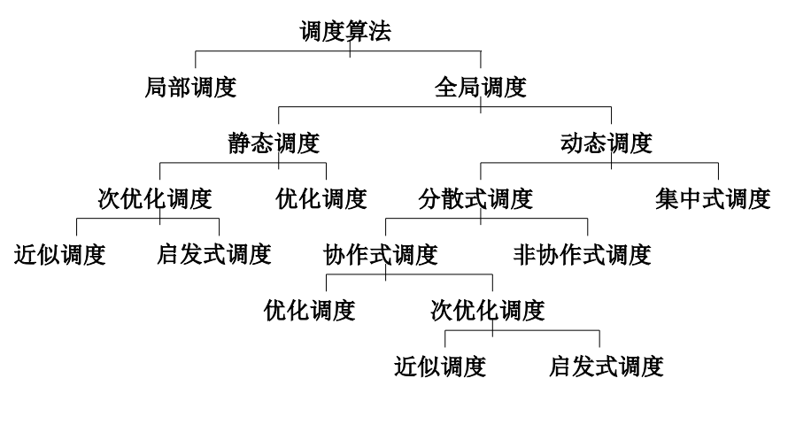
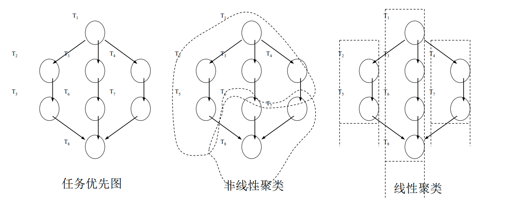

# 分布式调度

- [分布式调度](#分布式调度)
  - [一、调度算法概述](#一调度算法概述)
    - [(1) 调度算法分类](#1-调度算法分类)
    - [(2) 调度算法目标](#2-调度算法目标)
    - [(3) 有效性评价](#3-有效性评价)
  - [二、静态调度](#二静态调度)
    - [(1) 任务建模](#1-任务建模)
    - [(2) 任务划分与分配](#2-任务划分与分配)
    - [(3) 任务划分算法](#3-任务划分算法)
  - [三、动态调度](#三动态调度)
    - [(1) 组成要素](#1-组成要素)
    - [(2) 算法分类](#2-算法分类)
    - [(3) 设计决策](#3-设计决策)
    - [(4) 负载平衡算法使用的参数](#4-负载平衡算法使用的参数)

## 一、调度算法概述

- 分布式系统提供了巨大的处理能力
- 为了实现和充分利用这种能力，需要优良的负载分配方案
- 负载分配是分布式系统的资源管理模块，它的主要功能是合理和透明地在处理器之间分配系统负载，以达到系统的综合性能最优

### (1) 调度算法分类

**局部和全局**

- 在分布式系统中，进程的调度有两个层次：局部调度和全局调度
  - 局部调度解决在单个节点上为各作业分配处理资源的问题
  - 全局调度解决的是选择哪个处理机来执行给定的进程，即解决在各节点上如何分配整个系统的负载的问题
- **全局调度必须优先于局部调度**，即先进行全局调度然后进行局部调度

**静态与动态**

- 在全局调度中，调度算法又可以分为静态调度算法和动态调度算法
  - 在静态调度算法中，进程到处理机的分配是在进程执行之前的编译阶段完成的
    - 静态调度又叫做确定性调度
  - 动态调度算法要到进程在系统中执行时才做出分配

**最优和次优**

- 无论是静态调度，还是动态调度，又可以分为最优调度和次优调度
  - 如果根据标准，比如最短执行时间和最大系统流量，可以取得最优的负载分配，那么就可以认为这种调度是最优的
  - 一般来说，调度问题是一个NP完全性问题
    - 在某些情况下，次优方案也是可以接受的

**近似和启发式**

- 次优调度算法又分为近似的和启发式的
  - 在近似算法中，算法仅仅搜索解空间的一个子集，当寻找到一个好的解时，终止算法的执行
  - 在启发式算法中，算法使用某些特殊参数，用这些参数对真实系统进行近似地建模

**集中控制和分散调度**

- 从调度者的职责这个角度来看，动态调度算法又分为集中控制算法和分散调度算法
  - 在分散控制算法中，决策工作被分配给不同的处理器，即整个调度任务是由多个参加者共同完成的
- 在集中控制算法中，决策工作由一个处理器完成
  - 在集中式调度算法中，如果集中的调度处理器失效或者变得不可用，那么整个系统就会瘫痪，所以一般还提供一个备用的调度处理器，一旦集中的调度处理器出现错误，备用的调度处理器接替原先的调度处理器的工作，执行调度任务

**协作和非协作**

- 对于分散控制算法而言，又可以分为协作的和非协作的调度算法
  - 在协作的调度算法中，分布式对象间有协同操作
  - 在非协作的调度算法中各处理器独立做出决策

**其他分类**

- 非抢先式的（non-preemptive）和抢先式的（preemptive）
  - 对非抢先式的调度算法，一个进程开始执行后就不能中断
  - 在抢先式调度算法中，进程可以中断，从一个处理机上移走，到另一个处理机上继续执行
- 适应性（adaptive）和非适应性的（non-adaptive）
  - 非适应性调度算法只使用一种负载分配策略，不会根据系统的反馈而改变自己的行
  - 适应性调度算法能够根据系统的反馈调整自己的行为，采用不同的负载分配策略
    - 典型地，一个适应性调度算法是许多种调度算法的集合，根据系统的各种参数来选择一种合适的算法

### (2) 调度算法目标

- 分布式调度的基本目标是尽快得到计算结果和有效地利用资源
- 具体来说，调度算法的目标有两个
  - 负载平衡（load balancing）
    - 目标是维持整个分布式系统中各个资源上的负载大致相同
  - 负载共享（load sharing）
    - 目标仅仅是防止某个处理机上的负载过重
- 相对来说负载共享的目标要比负载平衡的目标容易达到
  - 负载平衡的主要目的是提高整个系统的流量，而负载共享的主要目标是缩短特定程序的执行时间

### (3) 有效性评价

- 从调度算法的有效性来看，调度算法分为最优调度算法和次优调度算法
  - 为了实现最优调度算法，调度者必须获得所有进程的状态信息和系统中所有相关的可用信息
- 最优性常用执行时间、资源利用率、系统流量以及这些参数的某种综合来进行评价
- 有许多参数用于确定或测量一个调度算法的有效性
  - 通信代价、执行代价、资源利用率

## 二、静态调度 

- 总体上来说，设计调度策略时要考虑的三个主要因素是处理机的互连、任务的划分和任务的分配通常用图模型表示任务和处理机的结构
- 一个给定任务划分的粒度被定义为任务的计算量与通信量的比值
  - 如果粒度太大，就会限制并行性，因为潜在的并行任务可能被划分进同一个任务而分配给一个处理器
  - 粒度太小，进程切换和通信的开销就会增加，从而降低性能

### (1) 任务建模

- 使用任务优先图和任务交互作用图对任务集合建模
- 任务优先图是一个有向无环图（DAG）
  - 任务优先图中每个链接定义了任务间的优先关系，节点和边/链接上的标记表示任务的执行时间和任务完成后启动后续任务所需的时间间隔
- 任务交互作用图中
  - 边/链接定义了两个任务间的相互关系，每个链接赋予一对数，分别表示这两个任务在同一个处理机上时的通信开销和在不同处理机上时的通信开销

### (2) 任务划分与分配

- 在图模型中，任务的划分被称作任务聚类
  - 即依据任务优先图的任务划分就是将一个DAG中的节点映射到m个聚类上
  - 通常聚类的数目等于处理机的数目，以此简化下一步的聚类到处理机的映射
- 任务聚类的两种策略
  - 非线性聚类
    - 将不相关的任务映射到一个聚类中，通过串行化不相关任务来减少并行性，以防止较大通信开销的产生
  - 线性聚类
    - 将DAG中一条优先路径上的任务映射到一个聚类中，完全利S用了DAG中的并行性

### (3) 任务划分算法

**关键路径划分**

- 依赖于任务优先图中关键路径的细粒度任务必须串行执行
- 具体做法
  - 每次搜索到图中关键路径的时候，就将路径上的节点聚集到一个划分当中，并将它们从路径上删除

**消除通信延迟的划分**

- 方法的关键之处在于消除通信的额外开销，所以要把通信频繁的节点聚集成一类
  - 通常的方法是将一个节点的后继节点与节点自身聚集成一类，这样总的执行时间不会被延长
  - 消除通信延迟的划分算法都是在减少通信延迟和并发性之间寻找平衡点
  - 如果减少通信延迟的好处抵消了并行任务被串行化带来的损失，就采用消除通信延迟的划分

**任务复制**

- 任务复制不仅能保留程序最初的并行性，同时也能减少通信开销
  处理机的空间有限时就不大可行了，因为任务复制要占据很多空间

## 三、动态调度

- 动态调度能够用来恢复平衡
  - 动态调度算法使用系统状态信息（处理机节点的负载信息）来做调度的决策，而静态调度算法没有使用这些信息
- 动态调度在运行时重新分配进程，以达到提高性能的目标
  - 动态调度更好地使用了全系统的所有资源，提高了系统的性能

### (1) 组成要素

- 典型动态调度有六个策略
  - 启动策略、转移策略、选择策略、收益性策略、定位策略、信息策略

**启动策略**

- 责任是决定谁应该激活负载平衡活动，有三种方法
  - 发送者发动
    - 负载分配活动由重负载节点发动，它力图把一个进程发送到轻负载节点
    - 其性能在系统的整体负载较轻的情况下比较有效
  - 接收者发动
    - 轻负载的节点向重负载的节点请求获得一个进程
    - 其性能在系统的整体负载较重的情况下比较有效
  - 对称发动
    - 使用兼有接收者发动的和发送者发动的方案，根据当前负载可以切换

**转移策略**

- 转移策略决定一个节点是否在合适的状态参与负载转移
  - 多数转移策略是使用静态门限策略
    - 门限用负载单元数表示
    - 当一个节点的工作负载超过某个门限值时，该节点的工作负载可以转移到网络中的其他节点上
    - 如果节点的负载小于某个门限值时，转移策略就认为它是一个远程任务的接受者
  - 门限设置是个技术活
    - Lin和Keller[LIN,1987]使用两个门限将节点的工作负载分类成轻的、中等的和重的，认为仅当超过重负载门限时才需要转移负载
    - 某些转移策略决定负载转移的主要标准是使用两节点的工作负载差值[STANKOVIC,1984]
    - 当两节点的负载差值超过某值时，则需要进行负载转移
    - Deriche[DERICHE,1989]指出应该根据不同的作业在不同的系统状态下对门限值进行动态地调整

**选择策略**

- 源处理器选择最适合转移最能起平衡作用的任务，并发送给合适的目标处理器
  - 最简单的方法是选择最新生成的任务，这个任务导致处理器工作负载超出门限值
    - 这些任务相对来说转移的代价不大，特别是对于非抢先式的负载转移来说更是如此
  - 另一种方法是选择一个已经运行的任务，然而这时可能的结果是转移运行任务的代价抵消了转移响应时间的减少
    - 转移的作业运行的时间应该足够长，否则相应时间的改进被转移的开销所抵消

**收益性策略**

- 不平衡因子量化了系统中负载不平衡程度，并且作为系统负载平衡潜在受益的估计，评估系统负载平衡是否是有收益的
  - 负载平衡的决策基于关于平衡的收益函数φ(t)的值，和平衡代价函数ψ(t)的值
  - φ(t)是估计时刻t通过负载平衡能够取得的潜在收益的不平衡因子，可定义为平衡前最大处理器负载$L_{max}$和平衡后最大处理器负载$L_{bai}$的差值
  - 负载代价来自三个方面
    - 处理器间负载信息的传播
    - 任务转移前的任务选择的决策过程
    - 任务转移的通信延迟

**定位策略**

- 寻找合适的节点共享负载, 最常用方法是询问（polling）
  - 通常是开始负载平衡的节点询问其他节点，以决定被询问节点是否适于负载共享
  - 局部范围方法中，只有相邻节点才是询问的候选节点
  - 在全局范围方法中，系统的任一个节点都是询问的对象
    - 从所有候选节点中选取一个节点要么是随机的，要么是基于上一次轮询收集的信息
  - 轮询的替代方法是广播请求，适用于所有节点都能共享负载的情况。

**信息策略**

- 信息策略决定收集系统中其他节点状态信息的时机、收集的方法和收集的信息
  - 在每个节点收集的信息越多的情况下，负载平衡过程就越有效
    - 然而，信息收集过程会产生新的代价

### (2) 算法分类

- 全局的和局部的
  - 局部负载平衡算法在相邻的节点间转移工作负载
  - 全局负载平衡算法不仅在相邻节点间转移负载，还在全系统内计算负载，根据全局情况调整处理器负载
- 集中控制的和分散控制的
  - 在集中控制算法中，中心控制器收集状态信息，做出负载平衡决策
  - 分散控制算法把控制机制分散到全系统的各个节点
  - 混合式负载平衡算法是集中控制和分散控制算法的折衷
- 不协作的和协作的
  - 在不协作方法中，各个节点不知道系统中其他节点的状态，独立决定自己的定位和负载转移规则
  - 在协作算法中，节点间相互配合来决定负载平衡决策
- 适应性的和非适应性的
  - 在适应性算法中，负载平衡策略根据系统状态变化而改变
  - 而非适应性方法中，这些策略是不变的

### (3) 设计决策

- 静态算法和动态算法
  - 当问题涉及处理器上未知到达率的进程时，就要使用动态负载平衡算法
- 采用何种信息策略
  - 周期性收集信息还是非周期性收集信息
  - 收集局部信息还是全局信息
  - 处理器负载指标
- 控制方法
  - 集中控制算法
  - 分散控制算法
- 采用何种启动策略
  - 发送者启动
  - 接受者启动
  - 对称启动
- 资源复制
  - 任务转移的时候，涉及到的文件和数据也必须被复制到目标处理器
- 进程分类
  - 依据特征来区分进程类型。如果系统中运行的进程有很大的区别，它们就必须分在不同的类
  - 当系统中有多个进程类型时，负载平衡算法必须考虑进程的类型，根据不同的类型做出改变
- 实现方式
  - 负载平衡算法作为操作系统的一部分实现，还是作为一个独立的进程实现
  - 负载平衡是以硬件的方式实现还是用软件的方式实现等等

### (4) 负载平衡算法使用的参数

- 系统的规模
  - 影响找到一个轻负载处理器的难易、产生报文传递成本和管理成本
- 系统负载情况
  - 系统重负载下可能引起系统颠簸现象，即移向目标处理器的任务导致目标处理器过载，产生新的任务转移
  - 在这种情况下，初始的那个任务转移不该发生
- 处理器的输入流量
  - 进程可以以任何随即模式到达处理器，如果处理器能够测定自己的输入流量并且和其他处理器比较，它就能比较容易评估系统即时的负载水平，从而对任务转移做出更好的决策
- 转移的负载门限
  - 系统中触发任务转移的负载门限是一个关键参数，因为选择不当会导致系统不平衡和任务转移的连锁反应
- 任务大小
  - 转移一个运行时间太短的任务是不恰当的。而太大的进程或者涉及到大量数据和文件不宜迁移
  - 然而，确定任务大小并不容易，可以根据资源要求、任务类型（计算密集型的还是I/O密集型的）、存储器要求和数据文件要求来估计
- 管理成本
  - 组成管理成本的主要因素是
  - 处理器当前负载的测量、处理器决策使用的负载信息、决策发生的位置和处理器间任务的传送
- 负载平衡的视界
  - 一个节点能够在其邻接节点范围内为一个任务寻找可能的目标节点，在其上运行该任务
  - 这个邻接节点范围的直径称为视界（horizon）
  - 这个参数设置了寻找目标节点过程中探查的邻接节点的数量
- 资源要求
  - 任务对系统资源的要求会影响它的转移
  - 需要较多资源的进程可能会持续等待资源变得可用，这就可能影响系统的响应时间。资源要求影响了处理器的负载

