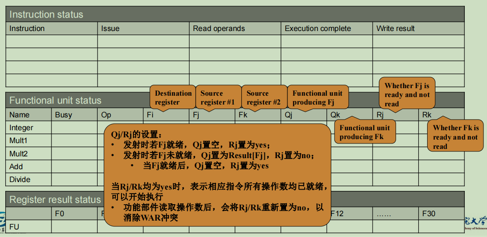
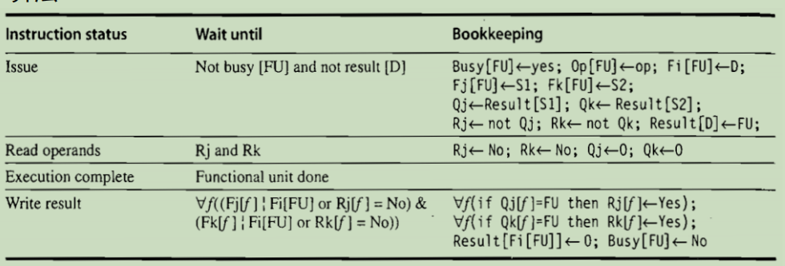

# 动态调度

## 静态调度流水线

- 指令调度
  - 在不改变程序指向结果的前提下，改变指令指向的顺序, 使得相互依赖的指令相隔足够远，从而消除冲突或减少停顿

- 静态调度流水线
  - 完全依赖编译器执行指令调度、硬件完全按照顺序(program order)发射指令的流水线
    - 一旦有指令因资源冲突或数据依赖而停顿，后续指令都不允许发射，即便这些后续指令并不依赖流水线中的任何指令
      - 因此4.1中所讨论的流水线才没有资源冲突、WAR、WAW冲突

- 静态调度流水线存在的问题
  - 对编译器开发人员要求高
  - 一些依赖关系无法在编译时确定
  - 编译器通用性差(CPU相关)
  - 代码通用性差
  - 受Cache miss影响大
    - cache miss 时，会产生大量停顿
    - 编译器无法知道那些load操作会导致cachemiss
  - 动态调度即让CPU硬件能够取代编译器，自动调度指令的运行顺序

## 动态调度流水线

- 允许就绪指令越过前面停顿的指令，率先投入运行(乱序执行)
  - 就绪指令: 不存在资源冲突、操作数已就绪的指令
  - 就绪指令在ID阶段被阻塞(读寄存器等)
- 将ID阶段拆分为两个阶段
  - Issue
    - 对于未拆分前的ID阶段，但精简操作，只执行必要的事: 指令译码、资源冲突检测
      - 按序执行，停顿在此的指令，同样会阻塞后续指令
      - 不再检测检测所有的数据冲突，无论就绪与非就绪的指令，都有机会发射出去
        - WAR、WAW、RAW冲突不全部检测，但也不意味着都不检测
  - Read Operands
    - 等待数据冲突消除，然后读取操作数
      - 这一阶段检测数据冲突检测数据冲突，也是乱序执行实际发生的位置
      - 非就绪指令会停顿在这一阶段，就绪指令会直接发射出去

- 动态调度流水线引入了指令的乱序执行，这将带来WAR冲突，同时，乱序执行隐含着乱序结束，因此也存在WAW冲突，因此在动态调度流水线中，所有类型的冲突都是存在的

## 计分板算法

- 计分板记录所有必要的信息，控制以下事情
  - 每条指令何时可以读取操作数并投入运行（对应着RAW冲突的检测）
  - 每条指令何时可以写入结果（对应着WAR冲突的检测）
- 计分板算法中，WAW冲突在issue阶段检测，因此仍然会导致流水线停顿

### 指令执行阶段

- IF阶段仍然保留，动态调度中，指令仍然时循序发射，即每个时钟周期都有指令尝试发射
  - 当然，尝试发射的前提是IF空闲
  - 如果IF中的指令一直无法进入Issue，则后续指令无法取到(PC值没有变)

- 每条指令经历四个阶段
  - Issue
    - 如果当前指令的所需功能部件空闲，并且其他运行中的指令没有使用相同的目的寄存器，计分板就会将该指令发送到这个功能部件，并且更新计分板内部的数据结构
    - 解决资源冲突，WAW冲突
  - Read operands
    - 计分板监控源操作数的可用性，如果一个源操作数没有任何更早发射的指令将要写，那么这个操作数是可用的
    - 当所有操作数都可用时，计分板告知功能单元继续从寄存器中读取操作数并开始执行
    - 解决RAW冲突
  - Execute
    - 功能但与基于给出的操作数开始运行，当结果准备好时，就告知计分板它已经完成了执行
  - Write result
    - 一旦计分板知道功能单元已经完成了执行，就开始检测WAR冲突，并在有必要时暂停指令的完成

### 数据结构

- Instruction status
  - 记录指令执行的阶段
- Functional unit status
  - 记录功能单元的状态(执行状态及参数)
  - Q记录产生参数F的功能单元
- Register result status
  - 记录结果寄存器状态(对功能单元而言)

### 算法

- wait until
  - 在条件达成之前，指令无法进入此阶段
- Bookkeeping
  - 在进入此阶段后，需要修改的值

### 评价

- 计分板算法没有处理控制冲突，乱序执行仅局限在一个基本块内
- 计分板算法没有消除WAR/WAW冲突，这些冲突仍会导致停顿
  - 计分板算法区分WAR与WAW(书507)
  - 因为只有当寄存器堆中拥有→条指令的两个操作数时，才会读取这些操作数，所以记分卡未能利用转发。只有当寄存器都可用时才会进行读取。这一代价并没有读者最初想象得那么严重。这里与我们前面的简单流水线不同，指令会在完成执行之后立即将结果写入寄存器堆(假定没有 WAR 冒险)，而不是等待可能间隔几个周期的静态指定写入时隙。由于结果的写人和操作数的读取不能重叠，所以仍然会增加一个周期的延迟。我们需要增加缓冲，以消除这一开销

## Tomasulo算法

- Tomasulo算法的核心是寄存器重命名(Register Renaming)
  - 通过重命名彻底消除WAR/WAW冲突

- 消除WAR冲突
  - 指令i发射后将就绪的操作数R1立即取走，并保存在一个临时的存储位置s中
  - 其他指令可以直接写R1，不必停顿
  - 指令i开始执行是，引用临时位置s而不是R1
    - 这就相当于对源操作数寄存器进行了重命名

- 消除WAW冲突
  - 关键思路
    - 重要的是维持正确的dataflow，而不是写入顺序
      - 例如，对于指令序列I、J、K、M、N(数据依赖 j -> i(R3), M/N -> K），只要保证指令J读取的是指令I的结果，指令M/N读取的是指令K的结果，指令I/K的完成顺序并不重要
  - 指令j发送后，不仅立即取走就绪的操作数R1，也为未就绪的操作数R3预留一个临时的存储位置, 并贴上标签<I>，建立起与指令I的关联关系
  - 指令I执行完毕后，将结果一方面写入R3，另一方面写入所有与I相关联的临时存储位置

### 算法简介

- 每个功能部件都有自己的保留站
- 保留站中的每一行保存着一条发射到相关功能部件的指令，并缓存了已就绪的操作数，和未就绪操作数的标签(生成指令所在的保留站行号)
- CDB(Common Data Bus)不仅把结果送到寄存器中，也送到所有正在等待该结果的保留站中
  - 每一个结果会附带一个标签(即生成指令所在的保留站行号)，用来和保留站中的标签相匹配
  - CDB相当于实现了前送功能

- 每条指令的执行经历三个阶段
  - Issue
    - 取出下一条指令，检查资源冲突(即是否还有空闲的保留站)，并在有空闲保留站时，将指令连同就绪的操作数发射到一个空闲的保留站中(对于未就绪的操作数，在保留站中记录生产指令所在的保留站编号)，否则停顿当前及后续指令的发射
  - Execute
    - 监控CDB，等待所有操作数就绪，然后开始执行该指令
      - Load/Store指令的执行分为两个步骤
        - 计算访存地址(各指令按照程序顺序执行此步，放置通过内存发生的数据冲突)
        - 访问内存，或者等待要写入内存的操作数
      - 为保证精确例外，任何指令都必须等待前面的分支指令执行完毕后才能开始执行
  - Write Result
    - 当结果产生后，将其连同标签广播到CDB上，进而写入寄存器文件和所有需要它的保留站和Store Buffer中
      - Store指令在这一阶段访存