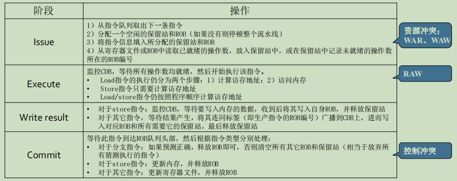

# 分支预测和猜测执行

## 一、算法简介

- 与Tomasulo算法的结构基本相同，区别主要有四点
  - 引入了Reorder Buffer
    - CDB不再直接写寄存器文件，而是写入到ROB中
    - 保留站不仅从寄存器文件中读取源操作数，也从ROB中读取
  - 取消了Store Buffer（其功能改由ROB承担）
    - CDB上的数据标签有变化
    - 生产指令的保留站编号 -> 生产指令的ROB编号
  - 保留站数据结构有变化
    - 需要增加一个字段，记录与之关联的ROB编号，作为将来放置到CDB上的数据标签

**算法四个阶段**

