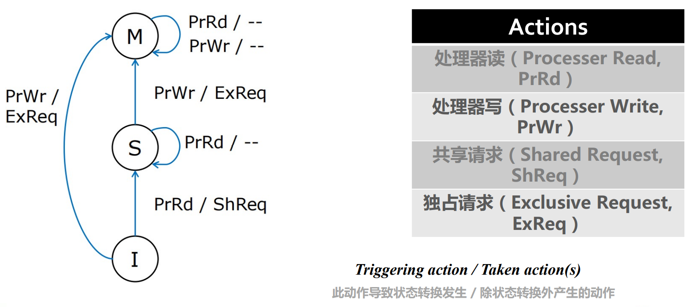
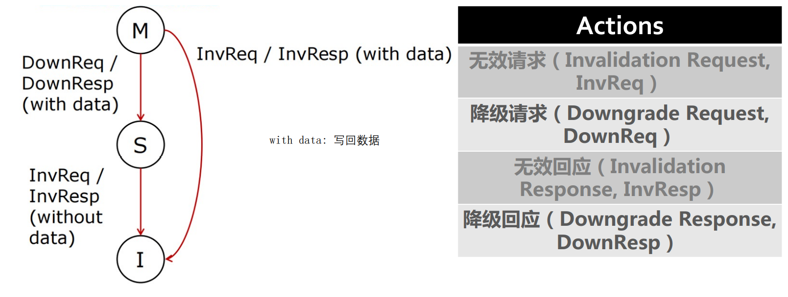
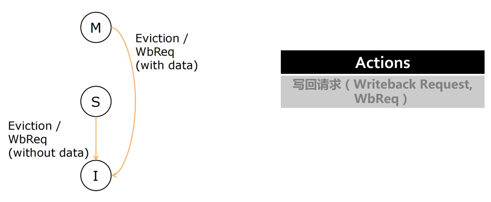
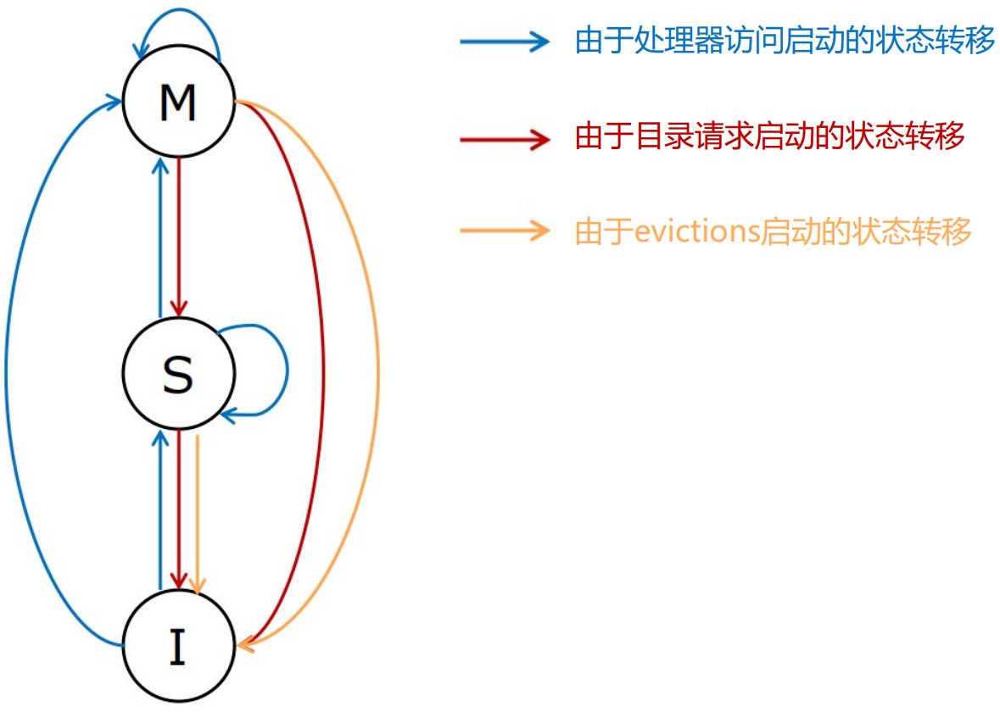
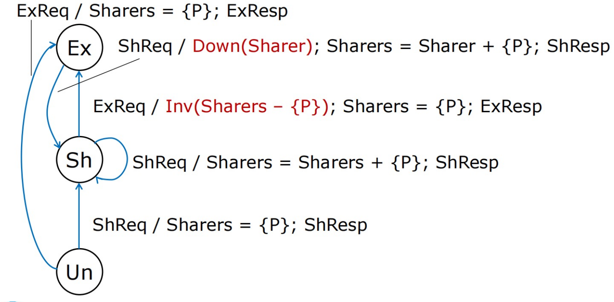
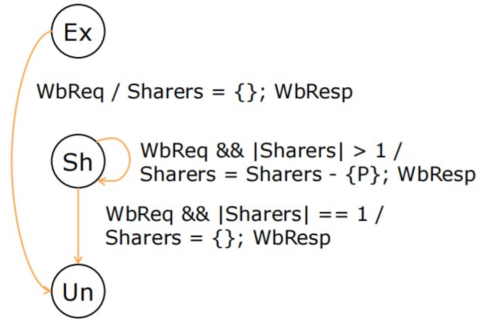

# 基于目录的Cache一致性

## 一、基于目录的协议

**目录协议对于监听协议的改进**

|               监听协议               |                      目录协议                       |
| :----------------------------------: | :-------------------------------------------------: |
|     监听协议通过内存总线广播请求     | 目录协议只向那些可能持有该Cache line的Cache发送消息 |
|    侦听协议难以扩展到大量的处理器    |                可以扩展到大量处理器                 |
| 需要使用额外的带宽缓存侦听请求的标记 |       需要额外的目录存储空间来跟踪可能的共享        |

- 每个存储行对于一个目录项
  - 记录有该存储行副本的处理器
  - 处理器对改行进行写时，根据目录项记录的内容传播数据
  - 只向持有此行的备份的处理器发送信号，避免了广播

### (1) MSI目录协议

- Cache状态: M、S、I
- 目录状态
  - Un: Uncached，所有处理器核都没有副本
  - Sh: Shared, 一个或多个处理器核具有读权限(S)
  - Ex: Exclusive, 只有一个处理器核具有读和写权限(M)

#### Cache状态迁移

**处理器访问产生的状态迁移**

**目录请求产生的状态迁移**

**evictions产生的状态迁移**

**状态迁移图**

#### 目录状态迁移

**数据请求产生的状态迁移**

- store操作会向目录发送 `ExReq`
  - 将 shares 设置为自己
- Sharers: 共享者集合

**写回产生的状态迁移**

