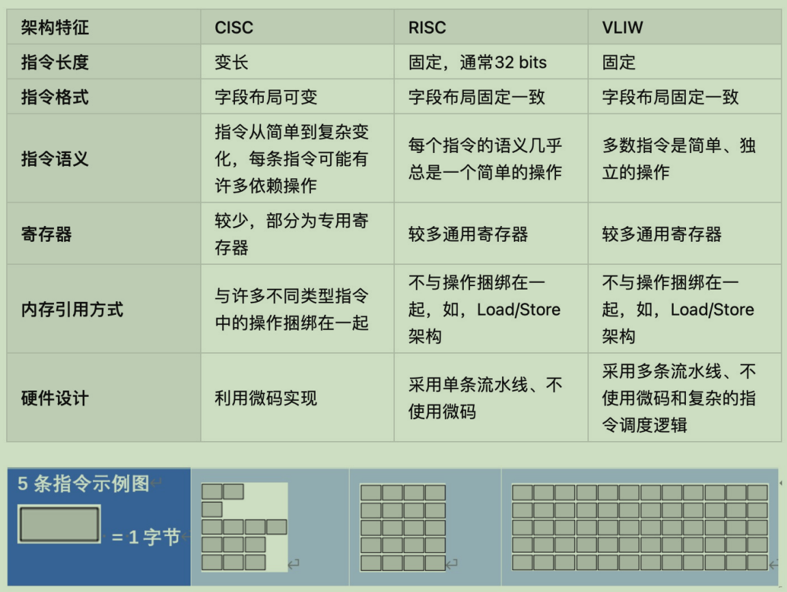

# 微码和VLIW处理器

## 一、微码处理器

- 当前处理器大多都是硬布线设计，通过微架构直接实现ISA中的所有指令
- 而微码处理器增加了一个解释层，每条ISA指令都采用一系列更简单的微指令执行
  - 部署实施更简单
  - 性能低于硬布线

- 现代微处理器中，微程序控制扮演辅助的角色
  - 芯片bug的修复（打补丁），例如Intel处理器在 bootup阶段可装载微代码方式的patches

## 二、超长指令字VLIW处理器

### (1) VLIW的提出

- 提高指令级并行(ILP)的有效方法
  - 流水线、多处理器、超标量处理器、超长指令字VLIW

- VLIW
  - 指的是一种被设计为可以利用指令级并行（ILP）优势的CPU体系结构
  - 由于在一条指令中封装了多个并行操作，其指令的长度比RISC或CISC的指令要长，因此起名为超长指令集

**VLIW与超标量**

<table>
<tbody>

<tr>
<th></th>
<th>VLIM</th>
<th>超标量</th>
</tr>

<tr>
<td align=left>
相同
</td>
<td align=center colspan=2>
一次发射并完成多个操作，提高ILP
</td>
</tr>

<tr>
<td align=left>
不同
</td>
<td align=left>
通过编译器对并发操作进行了编码，这种显式编码极大地降低了硬件的复杂性
</td>
<td align=left>
要复杂逻辑发现指令之间的数据依赖关系，以及乱序执行逻辑和超标量架构来实现多指令的并行发射
</td>
</tr>

</tbody>
</table>

**特点**

- 定长指令，将多个相互无依赖关系的指令封装到一条超长的指令字中
- 每个操作槽（slot）均用于固定的功能
- 每个功能单元的operation都声明了固定的延迟

**VLIM处理器设计原则**

- 架构设计
  - 允许一个指令内多个Operations的并行执行
  - 处理器中需要有有对应数量的ALU单元完成相应的Operations
  - 为所有Operation提供确定性延迟
  - 如果没有数据的interlocks，在指定的延迟之前不允许使用数据
- 编译器
  - 进行依赖性的检查，保证指令内各Operations的并行性
  - 通过编译器调度（重新排序）Operations，以最大限度地提高并行度
  - 通过编译器调度以避免数据竞争（无interlocks）
  - 编译器需要找到N个独立的Operations，不足则插入NO

### (2) VLIW与循环

- 循环展开
  - 如一次循环进行四次迭代
  - 若总循环次数N不是4的倍数，则需在最后一层展开需要编译器的介入执行清理工
- 软件流水线
  - 在循环展开的技术上，加入下次迭代的计算

### (3) VLIW与分支

- 选择一串表示最频繁分支路径的基本块,即追踪轨迹（Trace）
- 一次性调度整个“Trace” 
- 添加修复代码以应对分支跳出Trace
- 使用Prifile或编译器启发式方法查找常见的分支路径（增加编译时间）

### (4) VLIW的优化

**存在的问题**

- 需要确定分支概率
  - 代码分析需要在构建过程中执行一个额外的步骤
- 对静态不可预测的分支进行调度
  - 最佳调度方式会因分支路径而不同，增加编译时间
- 增加了目标代码量
  - 指令填充浪费指令内存/缓存（无法找到彼此独立的Operations
  - 循环展开/软件流水线这些技术需要复制大量代码
  - 分支修复代码，容易导致代码膨胀
- 调度内存操作不可预测
  - 缓存和/或内存访问有时候会带来静态不可预测的memory latency
- 目标代码兼容性
  - 必须为每台机器重新编译所有代码

**VLIW指令编码**

- 减少未使用字段影响的方案
  - 标记并行组
  - 在内存中对指令压缩，在指令执行时在I-cache解压缩
  - 提供单操作的VLIW指令

**ISA对比**

