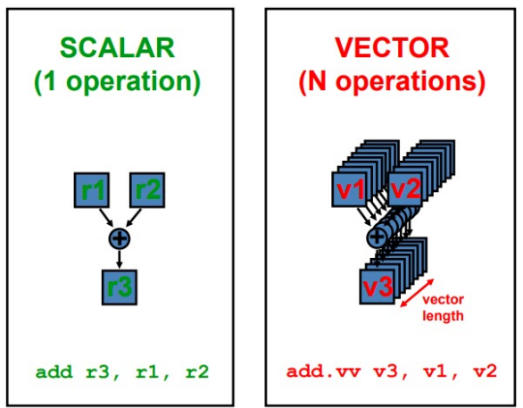
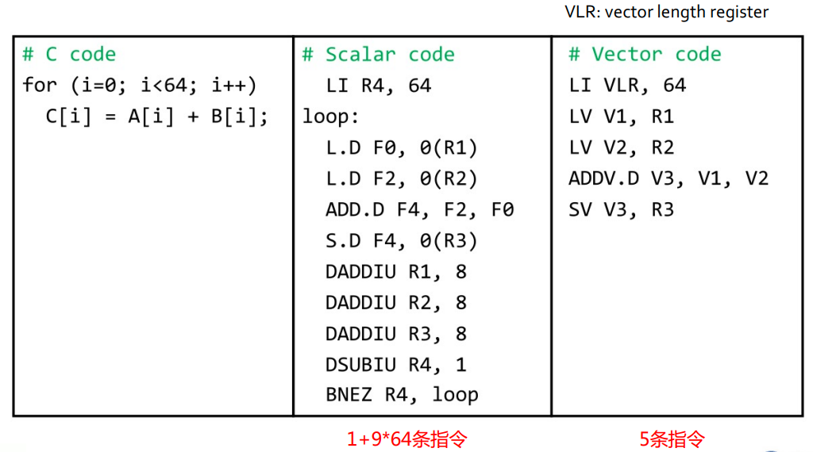
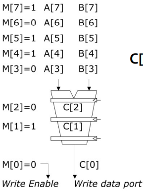
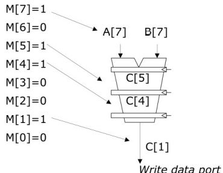

# SIMD和向量处理器

- [SIMD和向量处理器](#simd和向量处理器)
  - [一、数据级并行和SIMD](#一数据级并行和simd)
    - [(1) 传统提高性能方法(IPL)的缺陷](#1-传统提高性能方法ipl的缺陷)
    - [(2) SIMD](#2-simd)
  - [二、向量处理器](#二向量处理器)
    - [(1) 向量处理器结构](#1-向量处理器结构)
    - [(2) 向量指令](#2-向量指令)
      - [向量操作1 Vector Chaining](#向量操作1-vector-chaining)
      - [向量操作2 Masked Vector](#向量操作2-masked-vector)
      - [向量操作3 分段开采](#向量操作3-分段开采)
  - [三、 性能优化](#三-性能优化)
    - [(1) 性能指标](#1-性能指标)
  - [四、小结](#四小结)
    - [(1) Array Processor & Vector Processor](#1-array-processor--vector-processor)
    - [(2) Array Processor & VLIW](#2-array-processor--vliw)
    - [(3) SIMD/Multimedia扩展](#3-simdmultimedia扩展)
    - [(4) 并行的类型](#4-并行的类型)

## 一、数据级并行和SIMD

### (1) 传统提高性能方法(IPL)的缺陷

- 程序内在的并行性
  - 数据依赖性的存在
- 提高流水线的时钟频率
  - 提高时钟频率，有时导致CPI随着增加（branches，other hazards）
- 指令预取和译码
  - 有时在每个时钟周期很难预取和译码多条指令
- 提高Cache命中率
  - 在有些计算量较大的应用（如科学计算）中，需要大量的数据，其局部性较差
  - 有些程序处理的是连续的媒体流（multimedia），其局部性也较差

### (2) SIMD

- SIMD结构可有效地挖掘数据级并行
- SIMD比MIMD更节能
- SIMD允许程序员继续以串行模式思考

## 二、向量处理器

- 向量处理器具有更高层次的操作，一条向量指令可以同时处理N个或N对操作数（处理对象是向量）



### (1) 向量处理器结构

**基本特性**

- 基本思想：两个向量的对应分量进行运算，产生一个结果向量
- 简单的一条向量指令包含了多个操作
  - fewer instruction fetches
- 每一条结果独立于前面的结果
  - 长流水线，编译器保证操作间没有相关性
  - 硬件仅需检测两条向量指令间的相关性
  - 较高的时钟频率
- 向量指令以已知的模式访问存储器
  - 可有效发挥多体交叉存储器的优势
  - 可通过重叠减少存储器操作的延时
    - 例：一个向量包含64个元素
  - 不需要数据Cache（仅使用指令Cache）
- 在流水线控制中减少了控制Hazard

**存储器-存储器型**

> memory-memory vector processors

- 所有的向量操作是存储器到存储器
- 需要更高的存储带宽
- 多个向量操作重叠执行较为困难
- 启动时间很长

**寄存器型**

> vector-register processors

- 除了load和store操作外，所有的操作是向量寄存器和向量寄存器间的操作

**基本组成单元**

- Vector Register：固定长度的一块区域，存放单个向量
  - 至少2个读端口和1个写端口（一般最少16个读端口，8个写端口）
  - 典型的有8-32个向量寄存器，每个寄存器长度为32、64等
- Vector Functional Units (FUs)：全流水化的，每一个clock启动一个新的操作
  - 一般4到8个FUs：FP add，FP mult，FP reciprocal (1/X)，integer add，logical，shift
  - 可能有些重复设置的部件
- Vector Load-Store Units (LSUs)：全流水化地load或store一个向量，可能会配置多个LSU部件
- Scalar registers：存放单个元素用于标量处理或存储地址
- 用交叉开关连接（Cross-bar）FUs， LSUs， registers

**基于编译器的向量化**

- 编译器通过循环依赖分析识别出不相关的独立操作



**向量指令集的优势**

- 格式紧凑
  - 一跳指令包含N个操作
- 表达能力强，一条指令能告诉硬件诸多信息
  - N个操作之间无相关性
  - 使用同样的功能部件
  - 访问不相交的寄存器
  - 与前面的操作以相同模式访问寄存器
  - 访问存储器中的连续块 (unit-stride load/store)
  - 以已知的模式访问存储器 (strided load/store)
- 可扩展性好
  - 支持在多个并行的流水线上运行同样的代码

### (2) 向量指令

#### 向量操作1 Vector Chaining

**Vector Chaining**

- 为解决RAW寄存器依赖延迟大的问题
  - 引入寄存器旁路的向量化版本，向量链接

#### 向量操作2 Masked Vector 

- 对使用条件语句的循环进行矢量化
  - 增加向量掩码(标志)寄存器和可屏蔽向量指令

**简单实现**

执行所有N个操作，根据对应的掩码决定结果是否写回



**密集时间实现**

- 扫描掩码向量，只对应掩码位非零的元素执行操作



**缺陷**

- 简单实现时，条件不满足时向量指令仍然需要花费时间
- 有些向量处理器针对带条件的向量执行时，仅控制向目标寄存器的写操作，可能会有除法错误

#### 向量操作3 分段开采

- Code

```c++
for (i=0; i<N; i++){
    Y[i] = a * X[i] + Y[i];
}
```

- 问题：向量寄存器的长度有限
- 解决：将循环拆解成适合寄存器的片段

**过程**

- vector length register (VLR)
  - 控制特定向量操作的长度，包括向量的load/store
  - 一次操作的向量长度不能大于向量寄存器的长度
-  Max vector length (MVL)
   -  向量寄存器长


## 三、 性能优化

### (1) 性能指标

- Time = f(vector length, data dependencies, struct. Hazards)
- initiation rate
  - 功能部件消耗向量元素的速率
- Convoy
  - 可在同一时钟周期开始执行的指令集合（no structural or data hazards）
- Chime
  - 执行一个convoy所花费的大致时间（approx. time）
- m convoys take m chimes
  - 如果每个向量长度为n, 那么m个convoys 所花费的时间是m个chimes
  - 每个chime所花费的时间是n个clocks，该程序所花费的总时间大约为 m*n clock cycles 
    - 忽略额外开销；当向量长度较长时这种近似是合理的

**Vector Startup**

- 向量启动时间由两部分构成
  - 功能部件延时：一个操作通过功能部件的时间
  - 截止时间或恢复时间（dead time or recovery time）：运行下一条向量指令的间隔时间

**Common Vector Metrics**


## 四、小结

- Vector/SIMD机器适合挖掘数据集并行
  - 同样的操作作用于不同的数据元素
  - 向量内的元素操作独立，可有效提高性能，简化设计
- 性能的提升受限于代码的向量化
  - 标量操作限制了向量机的性能
  - 阿姆达尔定律Amdahl’s Law
- 很多ISA包含SIMD操作指令

### (1) Array Processor & Vector Processor

- Array Processor：又称为并行处理机
  - 核心是一个由多个处理单元构成的阵列
  - 用单一的控制部件来控制多个处理器对各自的数据进行相同的运算和操作

### (2) Array Processor & VLIW

- VLIW：多个独立的操作由编译器封装在一起
  - 提高IPL
- Array Processors
  - 单个操作作用在多个不同的数据元素上

### (3) SIMD/Multimedia扩展

- 在已有ISAs中添加一些向量长度很短的向量操作指令
- 将已有的64-bit寄存器拆分为2*32b、4*16b、8*8b
- 单条指令可实现寄存器中所有向量元素的操作

**Multimedia Extensions vs. Vectors**

- 受限的指令集
- 受限的向量寄存器长度
- 在微处理器设计中向全向量化发展

### (4) 并行的类型

- 指令级并行（ILP）
  - 以并行方式执行某个指令流中的独立无关的指令
  - pipeline，superscalar，VLIW
- 数据级并行（DLP）
  - 以并行方式执行多个相同类型的操作（vector/SIMD execution）
  - Array Processor、Vector Processor
- 线程级并行（TLP）
  - 以并行方式执行多个独立的指令流（multithreading，multiple cores）