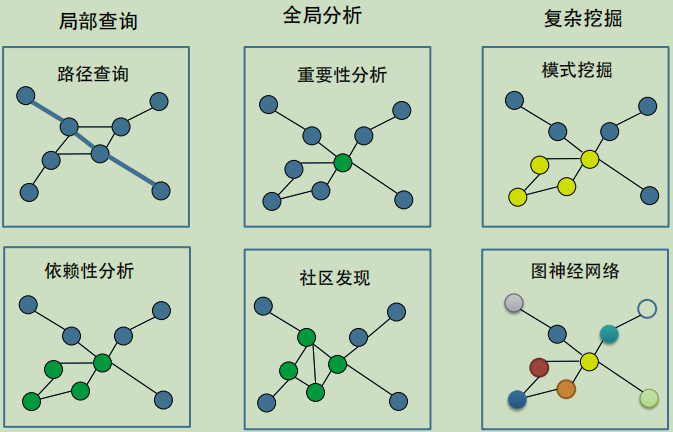
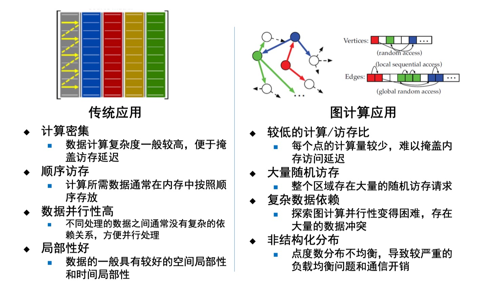

# 硬件加速器

- 加速器是面向特定领域、针对有限算法定制设计的专用计算架构，其目的是提升特定计算的性能或减少功耗需求

## 一、图计算加速器

**图计算的常见查询和分析**

**图计算对比传统应用**

### (1) 图计算面临的挑战

- 负载不规则
- 遍历不规则

**传统CPU面临的问题**

- Cache, TLB 和分支预测命中率低
- 带宽利用率低
- 流水线停顿长

**传统GPU面临的问题**

- Memory/branch divergence严重
- SIMD利用效率低

### (2) 图计算加速器设计

**要点**

- 图数据海量性和加速器资源的有限性之间的不适配
  - 对图书角预处理使其能够被加载到加速器进行处理
- 图拓扑结构的非规则性和传统处理架构的通用性的不适配
  - 对图计算并行性进行抽象来设计高并发流水
- 上层应用并行表达与细粒度底层并行性之间不适配
  - 底层加速器资源潜力和上层图应用之间的鸿沟导致加速器硬件能力并不能直接转化为性能上的提高

### (3) 图加速生态体系

- 预处理、高效能处理架构设计、运行时调度、加速器评测、用户使用

#### 图数据预处理

- 图划分
  - 将原始图划分为互不相邻的子图进行并行处理
    - 考虑图数据的局部性
    - 根据加速器存储架构进行划分
    - 根据划分设计响应的执行模式
- 图数据重排序
  - 图数据排序对点和边在存储空间上的位置进行了规定

#### 高能效加速架构设计

- 设计高并发编程模型
  - 对点或边的相同处理模式进行探索，尽可能分离图计算中的相关依赖
- 高效流水结构和内存子系统
  - 利用不同硬件平台设计面向图计 算的内存子系统和处理流水，充分探索新兴器件特性
- 加速器性能优化
  - 对加速器设计进一步优化提升图计算的并行性，优化访存和能耗等

**模型选择**

<table>
<tbody>

<tr>
<th></th>
<th>以点为中心的编程模型</th>
<th>以边为中心的编程模型</th>
</tr>

<tr>
<td align=left>
优势
</td>
<td align=center>
能够容易的表示大多数算法 
点处理的并行性较高 
</td>
<td align=center>
可以表示多种图算法 
对边的访问是顺序的 
</td>
</tr>

<tr>
<td align=left>
劣势
</td>
<td align=center>
存在对边的大量随机访问 
数据冲突频繁 
</td>
<td align=center>
存在对点的大量随机访问 
存在边的冗余计算 
</td>
</tr>

</tbody>
</table>

#### 运行时调度

- 应用感知的异构平台任务调度方法
- 结构感知的异构平台任务调度方法

#### 图加速器评测

#### 用户使用
