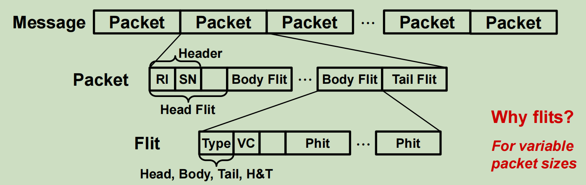

# 片上互联网络

- [片上互联网络](#片上互联网络)
  - [基础](#基础)
    - [网络拓扑特性](#网络拓扑特性)
    - [传输数据](#传输数据)
    - [路由算法](#路由算法)
    - [流量控制](#流量控制)
  - [拓扑](#拓扑)
    - [环网](#环网)
    - [MESH](#mesh)
  - [路由器](#路由器)
    - [虚通道路由器](#虚通道路由器)
## 基础
### 网络拓扑特性

- 网络直径(Diameter)
- 路由距离(Routing Distance)
- 平均距离(Average Distance)
- 网络分割(Partition)
- 等分带宽(Bisection Bandwidth)

### 传输数据

- Message
  - Packet：路由与顺序化的基础单元，大小在 64b - 64KB
    - Flit(flow control digit)：带宽/存储分片的最小单元，同一个packet中的Flit使用相同的路由，使用Flit以适应可变的Packet大小
      - Phit(physical transfer digit)：单个时钟内传输的数据

### 路由算法

- 选择一条数据包从源节点到目的节点的传输路径

- 路由算法分类
  - 确定性/显示路由
    - 路由由 源节点 和 目的节点决定，不依赖网络中的流量状态
  - 自适应路由
    - 依据网络中的流量状态动态改变
- 最短路径
- 无死锁
  - 在任何网络通信流量模式下，都不会出现数据包无法向前传输的情况

### 流量控制

- 在数据包传输的过程中，进行相关资源(缓冲区、传输链路、控制状态)分配的方法

- 虫洞流控
  - 路由器以 Flits 为单位来进行缓冲区管理
  - 解析包头后，只要输出链路可用，就立即传输
  - 发生拥塞时，一个数据包的 Flits 可能会跨路由地存储在路径的缓冲区内
    - 分配给该数据包的链路被占用，阻碍同一链路上的其他数据包传输
- 虚通道流控
  - 数据包堵塞时，Flits存储在虚通道而不是通道上
    - 理解为有多个输入缓存(对应于多个数据包) -> 多条虚通道

## 拓扑

### 环网

- 通过一个环，相互连接

### MESH

- 全互联

## 路由器

- 路由器本身也是一个数字系统
  - 逻辑：状态机、仲裁器、分配器
    - 控制 数据包 在 路由器内 的传输过程
    - 状态：空闲、路由、等待资源、激活
  - 存储器：缓冲区
    - 存储转发前的 Flits
    - 实现: SRAMs, 寄存器，处理器内存
  - 传输器：开关
    - 把 Flits 从输入端口传递到输出端口

### 虚通道路由器

- 主要部件
  - 输入缓冲区
    - 大多数片上网络路由器采用输入缓存结构(采用单端口内存实现输入缓冲区)
    - 存储路由时间内的 Flits
  - 路由计算逻辑
  - 虚通道分配器
  - 开关分配器
  - 交叉开关

- 路由器流水线
