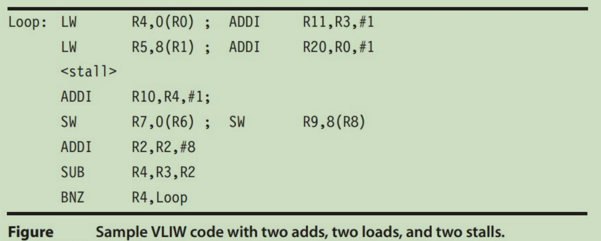
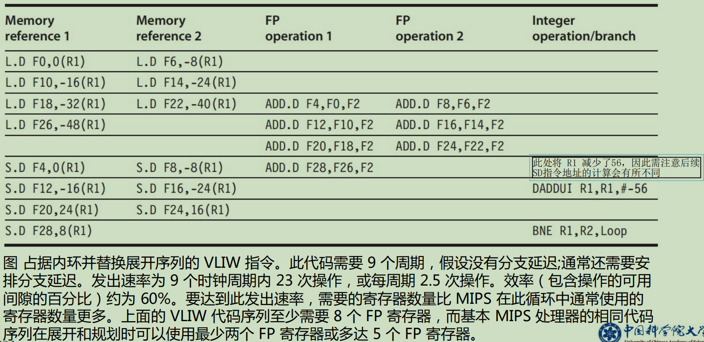

# 作业与习题

- [作业与习题](#作业与习题)
  - [指令与流水线冲突](#指令与流水线冲突)
    - [一](#一)
      - [answer](#answer)
    - [二](#二)
    - [三](#三)
  - [动态调度](#动态调度)
    - [一](#一-1)
  - [集中式共享Cache一致性](#集中式共享cache一致性)
    - [一](#一-2)
  - [基于目录Cache一致性](#基于目录cache一致性)
    - [一](#一-3)
    - [二](#二-1)
  - [VLIW超长指令字](#vliw超长指令字)
    - [一](#一-4)
    - [二](#二-2)
  - [GPU体系结构](#gpu体系结构)
    - [一](#一-5)

## 指令与流水线冲突

### 一

- Use the following code fragment:

```s
Loop: 
  LD R1, 0(R2) ; load R1 from address 0+R2
  DADDI R1, R1, #1 ; R1=R1+1
  SD R1, 0(R2) ; store R1 at address 0+R2
  DADDI R2, R2, #4 ; R2=R2+4
  DSUB R4, R3, R2 ; R4=R3-R2
  BNEZ R4, Loop ; branch to Loop if R4!=0
```
- Assume that the initial value of R3 is R2+396.
  - a) Data hazards are caused by data dependences in the code. Whether a dependency causes a hazard depends on the machine implementation (i.e. number of pipeline stages). List all of the data dependences in the code above. Record the register, source instruction, and destination instruction; for example, there is a data dependency for register R1 from the LD to the DADDI.
  - b) Show the timing of this instruction sequence for the 5-stage RISC pipeline without any forwarding or bypassing hardware but assuming that a register read and a write in the same clock cycle “forwards” through the register file, as shown in Figure C.6. Use a pipeline timing chart like that in Figure C.5. Assume that the branch is handled by flushing the pipeline. If all memory references take 1 cycle, how many cycles does this loop take to execute?
  - c) Show the timing of this instruction sequence for the 5-stage RISC pipeline with full forwarding and bypassing hardware. Use a pipeline timing chart like that shown in Figure C.5. Assume that the branch is handled by flushing the pipeline. If all memory references take 1 cycle, how many cycles does this loop take to execute?

#### answer

- a)

R1 LD DADDI // 数据相关
R1 DADDI SD // 数据相关
R2 LD DADDI // 名称相关
R2 SD DADDI // 名称相关
R2 DSUB DADDI #R2 DADDI DSUB // 数据依赖
R4 BNEZ DSUB #R4 DSUB BNEZ // 数据依赖

- b)

> 意味着WB与ID可以进行数据流动
> 没有分支预测的前提下，必须再EX阶段后，才能判断之后的指令能否执行

|                  | 1   | 2   | 3     | 4     | 5   | 6     | 7     | 8   | 9   | 10    | 11    | 12  | 13    | 14    | 15  | 16  | 17  | 18  | 19  | 20  | 21  |     |     |     |     |     |
| ---------------- | --- | --- | ----- | ----- | --- | ----- | ----- | --- | --- | ----- | ----- | --- | ----- | ----- | --- | --- | --- | --- | --- | --- | --- | --- | --- | --- | --- | --- | --- |
| LD R1, 0(R2)     | IF  | ID  | EX    | MEM   | WB  |       |       |     |     |       |       |     |       |       |     |     |     |     |     |     |     |     |     |     |     |     |     |
| DADDI R1, R1, #1 |     | IF  | stall | stall | ID  | EX    | MEM   | WB  |     |       |       |     |       |       |     |     |     |     |     |     |     |     |     |     |     |     |     |
| SD R1, 0(R2)     |     |     |       |       | IF  | stall | stall | ID  | EX  | MEM   | WB    |     |       |       |     |     |     |     |     |     |     |     |     |     |     |     |     |
| DADDI R2, R2, #4 |     |     |       |       |     |       |       | IF  | ID  | EX    | MEM   | WB  |       |       |     |     |     |     |     |     |     |     |     |     |     |     |     |
| DSUB R4, R3, R2  |     |     |       |       |     |       |       |     | IF  | stall | stall | ID  | EX    | MEM   | WB  |     |     |     |     |     |     |     |     |     |     |     |     |
| R4 DSUB BNEZ     |     |     |       |       |     |       |       |     |     |       |       | IF  | stall | stall | ID  | EX  | MEM | WB  |     |     |     |     |     |     |     |
| LD R1, 0(R2)     |     |     |       |       |     |       |       |     |     |       |       |     |       |       |     |     | IF  | ID  | EX  | MEM | WB  |     |     |     |     |


- 一共循环 396/4 = 99 次
- 总时钟周期 = 16 * 98 + 18 = 1586 
  - 第一次18c，之后每迭代一次增加16
  - 每次加16，最后一次加18c

- c)

> 旁路可以将当前部件执行的结果直接输入之部件的输入中
> LD必须等待MEM完成才有结果
> 基于冲刷的分支处理，在ID阶段进行分支的处理

|                  | 1   | 2   | 3   | 4     | 5   | 6   | 7   | 8     | 9   | 10  | 11  | 12  | 13  | 14  | 15  | 16  | 17  | 18  | 19  | 20  | 21  |     |     |     |     |     |
| ---------------- | --- | --- | --- | ----- | --- | --- | --- | ----- | --- | --- | --- | --- | --- | --- | --- | --- | --- | --- | --- | --- | --- | --- | --- | --- | --- | --- | --- |
| LD R1, 0(R2)     | IF  | ID  | EX  | MEM   | WB  |     |     |       |     |     |     |     |     |     |     |     |     |     |     |     |     |     |     |     |     |     |     |
| DADDI R1, R1, #1 |     | IF  | ID  | stall | EX  | MEM | WB  |       |     |     |     |     |     |     |     |     |     |     |     |     |     |     |     |     |     |     |     |
| SD R1, 0(R2)     |     |     | IF  | stall | ID  | EX  | MEM | WB    |     |     |     |     |     |     |     |     |     |     |     |     |     |     |     |     |     |     |
| DADDI R2, R2, #4 |     |     |     |       | IF  | ID  | EX  | MEM   | WB  |     |     |     |     |     |     |     |     |     |     |     |     |     |     |     |
| DSUB R4, R3, R2  |     |     |     |       |     | IF  | ID  | EX    | MEM | WB  |     |     |     |     |     |     |     |     |     |     |     |     |
| R4 DSUB BNEZ     |     |     |     |       |     |     | IF  | stall | ID  | EX  | MEM | WB  |     |     |     |     |     |     |     |
| Flush            |     |     |     |       |     |     |     |       | IF  | x   | x   | x   | x   |     |     |     |     |     |     |     |
| LD R1, 0(R2)     |     |     |     |       |     |     |     |       |     | IF  | ID  | EX  | MEM | WB  |     |     |     |     |

- 总时钟周期 = 9*98 + 12 = 9=894
  - 最后一次为12个周期

### 二

- Suppose the branch frequencies (as percentages of all instructions) are as follows:
  - Conditional branches: 15%
  - Jumps and calls 1%
  - Taken conditional branches 60% are taken
- a) We are examining a four-deep pipeline where the branch is resolved at the end of the second cycle for unconditional branches and at the end of the third cycle for conditional branches. Assuming that only the first pipe stage can always be done independent of whether the branch goes and ignoring other pipeline stalls, how much faster would the machine be without any branch hazards?
- b) Now assume a high-performance processor in which we have a 15-deep pipeline where the branch is resolved at the end of the fifth cycle for unconditional branches and at the end of the tenth cycle for conditional branches. Assuming that only the first pipe stage can always be done independent of whether the branch goes and ignoring other pipeline stalls, how much faster would the machine be without any branch hazards?

### 三

- We begin with a computer implemented in single-cycle implementation. When that stages are split by functionality, the stages do not require exactly the same amount of time. The original machine had a clock cycle time of 7ns. After the stages are split, the measured times were IF, 1ns; ID, 1.5ns; EX, 1ns; MEM, 2ns; and WB, 1.5ns. The pipeline register delay is 0.1ns.
- a) What is the clock cycle time of the 5-stage pipelined machine?
- b) If there is a stall every 4 instructions, what is the CPI of the new machine?
- c) What is the speedup of the pipelined machine over the single-cycle machine?
- d) If the pipelined machine had an infinite number of stages, what would its speedup be over the single-cycle machine

## 动态调度

### 一

- It is critical that the scoreboard be able to distinguish RAW and WAR hazards, because a WAR hazard requires stalling the instruction doing the writing until the instruction reading an operand initiates execution, but a RAW hazard requires delaying the reading instruction until the writing instruction finishes——just the opposite. For example, consider the sequence:

```s
MUL.D F0, F6, F4
DSUB.D F8, F0, F2
ADD.D F2, F10, F2
```

- The DSUB.D depends on the MUL.D (a RAW hazard), thus the MUL.D must be allowed to complete before the DSUB.D. If the MUL.D were stalled for the DSUB.D due to the inability to distinguish between RAW and WAR hazards, the processor will deadlock. This sequence contains a WAR hazard between the ADD.D and the DSUB.D, and the ADD.D cannot be allowed to complete until the DSUB.D begins execution. The difficulty lies in distinguishing the RAW hazard between MUL.D and DSUB.D, and the WAR hazard between the DSUB.D and ADD.D. To see just why the three-instruction scenario is important, trace the handling of each instruction stage by stage through issue, read operands, execute, and write result. Assume that each scoreboard stage other than execute takes 1 clock cycle. Assume that the MUL.D instruction requires 3 clock cycles to execute and that the DSUB.D and ADD.D instructions each take 1 cycle to execute.Finally, assume that the processor has two multiply function units and two add function units. Present the trace as follows
- a) Make a table with the column headings Instruction, Issue, Read Operands, Execute, Write Result, and Comment. In the first column, list the instructions in program order (be generous with space between instructions; larger table cells will better hold the results of your analysis). Start the table by writing a 1 in the Issue column of the MUL.D instruction row to show that MUL.D completes the issue stage in clock cycle 1. Now fill in the stage columns of the table through the cycle at which the scoreboard first stalls an instruction.
- b) For a stalled instruction write the words “waiting at clock cycle X”, where X is the number of the current clock cycle, in the appropriate table column to show that the scoreboard is resolving an RAW or WAR hazard by stalling that stage. In the Comment column, state what type of hazard and what dependent instruction is causing the wait.
- c) Adding the words “completes with clock cycle Y” to a “waiting” table entry, fill in the rest of the table through the time when all instructions are complete. For an instruction that stalled, add a description in the Comments column telling why the wait ended when it did and how deadlock was avoided. (Hint: Think about how WAW hazards are prevented and what this implies about active instruction sequences.) Note the completion order of the three instruction as compared to their program order

## 集中式共享Cache一致性

### 一

- 假设在一个双CPU多处理器系统中，两个CPU用单总线连接，并且采用监听一致性协议（MSI），cache的初始状态均为无效，然后两个CPU对内存中同一块数据进行如下操作：CPU A读、CPU A写、CPU B写、CPU A读，写出每次访问后两个CPU各自的cache的状态变化

|   事件   | A状态 | B状态 |
| :------: | :---: | :---: |
| 初始状态 |   I   |   I   |
| CPU A读  |   S   |   I   |
| CPU A写  |   M   |   I   |
| CPU B写  |   I   |   M   |
| CPU A读  |   S   |   S   |

## 基于目录Cache一致性

### 一

- 在基于目录的Cache一致性系统中，目录记载了P1处理器已经有数据块A的备份
  - （1）在哪些情况下，目录又会收到一个P1对A块访问的请求
  - （2）如何正确处理上述情况？

### 二

- A、B、C、D为进程P1，P2，P3的共享变量，且初始值均为0，该程序执行结果为D=2000，在基于目录的Cache一致性系统中，运行结果是D=0，请解释原因

|   P1   |       P2       |       P3       |
| :----: | :------------: | :------------: |
| A=2000 | while(B!=1){;} | while(C!=1){;} |
|  B=1   |      C=1       |      D=A       |

## VLIW超长指令字

### 一

- 超长指令字 （VLIW） 设计人员在寄存器使用的体系结构规则方面需要做出一些基本选择。假设 VLIW 设计了自耗尽的执行流水线：一旦启动了操作，其结果将在以后最多 L 个周期出现在目标寄存器中（其中 L 是操作的延迟）。寄存器是永远不够用的，因此希望从现有寄存器中得到最大使用率。请考虑下图。如果负载具有 1 + 2 个周期的延迟，请展开此循环一次，并显示在 没有任何流水线中断或停顿的情况下，每个周期能够进行两次加载和两次添加的 VLIW 如何使用最小数量的寄存器。在存在自耗尽流水线的时，说明一种可能会破坏流水线并产生错误的结果的情况。



### 二

- 假设一个 VLIW 处理器的指令包含五个操作，如图所示。我们将比较两个循环展开的程度。首先，展开循环 6 次以获取并规划ILP，使其没有任何stall（即完全空的事件周期），折叠循环开销指令。并重复该方法但展开循环10 次。忽略分支延迟间隙。写出两个规划。每个规划的结果向量的每个元素的执行时间是多少？每个规划中使用的操作间隙的百分比是多少？两个规
划之间的代码大小有多大差异？这两个规划的总寄存器需求是多少？



## GPU体系结构

### 一

- 假定有一种包含10个 SlMD 处理器的 GPU 体系结构。每条 SIMD 指令的宽度为32，每个SIMD 处理器包含8个车道（lane）,用于执行单精度运算和载入/存储指令，也就是说，每个非分岔 SIMD 指令每4个时钟周期可以生成32个结果。假定内核的分岔分支将导致平均80%的线程为活动的。假定在所执行的全部 SIMD 指令中，70%为单精度运算、20%为载入/ 存储。由于并不包含所有存储器延迟，所以假定 SIMD 指令平均发射率为0.85。假定 GPU 的时钟速度为1.5 GHZ
- a. 计算这个内核在这个GPU上的吞吐量,单位为GFLOP/S
- b. 假定我们有以下选项
  1. 将单精度车道数增大至16
  2. 将SIMD处理器数增大至15 (假定这一改变不会影响所有其他性能度量,代码会扩展到增加的处理器上)
  3. 添加缓存可以有效地将存储器延迟缩减40%，这样会将指令发射率增加至0.95，对于这些改进中的每一项
  - 吞吐量的加速比为多少