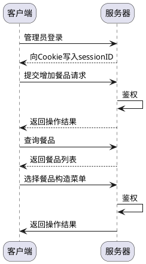
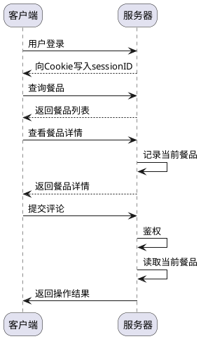

## 数据库设计

- [数据库设计](#数据库设计)
  - [E-R图](#e-r图)
  - [数据表设计](#数据表设计)
  - [数据库选型](#数据库选型)
  - [测试流程](#测试流程)

### E-R图

- 菜品
  - 属性
    - id
    - 名字
    - 描述
    - 价格

```platuml
@startuml

entity "菜品" as e01{
  * id: uuid
  --
  * 菜品名称: string
  * 菜品价格: float
  * 菜品类型: string (荤/素/主食)
    描述: string
    菜品图片: string (图片id)
  --
  * 创建日期: timestamp 
  * 更新日期: timestamp
  * 删除日期: timestamp
}

entity "菜单" as e02{
  * id: uuid
  --
  * 菜单名称: string
  * 供应地点: string (主餐区/面点区/盖饭区/水果区)
  * 供应时间: string (早餐/中餐/晚餐/不限)
    描述: string
  --
  * 创建日期: timestamp 
  * 更新日期: timestamp
  * 删除日期: timestamp
}

entity "用户" as e03 {
  * id: uuid
  --
  * 用户名: string
  * 权限: int (普通/管理员)
  * 密码: string (管理员必选)
  --
  * 创建日期: timestamp 
  * 更新日期: timestamp
  * 删除日期: timestamp
}

entity "订单" as e04 {
  * id: uuid
  --
  * 订单名称: string 
  * 用户ID: uuid
  * 状态: int (创建/结算/取消/终止)
  * 总金额: float
  --
  * 创建日期: timestamp 
  * 更新日期: timestamp
  * 删除日期: timestamp
}

entity "评价" as e05 {
  * id: uuid
  --
  * 用户ID: uuid
  * 用户名: string
  * 菜品ID: uuid
  * 菜品名: string
  * 评星: int (1-5)
    评论内容: string
  * 有效性: int (0/1)
  --
  * 创建日期: timestamp 
  * 更新日期: timestamp
  * 删除日期: timestamp
}

e01 }|--|{ e02
e04 }|--|| e03
e01 }|--|{ e04
e05 }|--left|| e03
e05 }|--|| e01


@enduml

```


### 数据表设计

**菜品表**


**菜单表**


**用户表**


**订单表**


**评价表**


### 数据库选型

- mariadb
  - 版本:

- redis
  - 版本:

### 测试流程






