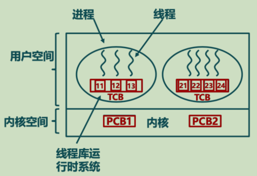
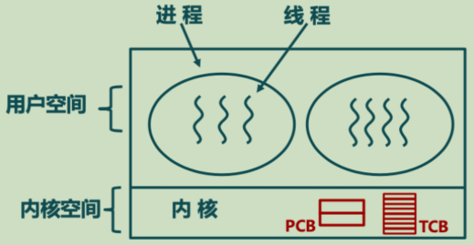
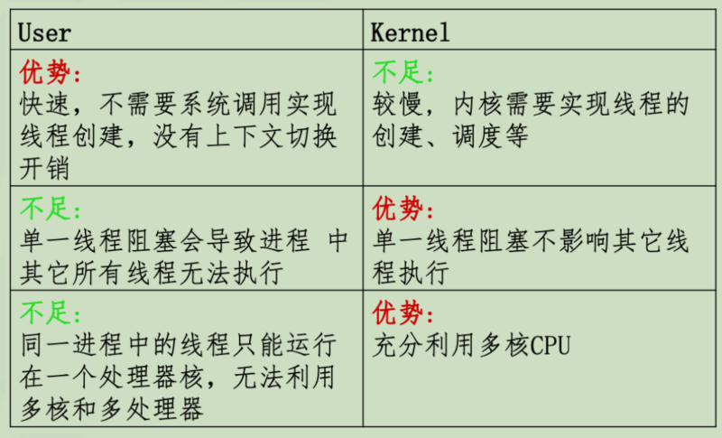
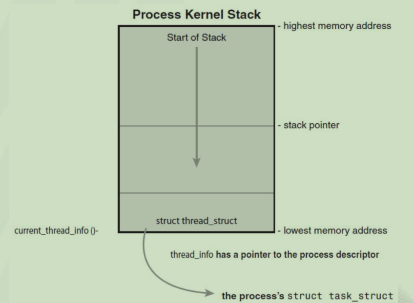

# 进程与线程

- [进程与线程](#进程与线程)
  - [进程](#进程)
    - [虚拟机制](#虚拟机制)
    - [进程的内涵与外延](#进程的内涵与外延)
    - [进程管理](#进程管理)
  - [线程](#线程)
    - [线程控制块TCB](#线程控制块tcb)
    - [线程设计模型](#线程设计模型)
    - [线程实现机制](#线程实现机制)
    - [线程池](#线程池)
  - [Linux线程](#linux线程)
    - [数据结构](#数据结构)
    - [线程的实现](#线程的实现)

## 进程

- 单道编程: 同一时刻只有一个线程
- 多道编程: 同一时刻有多个执行线程
  - 虚拟(virtual machine abstraction)
  - 并发(concurrency)
  - 共享(protection)
  - 异步(coordination)
- 通过进程实现
  - 多道并发、隔离保护、资源共享、调度协作

- 程序和进程
  - 进程大于程序: 进程不只有代码和数据
  - 程序大于进程: 一个程序可能有多个同时执行的进程
  - 进程大于程序: 一个进程可以运行多个程序

### 虚拟机制

- CPU虚拟
  - 通过上下文(context)环境实现对CPU的虚拟
- 内存虚拟
  - 通过地址空间(Address)机制实现对内存系统的虚拟

### 进程的内涵与外延

- 进程是一种操作系统对于执行的抽象
  - 执行的实体
  - 系统调度的单位(实际是线程)
  - 程序的动态执行上下文
- 程序执行的实体
  - Register: PC, GPR, FPR
    - 程序指针寄存器，通用整数寄存器，标志寄存器
  - Memory:code, data, stack, heap
- 资源分配的载体
  - 拥有独立的地址空间: memory(address space), file descriptors, file system context
  - 拥有独立I/O状态: file descriptor table, network sockets
- 程序协调的机制
  - 进程间通信IPC、pipe、socket

### 进程管理

- 进程在内存中的表示：PCB，进程队列
  - PCB: 记录进程状态、机器状态(Register,TLB)、调度与统计信息、内存管理信息、I/O
    - Linux中每一个进程都由task_struct数据结构来定义，调用fork()创建进程时，就会产生一个task_struct结构
- 进程管理: 生命周期、状态变迁

## 线程

- 分离进程与进程的执行状态
  - 进程是资源分配的主体，基于进程进行地址空间、内存和I/O的分配
  - 线程是指令执行的主体，基于线程管理CPU机器状态、栈执行环境等
- 线程是基本的执行单元，进程实际是线程执行的容器

- 共享部分: 同一进程的所有线程可见
  - 内存状态（全局变量、堆）
  - I/O状态（文件系统、网络连接状态等）
- 私有部分: 线程私有的机器状态
  - 程序执行指针(pc, eip寄存器)
  - 其他CPU相关寄存器
  - 线程执行环境栈: 函数调用参数、临时变量、返回PC
  - 线程ID、信号掩码、errno变量
    - errno: 全局错误码，记录系统调用时的错误
- 资源回收
  - 线程只回收栈
  - 进程回收所有资源
- 线程并发性

### 线程控制块TCB

- 构成
  - 状态
  - PC、寄存器
  - 执行栈

### 线程设计模型

- 内核调度线程的两种基本方法
  - 内核知道进程中的所有线程，并进行调度
  - 内核不知道线程的存在，将线程视作普通进程进行管理，利用用户态的调度器来调度每个进程中的多个线程

### 线程实现机制

- 用户态线程
  - 使用一组用户态的线程库函数来完成线程的管理(run-time system)
    - 创建、终止、同步、调度
    - 没有内核的接入，内核只看到一个执行的实体
  - 对内核透明
    - 线程由进程中的PC、寄存器、栈和TCB来表示
    - 所有线程操作通过用户台的过程调用完成
    - 操作速度是内核态线程 100 x
  - 线程调度
    - 线程在一个进程中
      - run-time system 负责进行 TCB 信息的load/store
    - 线程在不同进程中
      - OS进行进程切换操作
      - 操作系统完成 PCB 与 TCB 的 load/store
  - 问题
    - 阻塞的系统调用会阻塞整个进程
    - 无法很好地与OS进行交互与基础
    - 操作系统可能称为性能瓶颈

- 内核态线程
  - 内核提供线程支持
    - 线程管理操作完全由内核完成
    - 线程是基本的调度单元
  - 线程调度
    - 不再调度PCB
    - 如果一个线程阻塞，内核可以调度同一进程中的其他线程执行
  - 问题
    - 速度慢，需要陷入内核，同时内核需要维护更多的数据结构

- 同时使用用户态和内核台线程
  - 如 JVM
  - 线程库必须将用户态线程映射至内核态
  - 权衡
    - 内核态线程
      - 物理上并行度
    - 用户态线程
      - 应用级并行度

**映射模型**

|       |                          |                     优势                      |                           不足                           |
| :---: | :----------------------: | :-------------------------------------------: | :------------------------------------------------------: |
|  N:1  |  常用于用户态线程的实现  | 开销小:无需系统调用;可移植性高:不依赖系统设计 |      线程执行不能并行化，一个线程等待会阻塞整个进程      |
|  1:1  |  常用于内核态线程的实现  |                 更高的并行度                  | 开销大: 过多内核线程、线程操作设计内核、线程占用内核资源 |
|  M:N  | bsd与windows一些版本实现 | 灵活性高:利用多核并行，同时也能实现应用级并行 |                       实现过于复杂                       |

- 基本所有现代操作系统都采用了内核态线程模型
  - 一般而言，用户使用 pthread 创建的线程，会映射到一个内核线程，也就是 1:1 模型
  - NPTL (NATIVE POSIX Thread Library) 所实现的，也是 1:1 模型
 

### 线程池

- 线程池
  - 预先创建一定数量的线程，等待服务
  - 用户请求到达时，唤醒线程
  - 请求结束时，线程不退出，而是放回线程池
  - 需要设置线程池的容量

## Linux线程

### 数据结构

- task_struct、thread_info 与 stack
  - task_struct
    - Linux中的进程描述符(process descriptor) 是 tack_struct
    - linux中的线程与进程，都使用 task_struct 来进行描述
  - thread_info
    - 一个与进程描述符相关的小数据结构，与进程的内核态栈stack存放在一个单独为进程分配的内存区域中
      - 这个区域以 Thread_Size 对齐
    - thread_info 存放在这片区域的最低位置
      - 即，如果知道 stack 的地址，将地址 低N位($2^{N} = Thread\_Size$)置0就可以得到 thread_info 地址
  - stack
  - 关系网: thread_info -> task_struct -> stack -> thread_info
    - 知道其中的一个，很容易知道另外两个
- [参考](https://www.cnblogs.com/yanghaizhou/p/7705520.html)

### 线程的实现

- 所有线程作为标准进程实现
  - 线程仅仅是一个与其他进程共享资源的进程
  - 每个线程有一个唯一的task_struct结构
- 内核线程
  - 在后台进行特定操作的线程，可以被调度和抢占
  - 内核线程没有自己的地址空间，只运行在内核态

- posix线程
  - Portable Operating System Interface
- pthread
  - 定义了一组C语言的数据结构，函数和约束
  - 头文件 pthread.h
  - 库 libpthread.so

- Linux线程演化
  - Linux Threads -> NPTL
