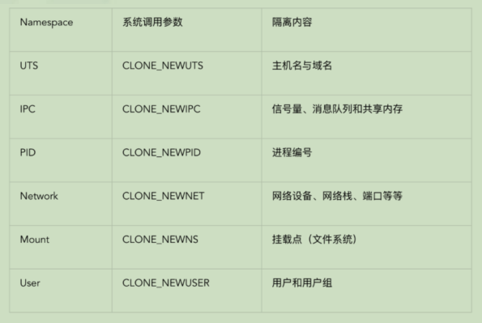
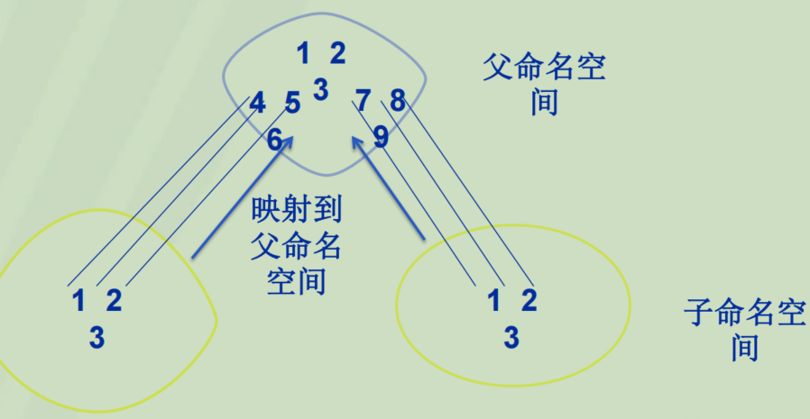
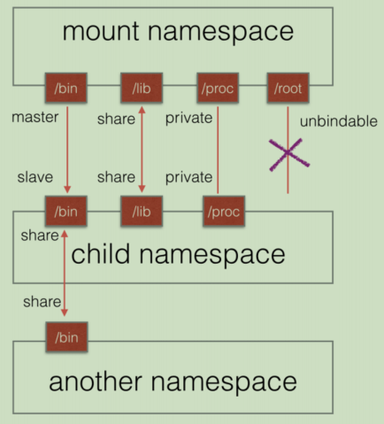

# 内核进程隔离

- [内核进程隔离](#内核进程隔离)
  - [一、进程隔离](#一进程隔离)
  - [二、Namespace](#二namespace)
  - [三、子系统](#三子系统)
    - [UTS](#uts)
    - [IPC](#ipc)
    - [PID](#pid)
    - [Mount](#mount)
    - [NetWork](#network)
    - [User](#user)
  - [四、Proc文件系统](#四proc文件系统)
  - [五、Cgroup和LXC](#五cgroup和lxc)
    - [基础概念](#基础概念)
    - [LXC](#lxc)

## 一、进程隔离

- 进程隔离式为保护操作系统中进程互不干扰而设计的一组不同硬件和软件的技术
  - 虚拟地址空间
    - 进程之间使用不同的虚拟地址，防止错误写入
  - 安全性
    - 禁止进程之间的内存访问，不允许一个进程修改另一个进程的内存
  
## 二、Namespace

- 目的
  - 让每个进程组具有独立的PID、IPC和网络空间
    - 进程组: 一组进程的集合
- 命名空间提供了系统虚拟化的新思路，即让一台主机同时运行多个内核，即同时运行多个同种操作系统

- nsproxy指针
  - 每个进程所包含的命名空间都抽象为一个nsproxy指针，共享同一个命名空间的进程指向同一个指针
    - 指针的结构通过引用计数来确定使用者的数目
  - 一个进程用户空间变化时发生分裂，通过复制旧命名空间数据结构并作出一些修改，再赋值给相应的进程

- 命名空间本身只是一个框架
  - 需要其他实行虚拟化的子系统实现自己的命名空间
  - 子系统的对象不是全局维护的结构，而和进程的用户空间数目一致，每一个命名空间都会有对象的一个具体实例
    - 子系统如PID不再是全局维护的，而是每个Namespace中都有一个
  - 目前Linux实现的命名空间子系统
    - UST、IPC、MNT、PID、NET
- [参考](https://blog.csdn.net/gatieme/article/details/51383322)

- Namespace API
  - Clone(), setns(), unshare()
    - Clone()
      - 在创建新进程的同时，创建Namespace
    - setns()
      - 加入一个已存在的Namespace
    - unshare()
      - 在原进程进行namespace隔离
      - 使用与父进程不共享的namespace运行程序
  - /proc 下的部分文件
    - `ls -l /proc/<PID>/ns` 可查看进程的命名空间
  - 父进程可以通过系统调用，指定子系统的命名空间

## 三、子系统

### UTS

- UTS 
  - UNIX Time-sharing System
  - UTS 提供了主机名和域名的隔离，使得每个容器拥有独立的主机名和域名，因此在网络上可被视为一个独立的节点

### IPC

- IPC
  - Interprocess Communication
  - 容器中进程间通信的方式
    - 管道、信号量、信息队列、共享内存
  - 容器间通信，即在相同 pid namespace 中进行IPC

### PID

- PID 
  - Linux为 PID namespace 维护一个树状结构
    - 初始化时创建的为root namespace
    - 类似于进程ID，pid namespace存在父子关系
    - *父节点能够看到子节点的进程，并通过信号等方式进行影响，反之则不可*
      - 这也是能够从os对容器中的进程进行观察和控制的前提
  - 内核新建一个进程
    - 在全局内创建一个唯一的描述符来描述该进程
      - 没有命名空间的情况下，使用一个单增的数字作为进程号即可
      - 有命名空间时，由于子空间中的所有进程在父空间中都可见，因此子空间中每新建一个进程，上层的每层命名空间都要有一个唯一的进程号描述
        - 因此，一个进程在整个系统中可能有多个进程描述符
    - 一般使用时，显示的进程号往往是该进程对应到顶层命名空间的进程号
  - init进程
    - 负责创建第一个pid namespace
    - init进程负责回收资源和监控，并维护后续启动进程的运行状态
  - 信号
    - 如果init没有对某个信号进行处理，则于init在同一个pid namespace中的进程发送该信号则会被屏蔽
  - unshare()、setns()
    - 调用者不进入进行的pid namespace

### Mount

- Mount
  - 隔离文件系统挂载点来对文件系统提供支持
    - 进程创建mount namespace
      - 复制当前的文件结构到新namespace
      - 新namespace中的所有mount操作，只影响自身的文件系统
  - mount propagation
    - 共享关系(share relationship)
      - 一个挂载对象中的挂载事件会传播到另一个挂载对象，反之亦然
    - 从属关系(slave relationship)
      - 一个挂载对象中的挂载事件会传播到另一个挂载对象，但是反过来不行
  - 挂载状态
    - 共享挂载
    - 从属挂载
    - 私有挂载(private)
      - 既不传播也不接收传播事件的挂载对象
    - 不可绑定挂载(unbindable)
      - 不允许绑定挂载，即创建mount namespace时改文件不可以被复制

### NetWork

- NetWork
  - 提供了关于网络资源的隔离
    - 包括网络设备、IPv4和IPv6协议栈，IP路由表、防火墙、/proc/net目录
    - 一个物理网络设备最多存在在一个network namespace中
  - veth pair(虚拟网络设备对)
    - 在不同 network namespace 间创建通道，以达到通信的目的
    - 一端放在新的namespace中，命名为 eth0，另一端放在原先的namespace中链接物理设备，通过网桥将别的设备连接进来或进行路由转发

### User

- 隔离目标：安全相关的标识符和属性
  - 用户 ID、用户组 ID、root 目录、 key （指密钥）以及特殊权限

## 四、Proc文件系统

- Proc: Process file system
  - 一个虚拟文件系统
  - proc 文件系统是一种内核和内核模块用来向进程发送和接收信息的机制 
    - 允许用户和内核内部数据结构进行交互，获取有关进程的有用信息，通过改变内核参数在运行中改版设置
  - proc 存在于内存之中而不是硬盘上
- /proc 
  - 由内核控制，不存在承载 /proc 的设备
  - /proc 文件系统和其他常规文件系统一样将注册到虚拟文件系统层(VFS)
  - 只有当VFS调用，请求文件、目录和i-node时，/proc文件系统才根据内核中的信息建立相应的文件和目录
    - 当编辑程序试图打开一个虚拟文件时，这个文件就通过内核中的信息被凭空创建

- 重要的信息

|                   |                                     |
| :---------------: | :---------------------------------: |
|   /proc/cpuinfo   | CPU 的信息 (型号, 家族, 缓存大小等) |
|   /proc/meminfo   |     物理内存、交换空间等的信息      |
|   /proc/mounts    |       已加载的文件系统的列表        |
|   /proc/devices   |           可用设备的列表            |
| /proc/filesystems |          被支持的文件系统           |
|   /proc/modules   |            已加载的模块             |
|   /proc/version   |              内核版本               |
|   /proc/cmdline   |   系统启动时输入的内核命令行参数    |

- 通过Proc与内核交互
  - 大部分 proc 的文件是只读的
    - 而实际上 proc 文件系统通过 proc 中可读写的文件提供了对内核的交互机制
    - 写这些文件可以改变内核 的状态，因而要慎重改动这些文件
  - 在/proc下还有三个很重要的目录：net，scsi和sys
    - Sys目录是可写的，可以通过它来访问或修改内核的参数，改变内核行为
    - 而net和scsi则依赖于内核配置，如系统不支持scsi，则scsi 目录不存在。

## 五、Cgroup和LXC

- Cgroups(control groups)
  - Linux内核提供的一种可以限制、记录、隔离进程组所使用的物理资源(cpu,memory,IO等)的机制
  - 以分组的形式对进程使用系统资源的行为进行管理和控制
    - 用户通过cgroup对所有进程进行分组，再对该分组整体进行资源的分配和控制

- 目前的cgroups适用于多种应用场景，从单个进程的资源控制，到实现操作系统层次的虚拟化

|             功能             | 举例                                                                                                                  |
| :--------------------------: | :-------------------------------------------------------------------------------------------------------------------- |
| 限制进程组可以使用的资源数量 | memory子系统可以为进程组设定一个memory使用上限，一旦进程组使用的内存达到限额再申请内存，就会出发OOM                   |
|      进程组的优先级控制      | 使用cpu子系统为某个进程组分配特定cpu share                                                                            |
|   记录进程组使用的资源数量   | 使用cpuacct子系统记录某个进程组使用的cpu时间                                                                          |
|          进程组隔离          | 使用ns子系统可以使不同的进程组使用不同的namespace，以达到隔离的目的，不同的进程组有各自的进程、网络、文件系统挂载空间 |
|          进程组控制          | 使用freezer子系统可以将进程组挂起和恢复                                                                               |

### 基础概念

- 任务
  - 任务就是系统的一个进程
- 控制族群
  - 一组按照某种标准划分的进程
  - Cgroups中的资源控制都是以控制族群为单位实现
  - 一个进程可以加入到某个控制族群，也从一个进程组迁移到另一个控制族群
  - 一个进程组的进程可以使用cgroups以控制族群为单位分配的资源，同时受到cgroups以控制族群为单位设定的限制
- 层级
  - 控制族群可以组织成hierarchical的形式，既一颗控制族群树
  - 控制族群树上的子节点控制族群是父节点控制族群的孩子，继承父控制族群的特定的属性
- 子系统
  - 一个子系统就是一个资源控制器
    - 比如cpu子系统就是控制cpu时间分配的一个控制器
  - 子系统必须附加（attach）到一个层级上才能起作用，一个子系统附加到某个层级以后，这个层级上的所有控制族群都受到这个子系统的控制

**概念间关系**

1. 每次在系统中创建新层级时，该系统中的所有任务都是那个层级的默认cgroup的初始成员
   - 默认cgroup称之为 root cgroup ，此cgroup在创建层级时自动创建，后面在该层级中创建的cgroup都是此cgroup的后代
2. 一个子系统最多只能附加到一个层级
3. 一个层级可以附加多个子系统
4. 一个任务可以是多个cgroup的成员，但是这些cgroup必须在不同的层级
5. 系统中的进程（任务）创建子进程（任务）时，该子任务自动成为其父进程所在 cgroup的成员
   - 可根据需要将该子任务移动到不同的 cgroup 中，但开始时它总是继承其父任务的cgroup

- 进程组按树进行组织

**cgroup子系统**

- cgroup在Linux内核中是以文件系统的形式存在的，与proc文件系统类似，是只存在于内存中的“虚拟”文件系统

| 子系统  | 功能                                                                                    |
| :-----: | :-------------------------------------------------------------------------------------- |
|  blkio  | 为块设备设定输入/输出限制，比如物理设备（磁盘，固态硬盘，USB 等等）                     |
|   cpu   | 使用调度程序提供对 CPU 的 cgroup 任务访问                                               |
| cpuacct | 自动生成 cgroup 中任务所使用的 CPU 报告                                                 |
| cpuset  | 为 cgroup 中的任务分配独立 CPU和内存节点                                                |
|         |
| devices | 可允许或者拒绝 cgroup 中的任务访问设备                                                  |
| freezer | 挂起或者恢复 cgroup 中的任务                                                            |
| memory  | 设定 cgroup 中任务使用的内存限制，并自动生成由那些任务使用的内存资源报告                |
| net_cls | 使用等级识别符标记网络数据包，可允许 Linux 流量控制程序识别从具体 cgroup 中生成的数据包 |
|   ns    | 名称空间子系统                                                                          |

### LXC

- LXC(Linux Containers)
  - 基于容器的操作系统层级的虚拟化技术
- 作用
  - L在操作系统层次上为进程提供的虚拟的执行环境，一个虚拟的执行环境就是一个容器
  - 可以为容器绑定特定的cpu和memory节点，分配特定比例的cpu时间、IO时间，限制可以使用的内存大小（包括内存和swap空间），提供device访问控制，提供独立的namespace（网络、pid、ipc、mnt、uts等)
- 实现
  - 在资源管理方面依赖与Linux内核的cgroups子系统
    - cgroups子系统是Linux内核提供的一个基于进程组的资源管理的框架，可以为特定的进程组限定可以使用的资源
  - LXC在隔离控制方面依赖于Linux内核的namespace特性
    - 具体而言就是在clone时加入相应的flag（NEWNS NEWPID等等）

**优势**

- LXC相比于传统的HAL虚拟化而言
  1. 更小的虚拟化开销
  2. 快速部署
- LXC相比于其他操作系统层次的虚拟化技术
  - 最大的优势在于LXC被整合进内核，不用单独为内核打补丁
