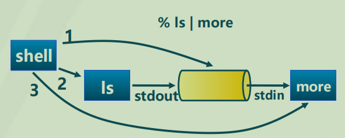

# 进程间通信

- [进程间通信](#进程间通信)
  - [一、基本概念](#一基本概念)
    - [(1) 消息队列](#1-消息队列)
    - [(2) 共享内存](#2-共享内存)
    - [(3) 消息队列与共享内存](#3-消息队列与共享内存)
  - [二、多种通信方式设计考虑](#二多种通信方式设计考虑)
    - [(1) 缓存消息](#1-缓存消息)
    - [(2) 直接通信与间接通信](#2-直接通信与间接通信)
    - [(3) 同步和异步通信](#3-同步和异步通信)
    - [(4) 时间处理和主动接收](#4-时间处理和主动接收)
  - [三、管道](#三管道)
    - [(1) 基本概念](#1-基本概念)
    - [(2) 系统调用](#2-系统调用)
    - [(3) stdin, stdout, stderr](#3-stdin-stdout-stderr)
    - [(4) 重定向输出](#4-重定向输出)
  - [四、Linux信号机制](#四linux信号机制)
    - [(1) Signal Model](#1-signal-model)
    - [(2) 栈操作](#2-栈操作)
    - [(3) 用户态栈段](#3-用户态栈段)
    - [(4) 相关系统调用](#4-相关系统调用)

## 一、基本概念

- 进程间通信(IPC，Inter-process Communication)
- 不同进程间进行通信和同步的机制
- IPC提供两个基本原语：
  - Send (message)
  - Receive (message)
- 进程通信流程
  - 建立通信链路
  - Send/Recv交换数据

### (1) 消息队列

- 消息队列是由OS维护的以字节序列为基本单位的间接通信机制
  - 每个消息是一个字节序列
  - 相同标识的消息按先进先出顺序组成一个消息队列

**相关系统调用**

- msgget(key,flags) 
  - 获取消息队列标识
- msgsnd(QID,buf,size,flags) 
  - 发送消息
- msgrcv(QID,buf,size,type,flags) 
  - 接收消息
- msgctl(...) 
  - 消息队列控制

### (2) 共享内存

- 共享内存方式是OS将同一块物理内存区域同时映射到多个进程的地址空间的通信机制
- 每个进程将共享内存区域映射到私有地址空间
  - 优点：快速共享数据
  - 缺点：必须用额外的同步机制来协调数据访问

**相关系统调用**

- shmget(key,size,flags) 
  - 创建共享段
- shmat(shmid,*shmaddr,flags) 
  - 把共享段映射到进程地址空间
- shmdt( *shmaddr) 
  - 取消共享段到进程地址空间的映射
- shmctl(...) 
  - 共享段控制
- 需要信号量等机制协调共享内存的访问冲突

### (3) 消息队列与共享内存

- 消息队列
❖ 通过内核地址空间
❖ 实现简单（在内存中预设区域）
❖ 受到内核大小限制=>小消息
❖ 每次通信操作需要系统调用（如send，receive） ❖ 不易于开发
▪ 共享内存
❖ 通过可用空闲物理内存实现
❖ 允许大消息传递（只受限于物理内存）
❖ 易于开发：只需要系统调用分配共享内存，读写即可

<table>
<tbody>

<tr>
<th>消息队列</th>
<th>共享内存</th>
</tr>

<tr>
<td align=left>实现简单（在内存中预设区域）</td>
<td align=left></td>
</tr>

<tr>
<td align=left>通过内核地址空间</td>
<td align=left>通过可用空闲物理内存实现</td>
</tr>

<tr>
<td align=left>受到内核大小限制=>小消息</td>
<td align=left>允许大消息传递（只受限于物理内存）</td>
</tr>

<tr>
<td align=left>不易于开发，每次通信操作需要系统调用</td>
<td align=left>易于开发，只需要系统调用分配共享内存，读写即可</td>
</tr>

</tbody>
</table>

## 二、多种通信方式设计考虑

- 缓冲消息
- 直接和间接通信
- 单向和双向
- 异步和同步
- 事件处理和主动接收
- 例外处理

### (1) 缓存消息

- 无缓冲
  - 发送方必须等待接收方接收消息
  - 每个消息都要握手
- 有界缓冲
  - 缓冲区大小有限
  - 缓冲区满则发送阻塞
  - 使用一个管程
- 无界缓冲
  - "无限"大小
  - 发送方永不阻塞

### (2) 直接通信与间接通信

- 直接通信：sends and receives
  - 当发送消息时，消息目标必须明确
    - send（message message, Process targetProcess）
  - 当接收消息时，消息源必须明确
    - Message <- recv(Process sourceProcess)
- 间接通信: mailboxes
  - A mailbox是一个唯一的标识
  - 通过 mailbox接收和发送消息: 
    - send(Message message, String mailbox); 
    - Message ← recv(String mailbox);

- 直接通信时，必须知道接收信息的进程（进程已经执行）
- 间接通信时，谁接收信息可以在消息发送之后再决定

**直接通信**

1. 只有接收端有缓冲时
  - 多个进程可能向接收方发送消息
  - 从特定的进程接收消息需要遍历整个缓冲区
2. 每个发送者有一个缓冲区时
  - 每个发送者发送给多个接收者
  - 获取消息仍需要遍历缓冲区

**间接通信**

- 使用信箱
  - 允许多对多通信
  - 需要打开/关闭信箱
- 缓冲
  - 在信箱需要有一个缓冲区以及互斥锁和条件变量
- 消息长度
  - 不确定，可以把大消息分割成多个小消息
- 信箱和管道对比
  - 信箱允许多对多通信
  - 管道隐含一个发送一个接收

### (3) 同步和异步通信

**发送**

- 同步（阻塞）
  - 如果资源忙则阻塞
  - 否则启动数据传输
  - 直到源缓冲用完后再阻塞
- 异步（非阻塞）
  - 启动数据传输并且立即返回
  - 结束则需要应用检查状态通知或者向应用发信号

**接收**

- 同步
  - 如果有消息则返回数据
- 异步
  - 如果有消息则返回数据
  - 如果无消息则返回状态

### (4) 时间处理和主动接收

**键盘输入**

- 键盘输入的实现
  - 需要一个中断处理器
  - 从中断处理函数中生成一个mbox消息

## 三、管道

### (1) 基本概念

- 进程间基于内存文件的通信机制
  - 子进程从父进程继承文件描述符
  - 缺省文件描述符:0 stdin, 1 stdout, 2 stderr 
- 进程不知道的另一端
  - 可能从键盘、文件、程序读取
  - 可能写入到终端、文件、程序

### (2) 系统调用

- 读管道: `read(fd,buffer,nbytes) `
  - C语言中的`scanf()`是基于它实现的
- 写管道: `write(fd,buffer,nbytes) `
  - `printf()`是基于它实现的
- 创建管道: `pipe(rgfd)`
  - `rgfd`是2个文件描述符组成的数组
  - `rgfd[0]`是读文件描述符
  - `rgfd[1]`是写文件描述符

**Shell创建管道**

1. 创建管道
2. 为ls创建一个进程 , 设 置 stdout为 管道写端
3. 为more 创建一个进程, 设置 stdin 为管道读端

### (3) stdin, stdout, stderr

- Unix谱系下，每个进程都有三个已经打开的“文件”
  - 并非真实的文件，但在unix下，所有对象都可以看作一个文件
- 三个文件：
  - Stdin: 标准输入流
  - Stdout：标准输出流
  - Stderr：标准错误流
- 每个文件都关联了一个整型的文件描述符
  - 一个索引：该进程打开的文件
- 标准流的文件描述符 (see /usr/include/unistd.h): 
  - stdin: STDIN FILENO = 0 
  - stdout: STDOUT FILENO = 1 
  - stderr: STDERR FILENO = 2

### (4) 重定向输出

- Ls > file.txt 工作方式
  - fprintf(stdout, "%s", filename)
- 在unix中，当打开一个新文件，这个文件会获得第一个可用的文件描述符
- 若关闭stdout，再打开一个文件，该文件会有文件描述符 1 
- 因此，printf会以为这个文件是stdout，并将输出写入该文件
  - 且不需要更改ls的任何代码

**系统调用**

- Popen()
  - 创建一个双向pipe
  - Forks and execs一个子进程 （e.g， “ls -a”）
  - 返回管道，其实是一个文件（FILE *）
  - 父进程和子进程可以通过pipe通信
- Pclose()
  - 等待子进程完成
  - 关闭pipe
- 通过fork，waitpid，pipe，close，open，dup等系统调用来实现

## 四、Linux信号机制

- 进程间的软件中断通知和处理机制
  - 如:SIGKILL, SIGSTOP, SIGCONT等
- 信号的接收处理
  - 捕获(catch):执行进程指定的信号处理函数被调用
  - 忽略(Ignore):执行操作系统指定的缺省处理
    - 例如:进程终止、进程挂起等
  - 屏蔽(Mask):禁止进程接收和处理信号
    - 可能是暂时的(当处理同样类型的信号) 
- 不足
  - 传送的信息量小，只有一个信号类型

### (1) Signal Model

- 应用通过signal()、sigaction()注册信号处理程序
- 通过kill()等函数传递信号
  - 或者由内核中硬件异常处理函数触发信号
- Signal传递跳转到signal处理函数
  - Irregular control flow，类似于中断

- Signal是异常和catch blocks的底层机制
- JVM或其他的运行时系统会设置相关singal处理函数

### (2) 栈操作

- 信号处理函数可以执行在另外一个栈上
  - 通过sigaltstack()系统调用
- 类似中断处理，内核将寄存器状态推送到栈上
  - 通过sigreturn()系统调用返回到内核
  - 应用可以修改其私有的栈上寄存器状态

### (3) 用户态栈段

- Pretcode: 信号处理函数的返回地址
- Sig：signal number
- Sc：用户态进程的硬件上下文状态
- Fpstate：用户态进程的浮点寄存器
- Extramask：阻塞的实时信号
- Retcode：8字节的代码，触发sigreturn()系统调用

### (4) 相关系统调用

> 内核通过一小段汇编代码来清理信号处理函数现场

- Signal trampoline: sigreturn()
- Signal trampoline 代码一半存在于vDSO或者C库中
  - vDSO（virtual dynamic shared object）:内核自动映射到每个用户态应该地址空间的共享库
- Sigreturn()将重制信号处理函数的所有操作
  - 改变进程的singal mask，切换信号栈
  - 切换栈空间，恢复进程上下文
  - Sigreturn()函数原型有int返回值，但实际上并没有返回值。
