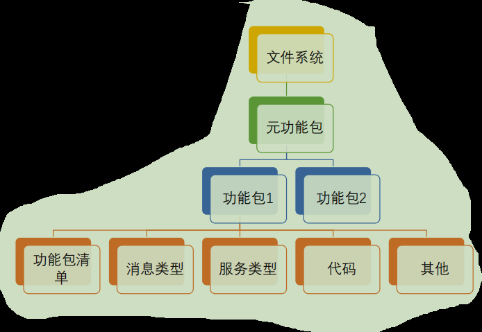
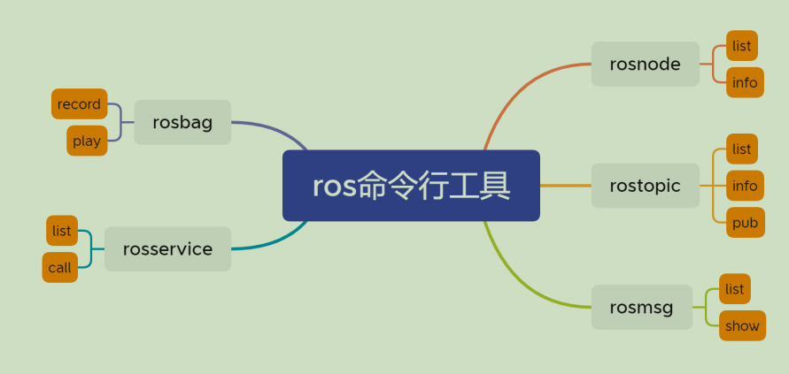
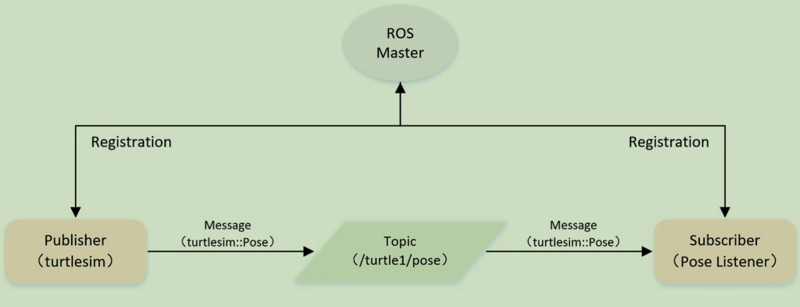
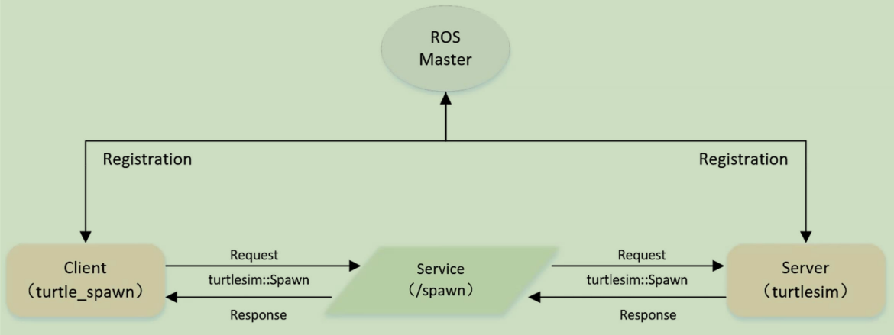

# 机器人操作系统

- [机器人操作系统](#机器人操作系统)
  - [一、ROS核心概念](#一ros核心概念)
    - [(1) 节点与主节点](#1-节点与主节点)
    - [(2) 话题通信](#2-话题通信)
    - [(3) 服务通信](#3-服务通信)
    - [(4) 参数](#4-参数)
    - [(5) 功能包](#5-功能包)
  - [二、ROS命令行工具](#二ros命令行工具)
  - [三、ROS编程](#三ros编程)
    - [(1) Pub/Sub编程](#1-pubsub编程)
    - [(2) C/S编程](#2-cs编程)
    - [(3) 自定义话题消息](#3-自定义话题消息)
  - [四、ROS坐标变换](#四ros坐标变换)
  - [五、ROS可视化与模拟](#五ros可视化与模拟)
  - [六、机器人导航](#六机器人导航)
    - [(1) SLAM硬件基础](#1-slam硬件基础)
    - [(2) 基于粒子滤波的SLAM--Gmapping](#2-基于粒子滤波的slam--gmapping)
    - [(3) 基于图优化框架的SLAM框架--Cartographer](#3-基于图优化框架的slam框架--cartographer)
    - [(4) 基于强化学习的导航VUCA](#4-基于强化学习的导航vuca)
  - [七、ROS2简介](#七ros2简介)

## 一、ROS核心概念

### (1) 节点与主节点

- 节点（Node）
  - 执行具体任务的进程
  - 独立的可执行文件
  - 不同节点可使用不同的编程语言
  - 可运行在相同或不同的计算机
  - 节点在系统中的名称必须唯一
- 节点管理器（ROS Master）
  - 系统中首先启动的节点
  - 为节点提供命名和注册服务
  - 建立节点间的连接
  - 提供参数服务器

### (2) 话题通信

- 话题Topic
  - 异步通信机制
  - 用于节点间数据传输
  - 使用发布/订阅模型
- 消息Message
  - 话题的数据
  - 具有一定类型和数据结构
    - ROS提供的标准类型
    - 用户自定义类型
  - 使用编程语言无关的.msg文件定义

### (3) 服务通信

- 服务Service
  - 同步通信机制
  - 使用客户端/服务器（C/S）模型
  - 客户端发送请求数据
  - 服务器处理后返回应答数据
  - 使用编程语言无关的.srv文件定义请求和应答的数据结构

|          |     话题      |     服务      |
| :------: | :-----------: | :-----------: |
|  同步性  |     异步      |     同步      |
| 通信模型 |   发布/订阅   | 客户端/服务器 |
| 底层协议 | ROSTCP/ROSUDP | ROSTCP/ROSUDP |
| 反馈机制 |      无       |      有       |
|  缓冲区  |      有       |      无       |
|  实时性  |      弱       |      强       |
|  同步性  |    多对多     |    一对多     |
| 适用场景 |   数据通路    |   控制通路    |

### (4) 参数

- 参数Parameter
  - 可通过网络访问的共享、多变量字典
  - 存储和检索配置参数
  - 适合静态存储、非二进制的参数
  - 不适合存储动态配置的参数

### (5) 功能包

- 功能包 Package
  - ROS软件中的基本单元
  - 包括节点源代码、配置文件、数据定义等
- 功能包清单 Package manifest
  - 记录功能包的基本信息
  - 作者、许可、依赖、编译选项
- 元功能包
  - 一组相关的功能包

## 二、ROS命令行工具

## 三、ROS编程

### (1) Pub/Sub编程

**Publisher编程**

- 初始化ROS节点
- 向Master Node注册节点信息
  - 发布的话题名
  - 消息类型
- 创建消息数据
- 按一定频率循环发布消息

**Subscriber编程**

- 初始化ROS节点
- 订阅需要的话题
- 循环等待话题消息
  - 接收到消息后进入回调函数
- 在回调函数中完成消息处理

### (2) C/S编程

**Client编程**

- 初始化ROS节点
- 创建Client实例
- 发布服务请求数据
- 等待Server返回应答结果

**Server编程**

- 初始化ROS节点
- 创建Server实例
- 循环等待服务请求
  - 进入回调函数
- 在回调函数中完成服务
  - 返回应答结果

### (3) 自定义话题消息

- 定义msg文件
  - 在package.xml中添加依赖
  - <build_depend> message_generation</build_depend>
  - <exec_depend>message_runtime</exec_depend>
- 在CMakeLists.txt添加编译选项
  - find_package(… message_generation)
  - add_message_files(FILE example.msg)
  - generate_message(DEPENDENCIES std_msgs)
  - catkin_package(… message_runtime)
- 编译相关文件

## 四、ROS坐标变换

## 五、ROS可视化与模拟

- QT工具箱
  - rqtgraph
- Rviz工具
  - 一款三维可视化工具
- Gazebo
  - 功能强大的三维物理仿真平台

## 六、机器人导航

> SLAM: Simultaneous Localization And Mapping

### (1) SLAM硬件基础

- 环境感知
  - 激光雷达
    - 发出一束激光，激光碰到障碍物会被反射
    - 从另一角度观测或接收。以光速的飞行时间或三角测量原理获知障碍物距离
    - 高速旋转，得知360度范围内的障碍物距离
  - 灰度/RGB/RGBD相机
- 里程计
  - 轮式里程计
    - 直接根据车轮的线速度与角速度，得知机器人行走的距离与轨迹
  - 惯性测量传感器IMU
    - 由一个陀螺仪和加速度计组成
    - 可以以非常高的频率测量自身的瞬时的角速度与加速度
    - 测量角速度和加速度积分得到位姿

### (2) 基于粒子滤波的SLAM--Gmapping

- 基于Rao-Blackwellized particle filters算法
  - 将定位和建图过程分离，先进行定位再进行建图
  - 在构建小场景地图所需的计算量较小且精度较高
  - 随着场景增大所需的粒子增加
    - 因为每个粒子都携带一张地图，因此在构建大地图是所需内存和计算量都会增加

### (3) 基于图优化框架的SLAM框架--Cartographer

- 由谷歌于2016年开源的一个支持ROS的室内SLAM库
- 工程化代码，多态、继承、封装，接口丰富
- 概率栅格地图
- 前端
  - 根据帧间匹配算法，实时根据激光来推测累积的scan相对于submap的位姿
- 后端
  - 检测回环，修正各个submap之间的位姿

### (4) 基于强化学习的导航VUCA

## 七、ROS2简介

