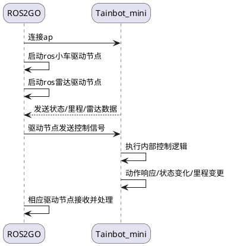

- 目录更新
- P算法add
  - 将四元组位置信息转化为 rall、pictch、raw




```
my_mini
├── CMakeLists.txt
├── launch
│   ├── direct_navigation.launch // 直行控制脚本
│   ├── one_point_navigation.launch // 单点非避障导航脚本
│   ├── simple_navigation.launch // 单点非避障导航
│   └── triangle_navigation.launch // 避障导航绘制三角形导航
├── package.xml
└── scripts
    ├── direct_control.py // 直行控制
    ├── one_point_navigation.py // 单点自动避障导航
    ├── simple_navigation.py // 单点非避障导航
    ├── trace_draw.py // 轨迹记录
    └── triangle_navigation.py // 避障导航绘制三角形
```

```
@startuml
skinparam roundCorner 25
skinparam responseMessageBelowArrow true

participant Simple as f1
participant CarNode as f2


f1    ->     f2  : 订阅`/tianbot_mini/odom`
f1    ->     f1  : 收集里程/状态数据
f1    ->     f1  : 判断距离，计算速度
f1    ->     f1  : 判断姿态，计算转向
f1    ->     f2  : 向`/tianbot_mini/cmd_vel` 发送控制命令

@enduml
```


```
@startuml
skinparam roundCorner 25
skinparam responseMessageBelowArrow true

participant Painter as f1
participant CarNode as f2


f1    ->     f2  : 订阅`/tianbot_mini/odom`
f1    ->     f1  : 收集里程/状态数据
f1    ->     f1  : 标准化x,y坐标
f1    ->     f1  : 绘图
f1    ->     f1  : 持久化数据到文件
@enduml
```

- Ros Action
  - ROS节点通信的方式
  - action有反馈机制，服务端不间断给客户端反馈

```
@startuml
skinparam roundCorner 25
skinparam responseMessageBelowArrow true

participant OnePoint as f1
participant DemoSlam as f2
participant Painter as f3

f1    ->     f1  : 订阅`/tianbot_mini/odom`
f1    ->     f1  : 创建 move_base client
f2    -->    f1  : 收集里程/状态数据
f1    ->     f2  : client 请求 action
f2    -->    f3  : 收集里程/状态数据
f3    ->     f3  : 绘图
f3    ->     f3  : 持久化数据到文件
@enduml
```


- Move Base Goal设置
  - Point: (a, 0, 0), (a, a, 0), (0, 0, 0)
  - Angle: $\frac{\pi}{2}$, $\frac{5 \pi}{4}$ , 0

```
@startuml
skinparam roundCorner 25
skinparam responseMessageBelowArrow true

participant OnePoint as f1
participant DemoSlam as f2
participant Painter as f3

f1    ->     f1  : 订阅`/tianbot_mini/odom`
f1    ->     f1  : 创建 move_base client
f2    -->    f1  : 收集里程/状态数据
f1    ->     f2  : client 依次请求 三个目标点
f2    -->    f3  : 收集里程/状态数据
f3    ->     f3  : 绘图
f3    ->     f3  : 持久化数据到文件
@enduml
```