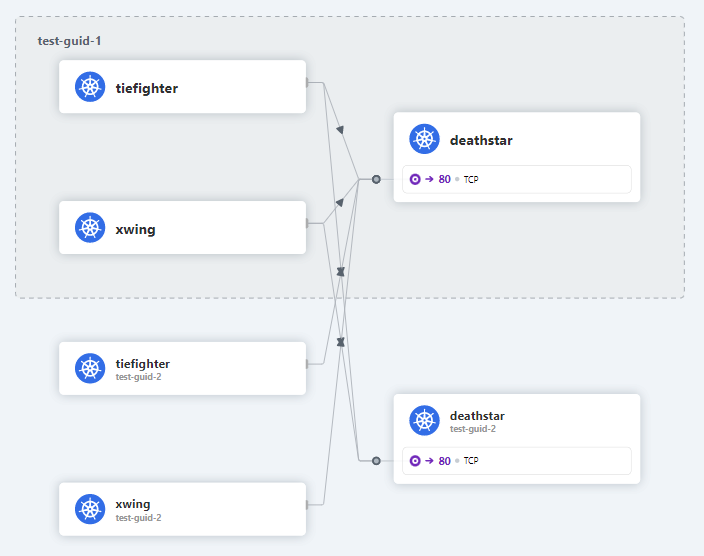

## 基于分组组网


同一group能相互访问，不同group无法相互访问(基于ingress)

label
- `group`

```yaml
# base_group_rule
apiVersion: "cilium.io/v2"
kind: CiliumNetworkPolicy
metadata:
  name: group-{GROUP}-rule
  namespace: {NS}
spec:
  endpointSelector:
    matchLabels:
      group-{GROUP}: in
  ingress:
  - fromEndpoints:
    - matchLabels:
        group-{GROUP}: in
```

### Demo

#### 端点配置

```yaml
# raw_apps
apiVersion: v1
kind: Namespace
metadata:
  name: {NS}
---
apiVersion: v1
kind: Service
metadata:
  name: deathstar
  namespace: {NS}
  labels:
    app: deathstar
spec:
  type: ClusterIP
  ports:
  - port: 80
  selector:
    app: deathstar
---
apiVersion: apps/v1
kind: Deployment
metadata:
  name: deathstar
  namespace: {NS}
  labels:
    app: deathstar
spec:
  replicas: 2
  selector:
    matchLabels:
      app: deathstar
  template:
    metadata:
      labels:
        app: deathstar
    spec:
      containers:
      - name: deathstar
        image: docker.io/cilium/starwars
---
apiVersion: v1
kind: Pod
metadata:
  name: tiefighter
  namespace: {NS}
  labels:
    app: tiefighter
spec:
  containers:
  - name: spaceship
    image: docker.io/tgraf/netperf
---
apiVersion: v1
kind: Pod
metadata:
  name: xwing
  namespace: {NS}
  labels:
    app: xwing
spec:
  containers:
  - name: spaceship
    image: docker.io/tgraf/netperf
```

|    guid     |    pod     | group |
| :---------: | :--------: | :---: |
| test-guid-1 | deathstar  |   A   |
| test-guid-1 | tiefighter | A、B  |
| test-guid-1 |   xwing    |   B   |
| test-guid-2 | deathstar  |   B   |
| test-guid-2 | tiefighter |   A   |
| test-guid-2 |   xwing    |   -   |

构造应用

```shell
$ sed -e "s/{NS}/test-guid-1/g" raw_apps.yaml > app_1/apps.yaml
```

为每个命名空间构造分组规则

```shell
# 分组A规则
$ sed -e "s/{GROUP}/a/g" -e "s/{NS}/test-guid-1/g" base_group_rule.yaml > app_1/group_a_rule.yaml

# 分组B规则
$ sed -e "s/{GROUP}/b/g" -e "s/{NS}/test-guid-1/g" base_group_rule.yaml > app_1/group_b_rule.yaml
```

测试 test-guid-1 与 test-guid-2 中应用的连通性

```shell
#! /bin/bash

namespaces=(test-guid-1 test-guid-2)
clients=(tiefighter xwing)

for nsc in ${namespaces[@]}
do
for cl in ${clients[@]}
do
for nss in ${namespaces[@]}
do
# echo "kubectl -n "$nsc" exec "$cl" -- curl -s -XPOST deathstar."$nss".svc.cluster.local/v1/request-landing"
kubectl -n $nsc exec $cl -- curl -s -XPOST deathstar.$nss.svc.cluster.local/v1/request-landing
done
done
done

echo "test over"
```




为pod增加标签


```
$ kubectl -n test-guid-1 label pod tiefighter group-a=in

```


## 基于身份组网

**label**:
- `gluenet_net_role`: A\B\C\D

| role  |   Ingress    |    Egress    |                         描述                         | 访问限制 |
| :---: | :----------: | :----------: | :--------------------------------------------------: | :------: |
|   A   | 同一命名空间 | 同一命名空间 | 内部服务, 仅能在内部镜像访问，并无法访问任何外部服务 |    内    |
|  *B   | 同一命名空间 |    无限制    |                       普通服务                       |    内    |
|   C   |    无限制    | 同一命名空间 |                       边缘服务                       |    公    |
|  *D   |    无限制    |    无限制    |                       公共服务                       |    公    |

### Demo

#### 网络规则

```yaml
# 角色规则 A
apiVersion: "cilium.io/v2"
kind: CiliumNetworkPolicy
metadata:
  name: "base-a"
  namespace: GUID
spec:
  endpointSelector:
    matchLabels:
      role: A
  ingress:
  - fromEndpoints:
    - {}
  egress:
  - toEndpoints:
    - {}
---
# 角色规则 B
apiVersion: "cilium.io/v2"
kind: CiliumNetworkPolicy
metadata:
  name: "base-b"
  namespace: GUID
spec:
  endpointSelector:
    matchLabels:
      role: B
  ingress:
  - fromEndpoints:
    - {}
---
# 角色规则 C
apiVersion: "cilium.io/v2"
kind: CiliumNetworkPolicy
metadata:
  name: "base-c"
  namespace: GUID
spec:
  endpointSelector:
    matchLabels:
      role: C
  egress:
  - toEndpoints:
    - {}
---
# 角色规则 D
# 不需要
```

#### 端点配置

|    guid     |    pod     | network |
| :---------: | :--------: | :-----: |
| test-guid-1 | deathstar  |    A    |
| test-guid-1 | tiefighter |    B    |
| test-guid-1 |   xwing    |    B    |
| test-guid-2 | deathstar  |    D    |
| test-guid-2 | tiefighter |    B    |
| test-guid-2 |   xwing    |    B    |

```shell
$ sed -e "s/GUID/test-guid-2/g" base_rules.yaml > app_2_rules.yaml
```

```shell
$ kubectl -n test-guid-1 exec tiefighter -- curl -s -XPOST deathstar.test-guid-2.svc.cluster.local/v1/request-landing
```


**app1**

```yaml
apiVersion: v1
kind: Namespace
metadata:
  name: test-guid-1
---
apiVersion: v1
kind: Service
metadata:
  name: deathstar
  namespace: test-guid-1
  labels:
    app: deathstar
spec:
  type: ClusterIP
  ports:
  - port: 80
  selector:
    app: deathstar
---
apiVersion: apps/v1
kind: Deployment
metadata:
  name: deathstar
  namespace: test-guid-1
  labels:
    app: deathstar
spec:
  replicas: 2
  selector:
    matchLabels:
      app: deathstar
  template:
    metadata:
      labels:
        app: deathstar
        role: A
    spec:
      containers:
      - name: deathstar
        image: docker.io/cilium/starwars
---
apiVersion: v1
kind: Pod
metadata:
  name: tiefighter
  namespace: test-guid-1
  labels:
    role: B
    app: tiefighter
spec:
  containers:
  - name: spaceship
    image: docker.io/tgraf/netperf
---
apiVersion: v1
kind: Pod
metadata:
  name: xwing
  namespace: test-guid-1
  labels:
    role: B
    app: xwing
spec:
  containers:
  - name: spaceship
    image: docker.io/tgraf/netperf
```

**app2**

```yaml
apiVersion: v1
kind: Namespace
metadata:
  name: test-guid-2
---
apiVersion: v1
kind: Service
metadata:
  name: deathstar
  namespace: test-guid-2
  labels:
    app: deathstar
spec:
  type: ClusterIP
  ports:
  - port: 80
  selector:
    app: deathstar
---
apiVersion: apps/v1
kind: Deployment
metadata:
  name: deathstar
  namespace: test-guid-2
  labels:
    app: deathstar
spec:
  replicas: 2
  selector:
    matchLabels:
      app: deathstar
  template:
    metadata:
      labels:
        app: deathstar
        role: D
    spec:
      containers:
      - name: deathstar
        image: docker.io/cilium/starwars
---
apiVersion: v1
kind: Pod
metadata:
  name: tiefighter
  namespace: test-guid-2
  labels:
    role: B
    app: tiefighter
spec:
  containers:
  - name: spaceship
    image: docker.io/tgraf/netperf
---
apiVersion: v1
kind: Pod
metadata:
  name: xwing
  namespace: test-guid-2
  labels:
    role: B
    app: xwing
spec:
  containers:
  - name: spaceship
    image: docker.io/tgraf/netperf
```