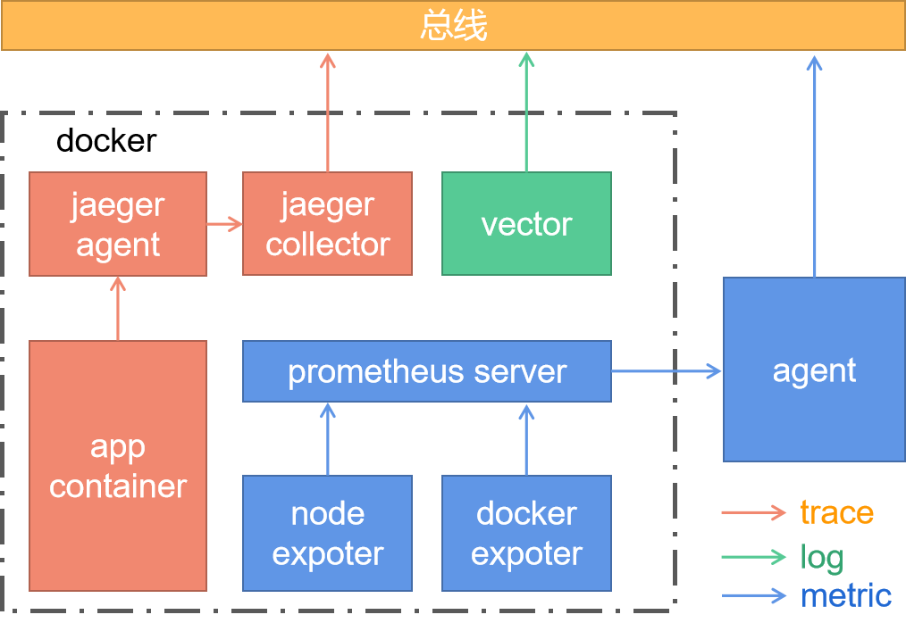
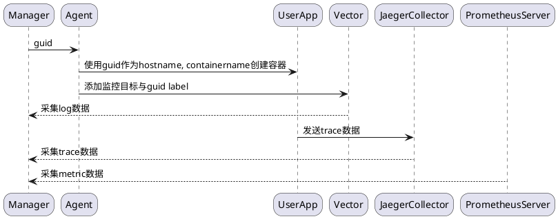
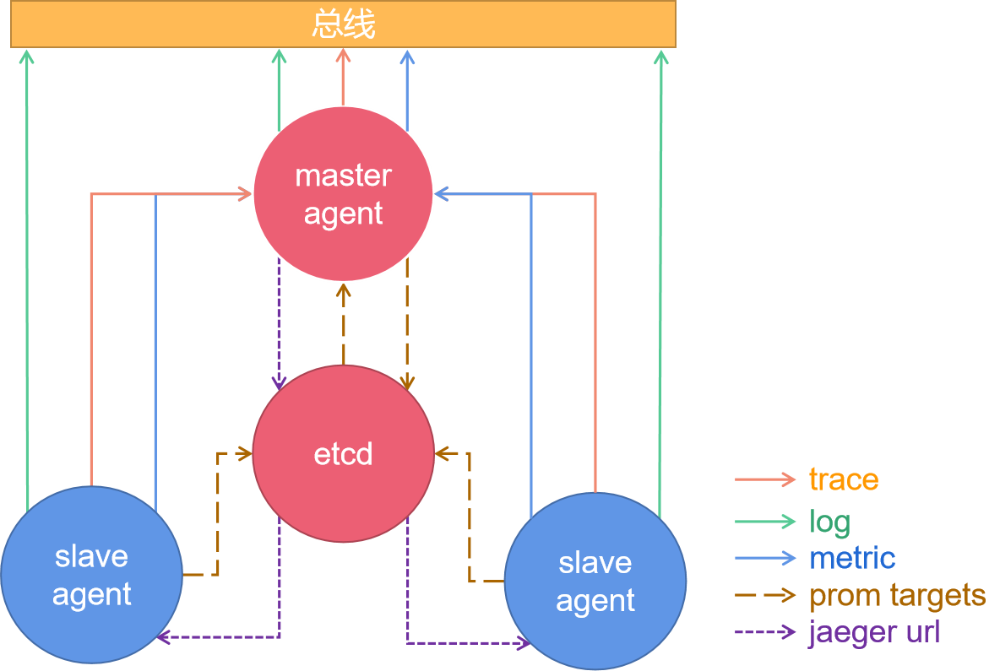
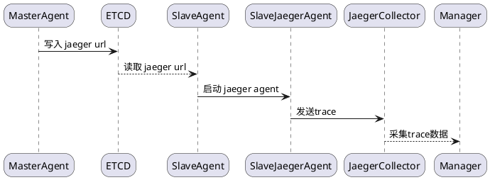
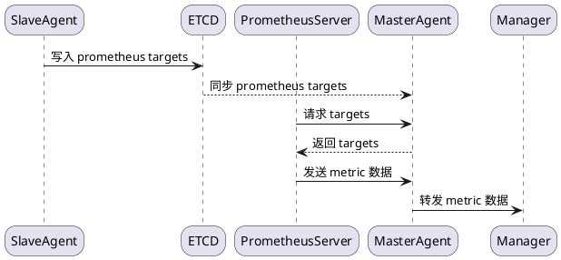
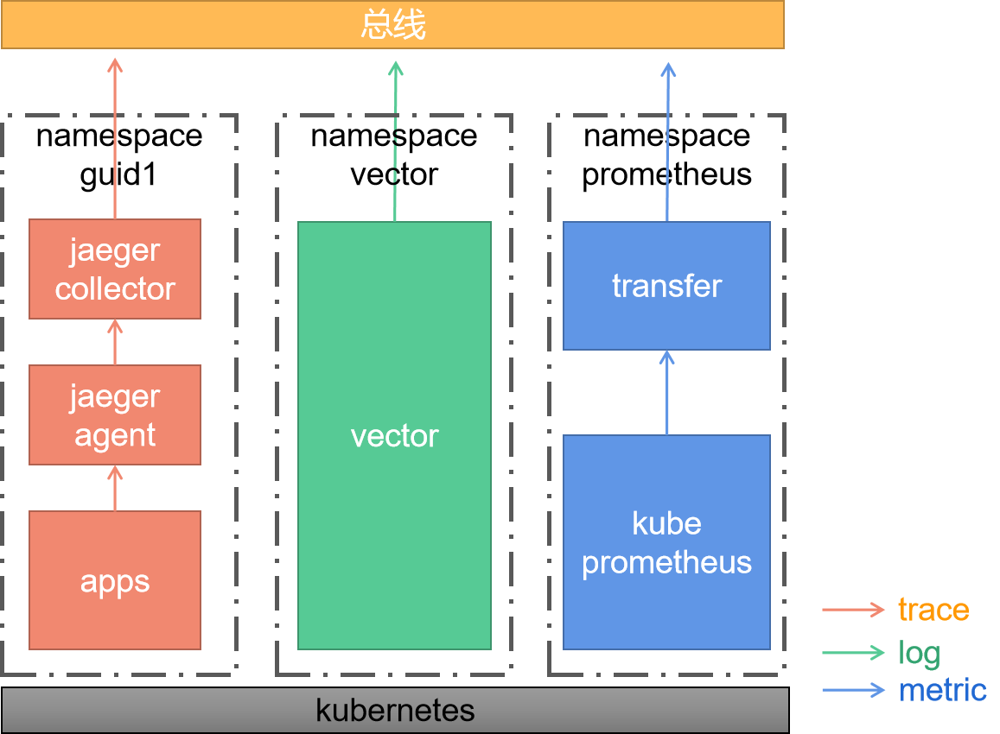

# 可观测性方案

- [可观测性方案](#可观测性方案)
  - [一、单节点容器](#一单节点容器)
    - [(1) 监控架构](#1-监控架构)
    - [(2) 处理逻辑](#2-处理逻辑)
    - [(3) 流程设计](#3-流程设计)
  - [二、普通集群](#二普通集群)
    - [(1) 监控架构](#1-监控架构-1)
    - [(2) 处理逻辑](#2-处理逻辑-1)
    - [(3) 流程设计](#3-流程设计-1)
  - [三、K8s集群](#三k8s集群)
    - [(1) 监控架构](#1-监控架构-2)
    - [(2) 处理逻辑](#2-处理逻辑-2)
    - [(3) 流程设计](#3-流程设计-2)

## 一、单节点容器

### (1) 监控架构

| 监控项目 | 依赖项目                                    | 项目类型                           | 功能需求                              |
| -------- | ------------------------------------------- | ---------------------------------- | ------------------------------------- |
| metric   | prometheus server <br> prometheus exporters | container <br> binary or container | docker driver <br> prometheus service |
| log      | vector                                      | container                          | docker driver <br> toml config modify |
| trace    | jaeger collector <br> jaeger agent          | container                          | docker driver                         |

- 监控架构


### (2) 处理逻辑

- trace
  - 将 guid 作为容器的hostname, 从而使得 jaeger client 产生的trace数据中包含 guid label

- metric
  - 为 node exporter 设置一个 guid label, 从而区分 host 的 metric 监控数据
  - 典型的容器监控cAdvisor在输出标签中会带有container name，因此可以将guid作为container name，从而进行container监控数据与guid的关联

- log
  - 设置vector监控目标的 guid label，从而区分 用户应用 的 log 监控数据

### (3) 流程设计



## 二、普通集群

### (1) 监控架构

| 监控项目 | 依赖项目                                    | 项目类型                           | 功能需求                                                                       |
| -------- | ------------------------------------------- | ---------------------------------- | ------------------------------------------------------------------------------ |
| metric   | prometheus server <br> prometheus exporters | container <br> binary or container | docker driver <br> prometheus service <br> slaveagent service <br> etcd driver |
| log      | vector                                      | container                          | docker driver <br> toml config modify                                          |
| trace    | jaeger collector <br> jaeger agent          | container                          | docker driver                                                                  |

- 监控架构



### (2) 处理逻辑

- 集群中每个节点上都会部署agent，每个agent身份并不相同
  - 只有master节点启动 prometheus server 与 jaeger collector
  - master 节点与 slave 节点之间通过 etcd 同步jaeger collector 与 prometheus targets 配置

- log
  - 每个agent的处理逻辑不变
  
- metric
  - 所有agent都自己管理的 exporter 添加到etcd中
  - master定期将etcd中的target同步给prometheus server
  - master agent 所启动的 prometheus server 会采集整个集群中的 metric 数据，并通过 agent 转发到总线

- trace
  - slave agent 通过 etcd 获得 jaeger collector url，并配置给jaeger agent
  - 集群中所有的trace数据都会由master节点上的jaeger collector统一发送到总线

### (3) 流程设计


- trace



- metric
  


## 三、K8s集群

### (1) 监控架构

| 监控项目 | 依赖项目        | 项目类型    | 功能需求    |
| -------- | --------------- | ----------- | ----------- |
| metric   | kube-prometheus | helm chart  | helm driver |
| log      | vector          | helm  chart | helm driver |
| trace    | jaeger          | helm chart  | helm driver |



### (2) 处理逻辑

- 以guid创建用户用户应用(chart)的namespace

- log
  - 在 vector chart 基础上
    - 定义 vector-value.yaml，在install时加入，设置vector将采集的日志直接发送到总线
  - vector 作为监控基础设施，一个集群中运行一个
  - vector采集的log数据中中包含有namespace，对用户应用进行区分

- metric
  - 在原版 kube-prometheus yamls 基础上
    - 插入转发metric到总线的容器配置
    - 在 `prometheus-prometheus.yaml` 中加入remote write
  - prometheus将采集的数据发送到转发器上，转发器直接发送到总线
  - kube-prometheus 作为监控基础设施，一个集群中运行一个
  - prometheus采集的metric数据中中包含有namespace，对用户应用进行区分

```yml
# `192.168.49.2:10000/write`接口由转发容器提供
remoteWrite:
- url: "http://192.168.49.2:10000/write"
```

- trace
  - 自定义 jaeger chart，能够对 jaeger agent 进行配置
  - 启动用户应用的同时，在同样namespace中启动jaeger(agent、collector)
    - tag 应用 guid 给 jaeger agent， 将agent guid 作为环境变量传入 jaeger collector
  - collecor将数据发送到总线
  - jaeger 随用户应用的启动而启动
  - jaeger 采集到的数据中包含有 guid tag，对用户应用进行区分

### (3) 流程设计

