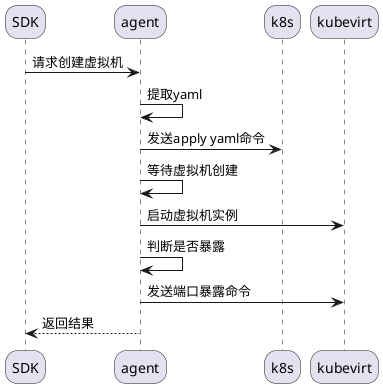
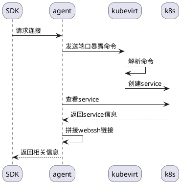
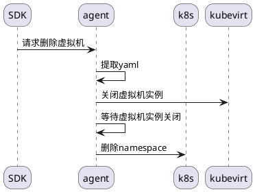

# Agent设计V2.2

## 一、优化指标

### (1) 应用启动时间

- 容器
- helm chart

### (2) 运行时资源占用

- CPU资源
- 内存资源
- 网络资源

## 二、需求

### (1) KVM

- KVM虚拟机配置、启动、关闭

### (2) Agent

- 日志、指标标准化
  - namespace: gluenet-system
  - 系统容器命名: "glue-system-{name}"

- agent心跳包含容器状态
  - 所有容器的状态
  - ready/notready

- 开启 prometheus remote receive
  - agent写心跳到prometheus
  - prometheus数据结构

- 自定义容器cprfile监控
  - 启动容器时，新增监控配置

- 监控容器使用脚本开启、关闭

- agent容器创建数据结构
  - 使用 docker.Config

- 自定义容器提交

- agent配置重载
  - 服务
  - restart agent

- 容器配置重载
  - 容器配置、规则配置
  - restart 容器
  - 配置导入，容器重载配置

### agent接入kubevirt

**初始环境准备**

- kubevirt环境
- webssh

**创建虚拟机**

**连接虚拟机**

**删除虚拟机**

