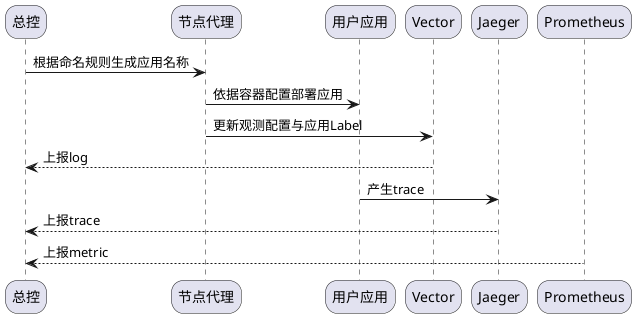
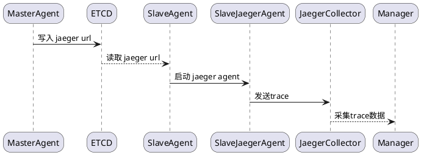
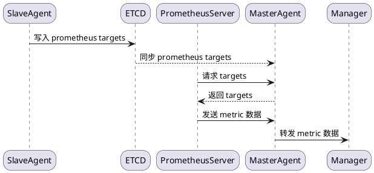
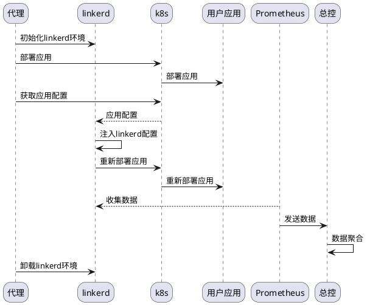

# 可观测性方案

- [可观测性方案](#可观测性方案)
  - [一、单节点容器](#一单节点容器)
    - [(1) 观测组件](#1-观测组件)
    - [(2) 观测架构](#2-观测架构)
    - [(3) 观测逻辑](#3-观测逻辑)
    - [(3) 观测流程](#3-观测流程)
  - [二、普通集群](#二普通集群)
    - [(1) 监控架构](#1-监控架构)
    - [(2) 处理逻辑](#2-处理逻辑)
    - [(3) 流程设计](#3-流程设计)
  - [三、K8s集群](#三k8s集群)
    - [(1) 观测组件](#1-观测组件-1)
    - [(2) 观测架构](#2-观测架构-1)
    - [(3) 观测逻辑](#3-观测逻辑-1)
    - [(4) 观测逻辑](#4-观测逻辑)

## 一、单节点容器

### (1) 观测组件

<table>
<tbody>

<tr>
<th>观测目标</th>
<th>观测组件</th>
<th>部署方式</th>
<th>描述</th>
<th>Agent功能</th>
</tr>

<tr>
<td rowspan=3>Metric</td>
<td align=center>
Prometheus Server
</td>
<td align=center>
容器 
</td>
<td align=center>
主动聚合Metric数据并上报 
</td>
<td align=left rowspan=3>
1. 启动容器 
2. 配置Prometheus Server及过滤规则 
3. 同步Exporter信息 
</td>
</tr> 

<tr>
<td align=center>
NodeExporter
</td>
<td align=center>
容器 
</td>
<td align=center>
观测宿主机运行指标 
</td>
</tr> 
<tr>
<td align=center>
Cadvisor
</td>
<td align=center>
容器 
</td>
<td align=center>
观测Docker容器运行指标 
</td>
</tr> 

<tr>
<td>Log</td>
<td align=center>
Vector
</td>
<td align=center>
容器 
</td>
<td align=center>
主动聚合容器log信息并上报 
</td>
<td align=left>
1. 启动容器 
2. 动态配置Vector 
</td>
</tr>

<tr>
<td rowspan=2>Trace</td>
<td align=center>
Jaeger Collector
</td>
<td align=center>
容器 
</td>
<td align=center>
主动聚合Trace数据并上报 
</td>
<td align=left rowspan=2>
1. 启动容器 
2. 动态配置Collector Url 
</td>
</tr> 

<tr>
<td align=center>
Jaeger Agent
</td>
<td align=center>
容器 
</td>
<td align=center>
收集trace数据并提交给collector 
</td>
</tr>  

</tbody>
</table>

### (2) 观测架构

### (3) 观测逻辑

**用户应用**

- 一个或多个Service App，彼此之间相互通信
- 以容器的形式进行部署

**Metric**

- Prometheus Server 配置
  - Job NodeExporter
    - 设置节点guid为`Job.Label`, 区分Host
  - Remote Write
    - 设置目标为当前节点的Agent，数据通过Agent转发至总控
  - Rule
    - 过滤系统容器
    - 聚合指标数据
- 容器命名
  - 用户容器命名由总控设置，格式为`<guid>-<custom_name>`
  - 系统容器命名由Agent设置，格式为`glue-<custom_name>`

**Log**

- Vector配置
  - 配置label规则，为容器Log信息打上`guid`标签

**Trace**

- 容器配置
  - 容器HostName由Agent进行设置，默认与容器名称相同

- Jaeger Client 生成的Span数据中包含有HostName，用于数据聚合

### (3) 观测流程

## 二、普通集群

### (1) 监控架构

| 监控项目 | 依赖项目                                    | 项目类型                           | 功能需求                                                                       |
| -------- | ------------------------------------------- | ---------------------------------- | ------------------------------------------------------------------------------ |
| metric   | prometheus server   prometheus exporters | container   binary or container | docker driver   prometheus service   slaveagent service   etcd driver |
| log      | vector                                      | container                          | docker driver   toml config modify                                          |
| trace    | jaeger collector   jaeger agent          | container                          | docker driver                                                                  |

- 监控架构

### (2) 处理逻辑

- 准备
  - 集群中每个节点上都会部署agent，每个agent身份并不相同
  - 只有master节点启动 prometheus server 与 jaeger collector
  - master 节点与 slave 节点之间通过 etcd 同步jaeger collector 与 prometheus targets 配置

- log
  - 使用单节点的Vector Container Log监控方案
  
- metric
  - 所有agent都自己管理的 exporter 添加到etcd中
    - 使用 etcd 的前缀匹配功能
  - Prometheus Server 定期从 master 中获得最新的targets配置
  - Prometheus Server 从 targets 采集 metric 数据，通过 master agent 的转发端口发布到总线

- trace
  - slave agent 通过 etcd 获得 jaeger collector url，并配置给jaeger agent
  - 集群中所有的trace数据都会由master节点上的jaeger collector统一发送到总线

### (3) 流程设计

- trace

- metric
  

## 三、K8s集群

### (1) 观测组件

<table>
<tbody>

<tr>
<th>观测目标</th>
<th>观测组件</th>
<th>部署方式</th>
<th>描述</th>
<th>Agent功能</th>
</tr>
 
<tr>
<td rowspan=2>Metric</td>
<td align=center>
kube-prometheus
</td>
<td align=center rowspan=2>
k8s configs 
</td>
<td align=center>
聚合集群metric数据并上报 
</td>
<td align=left rowspan=2>
1. apply k8s configs 
2. 配置 prometheus 过滤规则 
</td>
</tr>

<tr>
<td align=center>
glue-transfer
</td>
<td align=center>
提供http入口，转发数据至总控 
</td>
</tr>

<tr>
<td>Log</td>
<td align=center>
vector
</td>
<td align=center>
helm chart 
</td>
<td align=center>
主动聚合集群log信息并上报 
</td>
<td align=left>
1. 部署helm chart 
2. 配置vector nats 
3. 配置vector 过滤规则 
</td>
</tr>

<tr>
<td>Trace</td>
<td align=center>
linkerd
</td>
<td align=center>
tool 
</td>
<td align=center>
观测集群中的网络流数据 
</td>
<td align=left>
1. 初始化与卸载linkerd 
2. 向用户应用中插入linkerd配置 
3. 配置Prometheus收集Linkerd数据 
</td>
</tr>

</tbody>
</table>

### (2) 观测架构

### (3) 观测逻辑

**用户应用**

- 命名空间配置
  - 配置 helm release\k8s deployment 的命名空间为guid
  - 观测组件NameSpace默认为`monitoring`

**Metric**

- kube-prometheus配置
  - Remote Write
    - 设置目标为glue-transfer，数据通过Agent转发至总控
- Pod Metric 包含有 NameSpace 信息，用于聚合

**Log**

- Container Log 包含有 NameSpace，用于聚合

**Trace**

> linkerd监控仅限于TCP

- linkerd cli 安装
  - `install.sh`脚本

- linkerd初始化与卸载
  - apply
    - `linkerd install` yaml
    - `linkerd viz install` yaml

- linkerd配置注入
  1. 部署用户应用
  2. 注入 linkerd 配置 `kubectl get -n emojivoto deploy -o yaml | linkerd inject - | kubectl apply -f -`
  3. 重新部署用户应用

- linkerd数据上报
  - 利用 linkerd viz

### (4) 观测逻辑

**Trace**

