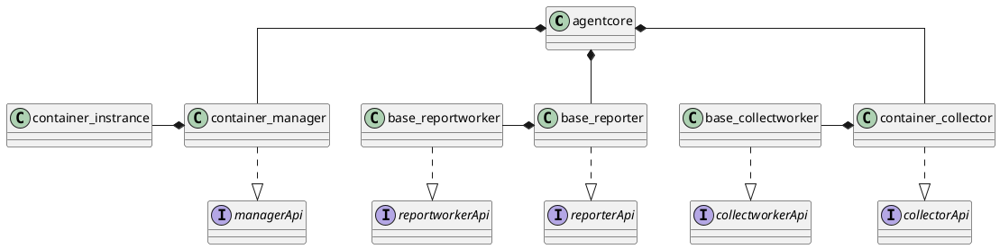
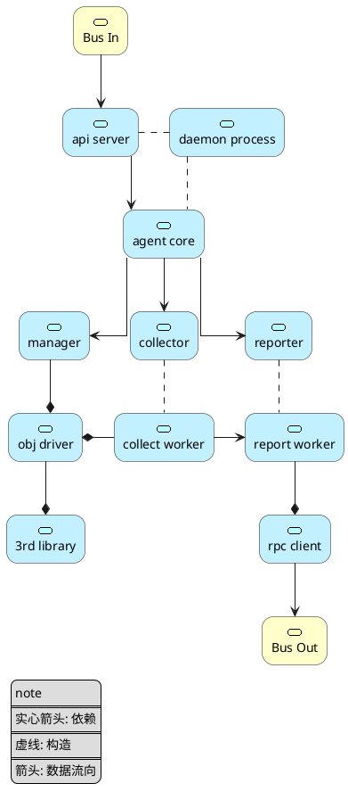
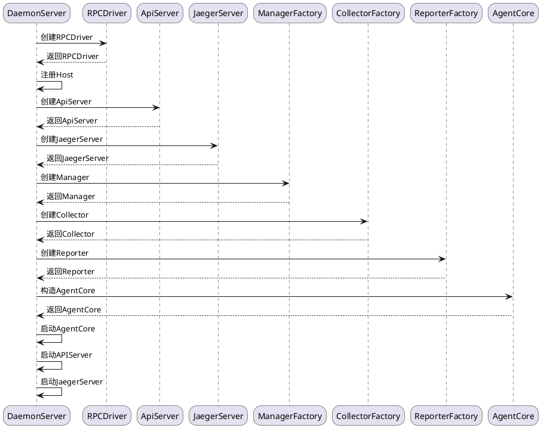
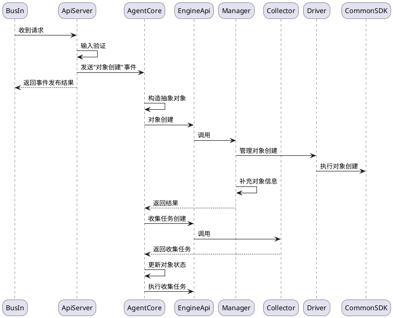
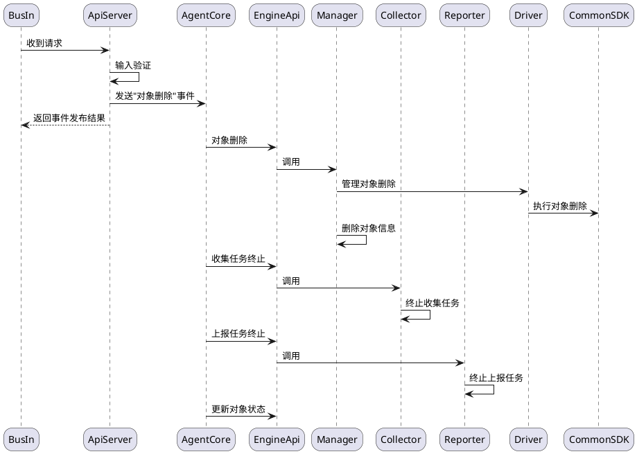
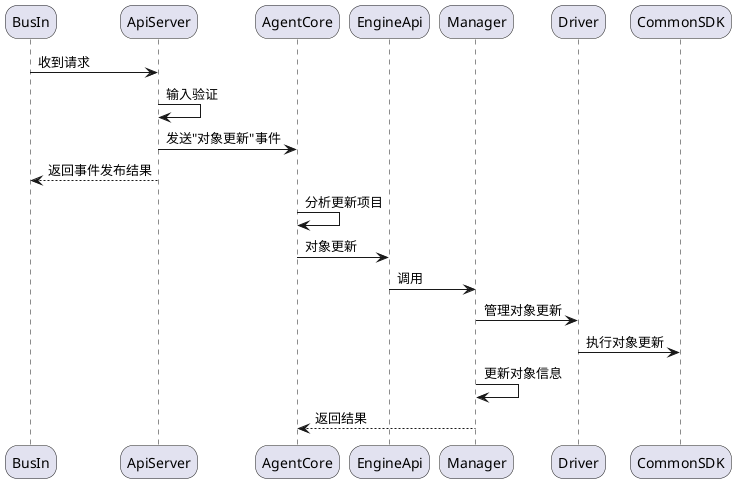
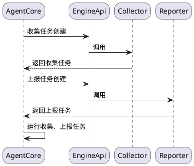
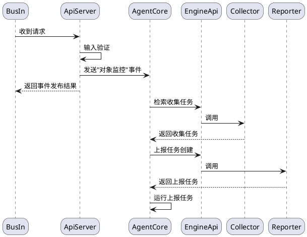

# 一、重构目标

|目标|具体|描述|
|:-:|:-:|:-:|
|功能拓展|接入类型拓展|接入k8s集群、ray集群等|
||控制维度拓展|增加可控资源，拓展控制方式|
|性能优化|运行效率|优化协程数量，运行模式，降低开销|
||稳定性|完善运行、退出机制|
||实时性|提升响应速度，实现毫秒级控制|

# 二、架构设计图


# 三、模块关系图






# 四、事件

|**事件**|**说明**|
|:-:|:-:|
|启动|agent启动流程|
|对象创建|创建对象接入到系统中|
|对象删除|删除对象并回收资源|
|对象更新|更新对象状态与资源分配|
|对象监控|上报对象的监控数据|

## (1) 启动流程



## (2) 对象创建



## (3) 删除对象



## (4) 更新对象



## (5) 描述对象

@Deprecated

## (6) 心跳检查



## (7) 监控对象


# 五、API设计

## Create

**Request**

**Response**

## Update

**Request**

**Response**

## Delete

**Request**

**Response**

## PushOn

**Request**

**Response**

## PushOff

**Request**

**Response**


# 六、规范设计

# 七、流程设计

# agent功能开发规范

## agent 目录结构

```shell
agent
├── agentcore
│   ├── agent.go
│   └── builder.go
├── apiserver
│   └── agentserver
│       ├── agent_server.go
│       ├── create.go
│       ├── delete.go
│       ├── pushOff.go
│       ├── pushOnce.go
│       ├── pushOn.go
│       └── update.go
├── driver
│   ├── cgroupD
│   │   └── cgroup_driver.go
│   ├── dockerD
│   │   └── docker_driver.go
│   ├── gopsD
│   │   └── gops_driver.go
│   ├── helmD
│   │   └── helm_driver.go
│   ├── k8sD
│   │   └── k8s_driver.go
│   └── rpcD
│       └── rpc_driver.go
├── engine
│ 	├── engine_api.go
│   ├── collector
│   │   ├── baseC
│   │   │   └── base_collector.go
│   │   ├── collector_factory.go
│   │   ├── containerC
│   │   │   └── container_collector.go
│   │   └── hostC
│   │       └── host_collector.go
│   ├── manager
│   │   ├── containerM
│   │   │   └── container_manager.go
│   │   └── manager_factory.go
│   └── reporter
│       └── base_reporter.go
├── option
│   └── option.go
└── server.go
```

## 开发规范

- agent后续开发面向功能扩展
  - 横向功能扩展: 
    - 能够对更多的对象(helm chart, 虚拟机等)进行控制与信息采集
  - 纵向功能扩展: 
    - 增加agentcore核心功能(如消息监听，分布式能力，跨网络桥接)

### 横向功能扩展

1. 调研目标对象，整理相关三方工具的搭建方式，环境要求以及主要功能列表，并输出相关文档
2. 在driver目录下，增加对应对象的driver，定义driver中此对象的结构体，并封装相应的主要功能
    - 对象结构体中，需要包含必要的参数(创建、删除时使用)，复杂对象则可以使用yaml进行描述
    - driver可以通过目标工具的第三方程序库，也可以对CLI，RESTFul接口进行封装(必要时) 
    - 如果实现功能需要多个三方工具，则对应每个工具都需要一个driver
    - 如果该对象不能使用已有的driver进行监控，则需要调研相关监控手段，增加相应监控手段的driver，并在对象的结构体中，增加所需的索引内容
3. 在manager目录中，创建该对象的manager，使用管理所需driver集合实现manager接口
4. 在collector目录中，创建该对象的collector，使用监控所需driver集合实现collector接口

- tips:
  - 横向功能的扩展逐层进行，尽量在本层拓展功能，必要时可以商定接口的更改
  - 命名遵守一定的规范，如driver以D结尾，Manager以M结尾，Collector以C结尾
  - 模块的名称需要在 option 中进行添加，不能直接使用字符串

### 纵向功能扩展
