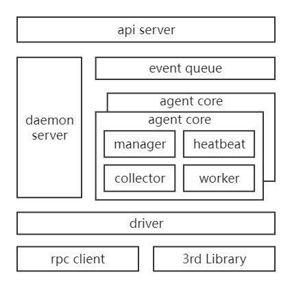
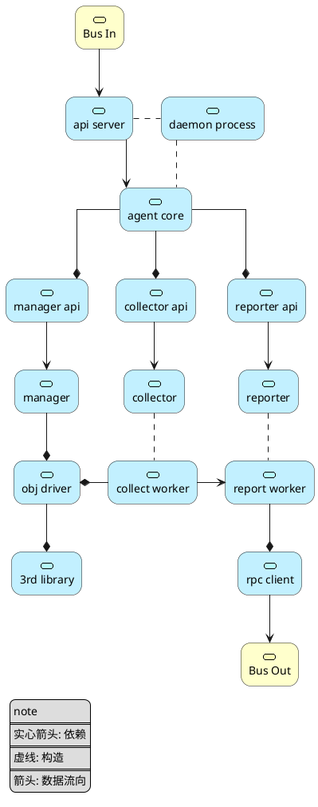
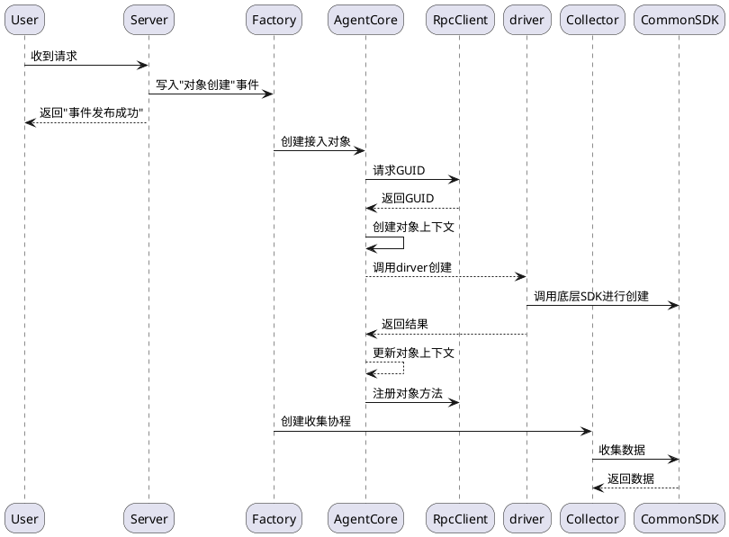
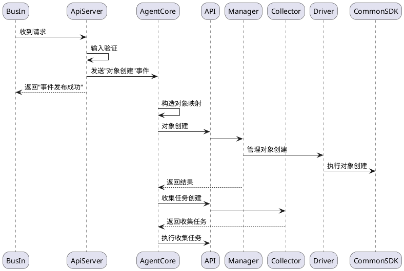
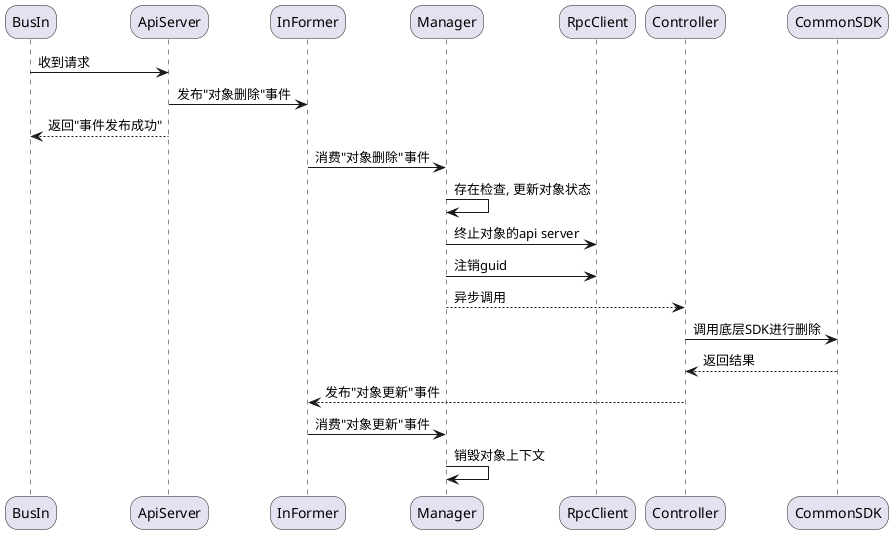
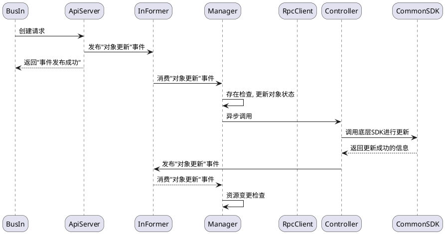
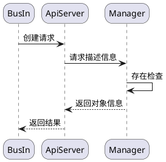
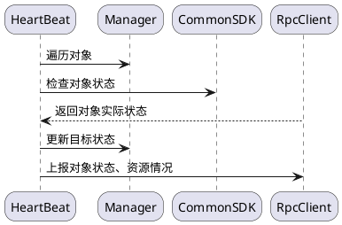
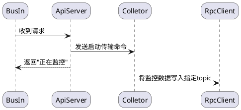

# 一、重构目标

|目标|具体|描述|
|:-:|:-:|:-:|
|功能拓展|接入类型拓展|接入k8s集群、ray集群等|
||控制维度拓展|增加可控资源，拓展控制方式|
|性能优化|运行效率|优化协程数量，运行模式，降低开销|
||稳定性|完善运行、退出机制|
||实时性|提升响应速度，实现毫秒级控制|

# 二、架构设计图

# 三、模块关系图

# 四、事件流

## (1) 说明

|**事件**|**说明**|
|:-:|:-:|
|对象创建|创建对象接入到系统中|
|对象删除|删除对象并回收资源|
|对象更新|更新对象状态与资源分配|
|对象描述|获得对象的状态、资源描述|
|对象监控|上报对象的监控数据|

## (1) Agent启动流程

## (2) 对象创建

## (3) 删除对象

## (4) 更新对象

## (5) 描述对象

## (6) 心跳检查

## (7) 监控对象

metric监控、log监控、trace监控

# 五、API设计

# 六、规范设计

# 七、流程设计
