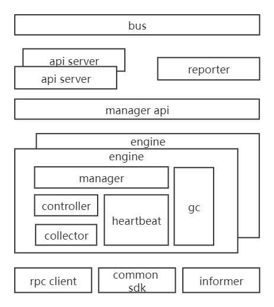

# Agent 重构

- [Agent 重构](#agent-重构)
  - [一、重构思路](#一重构思路)
  - [二、重构架构](#二重构架构)
  - [三、事件流设计](#三事件流设计)
    - [(1) 创建对象](#1-创建对象)
    - [(2) 删除对象](#2-删除对象)
    - [(3) 更新对象](#3-更新对象)
    - [(4) 描述对象](#4-描述对象)
    - [(5) 监控对象](#5-监控对象)
      - [metric监控](#metric监控)
      - [log监控](#log监控)
      - [trace监控](#trace监控)
  - [四、API设计](#四api设计)
  - [五、规范设计](#五规范设计)
  - [六、流程设计](#六流程设计)
## 一、重构思路

- 功能拓展
  - 接入对象拓展
  - 控制方式拓展
- 性能优化
  - 运行效率
  - 稳定性
  - 毫秒级控制
    - agent级别的策略

抽象 CRUD API
一种管理对象一种运行模式
控制粒度为容器

## 二、重构架构

## 三、事件流设计

### (1) 创建对象

@startuml
Alice -> Bob: Authentication Request
Bob --> Alice: Authentication Response
Alice -> Bob: Another authentication Request
Alice <-- Bob: another authentication Response
@enduml

### (2) 删除对象

### (3) 更新对象

### (4) 描述对象

### (5) 监控对象

#### metric监控

#### log监控
#### trace监控

## 四、API设计

## 五、规范设计

## 六、流程设计

