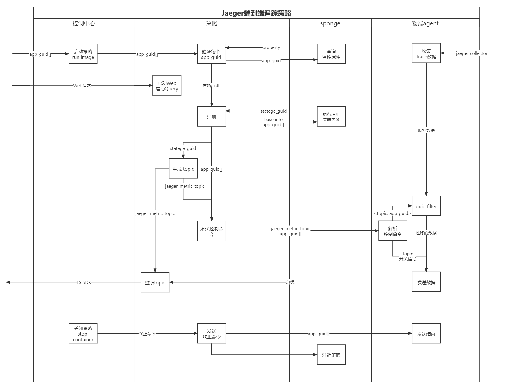
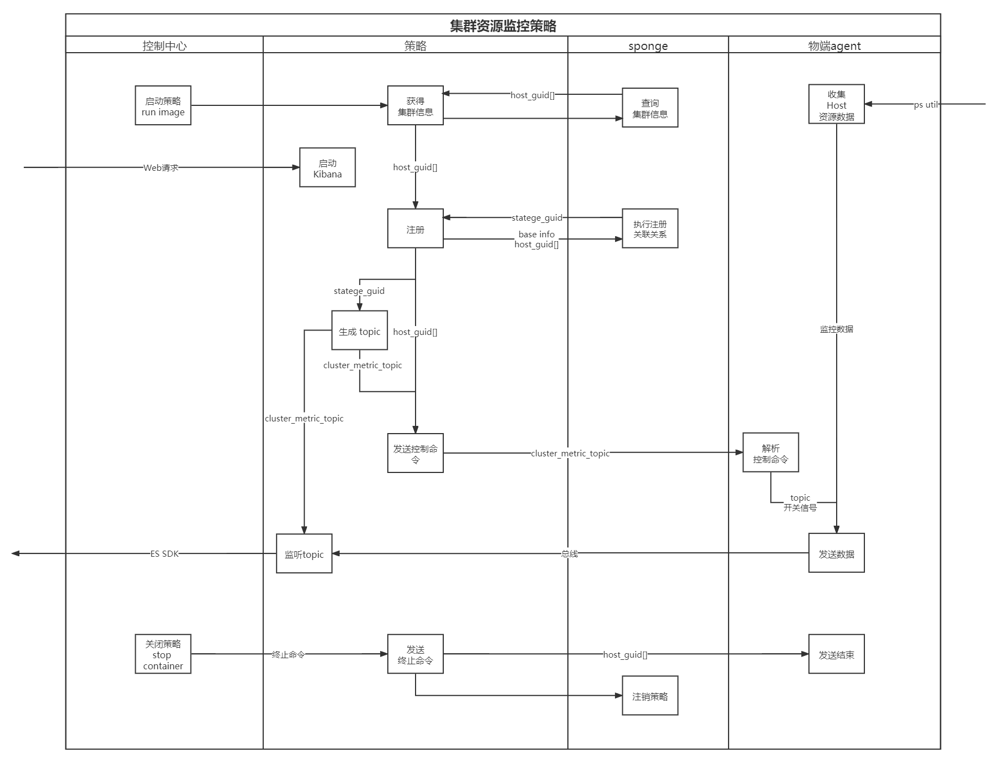

# 信息高铁测调中心策略流程设计
- [信息高铁测调中心策略流程设计](#信息高铁测调中心策略流程设计)
  - [一、说明](#一说明)
  - [二、监控策略](#二监控策略)
    - [(1) jaeger监控策略](#1-jaeger监控策略)
    - [(2) 集群监控策略](#2-集群监控策略)

## 一、说明

- 策略
   - 打包好的镜像
   - 内部包含算法与控制流
   - 策略是无状态的

## 二、监控策略
### (1) jaeger监控策略

- 流程图

1. 策略启动
   - 控制中心
      - 启动策略，并向策略传入 app_guid[]
   - 策略
      - 对于传入 app_guid，需要从 sponge 中查询该对象 monitor 属性(能否trace)  
      - 注册获得 stratege_guid，唯一标识此次策略 
      - 生成 jaeger_metric_topic (stratege_guid 加固定前/后缀)，并设置监听
      - 使用 app_guid 进行 agent 的RPC调用
         - agent 监听所管理的所有 app_guid 对应topic 
         - 控制命令携带内容
            - jaeger_metric_topic: span data应当写入的topic
   - sponge
      - 监听查询请求，检查目标状态，并返回查询结果  
   
2. 数据存储
   - 策略
      - 将从 jaeger_metric_topic 中接收到的数据写入到es

3. 数据转发
   - agent
      - agent 启动时持续接收 jaeger-collector 发送的 span 数据，以队列的形式维护
      - 接收到RPC请求时
         - 解析命令，得到 jaeger_metric_topic 与 app_guid
         - 组织相同 jaeger_metric_topic 的 app_guid 作为 guid filter
         - 启动对于 jaeger_metric_topic 的数据发送，并通过 filter 进行过滤

4. 策略结束
   - 控制中心
      - 发出关闭策略命令 
   - 策略
      - 向目标agent发送关闭命令
   - agent
      - 终止向 jaeger_metric_topic 的写入
   - 策略
      - 等到所有 agent 结束写入后，策略结束并退出  

5. query策略
   - 策略
      - 启动jaeger ui、jaeger query提供用户交互 
### (2) 集群监控策略

- 流程图
  

1. 策略启动
   - 控制中心
      - 启动策略
   - 策略
      - 从 sponge 中查询所有 host_guid
      - 注册获得 stratege_guid，唯一标识此次策略 
      - 生成 cluster_metric_topic (stratege_guid 加固定前/后缀)，并设置监听
      - 使用 host_guid 进行 agent 的RPC调用
         - agent 监听所管理的 host_guid 对应 topic 
         - 控制命令携带内容
            - cluster_metric_topic: 资源数据应当写入的topic
   - sponge
      - 监听查询请求，检查目标状态，并返回查询结果  
   
2. 数据存储
   - 策略
      - 将从 cluster_metric_topic 中接收到的数据写入到es

3. 数据转发
   - agent
      - agent 启动时持续接收 ps util 收集者 发送的host资源监控数据，以队列的形式维护
      - 接收到RPC请求时
         - 解析命令，得到 cluster_metric_topic 与 host_guid
         - 获得host资源数据队列
         - 启动对于 cluster_metric_topic 的数据发送

4. 策略结束
   - 控制中心
      - 发出关闭策略命令 
   - 策略
      - 向目标agent发送关闭命令
   - agent
      - 终止向 cluster_metric_topic 的写入
   - 策略
      - 等到所有 agent 结束写入后，策略结束并退出  

5. query策略
   - 策略
      - 启动 kibana 提供用户交互 