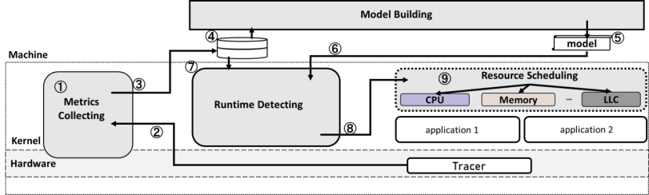

<!-- _class: lead -->

# 计划安排

---

- 复现
- 重构

---

# PARTIES 

PARTIES调度逻辑: 
1. 初始化应用资源
2. 请求目标应用获取QOS状态
3. 执行资源分配算法
4. 再次请求目标应用查看调度效果
5. 重复直到达到QOS目标

---

# 存在的工程问题

1. 调度需要进行实时QOS探测，本身对应用而已就是负担, 不适合生产环境
2. 调度与监控耦合，算法与监控的迭代不便

---

# 架构

# App

keydb redis memcache

mysql clickhouse

mongodb elasitc search

kafka

spark hive