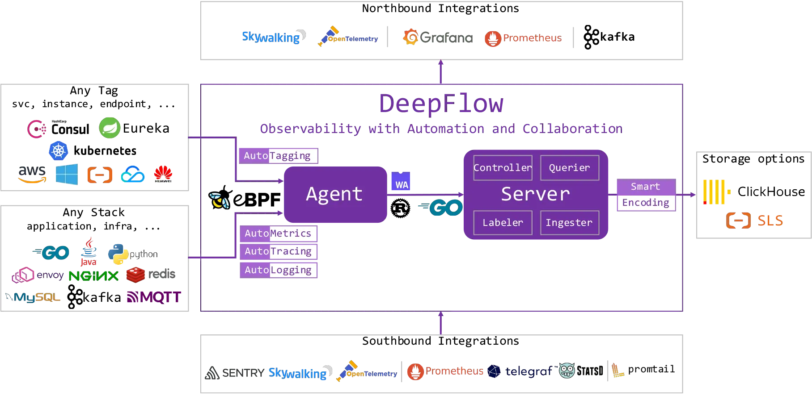

## 主要特性

- 全栈：DeepFlow 使用 eBPF 和 cBPF 技术实现的 AutoMetrics 机制，可以自动采集任何应用的 RED（Request、Error、Delay）性能指标，精细至每一次应用调用，覆盖从应用到基础设施的所有软件技术栈。在云原生环境中，DeepFlow 的 AutoTagging 机制自动发现服务、实例、API 的属性信息，自动为每个观测数据注入丰富的标签，从而消除数据孤岛，并释放数据的下钻能力。

- 全链路：DeepFlow 使用 eBPF 技术创新的实现了 AutoTracing 机制，在云原生环境中自动追踪任意微服务、基础设施服务的分布式调用链。在此基础上，通过集成并自动关联来自 OpenTelemetry 的数据，DeepFlow 实现了完整的全栈、全链路分布式追踪，消除了所有盲点。

- 高性能：DeepFlow 创新的 SmartEncoding 标签注入机制，能够将数据存储性能提升 10 倍，从此告别高基数和采样的焦虑。DeepFlow 使用 Rust 实现 Agent，拥有极致处理性能的同时保证内存安全。DeepFlow 使用 Golang 实现 Server，重写了 Golang 的 map、pool 基础库，数据查询和内存 GC 均有近 10 倍的性能提升。

- 可编程：DeepFlow 目前支持了对 HTTP (S)、Dubbo、MySQL、PostgreSQL、Redis、Kafka、MQTT、DNS 协议的解析，并将保持迭代增加更多的应用协议支持。除此之外，DeepFlow 基于 WASM 技术提供了可编程接口，让开发者可以快速具备对私有协议的解析能力，并可用于构建特定场景的业务分析能力，例如 5GC 信令分析、金融交易分析、车机通信分析等。

- 开放接口：DeepFlow 拥抱开源社区，支持接收广泛的可观测数据源，并利用 AutoTagging 和 SmartEncoding 提供高性能、统一的标签注入能力。DeepFlow 支持插件式的数据库接口，开发者可自由增加和替换最合适的数据库。DeepFlow 为所有观测数据提供统一的标准 SQL 查询能力，便于使用者快速集成到自己的可观测性平台中。

- 易于维护：DeepFlow 的内核仅由 Agent、Server 两个组件构成，将复杂度隐藏在进程内部，将维护难度降低至极致。DeepFlow Server 集群可对多个 Kubernetes 集群、传统服务器集群、云服务器集群进行统一监控，且无需依赖任何外部组件即可实现水平扩展与负载均衡

## 软件架构

DeepFlow 由 Agent 和 Server 两个进程组成
- 每个 K8s 容器节点、虚拟机或物理裸机中运行一个 Agent，负责该服务器上所有应用进程的 AutoMetrics 和 AutoTracing 数据采集
- Server 运行在一个 K8s 集群中，提供 Agent 管理、数据标签注入、数据写入、数据查询服务

## 设计理念

DeepFlow 名称来自对 Flow 的自动化采集能力。网络中的 Flow 对应一个 TCP/IP 五元组，应用中的 Flow 对应一个应用 Request。DeepFlow 使用 eBPF 等技术自动获取任意软件技术栈的 Request-scoped 数据，包括 Raw data 形态的 Request-scoped events、聚合后形成的 Rquest-scoped metrics、关联后构建的 Trace。这些数据通常用于绘制 **原始请求表** 、**服务调用拓扑** 、**分布式调用火焰图**

## DeepFlow Agent

Agent 采集的数据包括三类：
- eBPF 数据
  - 基于 eBPF（Linux Kernel 4.14+）的 AutoMetrics 机制采集任意应用 Request 的 RED 性能指标
  - 基于 BPF、AF_PACKET（Linux Kernel 2.6+）、winpcap（Windows 2008+）的 AutoMetrics 机制采集任意应用 Request 的 RED 性能指标、网络吞吐、时延、性能、异常性能指标
  - 基于 eBPF（Linux Kernel 4.14+）的 AutoTracing 机制，分析 Raw Request 数据关联性，构建分布式调用链
- 集成的观测数据：接收其他开源 Agent、SDK 的观测数据
- 标签数据：自动同步 K8s apiserver 和服务注册中心中的服务、实例和 API 属性信息

## DeepFlow Server

DeepFlow Server 使用 Golang 实现，由 Controller、Labeler、Ingester、Querier 四个模块组成：
- Controller：管理 Agent、均衡调度 Agent 与 Server 的通信关系、同步采集器发现的 Tag 数据
- Labeler：向观测数据中注入统一的属性标签
- Ingester：观测数据存储，插件化机制支持替换分析数据库
- Querier：观测数据查询，提供统一的 SQL 接口查询所有类型的观测数据

DeepFlow 的关键特性有两点：
- AutoTagging：自动为所有观测数据注入统一的属性标签，消除数据孤岛问题，并释放数据的下钻切分能力?
- SmartEncoding：利用分布式的编码技术，将属性标签编码为整形值，在标签注入阶段直接注入整形标签，在生产环境中的实际运行数据表明 SmartEncoding 可将标签存储性能提升一个数量级?